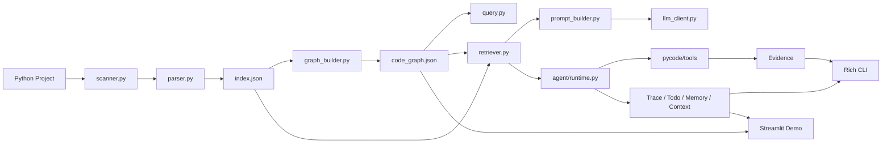
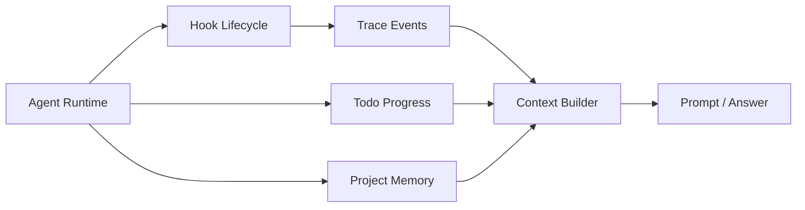

# PyCode

PyCode 是一个面向 Python 项目的代码库理解与改动影响分析 Agent。它不会把整个仓库直接丢给大模型，而是先用静态分析生成结构化索引和代码图谱，再根据问题选择有限上下文，最后让 LLM 或轻量 Agent 基于证据回答问题、分析影响范围和展示执行过程。

这个项目的重点不是做一个简单聊天壳，而是实现一层自己的代码理解中间层：文件扫描、AST 解析、图谱构建、上下文检索、工具调用、权限控制、执行轨迹、项目记忆和可视化展示都由项目本身管理。当前版本主要支持 Python 项目，适合用于学习代码分析、Agent 工程化和项目级上下文管理。

## 核心能力

- 代码索引：递归扫描 Python 文件，提取 import、class、function 和方法信息，生成 `.pclens/index.json`。
- 代码图谱：把文件、类、函数和方法建模为节点，把包含、导入和调用关系建模为边，生成 `.pclens/code_graph.json`。
- 图谱查询：支持查询文件导入、反向依赖、函数调用和入口候选文件。
- 代码库问答：基于 index 和 graph 检索相关上下文，支持 `ask`、`explain`、`onboard`、`impact` 等命令。
- 开发任务 Agent：围绕 git diff、改动影响、测试覆盖等任务规划工具调用，收集证据并生成总结。
- 可观测 Agent 内核：记录 Trace、Todo、Memory、Task DAG 和 Context Section，方便解释 Agent 做了什么、依据来自哪里。
- 展示层：支持 Rich 终端输出和 Streamlit Web Demo，便于演示项目结构、图谱和 Agent 运行过程。

## 快速开始

建议在项目根目录使用虚拟环境中的 Python。

```powershell
.\.venv\Scripts\python.exe -m pip install -r requirements.txt
```

`requirements.txt` 会以可编辑模式安装当前项目，因此 CLI 和 Streamlit 页面都可以直接导入 `pycode` 包。

```powershell
.\.venv\Scripts\python.exe -m pycode.cli index .\examples\demo_project
.\.venv\Scripts\python.exe -m pycode.cli graph .\examples\demo_project
.\.venv\Scripts\python.exe -m pycode.cli query entry .\examples\demo_project
.\.venv\Scripts\python.exe -m pycode.cli agent .\examples\demo_project "这个项目的入口在哪里？阅读顺序应该是怎样的？" --plan-only --show-context --rule-plan
```

前两条命令会在示例项目下生成 `.pclens/index.json` 和 `.pclens/code_graph.json`。`query entry` 会基于静态线索查找入口候选文件。最后一条命令使用离线规则 planner 展示 Agent 计划、Todo 和 Context 摘要，不需要配置 LLM API。

V1.0 推荐从这条离线命令开始演示，因为它能稳定展示 `trace`、`todo`、`context` 和 `evidence` 的关系，而不依赖真实 LLM API。完整演示流程见 [`docs_v1.0/v1.0_demo_script.md`](docs_v1.0/v1.0_demo_script.md)。

如果想查看 Web Demo，可以启动 Streamlit：

```powershell
.\.venv\Scripts\streamlit.exe run .\ui\streamlit_app.py
```

如果需要旧式文本输出，可以在主要 CLI 命令后追加 `--plain`：

```powershell
.\.venv\Scripts\python.exe -m pycode.cli graph .\examples\demo_project --plain
```

## Python API（V2 Phase 1）

`PyCodeEngine` 提供独立于 CLI 和 Streamlit 的同步入口，实例不保存项目或运行状态。下面的例子使用假 LLM，不需要 API Key：

```python
from pathlib import Path
from pycode import PyCodeEngine

class DemoLLM:
    def generate(self, prompt: str) -> str:
        return "离线示例回答；证据由实际检索生成。"

project = Path("examples/demo_project")
engine = PyCodeEngine()
index = engine.index(project)
graph = engine.graph(project)
entries = engine.query(project, "entry")
answer = engine.ask(project, "这个项目的入口在哪里？", llm_client=DemoLLM())
impact = engine.impact(project, "services/user_service.py", llm_client=DemoLLM())
run = engine.run_agent(
    project, "这个项目的入口在哪里？",
    llm_client=DemoLLM(), use_llm_planner=False,
    enable_memory=False, enable_memory_extraction=False,
)
print(answer.answer, answer.evidence)
print(run.answer, run.trace.run_id)
```

- `build_index()` 只返回索引，不写文件；`index()` 与 `graph()` 分别写入 `.pclens/index.json` 和 `.pclens/code_graph.json`，不会自动生成另一种产物。
- `ask()`、`explain()`、`onboard()`、`impact()` 返回 `AnswerResult(answer, retrieval)`，并提供 `evidence` 属性；调用前需准备默认位置的索引和图谱。缺失／损坏产物与模型错误会向调用方抛出，不自动重建。
- `run_agent()` 返回原有 `AgentResult`，可查看 Trace、Todo、Context 和工具结果；保留既有降级语义。`allow_tests=False` 为默认值，只有明确设为 `True` 才允许受控测试运行。
- Agent 默认可能读写项目内部 Memory／Task 状态。关闭 Memory 自动提取并不等于禁止所有内部状态工具；Engine 不管理同项目并发写入。
- Engine 不打印。调用方负责展示结果和处理异常。问答与 Agent 均可传入 `model` 或 `llm_client`，显式客户端优先；未注入时使用下节的配置。
- `use_llm_planner=False` 只切换为规则规划，最终总结仍可调用模型。完全离线的计划预览使用 `plan_only=True, use_llm_planner=False`；离线完整执行可如上例注入假客户端。
- 显式索引／图谱输出路径和 `query(graph_path=...)` 相对于当前工作目录。Agent graph 路径保留“绝对路径 → 当前目录已有文件 → 项目内已有文件 → 原路径”的解析顺序，工具仍限制项目内访问。

阶段问题和精简复测步骤见 [V2 开发记录](docs_v2.0/V2.0_development_record.md)。Phase 3 在该 Python API 和 Phase 2 HTTP 后端之上增加 PostgreSQL 持久化。

## FastAPI Backend（V2 Phase 3）

从项目根目录安装、迁移并启动。先在当前进程中设置指向开发数据库的 `DATABASE_URL`；Alembic 负责创建业务表：

```powershell
.\.venv\Scripts\python.exe -m pip install -r requirements.txt
.\.venv\Scripts\python.exe -m alembic upgrade head
.\.venv\Scripts\python.exe -m uvicorn backend.app.main:app --host 127.0.0.1 --port 8000
```

浏览器打开 `http://127.0.0.1:8000/docs`，可直接提交请求；OpenAPI 位于 `/openapi.json`。只安装后端可选依赖时可使用 `pip install -e ".[backend]"`；项目常规开发安装已包含 Backend 和测试依赖。

后端按 Router → Application Service → Repository／Infrastructure → PostgreSQL，以及 Service → PyCodeAdapter → PyCodeEngine 调用；Core 不依赖 FastAPI 或 SQLAlchemy。v2 的主要入口是公开 Git Repository URL：创建只登记，index 请求才准备受控 Workspace、必要时 Clone，并同步等待分析完成。Project、Snapshot、ask/impact AgentRun 和 TraceEvent 存入 PostgreSQL；源码、`.pclens/index.json` 与 `.pclens/code_graph.json` 继续保存在受控文件系统。应用重启后通过 PostgreSQL Project、持久化 workspace_path 和文件系统安全检查恢复已有 Workspace。

| 接口 | 请求示例 | 成功响应 |
| --- | --- | --- |
| `GET /health` | 无 | `200`，`{"status":"ok"}` |
| `POST /api/v1/projects` | `{"name":"Flask","repo_url":"https://github.com/pallets/flask.git","branch":null}` | `201`，created 项目记录和 `id`，不 Clone |
| `GET /api/v1/projects/{id}` | 无 | `200`，项目状态与索引统计 |
| `POST /api/v1/projects/{id}/index` | 无请求体 | `200`，ready 项目及文件／节点／边数量 |
| `POST /api/v1/projects/{id}/ask` | `{"question":"这个项目的入口在哪里？"}` | `200`，答案、意图和证据 |
| `POST /api/v1/projects/{id}/impact` | `{"file_path":"src/flask/app.py"}` | `200`，影响分析、意图和证据 |

执行顺序为创建 → index → 查询／分析。客户端不提交 `local_path` 或 `workspace_path`，同仓库／分支可以创建多个独立 Project；分支缺省时使用远程默认分支。状态为 created → preparing → indexing → ready，失败进入 failed 并记录安全的 `last_error`，可重试 index。首次浅 Clone 到 `<workspace_root>/<project_id>/repo`；后续 index 复用该工作区，只重建 `.pclens/index.json` 和 `.pclens/code_graph.json`，不自动 pull。每次成功 index 读取当前本地 HEAD，并按 Project + Commit upsert Snapshot；Phase 3 不实现远程更新或完整 Snapshot 生命周期。

项目记录包含 `id/name/repo_url/branch/status/created_at/updated_at/index_summary/last_error`，不返回服务器绝对路径；`index_summary` 由最新 ready Snapshot 组装，不在 projects 中重复保存。分析返回 `project_id/answer/intent/evidence`，不返回 prompt 或全部源码上下文。ask／impact 可额外传 `model`，凭证沿用服务端环境变量配置；请求不接受 API Key。两类分析会在数据库中记录 AgentRun，当前 API Response 不增加 run_id，无法获得 token usage 时保持 NULL。impact 目标必须是工作区内的相对 Python 文件路径。

服务需要 PATH 中存在 Git。可在启动前通过环境变量配置：

| 配置 | 默认值 | 用途 |
| --- | --- | --- |
| `DATABASE_URL` | 无，必填 | 生产 Backend 使用的同步 SQLAlchemy／Psycopg PostgreSQL URL |
| `TEST_DATABASE_URL` | 无 | 仅真实 PostgreSQL 集成测试使用，必须指向独立的 `pycode_test`，禁止与 `DATABASE_URL` 相同 |
| `PYCODE_WORKSPACE_ROOT` | `.pycode-workspaces`（相对于启动目录） | 仅由服务／管理员写入的源码目录，已加入 Git ignore |
| `PYCODE_GIT_ALLOWED_HOSTS` | `github.com,gitlab.com,gitee.com` | 逗号分隔、精确匹配的公共 HTTPS Host；可扩展其他公共 Git Server |
| `PYCODE_GIT_TIMEOUT_SECONDS` | `120` | 每条 Git 命令的超时秒数 |

URL 禁止内嵌认证、查询参数、片段及非 HTTPS 协议，仅接受默认端口或 443，禁用 HTTP 重定向和交互认证。Git 使用参数列表、隔离全局／系统配置、禁用 hooks，不递归获取子模块。在 checkout 前拒绝符号链接、子模块和仓库自带 `.pclens`，落盘及分析前检查链接、特殊文件和路径边界。整个 ingestion 不安装依赖、不运行仓库程序或测试。这是静态获取与分析流程；复杂网络出口控制、磁盘配额、并发外部写入隔离和执行 Sandbox 尚未实现。Git 配置及过滤器机制参见 [Git 配置文档](https://git-scm.com/docs/git-config)和 [Git 属性文档](https://git-scm.com/docs/gitattributes)。

业务错误形如 `{"detail":{"code":"project_not_ready","message":"..."}}`。参数校验保留 FastAPI 默认 `422` 格式；未就绪、产物不可用和同项目操作冲突返回 `409`，越界／权限错误返回 `403`。数据库配置或连接不可用返回安全的 `503`，响应不会包含 SQL、密码、连接 URL 或堆栈。模型配置不可用返回 `503`，超时返回 `504`，其他模型错误返回 `502`。模型失败不取消项目的 ready 状态。操作锁仍只协调本应用进程内的请求；Phase 3 不引入分布式锁。

获取失败返回 `502 repository_failed`（检查仓库公开可访问、分支和服务器网络），Git 缺失返回 `503 git_unavailable`，Git 超时返回 `504 repository_timeout`；来源／Workspace 安全拒绝返回 `403`。失败不会把部分 Clone 当作 ready，已有项目的索引失败也会禁止继续分析。服务不会自动认领数据库中没有对应 Project 的旧目录，也不会自动清理 Workspace。

数据库 Schema 只通过 Alembic 管理；应用启动不会调用 `Base.metadata.create_all()`。Initial Migration 创建 `projects`、`project_snapshots`、`agent_runs` 和 `trace_events`。测试前需单独设置 `TEST_DATABASE_URL`；数据库测试会再次验证数据库名为 `pycode_test`，不会回退使用开发数据库。

最短 PowerShell 示例（另一个终端执行；index 会联网 Clone 并在受控 Workspace 生成产物）：

```powershell
$base = "http://127.0.0.1:8000"
Invoke-RestMethod "$base/health"
$project = Invoke-RestMethod "$base/api/v1/projects" -Method Post -ContentType "application/json" -Body '{"name":"Flask","repo_url":"https://github.com/pallets/flask.git"}'
$projectUrl = "$base/api/v1/projects/$($project.id)"
Invoke-RestMethod "$projectUrl/index" -Method Post
Invoke-RestMethod $projectUrl
# 以下两步需要已配置真实模型；会产生模型调用。
Invoke-RestMethod "$projectUrl/ask" -Method Post -ContentType "application/json" -Body '{"question":"entry main"}'
Invoke-RestMethod "$projectUrl/impact" -Method Post -ContentType "application/json" -Body '{"file_path":"src/flask/app.py"}'
```

无需模型配置或公共网络的 HTTP 闭环由假 LLM 和临时 Git 仓库验证（缺少 Git 时仅跳过真实 Git 场景；Windows 无符号链接权限时跳过对应 OS 用例，Git tree 链接拒绝仍可离线测试）：

```powershell
.\.venv\Scripts\python.exe -m pytest tests --basetemp=.pytest_tmp_v2_phase3_manual -o cache_dir=.pytest_tmp_v2_phase3_manual/.pytest_cache --tb=short -rs
```

数据库、Snapshot、自动远程更新、后台任务、AgentRun、SSE 和前端留待后续阶段。原 Python API／CLI 的本地目录调用方式保持不变。

## LLM 配置

`ask`、`explain`、`onboard`、`impact` 以及普通 Agent 总结需要 LLM。项目通过环境变量或 `.env` 读取配置，可以复制 `.env.example` 为 `.env` 后填写自己的 API Key。

```powershell
$env:OPENAI_API_KEY="你的 API Key"
```

常用命令示例：

```powershell
.\.venv\Scripts\python.exe -m pycode.cli ask .\examples\demo_project "这个项目的入口在哪里？"
.\.venv\Scripts\python.exe -m pycode.cli explain .\examples\demo_project main.py
.\.venv\Scripts\python.exe -m pycode.cli onboard .\examples\demo_project
.\.venv\Scripts\python.exe -m pycode.cli impact .\examples\demo_project services/user_service.py
```

如果使用 OpenAI-compatible 网关，并且该网关不支持 Responses API，可以在 `.env` 中把 `OPENAI_API_TYPE` 设置为 `chat`。命令行的 `--model` 会优先于环境变量中的 `OPENAI_MODEL`。

## Agent 与项目状态

Agent 命令面向开发分析任务，不默认修改代码、不默认提交 git，也不默认运行测试。只有显式传入 `--run-tests` 时，Agent 才会运行受控 pytest 命令。

```powershell
.\.venv\Scripts\python.exe -m pycode.cli agent .\examples\demo_project "分析当前 git diff 是否影响用户服务逻辑"
.\.venv\Scripts\python.exe -m pycode.cli agent .\examples\demo_project "检查 services/user_service.py 的测试覆盖" --no-tests
.\.venv\Scripts\python.exe -m pycode.cli agent .\examples\demo_project "分析当前改动并运行相关测试" --run-tests
```

常用 Agent 参数：

- `--rule-plan`：使用离线规则 planner，适合稳定演示和无 LLM 环境。
- `--show-context`：展示 included / skipped context section，便于审查输入边界。
- `--plan-only`：只展示计划、Todo 和 Context，不执行工具。
- `--no-tests`：明确不运行测试，只做测试覆盖分析。
- `--run-tests`：显式授权运行受控 pytest。

V1.0 的 AgentResult 中会包含 trace、todos、memory 和 context。它们不是额外的装饰，而是为了让结果能够追溯：哪些工具被调用、哪些步骤完成了、哪些项目记忆被注入、最终结论依据了哪些文件或图谱关系。

项目还提供了轻量的项目记忆和 Task DAG 管理命令：

```powershell
.\.venv\Scripts\python.exe -m pycode.cli memory .\examples\demo_project list
.\.venv\Scripts\python.exe -m pycode.cli task .\examples\demo_project list
```

`examples/demo_project` 默认不携带 `.git` 目录，因此 `git_diff` / `changed_files` 在这个示例目录里通常不会产生真实 diff。需要展示这两个工具时，建议在真实 Git 仓库根目录运行 Agent，或复制示例项目后手动初始化 Git 并制造一处改动。

## V1.0 验收与文档

V1.0-D 阶段已经把项目收口为一个可复现的代码理解与开发分析 harness。推荐阅读顺序：

- [`docs_v1.0/v1.0_acceptance_checklist.md`](docs_v1.0/v1.0_acceptance_checklist.md)：验收场景、命令、观察点和通过标准。
- [`docs_v1.0/v1.0_demo_script.md`](docs_v1.0/v1.0_demo_script.md)：离线演示、普通 Agent、失败场景和 UI 展示流程。
- [`docs_v1.0/v1.0_architecture_overview.md`](docs_v1.0/v1.0_architecture_overview.md)：V1.0 最终架构和模块职责。
- [`docs_v1.0/v1.0_limitations.md`](docs_v1.0/v1.0_limitations.md)：当前局限、非目标和安全边界。

## 架构概览



阶段五可观测链路可以单独理解为：



核心流程可以理解为：先把代码变成可查询的数据，再把数据变成有限上下文，最后让问答或 Agent 基于这些上下文工作。这样做的好处是边界清楚、证据可追溯，也能避免 LLM 自己无约束地读取整个仓库。

## 技术栈

项目主体使用 Python，代码解析依赖标准库 `ast`，CLI 使用 `argparse`，测试使用 `pytest`。LLM 接入通过 OpenAI SDK 封装，终端展示使用 Rich，Web Demo 使用 Streamlit。图谱和记忆数据暂时使用 JSON / Markdown 文件保存，没有引入 Neo4j 或其它外部数据库。

## 项目结构

```text
pycode/
  cli.py                 # CLI 入口
  scanner.py             # Python 文件扫描
  parser.py              # AST 解析
  models.py              # 索引和图谱数据结构
  storage.py             # index / graph 读写
  graph_builder.py       # 代码图谱构建
  query.py               # 图谱查询
  retriever.py           # 上下文检索
  prompt_builder.py      # 阶段三问答 prompt
  llm_client.py          # LLM 客户端封装
  rich_output.py         # Rich 终端展示
  tools/                 # Agent 可调用工具
  agent/                 # planner / executor / runtime / trace / memory / context

ui/
  data_loader.py
  components.py
  streamlit_app.py

examples/demo_project/
  main.py
  controllers/
  services/
  models/
  utils/
  tests/

docs/
  technical_overview.md
  demo_guide.md
  assets/

docs_v1.0/
  v1.0_acceptance_checklist.md
  v1.0_demo_script.md
  v1.0_architecture_overview.md
  v1.0_limitations.md

tests/
  test_scanner.py
  test_parser.py
  test_storage.py
  test_graph_builder.py
  test_retriever.py
  test_agent_*.py
  test_tools_*.py
```

## 能力演进摘要

PyCode 从最小可行的代码扫描器开始，先完成 Python 文件扫描、AST 解析和索引保存；随后引入代码图谱，把文件、类、函数、方法和关系统一成 nodes / edges；第三阶段加入 LLM，但让 LLM 解释检索到的上下文，而不是直接读取整个仓库；第四阶段开始做单 Agent + 多工具的开发分析流程；第五阶段补齐 trace、todo、task、memory 和 context；第六阶段加入 Rich CLI 和 Streamlit Demo；第七阶段主要整理 README、技术文档、演示指南和项目边界，让项目更适合 GitHub 展示和面试讲解。

## 运行测试

项目已有覆盖 scanner、parser、storage、graph_builder、retriever、Agent、tools、Rich 输出和 UI 数据加载等模块的 pytest 测试。完整回归命令如下：

```powershell
.\.venv\Scripts\python.exe -m pytest tests --basetemp=.pytest_tmp --cache-clear
```

V1.0 验收测试中的 git diff 场景依赖本机 `PATH` 上存在可用的 `git` 可执行文件；如果当前环境没有安装 git，pytest 会只跳过该场景。

Windows 环境如果遇到 pytest 临时目录权限问题，继续优先使用项目内 `.pytest_tmp*` 目录，并换一个新的 `--basetemp` 名称重试。已有命令中如果显式带了 `--basetemp`，不需要再额外配置全局 pytest `addopts`。

V1.0 验收测试集中在 `tests/test_v1_acceptance.py`，并补充覆盖 CLI、Rich 输出和 UI 数据加载。早期 V1.0 验证曾使用临时进程内包装处理 Windows 沙箱的 pytest 临时目录 ACL 问题；该包装不是项目代码的一部分。V2 Phase 1 在沙箱外直接运行标准 pytest 命令完成验证，详情见开发记录。

## 当前局限

- 当前主要支持 Python 项目，暂未支持跨语言代码库。
- 调用关系基于静态 AST 分析，无法完全覆盖动态调用、反射、运行时注入和复杂类型推断。
- 当前不使用图数据库，代码图谱保存为 JSON，适合学习和小型项目演示。
- LLM 只解释 PyCode 选择出的有限上下文，不会自动读取整个仓库。
- Agent 默认不自动修改代码、不自动提交 git，也不默认运行测试。
- 当前不实现完整多 Agent、远程 MCP、后台 worker、自动任务调度或动态工具市场。
- Streamlit 页面是展示型 Demo，不是完整 IDE。
- 入口判断、影响分析和测试覆盖判断都属于静态分析辅助结果，需要人工结合项目语义确认。

## 后续计划

后续可以继续增强调用关系解析，尤其是类实例方法、跨文件符号解析和更复杂的 import 解析；可以为 Streamlit 图谱页增加更直观的交互式关系图；也可以把 Agent 运行结果导出为 Markdown 报告，方便代码评审和面试展示。更长期的方向是引入更精细的上下文预算、记忆合并策略和多项目分析能力，但这些都应该建立在当前静态分析和证据追踪能力稳定的基础上。
