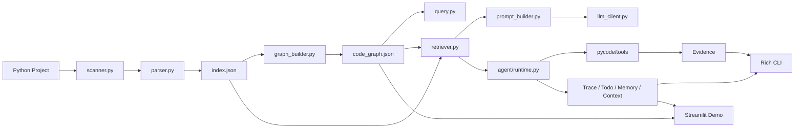
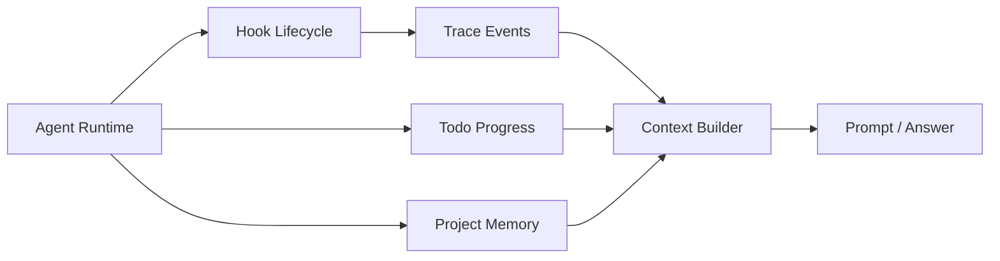

# PyCode

PyCode 是一个面向 Python 项目的代码库理解与改动影响分析 Agent。它不会把整个仓库直接丢给大模型，而是先用静态分析生成结构化索引和代码图谱，再根据问题选择有限上下文，最后让 LLM 或轻量 Agent 基于证据回答问题、分析影响范围和展示执行过程。

这个项目的重点不是做一个简单聊天壳，而是实现一层自己的代码理解中间层：文件扫描、AST 解析、图谱构建、上下文检索、工具调用、权限控制、执行轨迹、项目记忆和可视化展示都由项目本身管理。当前版本主要支持 Python 项目，适合用于学习代码分析、Agent 工程化和项目级上下文管理。

## 核心能力

- 代码索引：递归扫描 Python 文件，提取 import、class、function 和方法信息，生成 `.pclens/index.json`。
- 代码图谱：把文件、类、函数和方法建模为节点，把包含、导入和调用关系建模为边，生成 `.pclens/code_graph.json`。
- 图谱查询：支持查询文件导入、反向依赖、函数调用和入口候选文件。
- 代码库问答：基于 index 和 graph 检索相关上下文，支持 `ask`、`explain`、`onboard`、`impact` 等命令。
- 开发任务 Agent：围绕 git diff、改动影响、测试覆盖等任务规划工具调用，收集证据并生成总结。
- 可观测 Agent 内核：记录 Trace、Todo、Memory、Task DAG 和 Context Section，方便解释 Agent 做了什么、依据来自哪里。
- 展示层：支持 Rich 终端输出和 Streamlit Web Demo，便于演示项目结构、图谱和 Agent 运行过程。

## 快速开始

建议在项目根目录使用虚拟环境中的 Python。

```powershell
.\.venv\Scripts\python.exe -m pip install -r requirements.txt
```

`requirements.txt` 会以可编辑模式安装当前项目，因此 CLI 和 Streamlit 页面都可以直接导入 `pycode` 包。

```powershell
.\.venv\Scripts\python.exe -m pycode.cli index .\examples\demo_project
.\.venv\Scripts\python.exe -m pycode.cli graph .\examples\demo_project
.\.venv\Scripts\python.exe -m pycode.cli query entry .\examples\demo_project
.\.venv\Scripts\python.exe -m pycode.cli agent .\examples\demo_project "这个项目的入口在哪里？阅读顺序应该是怎样的？" --plan-only --show-context --rule-plan
```

前两条命令会在示例项目下生成 `.pclens/index.json` 和 `.pclens/code_graph.json`。`query entry` 会基于静态线索查找入口候选文件。最后一条命令使用离线规则 planner 展示 Agent 计划、Todo 和 Context 摘要，不需要配置 LLM API。

V1.0 推荐从这条离线命令开始演示，因为它能稳定展示 `trace`、`todo`、`context` 和 `evidence` 的关系，而不依赖真实 LLM API。完整演示流程见 [`docs_v1.0/v1.0_demo_script.md`](docs_v1.0/v1.0_demo_script.md)。

如果想查看 Web Demo，可以启动 Streamlit：

```powershell
.\.venv\Scripts\streamlit.exe run .\ui\streamlit_app.py
```

如果需要旧式文本输出，可以在主要 CLI 命令后追加 `--plain`：

```powershell
.\.venv\Scripts\python.exe -m pycode.cli graph .\examples\demo_project --plain
```

## LLM 配置

`ask`、`explain`、`onboard`、`impact` 以及普通 Agent 总结需要 LLM。项目通过环境变量或 `.env` 读取配置，可以复制 `.env.example` 为 `.env` 后填写自己的 API Key。

```powershell
$env:OPENAI_API_KEY="你的 API Key"
```

常用命令示例：

```powershell
.\.venv\Scripts\python.exe -m pycode.cli ask .\examples\demo_project "这个项目的入口在哪里？"
.\.venv\Scripts\python.exe -m pycode.cli explain .\examples\demo_project main.py
.\.venv\Scripts\python.exe -m pycode.cli onboard .\examples\demo_project
.\.venv\Scripts\python.exe -m pycode.cli impact .\examples\demo_project services/user_service.py
```

如果使用 OpenAI-compatible 网关，并且该网关不支持 Responses API，可以在 `.env` 中把 `OPENAI_API_TYPE` 设置为 `chat`。命令行的 `--model` 会优先于环境变量中的 `OPENAI_MODEL`。

## Agent 与项目状态

Agent 命令面向开发分析任务，不默认修改代码、不默认提交 git，也不默认运行测试。只有显式传入 `--run-tests` 时，Agent 才会运行受控 pytest 命令。

```powershell
.\.venv\Scripts\python.exe -m pycode.cli agent .\examples\demo_project "分析当前 git diff 是否影响用户服务逻辑"
.\.venv\Scripts\python.exe -m pycode.cli agent .\examples\demo_project "检查 services/user_service.py 的测试覆盖" --no-tests
.\.venv\Scripts\python.exe -m pycode.cli agent .\examples\demo_project "分析当前改动并运行相关测试" --run-tests
```

常用 Agent 参数：

- `--rule-plan`：使用离线规则 planner，适合稳定演示和无 LLM 环境。
- `--show-context`：展示 included / skipped context section，便于审查输入边界。
- `--plan-only`：只展示计划、Todo 和 Context，不执行工具。
- `--no-tests`：明确不运行测试，只做测试覆盖分析。
- `--run-tests`：显式授权运行受控 pytest。

V1.0 的 AgentResult 中会包含 trace、todos、memory 和 context。它们不是额外的装饰，而是为了让结果能够追溯：哪些工具被调用、哪些步骤完成了、哪些项目记忆被注入、最终结论依据了哪些文件或图谱关系。

项目还提供了轻量的项目记忆和 Task DAG 管理命令：

```powershell
.\.venv\Scripts\python.exe -m pycode.cli memory .\examples\demo_project list
.\.venv\Scripts\python.exe -m pycode.cli task .\examples\demo_project list
```

`examples/demo_project` 默认不携带 `.git` 目录，因此 `git_diff` / `changed_files` 在这个示例目录里通常不会产生真实 diff。需要展示这两个工具时，建议在真实 Git 仓库根目录运行 Agent，或复制示例项目后手动初始化 Git 并制造一处改动。

## V1.0 验收与文档

V1.0-D 阶段已经把项目收口为一个可复现的代码理解与开发分析 harness。推荐阅读顺序：

- [`docs_v1.0/v1.0_acceptance_checklist.md`](docs_v1.0/v1.0_acceptance_checklist.md)：验收场景、命令、观察点和通过标准。
- [`docs_v1.0/v1.0_demo_script.md`](docs_v1.0/v1.0_demo_script.md)：离线演示、普通 Agent、失败场景和 UI 展示流程。
- [`docs_v1.0/v1.0_architecture_overview.md`](docs_v1.0/v1.0_architecture_overview.md)：V1.0 最终架构和模块职责。
- [`docs_v1.0/v1.0_limitations.md`](docs_v1.0/v1.0_limitations.md)：当前局限、非目标和安全边界。

## 架构概览



阶段五可观测链路可以单独理解为：



核心流程可以理解为：先把代码变成可查询的数据，再把数据变成有限上下文，最后让问答或 Agent 基于这些上下文工作。这样做的好处是边界清楚、证据可追溯，也能避免 LLM 自己无约束地读取整个仓库。

## 技术栈

项目主体使用 Python，代码解析依赖标准库 `ast`，CLI 使用 `argparse`，测试使用 `pytest`。LLM 接入通过 OpenAI SDK 封装，终端展示使用 Rich，Web Demo 使用 Streamlit。图谱和记忆数据暂时使用 JSON / Markdown 文件保存，没有引入 Neo4j 或其它外部数据库。

## 项目结构

```text
pycode/
  cli.py                 # CLI 入口
  scanner.py             # Python 文件扫描
  parser.py              # AST 解析
  models.py              # 索引和图谱数据结构
  storage.py             # index / graph 读写
  graph_builder.py       # 代码图谱构建
  query.py               # 图谱查询
  retriever.py           # 上下文检索
  prompt_builder.py      # 阶段三问答 prompt
  llm_client.py          # LLM 客户端封装
  rich_output.py         # Rich 终端展示
  tools/                 # Agent 可调用工具
  agent/                 # planner / executor / runtime / trace / memory / context

ui/
  data_loader.py
  components.py
  streamlit_app.py

examples/demo_project/
  main.py
  controllers/
  services/
  models/
  utils/
  tests/

docs/
  technical_overview.md
  demo_guide.md
  assets/

docs_v1.0/
  v1.0_acceptance_checklist.md
  v1.0_demo_script.md
  v1.0_architecture_overview.md
  v1.0_limitations.md

tests/
  test_scanner.py
  test_parser.py
  test_storage.py
  test_graph_builder.py
  test_retriever.py
  test_agent_*.py
  test_tools_*.py
```

## 能力演进摘要

PyCode 从最小可行的代码扫描器开始，先完成 Python 文件扫描、AST 解析和索引保存；随后引入代码图谱，把文件、类、函数、方法和关系统一成 nodes / edges；第三阶段加入 LLM，但让 LLM 解释检索到的上下文，而不是直接读取整个仓库；第四阶段开始做单 Agent + 多工具的开发分析流程；第五阶段补齐 trace、todo、task、memory 和 context；第六阶段加入 Rich CLI 和 Streamlit Demo；第七阶段主要整理 README、技术文档、演示指南和项目边界，让项目更适合 GitHub 展示和面试讲解。

## 运行测试

项目已有覆盖 scanner、parser、storage、graph_builder、retriever、Agent、tools、Rich 输出和 UI 数据加载等模块的 pytest 测试。完整回归命令如下：

```powershell
.\.venv\Scripts\python.exe -m pytest tests --basetemp=.pytest_tmp --cache-clear
```

Windows 环境如果遇到 pytest 临时目录权限问题，继续优先使用项目内 `.pytest_tmp*` 目录，并换一个新的 `--basetemp` 名称重试。已有命令中如果显式带了 `--basetemp`，不需要再额外配置全局 pytest `addopts`。

V1.0 验收测试集中在 `tests/test_v1_acceptance.py`，并补充覆盖 CLI、Rich 输出和 UI 数据加载。Codex 在当前 Windows 沙箱中运行 pytest 时使用临时进程内包装修正 pytest 临时目录 ACL 行为；该包装不是项目代码的一部分。

## 当前局限

- 当前主要支持 Python 项目，暂未支持跨语言代码库。
- 调用关系基于静态 AST 分析，无法完全覆盖动态调用、反射、运行时注入和复杂类型推断。
- 当前不使用图数据库，代码图谱保存为 JSON，适合学习和小型项目演示。
- LLM 只解释 PyCode 选择出的有限上下文，不会自动读取整个仓库。
- Agent 默认不自动修改代码、不自动提交 git，也不默认运行测试。
- 当前不实现完整多 Agent、远程 MCP、后台 worker、自动任务调度或动态工具市场。
- Streamlit 页面是展示型 Demo，不是完整 IDE。
- 入口判断、影响分析和测试覆盖判断都属于静态分析辅助结果，需要人工结合项目语义确认。

## 后续计划

后续可以继续增强调用关系解析，尤其是类实例方法、跨文件符号解析和更复杂的 import 解析；可以为 Streamlit 图谱页增加更直观的交互式关系图；也可以把 Agent 运行结果导出为 Markdown 报告，方便代码评审和面试展示。更长期的方向是引入更精细的上下文预算、记忆合并策略和多项目分析能力，但这些都应该建立在当前静态分析和证据追踪能力稳定的基础上。
