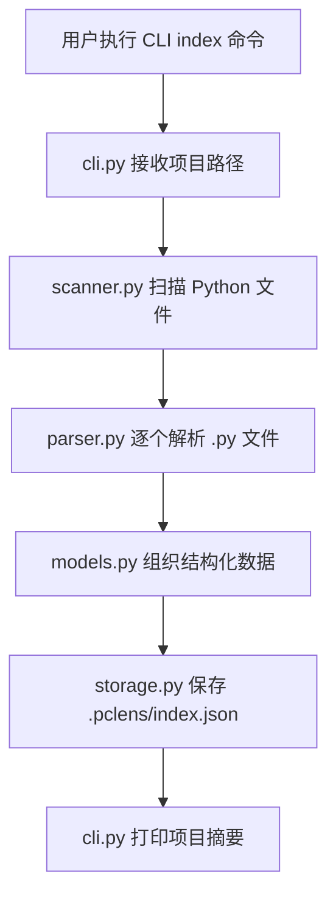
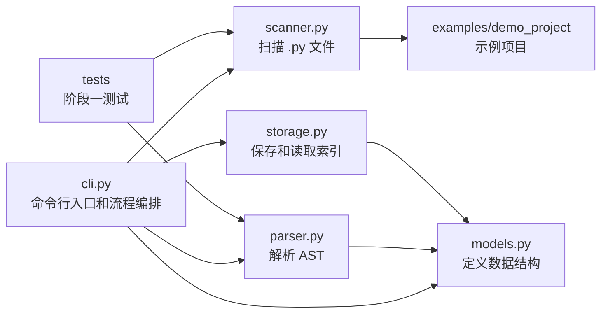

# 阶段一开发记录：代码结构索引 MVP

## 1. 本阶段要完成的内容和目标效果

阶段一的目标是完成项目的第一个 MVP：让 PyCode 能够扫描一个小型 Python 项目，解析其中的代码结构，并生成结构化索引文件。

本阶段要完成的核心内容：

- 输入一个 Python 项目路径。
- 递归扫描项目中的 `.py` 文件。
- 忽略 `.git`、`.venv`、`venv`、`__pycache__`、`node_modules` 等无关目录。
- 使用 Python 标准库 `ast` 解析每个 Python 文件。
- 提取每个文件中的 `import`、`class`、`function` 信息。
- 将扫描和解析结果组织成统一的数据结构。
- 生成 `.pclens/index.json` 索引文件。
- 通过 CLI 命令打印项目摘要，例如文件数量、导入数量、类数量、函数数量。

本阶段要达到的效果：

- 用户可以通过命令行执行索引任务。
- 程序可以正确识别目标项目中的 Python 文件。
- 程序可以正确提取基础代码结构信息。
- 程序可以把结果保存为 JSON 文件。
- 用户可以从终端看到清晰的索引统计结果。

建议命令形式：

```bash
python -m pycode.cli index ./examples/demo_project
```

默认产物：

```text
.pclens/index.json
```

本阶段暂时不做：

- 不接入 LLM。
- 不做自然语言问答。
- 不做代码修改。
- 不做复杂代码图谱。
- 不做可视化界面。
- 不做 Agent 多步任务执行。

## 2. 阶段一工作拆解和文件级功能

### `pycode/scanner.py`

职责：只负责查找 Python 文件。

需要实现的功能：

- 接收一个项目根目录路径。
- 递归遍历目录。
- 只返回 `.py` 文件。
- 跳过无关目录，例如 `.git`、`.venv`、`venv`、`__pycache__`、`node_modules`。
- 返回 `pathlib.Path` 列表。

建议核心函数：

```python
scan_python_files(project_path: Path) -> list[Path]
```

### `pycode/parser.py`

职责：只负责解析单个 Python 文件的代码结构。

需要实现的功能：

- 接收一个 Python 文件路径。
- 读取文件内容。
- 使用 `ast.parse` 构建 AST。
- 提取 `import` 和 `from ... import ...`。
- 提取顶层函数。
- 提取类。
- 提取类中的方法。
- 将解析结果转换为统一的数据结构。

建议核心函数：

```python
parse_python_file(file_path: Path, project_path: Path) -> FileInfo
```

### `pycode/models.py`

职责：只负责定义阶段一需要的数据结构。

需要实现的数据结构：

- `ProjectIndex`：表示整个项目的索引结果。
- `FileInfo`：表示单个 Python 文件的结构信息。
- `ClassInfo`：表示类及其方法信息。

建议字段：

- `ProjectIndex.project_path`
- `ProjectIndex.files`
- `FileInfo.path`
- `FileInfo.imports`
- `FileInfo.classes`
- `FileInfo.functions`
- `ClassInfo.name`
- `ClassInfo.methods`

### `pycode/storage.py`

职责：只负责索引文件的保存和读取。

需要实现的功能：

- 将 `ProjectIndex` 保存为 JSON。
- 从 JSON 中读取索引数据。
- 处理输出路径，例如默认保存为 `.pclens/index.json`。
- 保证 JSON 结构清晰、可读、便于后续阶段扩展。

建议核心函数：

```python
save_index(index: ProjectIndex, output_path: Path) -> None
load_index(index_path: Path) -> ProjectIndex
```

### `pycode/cli.py`

职责：只负责命令行入口和流程编排。

需要实现的功能：

- 提供 `index` 命令。
- 接收项目路径参数。
- 调用 `scanner.py` 扫描文件。
- 调用 `parser.py` 解析文件。
- 组装 `ProjectIndex`。
- 调用 `storage.py` 保存索引。
- 在终端打印项目摘要。

建议命令：

```bash
python -m pycode.cli index ./examples/demo_project
```

建议输出内容：

- 扫描的项目路径。
- 识别到的 Python 文件数量。
- 提取到的 import 数量。
- 提取到的 class 数量。
- 提取到的 function 数量。
- 索引文件保存位置。

### `examples/demo_project/main.py`

职责：提供阶段一功能验证用的小型示例项目。

需要包含的内容：

- 至少一个 `import`。
- 至少一个函数。
- 至少一个类。
- 类中至少一个方法。

该文件用于验证扫描、解析和索引输出是否完整。

### `tests/test_scanner.py`

职责：测试文件扫描功能。

需要覆盖：

- 能找到 `.py` 文件。
- 能忽略非 Python 文件。
- 能忽略 `.git`、`.venv`、`__pycache__` 等目录。
- 返回结果类型为 `Path` 列表。

### `tests/test_parser.py`

职责：测试 AST 解析功能。

需要覆盖：

- 能提取普通 `import`。
- 能提取 `from ... import ...`。
- 能提取顶层函数。
- 能提取类。
- 能提取类方法。

## 3. 阶段一流程图和关系图

### 阶段一整体流程



### 模块职责关系



### 数据流关系

```mermaid
flowchart TD
    ProjectPath[项目路径] --> PythonFiles[Python 文件列表]
    PythonFiles --> FileInfos[FileInfo 列表]
    FileInfos --> ProjectIndex[ProjectIndex]
    ProjectIndex --> IndexJson[.pclens/index.json]

    PythonFiles -.由 scanner.py 生成.-> FileInfos
    FileInfos -.由 parser.py 生成.-> ProjectIndex
    ProjectIndex -.由 storage.py 保存.-> IndexJson
```

## 4. 开发中纪要

### 2026-06-10：实现 `pycode/scanner.py`

本次完成阶段一的文件扫描模块初版实现：

- 在 `pycode/scanner.py` 中新增 `scan_python_files(project_path: Path) -> list[Path]`。
- 使用 `pathlib.Path` 处理路径。
- 使用递归扫描查找指定目录下的 `.py` 文件。
- 忽略 `.git`、`.venv`、`venv`、`__pycache__`、`node_modules` 目录。
- 当项目路径不存在时抛出 `FileNotFoundError`。
- 当传入路径不是目录时抛出 `NotADirectoryError`。
- 返回排序后的 `Path` 列表，保证输出顺序稳定。

### 2026-06-10：实现 `pycode/parser.py` 与 'pycode/models.py'

本次完成阶段一的单文件解析模块初版实现：

- 在 `pycode/models.py` 中新增 `ClassInfo`、`FileInfo`、`ProjectIndex` 三个基础数据结构。
- 在 `pycode/parser.py` 中新增 `parse_python_file(file_path: Path, project_path: Path | None = None) -> FileInfo`。
- 使用 `pathlib.Path` 接收和处理文件路径。
- 使用 `Path.read_text(encoding="utf-8-sig")` 读取 Python 文件内容，兼容普通 UTF-8 和带 BOM 的 UTF-8 文件。
- 使用标准库 `ast.parse` 解析文件结构。
- 提取顶层 `import` 和 `from ... import ...`。
- 提取顶层函数，包括普通函数和异步函数。
- 提取类，以及类中的普通方法和异步方法。
- 将解析结果统一返回为 `FileInfo`。
- 对不存在路径、目录路径、非 `.py` 文件分别进行基础异常处理。

### 2026-06-10：实现 `pycode/storage.py`

本次完成阶段一的索引保存和读取模块初版实现：

- 在 `pycode/storage.py` 中新增 `save_index(index: ProjectIndex, output_path: Path) -> None`。
- 使用 `dataclasses.asdict` 将 `ProjectIndex` 转换为可 JSON 序列化的字典。
- 使用 `json.dumps(..., ensure_ascii=False, indent=2)` 保存结构清晰、可读的 JSON。
- 保存前自动创建输出文件所在目录。
- 新增 `load_index(index_path: Path) -> ProjectIndex`。
- 读取 JSON 后，将字典结构还原为 `ProjectIndex`、`FileInfo`、`ClassInfo` dataclass 对象。
- 对不存在的索引路径和目录路径进行基础异常处理。

### 2026-06-10：实现 `pycode/cli.py`

本次完成阶段一的命令行入口和一级流程编排初版实现：

- 使用 Python 标准库 `argparse` 创建 CLI 应用入口，减少阶段一对外部依赖的要求。
- 新增 `index` 命令，用于扫描并索引指定 Python 项目目录。
- 命令接收 `project_path` 参数作为待扫描项目路径。
- 命令支持 `--output` / `-o` 参数指定索引 JSON 输出路径，默认输出到被扫描项目目录下的 `.pclens/index.json`。
- 在 CLI 中串联 `scan_python_files`、`parse_python_file`、`ProjectIndex`、`save_index`。
- 命令执行完成后输出项目摘要，包括项目路径、Python 文件数量、import 数量、class 数量、function 数量和索引文件位置。

### 2026-06-10：补充 `examples/demo_project` 示例项目

本次补充了可用于阶段一功能测试的示例项目代码：

- 更新 `examples/demo_project/main.py`，加入 `import`、`from ... import ...`、顶层函数、异步函数、类和类方法。
- 新增 `examples/demo_project/services/user_service.py`，用于测试跨文件导入、类、普通方法、异步方法和顶层函数。
- 新增 `examples/demo_project/models/user.py`，用于测试 `dataclass`、类方法和工厂函数。
- 新增 `examples/demo_project/utils/formatting.py`，用于测试标准库导入、多个顶层函数和工具类。
- 新增各子目录的 `__init__.py`，让示例项目结构更接近真实 Python 包。
- 新增 `examples/demo_project/node_modules/ignored.py`，用于验证 scanner 会忽略 `node_modules`。
- 本地创建 `.venv/ignored.py` 和 `__pycache__/ignored.py`，用于验证 scanner 会忽略 `.venv` 和 `__pycache__`。
- 使用 CLI 验证后，示例项目当前可索引到 7 个真实 Python 文件，统计结果为 9 个 import、4 个 class、8 个 function。

### 2026-06-10：补充 `scanner.py` 和 `parser.py` 单元测试

本次补充了阶段一基础模块的单元测试：

- 在 `tests/test_scanner.py` 中补充 scanner 单测。
- 测试 scanner 能递归扫描 `.py` 文件。
- 测试 scanner 会忽略非 Python 文件。
- 测试 scanner 会忽略 `.git`、`.venv`、`venv`、`__pycache__`、`node_modules`。
- 测试 scanner 对不存在路径抛出 `FileNotFoundError`。
- 测试 scanner 对文件路径抛出 `NotADirectoryError`。
- 在 `tests/test_parser.py` 中补充 parser 单测。
- 测试 parser 能提取 `import`、`from ... import ...`、顶层函数、异步函数、类和类方法。
- 测试 parser 在未传入 `project_path` 时默认使用文件名作为 `FileInfo.path`。
- 测试 parser 能兼容带 BOM 的 UTF-8 文件。
- 测试 parser 对不存在文件、目录路径、非 `.py` 文件分别抛出对应异常。
- 使用项目虚拟环境运行测试，结果为 10 个用例全部通过。

### 2026-06-10：阶段一收尾调整

本次完成阶段一收尾调整：

- 将 CLI 默认索引输出位置从当前目录 `index.json` 调整为被扫描项目目录下的 `.pclens/index.json`。
- 保留 `--output` / `-o` 参数，允许用户手动指定索引输出路径。
- 在 `.gitignore` 中补充 `index.json` 和 `.pclens/`，避免索引产物被误提交。
- 在 `README.md` 中补充阶段一已完成内容、项目结构、索引生成方法、测试运行方法、当前局限和后续计划。
- 新增 `tests/test_storage.py`，单独测试索引保存和读取逻辑。
- storage 单测覆盖保存时自动创建父目录、JSON 内容结构、读取后还原 dataclass、兼容 UTF-8 BOM、缺失文件异常和目录路径异常。
- 运行 `python -m pycode.cli index ./examples/demo_project` 验证通过，默认输出位置为 `examples/demo_project/.pclens/index.json`。
- 运行 scanner、parser、storage 三组单元测试，15 个用例全部通过。

## 5. 运行方法

以下命令默认在项目根目录执行。

### 生成示例项目索引

扫描 `examples/demo_project`，并在示例项目目录下生成默认索引文件 `.pclens/index.json`：

```powershell
python -m pycode.cli index ./examples/demo_project
```

### 指定索引输出路径

扫描 `examples/demo_project`，并通过 `--output` 指定输出文件：

```powershell
python -m pycode.cli index ./examples/demo_project --output ./examples/demo_project/.pclens/index.json
```

也可以使用短参数：

```powershell
python -m pycode.cli index ./examples/demo_project -o ./examples/demo_project/.pclens/index.json
```

### 查看 CLI 帮助

查看整体命令帮助：

```powershell
python -m pycode.cli --help
```

查看 `index` 子命令帮助：

```powershell
python -m pycode.cli index --help
```

### 运行阶段一单元测试

如果已激活虚拟环境：

```powershell
python -m pytest tests/test_scanner.py tests/test_parser.py tests/test_storage.py
```

如果未激活虚拟环境，推荐直接使用项目虚拟环境中的 Python：

```powershell
.\.venv\Scripts\python.exe -m pytest tests/test_scanner.py tests/test_parser.py tests/test_storage.py
```

### 遇到 pytest 临时目录权限问题时

如果 pytest 报临时目录权限错误，可以指定临时目录到项目内：

```powershell
.\.venv\Scripts\python.exe -m pytest tests/test_scanner.py tests/test_parser.py tests/test_storage.py --basetemp=.pytest_tmp --cache-clear
```

测试通过时，终端应看到类似输出：

```text
15 passed
```

### 清理临时测试文件

pytest 临时目录和缓存目录不是项目源码，可以删除：

```powershell
Remove-Item -Recurse -Force .\.pytest_tmp
Remove-Item -Recurse -Force .\pytest-cache-files-*
Remove-Item -Recurse -Force .\.pytest_cache
```

如果运行 CLI 时生成了 `.pclens` 索引目录，确认不需要后也可以删除：

```powershell
Remove-Item -Recurse -Force .\examples\demo_project\.pclens
```

## 6. 问题记录

### 2026-06-10：暂无报错

本次实现过程中未出现运行报错。当前仅完成 `scanner.py` 的功能实现，后续需要补充 `tests/test_scanner.py` 对扫描、忽略目录和异常路径进行验证。

### 2026-06-10：`parser.py` 依赖的数据结构尚未定义

实现 `parser.py` 时发现 `FileInfo`、`ClassInfo`、`ProjectIndex` 尚未在 `models.py` 中定义。为保证 `parse_python_file` 能返回统一数据结构，本次同步补充了阶段一所需的最小模型定义。后续实现 `storage.py` 时可以继续基于这些 dataclass 做 JSON 序列化。

### 2026-06-10：解析带 BOM 的 UTF-8 文件时报错

验证 `parser.py` 时，使用 PowerShell 创建的临时 Python 文件包含 UTF-8 BOM，`ast.parse` 报错 `SyntaxError: invalid non-printable character U+FEFF`。已将读取编码从 `utf-8` 调整为 `utf-8-sig`，让解析器能够兼容带 BOM 的 UTF-8 文件。

### 2026-06-10：暂无新的 storage 报错

实现 `storage.py` 时未出现新的运行报错。当前实现暂未做复杂 JSON schema 校验，后续如果索引结构升级，可以再补充更明确的数据校验和错误提示。

### 2026-06-10：全局 Python 环境缺少 `typer`

初版 `cli.py` 使用 `typer` 实现命令行入口，但验证时全局 Python 环境报错 `ModuleNotFoundError: No module named 'typer'`。为保证阶段一 MVP 在未安装额外依赖时也能运行，已将 CLI 改为使用 Python 标准库 `argparse`。当前 CLI 输出先保持简单文本格式，后续如果进入展示增强阶段，可以再引入 Rich 表格或树形输出。

### 2026-06-10：示例项目验证通过

补充 `examples/demo_project` 后，运行 `python -m pycode.cli index ./examples/demo_project --output <temp-index>` 验证通过。输出结果没有包含 `node_modules`、`.venv`、`__pycache__` 中的假 `.py` 文件，说明当前 scanner 的忽略目录逻辑生效。

### 2026-06-10：pytest 临时目录权限问题

首次运行 `python -m pytest tests/test_scanner.py tests/test_parser.py` 时，全局 Python 环境缺少 pytest。改用项目虚拟环境后，pytest 默认临时目录位于用户 Temp 目录，当前执行环境对该目录访问受限，报错 `PermissionError: [WinError 5] 拒绝访问`。随后将 pytest 临时目录指定为项目内 `.pytest_tmp`，但沙箱仍限制 pytest 清理该目录。最终使用提升权限运行 `.\\.venv\\Scripts\\python.exe -m pytest tests/test_scanner.py tests/test_parser.py --basetemp=.pytest_tmp --cache-clear`，测试通过。
