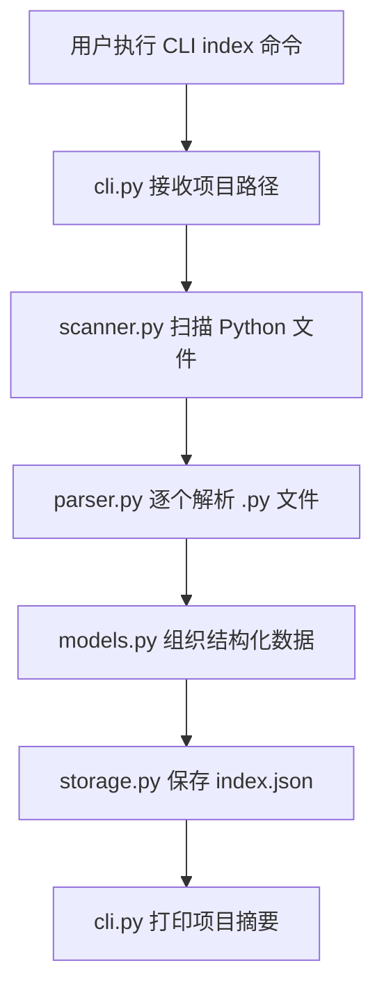
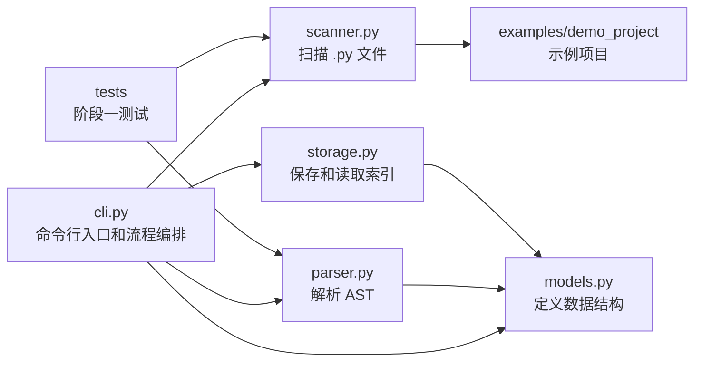

# 阶段一开发记录：代码结构索引 MVP

## 1. 本阶段要完成的内容和目标效果

阶段一的目标是完成项目的第一个 MVP：让 PyCode 能够扫描一个小型 Python 项目，解析其中的代码结构，并生成结构化索引文件。

本阶段要完成的核心内容：

- 输入一个 Python 项目路径。
- 递归扫描项目中的 `.py` 文件。
- 忽略 `.git`、`.venv`、`venv`、`__pycache__`、`node_modules` 等无关目录。
- 使用 Python 标准库 `ast` 解析每个 Python 文件。
- 提取每个文件中的 `import`、`class`、`function` 信息。
- 将扫描和解析结果组织成统一的数据结构。
- 生成 `index.json` 索引文件。
- 通过 CLI 命令打印项目摘要，例如文件数量、导入数量、类数量、函数数量。

本阶段要达到的效果：

- 用户可以通过命令行执行索引任务。
- 程序可以正确识别目标项目中的 Python 文件。
- 程序可以正确提取基础代码结构信息。
- 程序可以把结果保存为 JSON 文件。
- 用户可以从终端看到清晰的索引统计结果。

建议命令形式：

```bash
python -m pycode.cli index ./examples/demo_project
```

建议产物：

```text
index.json
```

或后续升级为：

```text
.pclens/index.json
```

本阶段暂时不做：

- 不接入 LLM。
- 不做自然语言问答。
- 不做代码修改。
- 不做复杂代码图谱。
- 不做可视化界面。
- 不做 Agent 多步任务执行。

## 2. 阶段一工作拆解和文件级功能

### `pycode/scanner.py`

职责：只负责查找 Python 文件。

需要实现的功能：

- 接收一个项目根目录路径。
- 递归遍历目录。
- 只返回 `.py` 文件。
- 跳过无关目录，例如 `.git`、`.venv`、`venv`、`__pycache__`、`node_modules`。
- 返回 `pathlib.Path` 列表。

建议核心函数：

```python
scan_python_files(project_path: Path) -> list[Path]
```

### `pycode/parser.py`

职责：只负责解析单个 Python 文件的代码结构。

需要实现的功能：

- 接收一个 Python 文件路径。
- 读取文件内容。
- 使用 `ast.parse` 构建 AST。
- 提取 `import` 和 `from ... import ...`。
- 提取顶层函数。
- 提取类。
- 提取类中的方法。
- 将解析结果转换为统一的数据结构。

建议核心函数：

```python
parse_python_file(file_path: Path, project_path: Path) -> FileInfo
```

### `pycode/models.py`

职责：只负责定义阶段一需要的数据结构。

需要实现的数据结构：

- `ProjectIndex`：表示整个项目的索引结果。
- `FileInfo`：表示单个 Python 文件的结构信息。
- `ClassInfo`：表示类及其方法信息。

建议字段：

- `ProjectIndex.project_path`
- `ProjectIndex.files`
- `FileInfo.path`
- `FileInfo.imports`
- `FileInfo.classes`
- `FileInfo.functions`
- `ClassInfo.name`
- `ClassInfo.methods`

### `pycode/storage.py`

职责：只负责索引文件的保存和读取。

需要实现的功能：

- 将 `ProjectIndex` 保存为 JSON。
- 从 JSON 中读取索引数据。
- 处理输出路径，例如默认保存为 `index.json`。
- 保证 JSON 结构清晰、可读、便于后续阶段扩展。

建议核心函数：

```python
save_index(index: ProjectIndex, output_path: Path) -> None
load_index(index_path: Path) -> ProjectIndex
```

### `pycode/cli.py`

职责：只负责命令行入口和流程编排。

需要实现的功能：

- 提供 `index` 命令。
- 接收项目路径参数。
- 调用 `scanner.py` 扫描文件。
- 调用 `parser.py` 解析文件。
- 组装 `ProjectIndex`。
- 调用 `storage.py` 保存索引。
- 在终端打印项目摘要。

建议命令：

```bash
python -m pycode.cli index ./examples/demo_project
```

建议输出内容：

- 扫描的项目路径。
- 识别到的 Python 文件数量。
- 提取到的 import 数量。
- 提取到的 class 数量。
- 提取到的 function 数量。
- 索引文件保存位置。

### `examples/demo_project/main.py`

职责：提供阶段一功能验证用的小型示例项目。

需要包含的内容：

- 至少一个 `import`。
- 至少一个函数。
- 至少一个类。
- 类中至少一个方法。

该文件用于验证扫描、解析和索引输出是否完整。

### `tests/test_scanner.py`

职责：测试文件扫描功能。

需要覆盖：

- 能找到 `.py` 文件。
- 能忽略非 Python 文件。
- 能忽略 `.git`、`.venv`、`__pycache__` 等目录。
- 返回结果类型为 `Path` 列表。

### `tests/test_parser.py`

职责：测试 AST 解析功能。

需要覆盖：

- 能提取普通 `import`。
- 能提取 `from ... import ...`。
- 能提取顶层函数。
- 能提取类。
- 能提取类方法。

## 3. 阶段一流程图和关系图

### 阶段一整体流程



### 模块职责关系



### 数据流关系

```mermaid
flowchart TD
    ProjectPath[项目路径] --> PythonFiles[Python 文件列表]
    PythonFiles --> FileInfos[FileInfo 列表]
    FileInfos --> ProjectIndex[ProjectIndex]
    ProjectIndex --> IndexJson[index.json]

    PythonFiles -.由 scanner.py 生成.-> FileInfos
    FileInfos -.由 parser.py 生成.-> ProjectIndex
    ProjectIndex -.由 storage.py 保存.-> IndexJson
```

