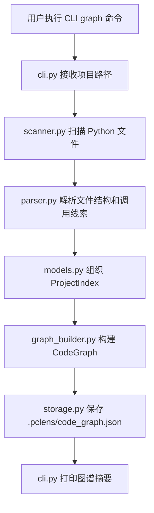
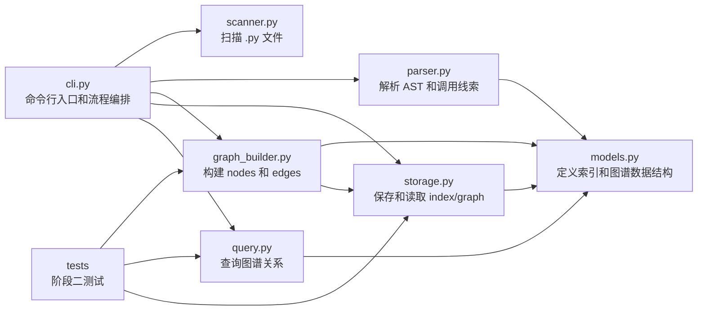
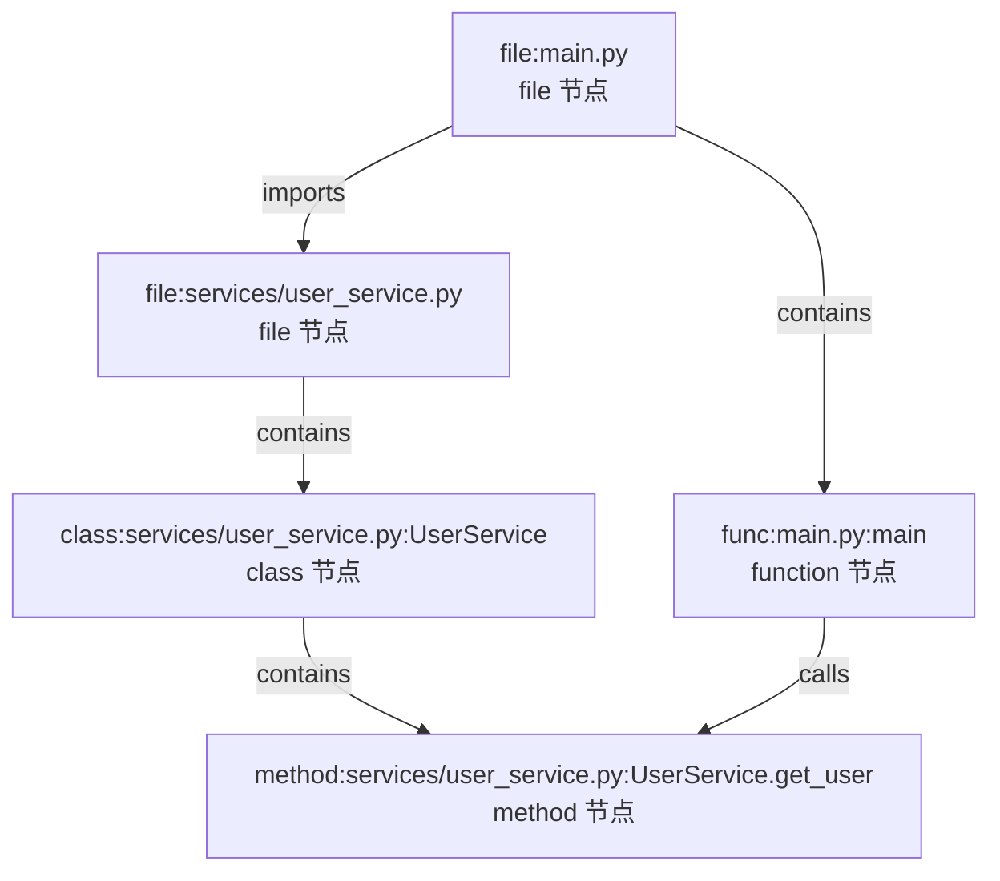
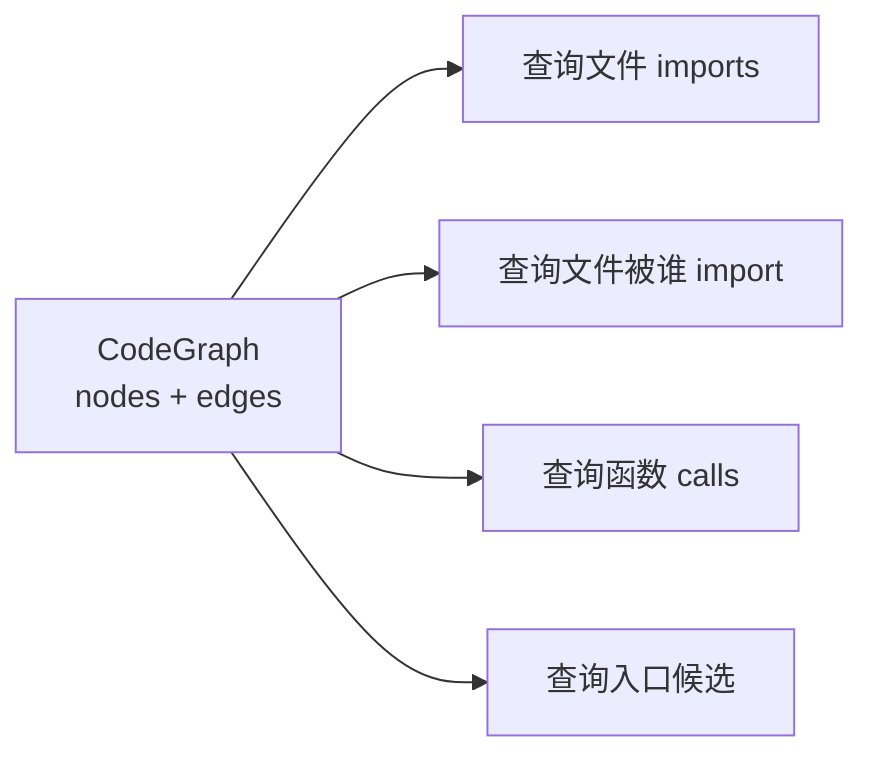

# 阶段二开发记录：代码关系图谱

## 1. 本阶段要完成的内容和目标效果

阶段二的目标是把阶段一生成的“代码结构清单”升级为“代码关系图谱”。阶段一已经能够回答项目中有哪些文件、类和函数；阶段二要进一步回答这些结构之间存在什么关系。

本阶段要完成的核心内容：

- 基于阶段一的扫描和解析结果，构建图结构数据。
- 将文件、类、函数抽象为 `node`。
- 将包含、导入、调用关系抽象为 `edge`。
- 生成图谱 JSON 文件，例如 `.pclens/code_graph.json`。
- 支持查询某个文件 import 了哪些模块或文件。
- 支持查询某个文件被哪些文件 import。
- 支持查询某个函数内部调用了哪些函数。
- 支持初步判断项目入口文件。
- 为后续阶段的问答、影响分析和 Agent 工具调用提供结构化基础。

本阶段要达到的效果：

- 用户可以通过命令行生成代码关系图谱。
- 图谱结果中包含清晰的 `nodes` 和 `edges`。
- 图谱可以表达文件、类、函数之间的基础关系。
- 用户可以执行简单查询，查看 imports、反向依赖、函数调用和入口候选。
- 项目从“代码结构索引工具”升级为“代码结构分析工具”。

建议命令形式：

```bash
python -m pycode.cli graph ./examples/demo_project
```

默认产物：

```text
.pclens/code_graph.json
```

本阶段暂时不做：

- 不接入 LLM。
- 不做自然语言问答。
- 不让程序自动修改代码。
- 不做复杂前端。
- 不引入 Neo4j 或其他图数据库。
- 不做复杂类型推断。
- 不追求完全准确覆盖所有动态调用关系。

## 2. 阶段二工作拆解和文件级功能

### `pycode/models.py`

职责：扩展阶段二需要的图谱数据结构。

需要新增或扩展的数据结构：

- `GraphNode`：表示图谱节点。
- `GraphEdge`：表示图谱边。
- `CodeGraph`：表示完整代码关系图谱。

建议字段：

- `GraphNode.id`
- `GraphNode.type`
- `GraphNode.name`
- `GraphNode.path`
- `GraphEdge.source`
- `GraphEdge.target`
- `GraphEdge.type`
- `CodeGraph.project_path`
- `CodeGraph.nodes`
- `CodeGraph.edges`

节点类型建议：

```text
file
class
function
method
```

边类型建议：

```text
contains
imports
calls
```

### `pycode/parser.py`

职责：在阶段一解析能力基础上，补充函数调用信息和入口判断线索。

需要补充的功能：

- 从函数体和方法体中提取简单调用关系。
- 识别 `foo()`、`obj.foo()`、`module.foo()` 这类基础调用形式。
- 记录每个函数或方法内部调用了哪些名称。
- 初步识别 `if __name__ == "__main__"` 入口线索。

注意边界：

- 当前只做静态 AST 分析。
- 不处理运行时动态调用。
- 不做复杂类型推断。
- 对 `obj.method()` 可以先记录为 `method` 或 `obj.method`，后续再逐步增强解析精度。

### `pycode/graph_builder.py`

职责：把阶段一的文件结构信息转换为阶段二的图谱结构。

需要实现的功能：

- 接收 `ProjectIndex` 或文件解析结果。
- 为每个 Python 文件生成 `file` 节点。
- 为每个顶层函数生成 `function` 节点。
- 为每个类生成 `class` 节点。
- 为每个类方法生成 `method` 节点。
- 生成文件包含函数、类的 `contains` 边。
- 生成类包含方法的 `contains` 边。
- 根据 import 信息生成 `imports` 边。
- 根据函数调用信息生成 `calls` 边。
- 输出完整 `CodeGraph`。

建议核心函数：

```python
build_code_graph(index: ProjectIndex) -> CodeGraph
```

可以先保证：

- `contains` 关系完整可靠。
- `imports` 关系能覆盖项目内部常见导入。
- `calls` 关系先做简单名称级别识别。

### `pycode/query.py`

职责：提供基于代码图谱的查询函数。

需要实现的功能：

- 查询某个文件 import 了哪些目标。
- 查询某个文件被哪些文件 import。
- 查询某个函数或方法调用了哪些函数。
- 查询项目入口候选文件。

建议核心函数：

```python
get_file_imports(graph: CodeGraph, file_path: str) -> list[GraphEdge]
get_file_imported_by(graph: CodeGraph, file_path: str) -> list[GraphEdge]
get_function_calls(graph: CodeGraph, function_id: str) -> list[GraphEdge]
find_entry_candidates(graph: CodeGraph) -> list[GraphNode]
```

### `pycode/storage.py`

职责：扩展 JSON 保存和读取能力，支持图谱文件。

需要补充的功能：

- 保存 `CodeGraph` 到 `.pclens/code_graph.json`。
- 从 `.pclens/code_graph.json` 读取 `CodeGraph`。
- 保持 JSON 可读、稳定、便于测试。

建议核心函数：

```python
save_graph(graph: CodeGraph, output_path: Path) -> None
load_graph(graph_path: Path) -> CodeGraph
```

### `pycode/cli.py`

职责：扩展命令行入口，增加阶段二相关命令。

需要补充的功能：

- 新增 `graph` 命令，用于生成代码关系图谱。
- 可复用阶段一的扫描、解析和索引构建流程。
- 默认输出 `.pclens/code_graph.json`。
- 打印图谱摘要，例如节点数量、边数量、文件节点数量、函数节点数量、导入边数量、调用边数量。
- 可以根据实现进度增加简单查询命令。

建议命令：

```powershell
python -m pycode.cli graph ./examples/demo_project
```

可选查询命令：

```powershell
python -m pycode.cli query imports ./examples/demo_project main.py
python -m pycode.cli query imported-by ./examples/demo_project services/user_service.py
python -m pycode.cli query entry ./examples/demo_project
```

### `examples/demo_project/`

职责：提供阶段二图谱功能验证用的小型示例项目。

需要确认或补充的内容：

- 至少存在跨文件 import。
- 至少存在类和方法。
- 至少存在顶层函数调用。
- 至少存在方法调用。
- 至少存在一个入口线索，例如 `main()` 或 `if __name__ == "__main__"`。

阶段二应尽量复用阶段一示例项目，只在确实缺少验证场景时做小范围补充。

### `tests/test_graph_builder.py`

职责：测试代码图谱构建能力。

需要覆盖：

- 能生成 `file` 节点。
- 能生成 `class`、`function`、`method` 节点。
- 能生成 `contains` 边。
- 能生成基础 `imports` 边。
- 能生成简单 `calls` 边。
- 图谱节点和边的 `id` 稳定可预测。

### `tests/test_query.py`

职责：测试图谱查询能力。

需要覆盖：

- 能查询某个文件的 imports。
- 能查询某个文件被谁 import。
- 能查询某个函数内部 calls。
- 能查询入口候选文件。
- 对不存在的文件或函数给出稳定结果，例如返回空列表。

### `tests/test_storage.py`

职责：在已有 storage 测试基础上补充图谱保存和读取测试。

需要新增覆盖：

- 能保存 `CodeGraph`。
- 能读取 `CodeGraph` 并还原为 dataclass。
- 能自动创建图谱输出目录。
- 能保持 JSON 中 `nodes` 和 `edges` 的结构清晰。

## 3. 阶段二流程图和关系图

### 阶段二整体流程



### 模块职责关系



### 图谱数据关系



### 查询能力关系



## 4. 开发中纪要

阶段二开发过程中，每完成或修改一块内容，在本区域追加开发纪要，说明本次动作做了什么、涉及哪些文件、产生了什么结果。

### 2026-06-11：扩展 `pycode/models.py` 图谱数据结构

本次完成阶段二图谱模型的最小数据结构定义：

- 在 `pycode/models.py` 中新增 `GraphNode`，用于表示图谱中的节点。
- 在 `pycode/models.py` 中新增 `GraphEdge`，用于表示图谱中的关系边。
- 在 `pycode/models.py` 中新增 `CodeGraph`，用于表示完整代码关系图谱。
- 保留阶段一已有的 `ClassInfo`、`FileInfo`、`ProjectIndex` 不变，避免影响现有 `index.json` 结构和阶段一测试。
- 当前模型先使用通用字符串字段表示节点类型和边类型，后续实现 `graph_builder.py` 时再统一约定 `file`、`class`、`function`、`method`、`contains`、`imports`、`calls` 等取值。
- 使用 `.\.venv\Scripts\python.exe -m pytest tests/test_storage.py --basetemp=.pytest_tmp --cache-clear` 验证现有 storage 测试通过，结果为 5 个用例全部通过。

### 2026-06-11：补充 `pycode/parser.py` 调用关系和入口线索解析

本次完成阶段二 parser 的功能补充：

- 在 `pycode/models.py` 中新增 `CallInfo`，用于表示某个函数或方法内部调用了哪些目标。
- 在 `FileInfo` 中新增 `call_infos` 字段，用于保存当前文件内的调用关系线索。
- 在 `FileInfo` 中新增 `has_main_guard` 字段，用于记录文件是否存在 `if __name__ == "__main__"` 入口线索。
- 在 `pycode/parser.py` 中补充函数调用解析，支持识别 `foo()`、`obj.foo()`、`module.foo()` 等基础调用形式。
- 在 `pycode/parser.py` 中补充类方法调用解析，调用方使用 `ClassName.method_name` 形式记录。
- 对没有任何调用的函数或方法不生成空 `CallInfo`，避免后续图谱出现无意义数据。
- 在 `pycode/storage.py` 中补充 `CallInfo` 读取逻辑，并保持对旧版 index JSON 的兼容：缺少 `call_infos` 和 `has_main_guard` 字段时使用默认值。
- 在 `tests/test_parser.py` 中新增调用关系和入口线索测试。
- 在 `tests/test_storage.py` 中新增新版字段保存和读取测试。
- 使用 `.\.venv\Scripts\python.exe -m pytest tests/test_parser.py tests/test_storage.py --basetemp=.pytest_tmp --cache-clear` 验证通过，结果为 13 个用例全部通过。

### 2026-06-11：实现 `pycode/graph_builder.py` 图谱构建初版

本次完成阶段二图谱构建模块初版实现：

- 新增 `pycode/graph_builder.py`。
- 新增 `build_code_graph(index: ProjectIndex) -> CodeGraph`，用于把阶段一索引转换为阶段二代码图谱。
- 为每个 Python 文件生成 `file` 节点。
- 为每个顶层函数生成 `function` 节点。
- 为每个类生成 `class` 节点。
- 为每个类方法生成 `method` 节点。
- 生成文件包含函数、文件包含类、类包含方法的 `contains` 边。
- 根据 `FileInfo.imports` 生成 `imports` 边，项目内部导入会尽量解析到对应 `file` 节点，标准库或第三方导入会生成 `external` 节点。
- 根据 `FileInfo.call_infos` 生成 `calls` 边，项目内部可识别调用会解析到已有函数、类或方法节点，暂时无法解析的调用会生成外部函数节点，避免图谱中出现悬空边。
- 对节点和边做去重，保证重复 import 或重复 call 不会生成重复图谱元素。
- 新增 `tests/test_graph_builder.py`，覆盖结构节点、`contains` 边、内部和外部 `imports` 边、已知和未知 `calls` 边、节点和边去重。
- 使用 `.\.venv\Scripts\python.exe -m pytest tests --basetemp=.pytest_tmp --cache-clear` 运行全量测试，结果为 21 个用例全部通过。

### 2026-06-11：实现 `pycode/query.py` 图谱查询函数

本次完成阶段二图谱查询模块初版实现：

- 新增 `pycode/query.py`。
- 新增 `get_file_imports(graph: CodeGraph, file_path: str) -> list[GraphEdge]`，用于查询某个文件 import 了哪些目标。
- 新增 `get_file_imported_by(graph: CodeGraph, file_path: str) -> list[GraphEdge]`，用于查询某个文件被哪些文件 import。
- 新增 `get_function_calls(graph: CodeGraph, function_id: str) -> list[GraphEdge]`，用于查询某个函数或方法调用了哪些目标。
- 新增 `find_entry_candidates(graph: CodeGraph) -> list[GraphNode]`，用于根据图谱结构初步判断入口候选文件。
- 新增 `get_target_nodes` 和 `get_source_nodes` 辅助函数，方便后续 CLI 将边转换为可显示的节点信息。
- 查询函数兼容 Windows 风格路径，会将 `\` 统一转换为 `/` 后匹配图谱中的文件节点。
- 当前入口候选判断基于图谱内已有信息：文件名为 `main.py`、`app.py`、`cli.py`、`__main__.py`，或文件包含名为 `main` 的顶层函数。后续如果把 `has_main_guard` 写入图谱，可进一步提高入口判断准确度。
- 新增 `tests/test_query.py`，覆盖文件 imports 查询、反向 import 查询、函数调用查询、入口候选查询、缺失目标空结果和边到节点的解析。
- 使用 `.\.venv\Scripts\python.exe -m pytest tests --basetemp=.pytest_tmp --cache-clear` 运行全量测试，结果为 28 个用例全部通过。

### 2026-06-11：扩展 `pycode/storage.py` 支持图谱保存和读取

本次完成阶段二 storage 的图谱文件读写能力：

- 在 `pycode/storage.py` 中新增 `save_graph(graph: CodeGraph, output_path: Path) -> None`。
- 在 `pycode/storage.py` 中新增 `load_graph(graph_path: Path) -> CodeGraph`。
- 图谱保存使用 `dataclasses.asdict` 转换 dataclass，并通过 `json.dumps(..., ensure_ascii=False, indent=2)` 输出清晰可读的 JSON。
- 保存图谱前会自动创建输出文件所在目录，适配默认 `.pclens/code_graph.json` 这类路径。
- 图谱读取支持 UTF-8 BOM，和阶段一 `load_index` 行为保持一致。
- 图谱读取会将 JSON 中的 `nodes` 和 `edges` 还原为 `GraphNode` 和 `GraphEdge` dataclass 对象。
- 对缺失图谱文件抛出 `FileNotFoundError`。
- 对目录路径抛出 `IsADirectoryError`。
- 在 `tests/test_storage.py` 中新增图谱保存、图谱读取、UTF-8 BOM、缺失文件和目录路径测试。
- 使用 `.\.venv\Scripts\python.exe -m pytest tests --basetemp=.pytest_tmp --cache-clear` 运行全量测试，结果为 33 个用例全部通过。

### 2026-06-11：扩展 `pycode/cli.py` 阶段二命令

本次完成阶段二 CLI 命令扩展：

- 在 `pycode/cli.py` 中抽取 `build_project_index(project_path: Path) -> ProjectIndex`，让阶段一索引和阶段二图谱生成复用同一套扫描解析流程。
- 保留阶段一 `index` 命令行为不变，仍默认生成 `.pclens/index.json`。
- 新增 `graph` 命令，用于扫描项目、构建代码图谱并保存 `.pclens/code_graph.json`。
- 新增 `graph_project(project_path: Path, output_path: Path | None = None) -> CodeGraph`，用于命令行和测试复用。
- 新增 `query` 命令，支持 `imports`、`imported-by`、`calls`、`entry` 四类查询。
- 新增 `query_project_graph(...)`，用于读取已生成的 `code_graph.json` 并执行查询。
- `query imports`、`query imported-by`、`query calls` 需要传入查询目标。
- `query entry` 不需要传入查询目标。
- 新增图谱摘要输出，包括节点数量、边数量、文件节点数量、类节点数量、函数节点数量、方法节点数量、import 边数量和 call 边数量。
- 新增 `tests/test_cli.py`，覆盖图谱生成命令函数、图谱查询命令函数、入口查询、缺少目标参数报错和阶段二 argparse 参数解析。
- 使用 `.\.venv\Scripts\python.exe -m pytest tests --basetemp=.pytest_tmp --cache-clear` 运行全量测试，结果为 38 个用例全部通过。
- 使用 `.\.venv\Scripts\python.exe -m pycode.cli graph .\examples\demo_project` 验证示例项目图谱生成成功，输出节点 44 个、边 57 个。
- 使用 `.\.venv\Scripts\python.exe -m pycode.cli query imports .\examples\demo_project main.py` 验证 `main.py` imports 查询成功。
- 使用 `.\.venv\Scripts\python.exe -m pycode.cli query entry .\examples\demo_project` 验证入口候选查询成功，结果为 `file:main.py`。

### 2026-06-11：丰富 `examples/demo_project` 阶段二验证场景

本次补充和调整示例项目，使其更适合阶段二代码关系图谱验证：

- 新增 `examples/demo_project/controllers/__init__.py`。
- 新增 `examples/demo_project/controllers/user_controller.py`，提供 `UserController` 类和 `create_user_controller` 工厂函数。
- 更新 `examples/demo_project/main.py`，让主流程从直接调用 `UserService` 调整为 `main -> AppRunner -> UserController -> UserService` 的多层调用链。
- 更新 `examples/demo_project/services/user_service.py`，增加对 `normalize_email` 和 `User.display_name()` 的调用，使服务层内部 calls 更明显。
- 当前 demo 可覆盖阶段二需要的跨文件 import、反向依赖、类包含方法、函数调用方法、函数调用函数和入口文件判断。
- 重新运行 `.\.venv\Scripts\python.exe -m pycode.cli index .\examples\demo_project`，生成示例索引，结果为 9 个 Python 文件、17 个 import、5 个 class、9 个 function。
- 重新运行 `.\.venv\Scripts\python.exe -m pycode.cli graph .\examples\demo_project`，生成示例图谱，结果为 55 个节点、76 条边。
- 使用 `query imports main.py` 验证 `main.py` 可查询到对 `controllers/user_controller.py`、`services/user_service.py` 和 `utils/formatting.py` 的导入关系。
- 使用 `query imported-by services/user_service.py` 验证反向依赖查询成功，结果包含 `controllers/user_controller.py` 和 `main.py`。
- 使用 `query calls func:main.py:main` 验证主函数调用关系查询成功。
- 使用 `.\.venv\Scripts\python.exe -m pytest tests --basetemp=.pytest_tmp --cache-clear` 运行全量测试，结果为 38 个用例全部通过。

## 5. 运行方法

以下命令默认在项目根目录执行。

### 命令总览

当前 CLI 的统一入口是：

```powershell
.\.venv\Scripts\python.exe -m pycode.cli <command> [arguments] [options]
```

如果已经激活虚拟环境，可以把前面的 `.\.venv\Scripts\python.exe` 换成 `python`：

```powershell
python -m pycode.cli <command> [arguments] [options]
```

当前可用命令如下：

| 功能 | 命令形式 | 说明 |
| --- | --- | --- |
| 查看总帮助 | `python -m pycode.cli --help` | 查看所有一级命令 |
| 生成结构索引 | `python -m pycode.cli index <project_path>` | 扫描项目并生成 `.pclens/index.json` |
| 指定索引输出 | `python -m pycode.cli index <project_path> -o <index_path>` | 生成索引并写入指定 JSON 文件 |
| 生成代码图谱 | `python -m pycode.cli graph <project_path>` | 扫描项目并生成 `.pclens/code_graph.json` |
| 指定图谱输出 | `python -m pycode.cli graph <project_path> -o <graph_path>` | 生成图谱并写入指定 JSON 文件 |
| 查询文件 imports | `python -m pycode.cli query imports <project_path> <file_path>` | 查看某个文件导入了哪些目标 |
| 查询反向依赖 | `python -m pycode.cli query imported-by <project_path> <file_path>` | 查看某个文件被哪些文件导入 |
| 查询函数调用 | `python -m pycode.cli query calls <project_path> <function_id>` | 查看某个函数或方法调用了哪些目标 |
| 查询入口候选 | `python -m pycode.cli query entry <project_path>` | 查看项目可能的入口文件 |
| 指定查询图谱 | `python -m pycode.cli query <query_type> <project_path> [target] --graph <graph_path>` | 从指定图谱文件执行查询 |

命令参数说明：

- `<command>`：一级命令，目前包括 `index`、`graph`、`query`。
- `<project_path>`：要分析的 Python 项目目录，例如 `.\examples\demo_project`。
- `<query_type>`：查询类型，目前包括 `imports`、`imported-by`、`calls`、`entry`。
- `<file_path>`：相对项目根目录的文件路径，例如 `main.py` 或 `services/user_service.py`。
- `<function_id>`：图谱中的函数或方法节点 id，例如 `func:main.py:main`。
- `-o` / `--output`：指定生成文件路径，可用于 `index` 和 `graph`。
- `--graph`：指定查询时读取的 `code_graph.json` 文件路径。

### 功能和命令对应关系

如果要生成“代码清单”，使用 `index`：

```powershell
.\.venv\Scripts\python.exe -m pycode.cli index .\examples\demo_project
```

如果要生成“代码关系图谱”，使用 `graph`：

```powershell
.\.venv\Scripts\python.exe -m pycode.cli graph .\examples\demo_project
```

如果要查“这个文件 import 了谁”，使用 `query imports`：

```powershell
.\.venv\Scripts\python.exe -m pycode.cli query imports .\examples\demo_project main.py
```

如果要查“这个文件被谁 import”，使用 `query imported-by`：

```powershell
.\.venv\Scripts\python.exe -m pycode.cli query imported-by .\examples\demo_project services/user_service.py
```

如果要查“这个函数调用了谁”，使用 `query calls`：

```powershell
.\.venv\Scripts\python.exe -m pycode.cli query calls .\examples\demo_project func:main.py:main
```

如果要查“项目入口可能在哪里”，使用 `query entry`：

```powershell
.\.venv\Scripts\python.exe -m pycode.cli query entry .\examples\demo_project
```

### 生成示例项目索引

阶段二图谱构建会复用阶段一的扫描和解析能力。可以先生成或刷新示例项目索引：

命令构成：

```text
python -m pycode.cli index <project_path> [-o <index_path>]
```

```powershell
.\.venv\Scripts\python.exe -m pycode.cli index .\examples\demo_project
```

如果已经激活虚拟环境，也可以使用：

```powershell
python -m pycode.cli index .\examples\demo_project
```

默认输出位置：

```text
examples/demo_project/.pclens/index.json
```

### 生成示例项目代码图谱

命令构成：

```text
python -m pycode.cli graph <project_path> [-o <graph_path>]
```

```powershell
.\.venv\Scripts\python.exe -m pycode.cli graph .\examples\demo_project
```

如果已经激活虚拟环境，也可以使用：

```powershell
python -m pycode.cli graph .\examples\demo_project
```

默认输出位置：

```text
examples/demo_project/.pclens/code_graph.json
```

当前示例项目图谱生成后，终端摘要应包含类似结果：

```text
PyCode graph completed.
Project path: examples\demo_project
Nodes: 55
Edges: 76
File nodes: 9
Class nodes: 5
Function nodes: 27
Method nodes: 10
Import edges: 11
Call edges: 41
Graph file: examples\demo_project\.pclens\code_graph.json
```

### 查询某个文件的 imports

查询 `main.py` 导入了哪些目标：

命令构成：

```text
python -m pycode.cli query imports <project_path> <file_path> [--graph <graph_path>]
```

```powershell
.\.venv\Scripts\python.exe -m pycode.cli query imports .\examples\demo_project main.py
```

示例输出中应包含：

```text
file:main.py --imports--> file:controllers/user_controller.py
file:main.py --imports--> file:services/user_service.py
file:main.py --imports--> file:utils/formatting.py
```

### 查询某个文件被谁 import

查询 `services/user_service.py` 被哪些文件导入：

命令构成：

```text
python -m pycode.cli query imported-by <project_path> <file_path> [--graph <graph_path>]
```

```powershell
.\.venv\Scripts\python.exe -m pycode.cli query imported-by .\examples\demo_project services/user_service.py
```

示例输出中应包含：

```text
file:controllers/user_controller.py --imports--> file:services/user_service.py
file:main.py --imports--> file:services/user_service.py
```

### 查询某个函数的 calls

查询 `main.py` 中的 `main` 函数调用了哪些目标：

命令构成：

```text
python -m pycode.cli query calls <project_path> <function_id> [--graph <graph_path>]
```

```powershell
.\.venv\Scripts\python.exe -m pycode.cli query calls .\examples\demo_project func:main.py:main
```

示例输出中应包含：

```text
func:main.py:main --calls--> func:main.py:load_config
func:main.py:main --calls--> func:controllers/user_controller.py:create_user_controller
func:main.py:main --calls--> class:main.py:AppRunner
```

### 查询入口候选文件

命令构成：

```text
python -m pycode.cli query entry <project_path> [--graph <graph_path>]
```

```powershell
.\.venv\Scripts\python.exe -m pycode.cli query entry .\examples\demo_project
```

示例输出：

```text
file:main.py (file)
```

### 指定图谱输出路径

可以使用 `--output` 或 `-o` 指定图谱输出文件：

```powershell
.\.venv\Scripts\python.exe -m pycode.cli graph .\examples\demo_project --output .\examples\demo_project\.pclens\code_graph.json
```

短参数写法：

```powershell
.\.venv\Scripts\python.exe -m pycode.cli graph .\examples\demo_project -o .\examples\demo_project\.pclens\code_graph.json
```

### 指定查询使用的图谱文件

如果图谱文件不在默认位置，可以使用 `--graph` 指定：

```powershell
.\.venv\Scripts\python.exe -m pycode.cli query imports .\examples\demo_project main.py --graph .\examples\demo_project\.pclens\code_graph.json
```

### 查看 CLI 帮助

查看整体命令帮助：

```powershell
.\.venv\Scripts\python.exe -m pycode.cli --help
```

查看阶段二命令帮助：

```powershell
.\.venv\Scripts\python.exe -m pycode.cli graph --help
.\.venv\Scripts\python.exe -m pycode.cli query --help
```

### 运行阶段二相关测试

只运行阶段二新增或重点修改的测试：

```powershell
.\.venv\Scripts\python.exe -m pytest tests/test_parser.py tests/test_graph_builder.py tests/test_query.py tests/test_storage.py tests/test_cli.py --basetemp=.pytest_tmp --cache-clear
```

运行全部测试：

```powershell
.\.venv\Scripts\python.exe -m pytest tests --basetemp=.pytest_tmp --cache-clear
```

当前全量测试通过结果：

```text
38 passed
```

### pytest 缓存权限问题处理

如果遇到 `.pytest_cache` 目录访问权限问题，可以继续使用项目内临时目录：

```powershell
.\.venv\Scripts\python.exe -m pytest tests --basetemp=.pytest_tmp --cache-clear
```

必要时在当前执行环境中需要提升权限运行同一条测试命令。

## 6. 开发后总结

### 实际完成内容和完成情况

阶段二已完成“代码关系图谱”核心 MVP。当前项目已经可以从 Python 项目源码中提取文件、类、函数、方法、导入关系和简单调用关系，并将这些结构组织为 `CodeGraph`。

本阶段实际完成内容：

- 扩展 `models.py`，新增 `CallInfo`、`GraphNode`、`GraphEdge`、`CodeGraph`。
- 扩展 `parser.py`，支持函数和方法内部调用关系提取，支持 `if __name__ == "__main__"` 入口线索识别。
- 新增 `graph_builder.py`，支持从 `ProjectIndex` 构建 `nodes / edges` 图谱。
- 新增 `query.py`，支持 imports、反向 imports、calls、入口候选查询。
- 扩展 `storage.py`，支持 `code_graph.json` 的保存和读取。
- 扩展 `cli.py`，新增 `graph` 和 `query` 命令。
- 丰富 `examples/demo_project`，增加 controller 层和多层调用链，使示例项目更适合阶段二验证。
- 补充阶段二测试，覆盖 parser、graph_builder、query、storage、cli 的核心行为。
- 生成示例项目阶段二产物 `examples/demo_project/.pclens/code_graph.json`。

阶段二完成情况：

- 可以构建 `nodes / edges`：已完成。
- 可以查询某个文件的 imports：已完成。
- 可以查询某个文件被谁 import：已完成。
- 可以查询某个函数内部调用了哪些函数：已完成。
- 可以初步判断项目入口：已完成。
- 不接入 LLM、不做自然语言问答、不自动修改代码、不引入图数据库：已遵守。

### 后续可改进或升级点

阶段二当前实现满足 MVP，但仍有一些可以在后续阶段逐步增强的点：

- 将 `has_main_guard` 写入图谱节点属性或额外边中，让入口判断不只依赖文件名和 `main` 函数。
- 增强调用解析能力，尝试将 `runner.run()`、`self.service.get_user()` 这类变量方法调用解析到更准确的方法节点。
- 增强 import 解析能力，进一步区分标准库、第三方库和项目内部模块。
- 为 `GraphNode.type` 和 `GraphEdge.type` 引入更明确的常量或枚举，减少字符串拼写错误。
- 增加图谱 schema 校验，对损坏或字段缺失的 `code_graph.json` 给出更清晰的错误信息。
- 在 CLI 查询输出中显示目标节点名称和路径，而不只是 edge id。
- 后续阶段三可以基于 `CodeGraph` 做上下文检索，为 LLM 问答提供依据。

### 本阶段已实现功能和运行方法

本阶段已实现功能对应命令如下：

```powershell
# 生成阶段一索引
.\.venv\Scripts\python.exe -m pycode.cli index .\examples\demo_project

# 生成阶段二代码图谱
.\.venv\Scripts\python.exe -m pycode.cli graph .\examples\demo_project

# 查询 main.py 导入了哪些目标
.\.venv\Scripts\python.exe -m pycode.cli query imports .\examples\demo_project main.py

# 查询 services/user_service.py 被哪些文件导入
.\.venv\Scripts\python.exe -m pycode.cli query imported-by .\examples\demo_project services/user_service.py

# 查询 main 函数调用了哪些目标
.\.venv\Scripts\python.exe -m pycode.cli query calls .\examples\demo_project func:main.py:main

# 查询入口候选文件
.\.venv\Scripts\python.exe -m pycode.cli query entry .\examples\demo_project

# 运行全量测试
.\.venv\Scripts\python.exe -m pytest tests --basetemp=.pytest_tmp --cache-clear
```

## 7. 问题记录

阶段二开发过程中，如果出现解析错误、图谱构建错误、测试失败、CLI 参数设计问题或权限问题，在本区域记录问题现象、原因分析和处理结果。

### 2026-06-11：暂无报错

当前仅完成阶段二开发前文档准备，尚未开始功能代码实现。

### 2026-06-11：pytest cache 权限问题

验证 `tests/test_storage.py` 时，首次运行 pytest 仍遇到 `.pytest_cache` 目录访问权限问题，报错 `PermissionError: [WinError 5] 拒绝访问`。随后使用提升权限重新运行同一条测试命令，测试通过。该问题与阶段二模型代码无关，属于当前执行环境对 pytest 缓存目录的权限限制。

### 2026-06-11：空调用函数不应生成 `CallInfo`

补充 parser 测试时发现，只有函数定义但函数体内没有调用表达式时，parser 会生成 `CallInfo(caller="main", calls=[])`。这类空记录对后续图谱构建没有价值，还会增加查询噪声。已调整为只有 `calls` 非空时才写入 `FileInfo.call_infos`。
