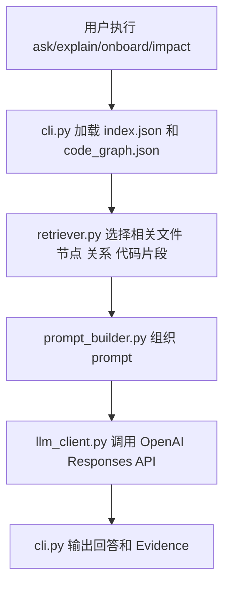
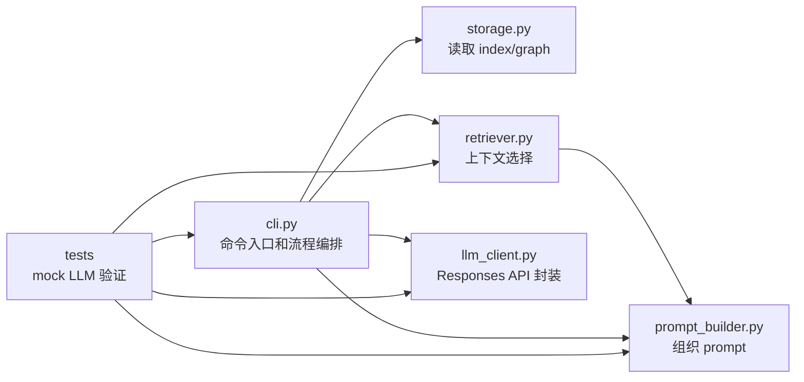

# 阶段三开发记录：代码库问答和轻量 LLM 接入

## 1. 本阶段要完成的内容和目标效果

阶段三目标是把阶段一的 `index.json` 和阶段二的 `code_graph.json` 用作上下文来源，接入 LLM 做代码库问答。LLM 不直接读取整个仓库，也不自动修改代码；PyCode 先完成检索、筛选和 prompt 组织，再把有限证据交给模型解释。

本阶段要完成的核心内容：

- 支持自然语言提问、文件解释、新手阅读顺序和初步影响分析。
- 基于索引和图谱选择相关文件、节点、关系和少量代码片段。
- 使用 OpenAI Responses API 作为第一版 LLM 接入方式。
- CLI 输出回答时附带依据位置，例如文件路径、节点 id 或图谱关系。
- 为后续阶段四 Agent 工具系统预留清晰边界。

本阶段暂时不做：

- 不让 LLM 自己搜索或读取整个仓库。
- 不自动修改代码。
- 不做多 Agent。
- 不接入多个模型供应商。
- 不引入向量库、Neo4j 或数据库。

## 2. 阶段三工作拆解和文件级功能

### `pycode/retriever.py`

负责根据用户问题和阶段一/二产物选择上下文。当前支持 `retrieve_for_question`、`retrieve_explain`、`retrieve_onboard` 和 `retrieve_impact`，分别对应自然语言问答、文件解释、新手阅读顺序和初步影响分析。

### `pycode/prompt_builder.py`

负责把检索结果组织为稳定 prompt，要求模型只能基于证据回答、证据不足时说明“不确定”、必须列出依据位置，并且不提出或执行代码修改。

### `pycode/llm_client.py`

负责封装 LLM 调用。当前 `OpenAIResponsesClient` 默认使用 OpenAI Responses API，默认模型为 `gpt-5.4-mini`，支持从 `.env` 或终端环境变量读取 `OPENAI_API_KEY`、`OPENAI_MODEL`、`OPENAI_BASE_URL` 和 `OPENAI_API_TYPE`。当兼容网关不支持 `/responses` 时，可以设置 `OPENAI_API_TYPE=chat` 改走 Chat Completions。CLI 和业务流程只依赖项目内部 `LLMClient` 接口，方便测试和后续替换。

### `pycode/cli.py`

新增阶段三命令：

```powershell
python -m pycode.cli ask <project_path> "问题"
python -m pycode.cli explain <project_path> <file_path>
python -m pycode.cli onboard <project_path>
python -m pycode.cli impact <project_path> <file_path>
```

这些命令都会先读取 `<project>/.pclens/index.json` 和 `<project>/.pclens/code_graph.json`。如果产物不存在，会提示先运行 `index` 和 `graph`。

## 3. 阶段三流程图和关系图

### 阶段三整体流程



### 模块职责关系



## 4. 开发中纪要

### 2026-06-16：实现阶段三轻量 LLM 问答管线

本次完成阶段三初版：

- 新增 `pycode/retriever.py`，基于 `ProjectIndex` 和 `CodeGraph` 选择有限上下文。
- 新增 `pycode/prompt_builder.py`，统一 prompt 结构和回答约束。
- 新增 `pycode/llm_client.py`，封装 OpenAI Responses API 调用。
- 扩展 `pycode/cli.py`，新增 `ask`、`explain`、`onboard`、`impact` 命令。
- 更新 `requirements.txt`，新增 `openai` 依赖。
- 新增阶段三测试，使用 mock LLM 验证流程，不在测试中真实调用 API。

### 2026-06-16：补充 `.env` 模型配置能力

本次完善 LLM 配置方式：

- 新增 `.env.example`，提供 `OPENAI_API_KEY`、`OPENAI_MODEL` 和 `OPENAI_BASE_URL` 示例。
- 扩展 `pycode/llm_client.py`，支持读取项目根目录 `.env`。
- 终端环境变量会覆盖 `.env` 中的同名配置。
- CLI 的 `--model` 会覆盖 `.env` 或环境变量中的 `OPENAI_MODEL`。
- `.env` 已在 `.gitignore` 中忽略，真实 API Key 不会进入版本管理。

### 2026-06-16：支持兼容网关 Chat Completions 模式

本次根据 DeepSeek 兼容网关返回的 `no provider supports protocol '/responses'` 错误补充 API 类型配置：

- 新增 `OPENAI_API_TYPE` 配置。
- `OPENAI_API_TYPE=responses` 时使用 `client.responses.create(...)`。
- `OPENAI_API_TYPE=chat` 时使用 `client.chat.completions.create(...)`。
- 本地 `.env` 已切换为 `OPENAI_API_TYPE=chat`，适配当前兼容网关。

## 5. 运行方法

以下命令默认在项目根目录执行。

### 准备索引和图谱

```powershell
.\.venv\Scripts\python.exe -m pycode.cli index .\examples\demo_project
.\.venv\Scripts\python.exe -m pycode.cli graph .\examples\demo_project
```

### 设置 OpenAI API Key 和模型配置

```powershell
$env:OPENAI_API_KEY="你的 API Key"
```

也可以复制 `.env.example` 为 `.env`，在项目根目录写入：

```text
OPENAI_API_KEY=你的 API Key
OPENAI_MODEL=gpt-5.4-mini
OPENAI_API_TYPE=responses
OPENAI_BASE_URL=https://api.openai.com/v1
```

如果使用官方 OpenAI API，`OPENAI_BASE_URL` 可以不写。若使用 DeepSeek、Qwen 或其它 OpenAI-compatible 网关，遇到不支持 `/responses` 的错误时，使用：

```text
OPENAI_MODEL=deepseek-v4-pro-202606
OPENAI_API_TYPE=chat
OPENAI_BASE_URL=https://你的兼容网关/v1
```

配置优先级为：终端环境变量优先于 `.env`，命令行 `--model` 优先于 `OPENAI_MODEL`。

### 自然语言问答

```powershell
.\.venv\Scripts\python.exe -m pycode.cli ask .\examples\demo_project "这个项目的入口在哪里？"
```

### 解释单个文件

```powershell
.\.venv\Scripts\python.exe -m pycode.cli explain .\examples\demo_project main.py
```

### 生成新手阅读顺序

```powershell
.\.venv\Scripts\python.exe -m pycode.cli onboard .\examples\demo_project
```

### 初步影响分析

```powershell
.\.venv\Scripts\python.exe -m pycode.cli impact .\examples\demo_project services/user_service.py
```

### 指定模型

```powershell
.\.venv\Scripts\python.exe -m pycode.cli ask .\examples\demo_project "这个项目的入口在哪里？" --model gpt-5.5
```

### 运行测试

```powershell
.\.venv\Scripts\python.exe -m pytest tests --basetemp=.pytest_tmp --cache-clear
```

## 6. 开发后总结

阶段三初版已经把项目从结构分析工具推进到代码理解助手：用户可以基于已生成的索引和图谱向项目提问，PyCode 会先做上下文选择，再交给 LLM 回答。当前实现仍保持阶段边界，不做自动改代码、不做工具循环、不做多 Agent。

后续可改进点：

- 增强问题意图识别，让更多中文问题映射到更准确的检索策略。
- 增加函数级代码片段截取，而不是只截取文件前若干行。
- 将 `has_main_guard` 写入图谱节点属性，提高入口检索准确度。
- 阶段四再把 retriever 能力包装成 Agent 工具。

## 7. 问题记录

### 2026-06-16：暂无阻塞问题

当前实现使用 mock LLM 进行自动化测试，不依赖真实网络和 API key。真实调用前需要安装 `openai` 依赖，并通过终端环境变量或 `.env` 设置 `OPENAI_API_KEY`。
