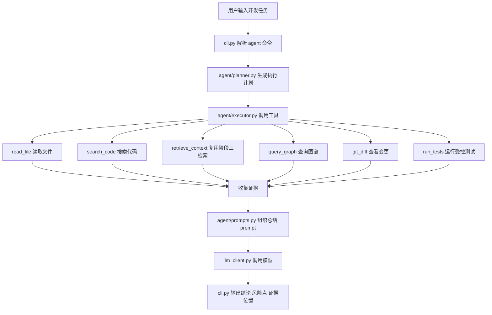
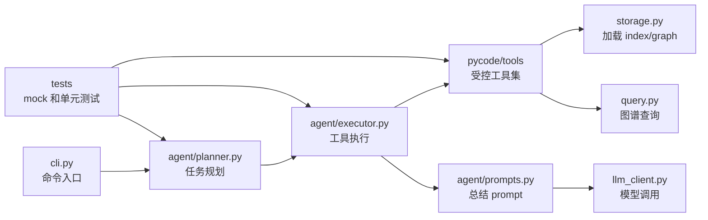
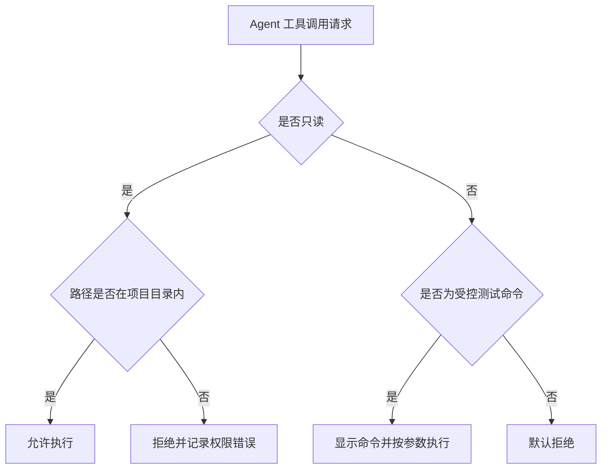
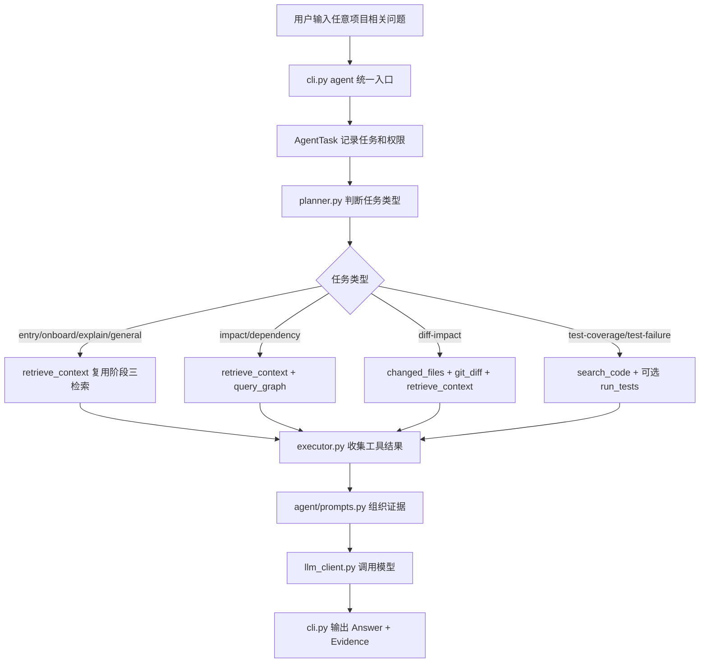
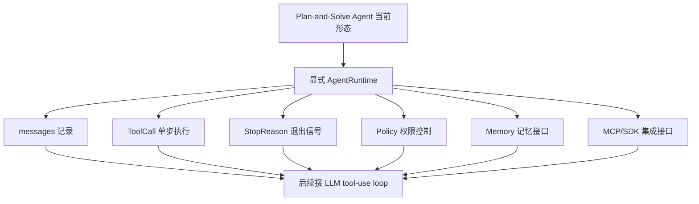

# 阶段四开发记录：Agent 化增强

## 1. 本阶段要完成的内容和目标效果

阶段四目标是把 PyCode 从“用户提问、程序检索、LLM 回答”的代码理解助手，推进到“围绕开发任务多步调用工具、分析、验证、总结”的轻量 Agent。

本阶段要完成的核心效果：

- Agent 可以接收一个开发分析任务，例如分析 `git diff`、检查改动影响、定位测试失败原因。
- Agent 能按任务需要调用项目内工具，包括读取文件、搜索代码、查询代码图谱、查看 git diff、运行测试。
- Agent 的执行流程是“规划 -> 调工具 -> 汇总证据 -> 给出结论”，而不是一次性问答。
- Agent 默认只做分析和建议，不自动大规模修改代码，不自动提交 git。
- 工具系统要有基础权限控制，限制文件读取范围、危险命令和写入行为。
- CLI 提供阶段四入口，方便用 demo 项目验证 Agent 流程。

本阶段暂时不做：

- 不做多 Agent 协作。
- 不直接接 Claude Agent SDK 或复杂外部 Agent 框架。
- 不让 Agent 自动提交 git。
- 不让 Agent 执行删除、格式化、重置等危险命令。
- 不让 Agent 自动大规模改写项目代码。

阶段四完成后，PyCode 应能处理以下开发场景：

- 分析当前 `git diff` 可能影响哪些文件、函数和测试。
- 检查某个函数或文件是否有测试覆盖线索。
- 根据图谱推荐可能需要阅读或修改的位置。
- 运行指定 pytest 命令并总结失败原因。
- 输出带有证据位置的风险点和后续建议。

## 2. 阶段四工作拆解和文件级功能

### `pycode/tools/`

新增工具目录，负责封装 Agent 可以调用的能力。工具层只做具体动作，不做复杂决策。

计划文件：

- `pycode/tools/__init__.py`：导出工具注册表和基础类型。
- `pycode/tools/base.py`：定义工具输入、输出、错误结果、权限上下文等通用结构。
- `pycode/tools/read_file.py`：读取项目目录内文件，限制路径不能逃逸项目根目录。
- `pycode/tools/search_code.py`：在项目目录内搜索代码，优先使用 Python 实现或受控命令参数。
- `pycode/tools/retrieve_context.py`：复用阶段三 `retriever.py`，根据任务从 `index.json` 和 `code_graph.json` 选择上下文。
- `pycode/tools/query_graph.py`：复用阶段二 `query.py` 能力查询 imports、imported-by、calls、entry。
- `pycode/tools/git_tools.py`：读取 `git diff` 和变更文件列表，只读 git 信息。
- `pycode/tools/test_runner.py`：运行受控 pytest 命令，记录命令、退出码、stdout/stderr 摘要。

### `pycode/agent/`

新增 Agent 目录，负责多步任务编排。

计划文件：

- `pycode/agent/__init__.py`：导出阶段四 Agent 入口。
- `pycode/agent/planner.py`：根据用户任务生成简单执行计划，例如 diff 分析、测试分析、影响分析。
- `pycode/agent/executor.py`：按计划调用工具，收集工具结果，并处理失败或权限拒绝。
- `pycode/agent/prompts.py`：组织 Agent 总结 prompt，复用阶段三 LLM 客户端。
- `pycode/agent/types.py`：定义 `AgentTask`、`AgentStep`、`AgentResult` 等数据结构。

### `pycode/cli.py`

扩展 CLI，新增阶段四命令入口。

计划命令：

```powershell
python -m pycode.cli agent .\examples\demo_project "分析当前 git diff 是否影响登录逻辑"
```

可选参数初步设计：

- `--no-tests`：只分析，不运行测试。
- `--run-tests`：允许 Agent 运行受控 pytest。
- `--model <model>`：沿用阶段三模型配置。
- `--graph <path>`：指定代码图谱文件。

### `pycode/retriever.py`、`pycode/prompt_builder.py`、`pycode/llm_client.py`

阶段四不替代阶段三能力，而是复用它们：

- `retriever.py`：继续提供代码上下文选择能力，必要时给 Agent 工具或总结阶段复用。
- `prompt_builder.py`：保留问答 prompt，同时新增或配合 `agent/prompts.py` 组织开发任务总结 prompt。
- `llm_client.py`：继续作为模型调用边界，Agent 不直接依赖外部 SDK 细节。

### `tests/`

新增或扩展测试，优先覆盖确定性逻辑，不在测试中真实调用 LLM 或执行危险命令。

计划测试：

- `tests/test_tools_read_file.py`：验证文件读取、路径逃逸拦截、缺失文件错误。
- `tests/test_tools_search_code.py`：验证代码搜索返回路径和行号。
- `tests/test_tools_query_graph.py`：验证工具层能复用阶段二图谱查询。
- `tests/test_tools_retrieve_context.py`：验证工具层能复用阶段三上下文检索。
- `tests/test_tools_git_tools.py`：验证 git diff 解析和无 diff 时输出。
- `tests/test_tools_test_runner.py`：验证受控 pytest 命令构造和结果摘要。
- `tests/test_agent_planner.py`：验证任务到执行计划的映射。
- `tests/test_agent_executor.py`：用 fake tools 验证多步执行和错误收集。
- `tests/test_cli.py`：补充 `agent` 命令参数和 mock 执行流程。

### `examples/demo_project/`

示例项目需要能展示阶段四场景，但不要为了演示引入过度复杂代码。

计划检查点：

- 保留当前多层调用链：`main -> AppRunner -> UserController -> UserService -> User`。
- 如需展示测试覆盖检查，可考虑新增小型测试样例。
- 如当前 demo 已足够展示影响分析，则优先不改 demo。

## 3. 阶段四流程图和关系图

### 阶段四 Agent 执行流程



### 模块职责关系



### 权限控制边界



## 4. 开发前准备记录

### 2026-06-22：读取阶段四规范并建立开发记录

本次已完成阶段四开发前准备：

- 重新读取 `develop_requirements.md`，确认阶段四边界是“单 Agent + 多工具”的开发任务分析。
- 核对阶段三记录，确认当前已有 `retriever.py`、`prompt_builder.py`、`llm_client.py` 和 `ask/explain/onboard/impact` CLI 能力可复用。
- 核对当前项目文件，确认阶段四需要新增 `pycode/tools/` 和 `pycode/agent/` 两组模块。
- 建立本阶段开发记录文档，后续开发中会持续补充开发纪要、问题记录、运行方法和阶段总结。

当前阶段四建议先从工具层开始实现，顺序为：

1. 工具基础类型和权限上下文。
2. `read_file`、`search_code`、`query_graph` 三个只读工具。
3. `git_diff` 只读工具。
4. `run_tests` 受控测试工具。
5. planner/executor 串联多步流程。
6. CLI `agent` 命令和测试。

### 2026-06-24：阶段四增强开发前准备

本次重新梳理阶段四增强方向。当前实现更接近 `Plan-and-Solve Agent` 范式：先由规则 planner 一次性生成工具计划，再由 executor 顺序执行工具，最后把工具结果交给 LLM 汇总。它已经具备 Agent 架构部件，但还不是 Claude Code / ReAct 风格的 “LLM tool-use loop”。

当前阶段四增强目标：

1. 将 `agent` 命令从“开发任务分析入口”增强为“统一代码库理解 Agent 入口”。
2. 让阶段三问答能力真正继承到阶段四，包括入口查询、阅读顺序、普通项目问答、文件解释和影响分析。
3. 保留当前 Plan-and-Solve 能力，同时为后续 Agent Runtime Loop、Memory、MCP、SDK 接入预留结构。
4. 明确 Agent 架构层次，避免把业务逻辑、工具调用、权限策略和模型调用混在一起。

当前 Agent 范式定位：

```text
当前：Plan-and-Solve Agent
用户任务 -> 规则 planner 生成完整计划 -> executor 执行工具 -> LLM 汇总

后续增强：Agent Runtime Loop
用户任务 -> messages -> LLM/Planner 判断下一步 -> tool call -> tool result -> messages -> stop signal -> final answer
```

增强阶段要补充的核心能力：

- `agent` 命令应能处理普通代码库问题，例如“入口在哪”“阅读顺序是什么”“某个模块做什么”。
- planner 需要识别更完整的问题类型：
  - `entry-question`
  - `onboard-question`
  - `explain-question`
  - `dependency-question`
  - `impact-question`
  - `diff-impact`
  - `test-coverage`
  - `test-failure`
  - `general-question`
- `retrieve_context` 需要继续扩展，包装阶段三更多检索能力：
  - `retrieve_for_question`
  - `retrieve_explain`
  - `retrieve_onboard`
  - `retrieve_impact`
- Agent 层需要逐步引入 Runtime 概念，但本阶段可以先实现轻量版本，不马上接外部 SDK。

增强阶段文件级拆解：

### `pycode/agent/types.py`

继续扩展 Agent 内部数据结构，为 Runtime Loop 预留类型：

- `AgentTask`：保留任务描述、项目路径、测试权限、图谱路径、任务类型。
- `AgentStep`：继续表示计划步骤。
- `AgentResult`：继续表示一次 Agent 执行结果。
- 后续可新增：
  - `AgentMessage`：记录用户消息、模型消息、工具调用、工具结果。
  - `ToolCall`：表示一次待执行工具调用。
  - `AgentStopReason`：表示 `final`、`tool_use`、`max_turns`、`error` 等退出原因。

### `pycode/agent/planner.py`

从偏开发任务的规则 planner，增强为代码库问题和开发任务都能识别的 planner：

- 识别入口问题，规划 `retrieve_context(intent="entry")` 或 `query_graph(entry)`。
- 识别阅读顺序问题，规划 `retrieve_context(intent="onboard")`。
- 识别文件解释问题，规划 `retrieve_context(intent="explain")` 和必要的 `read_file`。
- 识别依赖关系问题，规划 `retrieve_context(intent="dependency")` 和 `query_graph`。
- 保留已有 diff / impact / test 规划能力。

### `pycode/tools/retrieve_context.py`

继续作为阶段三能力进入 Agent 的桥：

- 支持 `intent="entry"`，内部调用 `retrieve_for_question` 或入口检索逻辑。
- 支持 `intent="onboard"`，内部调用 `retrieve_onboard`。
- 支持 `intent="explain"`，内部调用 `retrieve_explain`。
- 支持 `intent="impact"`，内部调用 `retrieve_impact`。
- 返回统一 `ToolResult`，包含 `evidence`、`items`、`intent`、`question`。

### `pycode/agent/executor.py`

继续负责执行工具计划，但要保持可替换：

- 当前执行固定计划。
- 后续 Runtime Loop 可以复用 executor 执行单个 `ToolCall`。
- 权限拒绝、未知工具、工具异常继续返回结构化结果。

### `pycode/agent/runtime.py`（后续可新增）

作为下一步增强重点，封装 Agent 最小核心循环：

```text
while not stopped:
    根据 messages 或当前状态决定下一步
    如果需要工具，执行一个 tool call
    将 tool result 追加回 messages
    如果不需要工具，输出 final answer
```

初版可以先不接 SDK function calling，只把当前 Plan-and-Solve 流程包装进统一 Runtime 接口，后续再替换 planner 为 LLMPlanner 或 SDKPlanner。

### `pycode/agent/policy.py`（后续可新增）

抽出权限策略：

- 只读工具默认允许。
- `run_tests` 需要显式 `--run-tests`。
- 写文件类工具未来必须用户确认。
- 危险命令默认禁止。
- 所有路径必须限制在项目目录内。

### `pycode/agent/memory.py`（后续可新增）

为后续记忆系统预留：

- 会话记忆：本次任务已经看过哪些文件、执行过哪些工具、得到哪些结论。
- 项目记忆：项目入口、模块说明、常见测试命令、历史分析结论。
- 初期可以先实现内存态结构，不急着持久化。

### `pycode/integrations/`（后续可新增）

为外部 Agent 生态接入预留：

- `integrations/mcp/`：未来接 MCP 工具或暴露 PyCode 工具为 MCP。
- `integrations/openai_agents/`：未来接 OpenAI Agents SDK。
- `integrations/claude_sdk/`：未来接 Claude Agent SDK。

### `pycode/cli.py`

继续保留 `agent` 作为统一入口：

```powershell
python -m pycode.cli agent .\examples\demo_project "这个项目的入口在哪？阅读顺序应该是怎样的？"
python -m pycode.cli agent .\examples\demo_project "解释 services/user_service.py"
python -m pycode.cli agent .\examples\demo_project "分析当前 git diff 是否影响用户服务逻辑"
python -m pycode.cli agent .\examples\demo_project "检查 services/user_service.py 的测试覆盖"
```

旧的 `ask`、`explain`、`onboard`、`impact` 命令继续保留，作为明确子能力入口和回归验证入口。

增强阶段流程图：



增强后和 Agent Runtime Loop 的关系：



增强阶段完成标准：

- `agent` 命令可以回答入口、阅读顺序、文件解释、依赖关系、影响分析、测试覆盖等项目相关问题。
- 阶段三 `ask/explain/onboard/impact` 能力被 Agent 统一入口复用，而不是并排存在。
- 当前 Plan-and-Solve 架构边界清晰，后续可以自然演化为 Runtime Loop。
- 文档能讲清楚：当前不是玩具式 prompt 调用，而是具备工具、规划、执行、证据、权限和扩展接口的 Agent 应用架构。

## 5. 开发中纪要

### 2026-06-24：阶段四增强实现 Agent Runtime Loop

本次按照 `docs/stage4_enhanced_plan.md` 开始阶段四增强开发，目标是把当前 Plan-and-Solve Agent 升级为显式 runtime loop，同时让 `agent` 统一入口继承阶段三项目问答能力。

已完成增强内容：

- 新增 `pycode/agent/runtime.py`，实现轻量 Agent Runtime Loop：用户任务进入消息历史，runtime 每轮执行一个工具调用，记录 tool observation，最后生成总结 prompt。
- 新增 `pycode/agent/policy.py`，把工具权限判断从 executor 中抽出，当前继续保持默认只读；`run_tests` 仍必须显式 `--run-tests` 才允许。
- 扩展 `pycode/agent/types.py`，新增 `ToolCall`、`AgentMessage`、`AgentTurn`、`AgentStopReason`、`RuntimeConfig`，为后续 SDK function calling、MCP、Memory 预留结构。
- 更新 `pycode/agent/executor.py`，新增 `execute_tool_call(...)` 单步工具执行入口；原 `execute_plan(...)` 继续可用；`run_agent_task(...)` 现在内部调用 `run_agent_runtime(...)`。
- 新增 `pycode/agent/planner_enhanced.py`，扩展 planner 任务识别，支持 `entry-question`、`onboard-question`、`explain-question`、`dependency-question`、`impact-question`、`diff-impact`、`test-coverage`、`test-failure`、`general-question`。
- 更新 `pycode/tools/retrieve_context.py`，支持 `entry`、`onboard`、`explain`、`dependency`、`impact`、`general` intent，复用阶段三检索函数。
- 更新 `pycode/retriever.py` 的 intent 识别覆盖，使中文“入口、启动、影响、改动、修改、依赖、调用”等问题可以稳定进入对应检索分支。
- 更新 `pycode/agent/prompts.py`，改为稳定英文 prompt 框架，并要求最终回答使用用户任务同语言，避免历史乱码提示影响 LLM 总结。
- 更新 CLI Agent 输出，新增 `Stop reason`、`Runtime turns` 和 `Runtime` 回合摘要，同时保留 `Steps`、`Evidence` 和 `Answer`。
- 更新 `README.md`，补充 runtime loop 说明、统一 `agent` 项目问答示例和新增 agent 模块结构。

新增或更新测试：

- 新增 `tests/test_agent_runtime.py`，覆盖 runtime 每轮执行一个工具、plan-only、不超过 max turns、权限策略拒绝非只读工具。
- 更新 `tests/test_tools_retrieve_context.py`，覆盖 `entry`、`onboard`、`explain` intent。
- 更新 `tests/test_cli.py`，覆盖 `agent "入口在哪？阅读顺序？"` 通过 runtime 调用两次 `retrieve_context` 并输出 Evidence。
- 更新 planner、executor、prompt 测试，使断言匹配增强后的任务类型和 prompt 格式。

本次验证命令和结果：

```powershell
.\.venv\Scripts\python.exe -B -c "from pathlib import Path; from pycode.agent import run_agent_task; q='\u8fd9\u4e2a\u9879\u76ee\u7684\u5165\u53e3\u5728\u54ea\uff1f\u9605\u8bfb\u987a\u5e8f\u5e94\u8be5\u662f\u600e\u6837\u7684\uff1f'; r=run_agent_task(q, Path('examples/demo_project'), llm_client=None); assert [s.arguments['intent'] for s in r.steps]==['entry','onboard']; assert len(r.tool_results)==2; assert all(x.ok for x in r.tool_results); print('real runtime tool smoke ok')"
```

```powershell
.\.venv\Scripts\python.exe -B -m pycode.cli agent .\examples\demo_project "这个项目的入口在哪？阅读顺序应该是怎样的？" --plan-only
```

本次 pytest 情况：

- 尝试运行 `tests\test_agent_planner.py tests\test_agent_executor.py tests\test_agent_runtime.py tests\test_tools_retrieve_context.py tests\test_cli.py`，测试主体先输出 `F..F...F.......EEEE.EEEE..EEEE`，随后 pytest 会话长时间不退出；该表现和本机此前记录的 pytest session finish / temp cleanup 不稳定问题一致。
- 后续改用 `python -B` 直接调用关键测试函数和 smoke 检查，已确认 planner、executor、prompt、runtime、retrieve_context、CLI runtime smoke 均通过。

当前增强后的关键行为：

- `agent` 命令现在可把“这个项目的入口在哪？阅读顺序应该是怎样的？”规划为两个 runtime tool turns：`retrieve_context(intent="entry")` 和 `retrieve_context(intent="onboard")`。
- 非 `--plan-only` 且配置 LLM 时，Agent 会把两个工具回合的 Evidence 交给 LLM 生成最终回答。
- 当前仍不接外部 Agent SDK、不做多 Agent、不自动修改代码、不自动提交 git；本次只完成可演进的最小 runtime loop。

后续每完成或修改一块内容，在这里补充简短记录。

### 2026-06-22：实现阶段四工具层初版

本次先完成 `pycode/tools/` 工具层，不进入 Agent planner/executor 和 CLI `agent` 命令实现。

已新增工具基础结构：

- `pycode/tools/base.py`：新增 `ToolContext`、`ToolResult`、`ToolSpec`，统一工具调用上下文、结果格式和注册信息。
- `pycode/tools/__init__.py`：新增 `TOOLS` 注册表，集中导出 `read_file`、`search_code`、`query_graph`、`git_diff`、`changed_files`、`run_tests`。

已新增只读工具：

- `pycode/tools/read_file.py`：读取项目目录内文件，支持行号范围和最大字符数截断，禁止路径逃逸项目根目录。
- `pycode/tools/search_code.py`：在项目目录内搜索代码，默认搜索 `*.py`，跳过 `.git`、`.venv`、`__pycache__`、`node_modules`、`.pclens` 等目录，返回文件路径、行号和匹配行。
- `pycode/tools/retrieve_context.py`：复用阶段三 `retriever.py`，从 `index.json` 和 `code_graph.json` 中选择 Agent 任务相关上下文。
- `pycode/tools/query_graph.py`：封装阶段二图谱查询，支持 `imports`、`imported-by`、`calls`、`entry`。
- `pycode/tools/git_tools.py`：只读执行 `git diff` 和 `git diff --name-only`，支持 staged diff 和项目内路径限制。

已新增受控测试工具：

- `pycode/tools/test_runner.py`：只有 `ToolContext.allow_tests=True` 时才允许运行 pytest；命令使用参数列表构造，不通过 shell 拼接；返回命令、退出码、stdout/stderr 摘要和超时状态。

已新增工具层测试：

- `tests/test_tools_read_file.py`
- `tests/test_tools_search_code.py`
- `tests/test_tools_query_graph.py`
- `tests/test_tools_retrieve_context.py`
- `tests/test_tools_git_tools.py`
- `tests/test_tools_test_runner.py`

这些测试覆盖工具返回结构、路径权限、图谱查询封装、git 输出解析和受控测试命令构造。`run_pytest` 的正向测试使用 mock subprocess，避免单元测试递归启动 pytest。

### 2026-06-22：实现阶段四 Agent 核心编排层

本次完成 `pycode/agent/` 初版核心工作，不进入 CLI `agent` 命令实现。

已新增 Agent 基础结构：

- `pycode/agent/types.py`：定义 `AgentTask`、`AgentStep`、`AgentResult`，用于表达用户任务、计划步骤和执行结果。
- `pycode/agent/__init__.py`：导出 Agent 层核心入口，方便后续 CLI 或其它模块复用。

已新增确定性 planner：

- `pycode/agent/planner.py`：根据任务文本生成简单执行计划。
- 当前支持识别 git diff / 改动 / 影响分析 / 指定 `.py` 文件 / 测试相关任务。
- 对指定目标文件，会规划 `read_file` 和 `query_graph imports/imported-by`。
- 对测试任务，默认只搜索测试；只有 `AgentTask.allow_tests=True` 时才加入 `run_tests`。

已新增 executor：

- `pycode/agent/executor.py`：按 `AgentStep` 顺序调用 `TOOLS` 注册表中的工具。
- 对未注册工具返回结构化失败结果。
- 对非只读工具增加执行前权限检查，未显式允许测试时拒绝执行。
- 新增 `run_agent_task(...)`，串联“规划 -> 执行工具 -> 生成总结 prompt -> 可选 LLM 总结”。

已新增总结 prompt：

- `pycode/agent/prompts.py`：把任务、步骤、工具结果组织成稳定 prompt。
- prompt 明确要求只能基于工具结果总结，不声称已经修改代码或提交 git。

已新增 Agent 层测试：

- `tests/test_agent_planner.py`
- `tests/test_agent_executor.py`
- `tests/test_agent_prompts.py`

这些测试使用 fake tools 和 mock LLM 验证 planner、executor、prompt，不真实运行 git、pytest 或 LLM。

### 2026-06-22：扩展 CLI 接入阶段四 Agent 功能

本次完成阶段四命令入口接入：

- 在 `pycode/cli.py` 中新增 `agent_project(...)`，用于从 CLI 或测试中执行阶段四 Agent 工作流。
- 在 `build_parser()` 中新增 `agent` 子命令。
- `agent` 命令支持 `project_path` 和自然语言 `task` 两个必填参数。
- 新增 `--run-tests` / `--no-tests` 互斥参数，默认不运行测试，只有显式 `--run-tests` 才允许 Agent 调用受控 pytest。
- 新增 `--graph` 参数，可指定已有 `code_graph.json`。
- 复用阶段三 `--model` 参数和 `OpenAIResponsesClient`。
- 新增 `_print_agent_result(...)`，输出任务、项目路径、测试权限、每一步工具状态和最终回答。

本次同步文档和测试：

- 更新 `README.md`，补充阶段四功能说明、目录结构、Agent 命令示例、当前局限和后续计划。
- 更新 `tests/test_cli.py`，补充 `agent` 参数解析和 mock LLM/fake tools 的 CLI 接入测试。

### 2026-06-22：补充阶段三复用、测试覆盖和 demo 示例

本次完成阶段四开发中的剩余开发中事项，不进入开发后总结：

- 新增 `pycode/tools/retrieve_context.py`，把阶段三 `retriever.py` 包装为 Agent 工具。
- 更新 `pycode/tools/__init__.py`，将 `retrieve_context` 加入 `TOOLS` 注册表。
- 更新 `pycode/agent/planner.py`，在“指定 `.py` 文件的影响分析”计划中加入 `retrieve_context` 步骤。
- 新增 `tests/test_tools_retrieve_context.py`，验证工具能读取 `index.json` / `code_graph.json` 并返回阶段三检索证据。
- 更新 `tests/test_agent_planner.py`，覆盖 Agent 计划中复用阶段三检索能力的步骤。
- 新增 `examples/demo_project/tests/test_user_service.py`，提供小型 pytest 示例，用于阶段四展示测试覆盖检查和受控测试运行。
- 更新 `README.md`，补充 `retrieve_context`、demo 测试样例和阶段四相关说明。

### 2026-06-22：完善阶段四 CLI 输出、plan-only 和 planner 分类

本次根据阶段四收口检查继续完善：

- 更新阶段四流程图，将 `retrieve_context` 加入 Agent 执行流程。
- 修正阶段记录中的旧 Agent smoke 断言，使其匹配当前 planner 步骤。
- 在 CLI Agent 输出中新增 `Evidence` 区块，从工具结果中抽取文件路径、搜索命中、图谱边、图谱节点和 `retrieve_context` 证据。
- 新增 `--plan-only` 参数，只展示 Agent 将调用的工具步骤，不运行工具、不调用 LLM。
- 增强 `planner.py`，为任务增加 `diff-impact`、`test-coverage`、`test-failure`、`impact`、`general` 等任务类型。
- 更新 `tests/test_agent_planner.py`，覆盖任务分类和新的 planner 步骤。
- 更新 `tests/test_cli.py`，补充 `--plan-only`、Evidence 输出和 `retrieve_context` 进入 CLI 链路的 mock 测试。


## 6. 问题记录

用于记录开发过程中出现的问题、报错、原因和处理方式。

### 2026-06-22：暂无阻塞问题

当前处于开发前准备阶段，尚未开始阶段四代码实现。

### 2026-06-22：pytest 在 Windows 环境退出阶段卡住

本次运行新增工具测试时，测试用例本体已经全部通过，输出显示：

```text
tests\test_tools_read_file.py ...                                        [ 20%]
tests\test_tools_search_code.py ...                                      [ 40%]
tests\test_tools_query_graph.py ...                                      [ 60%]
tests\test_tools_git_tools.py ...                                        [ 80%]
tests\test_tools_test_runner.py ...                                      [100%]
```

但 pytest 在退出阶段没有正常返回，需要手动停止对应测试进程。此前第一次运行还遇到 `.pytest_cache` 的 `PermissionError: [WinError 5]`，后续已改用 `-o cache_dir=.pytest_tmp\.pytest_cache` 避免旧缓存目录。

处理记录：

- 将新增工具测试从 `tmp_path` fixture 改成项目内 `.pytest_tmp_tools/` 临时目录，避免 Windows 临时目录和 pytest fixture 清理干扰。
- 将 `run_pytest` 正向测试改成 mock subprocess，只验证命令构造和结果处理。
- `.pytest_tmp_tools/` 清理时同样遇到 Windows 权限拒绝，已将 `.pytest_tmp*/` 加入 `.gitignore`，避免本地临时目录进入版本管理。
- `python -m compileall pycode tests` 在写入 `__pycache__` 时也遇到 `PermissionError: [WinError 5]`，但工具导入和基础 smoke 调用通过。
- Agent 层 pytest 测试运行到末尾时显示 `1 failed, 7 passed`，随后仍在退出阶段卡住；失败点定位为 planner 错把 `.py` 路径中的 `services` 当搜索关键词，已修复，并通过 `python -B` smoke 断言验证。
- CLI 接入本次未跑完整 pytest，使用 `python -B` 完成 `cli.py` / `tests/test_cli.py` 语法检查和 `agent_project(...)` mock smoke 验证。
- 本次尝试用 `TemporaryDirectory()` 做 `retrieve_context` smoke 时，系统临时目录创建也出现 `PermissionError: [WinError 5]`。后续改为复用现有 `examples/demo_project/.pclens/` 产物完成只读 smoke。
- 本次尝试完整 pytest：

```powershell
$env:PYTEST_DISABLE_PLUGIN_AUTOLOAD='1'; $env:PYTHONDONTWRITEBYTECODE='1'; .\.venv\Scripts\python.exe -B -m pytest tests examples\demo_project\tests --basetemp=.pytest_tmp_full -p no:cacheprovider -q
```

测试执行到 `100%`，但 pytest 在 session finish 阶段清理 `.pytest_tmp_full` 时触发 `PermissionError: [WinError 5]`。再次使用 `-x --tb=short` 抓首个错误时，也被 `.pytest_tmp_first` 的同类权限错误覆盖，暂时无法获得可信的完整 pytest 结果。

- 后续阶段如果继续遇到 pytest 退出卡住，优先使用固定 cache 目录，并检查本地 pytest/插件/缓存清理问题。

## 7. 运行方法

当前阶段四已新增 `agent` 命令。命令会先规划工具调用，再执行工具并把结果交给 LLM 总结。

### 执行 Agent 开发任务分析

```powershell
.\.venv\Scripts\python.exe -m pycode.cli agent .\examples\demo_project "分析当前 git diff 是否影响用户服务逻辑"
```

### 允许运行受控测试

```powershell
.\.venv\Scripts\python.exe -m pycode.cli agent .\examples\demo_project "分析当前改动并运行相关测试" --run-tests
```

### 只分析不运行测试

```powershell
.\.venv\Scripts\python.exe -m pycode.cli agent .\examples\demo_project "检查 services/user_service.py 的改动影响" --no-tests
```

### 只查看计划不运行工具

```powershell
.\.venv\Scripts\python.exe -m pycode.cli agent .\examples\demo_project "检查 services/user_service.py 的改动影响" --plan-only
```

### 指定模型和图谱文件

```powershell
.\.venv\Scripts\python.exe -m pycode.cli agent .\examples\demo_project "检查 services/user_service.py 的改动影响" --model gpt-5.5 --graph .\examples\demo_project\.pclens\code_graph.json
```

### 阶段四开发验证命令

```powershell
.\.venv\Scripts\python.exe -m pytest tests --basetemp=.pytest_tmp --cache-clear
```

### 当前工具层测试命令

```powershell
.\.venv\Scripts\python.exe -m pytest tests\test_tools_read_file.py tests\test_tools_search_code.py tests\test_tools_query_graph.py tests\test_tools_git_tools.py tests\test_tools_test_runner.py -o cache_dir=.pytest_tmp\.pytest_cache
```

当前这组测试的测试项已经全部通过，但本机 pytest 退出阶段曾卡住，详见“问题记录”。

新增 `retrieve_context` 工具后，工具层测试命令可补充：

```powershell
.\.venv\Scripts\python.exe -m pytest tests\test_tools_retrieve_context.py -q -o cache_dir=.pytest_tmp\.pytest_cache
```

对应只读 smoke：

```powershell
.\.venv\Scripts\python.exe -B -c "from pathlib import Path; from pycode.tools import ToolContext, retrieve_context; root=Path('examples/demo_project'); r=retrieve_context(ToolContext(root), '检查 services/user_service.py 的改动影响', target='services/user_service.py', intent='impact'); assert r.ok; print('retrieve context demo smoke ok')"
```

### 当前 Agent 层测试命令

```powershell
.\.venv\Scripts\python.exe -m pytest tests\test_agent_planner.py tests\test_agent_executor.py tests\test_agent_prompts.py -q -o cache_dir=.pytest_tmp\.pytest_cache
```

当前本机 pytest 退出阶段仍不稳定。本次补充使用了以下 smoke 检查确认 Agent 核心链路：

```powershell
.\.venv\Scripts\python.exe -B -c "from pathlib import Path; from pycode.agent import AgentTask, plan_task; s=plan_task(AgentTask('检查 services/user_service.py 的改动影响', Path('.'))); assert [x.tool for x in s] == ['changed_files','git_diff','read_file','retrieve_context','query_graph','query_graph']; print('agent smoke ok')"
```

### 当前 CLI 接入 smoke 检查

```powershell
.\.venv\Scripts\python.exe -B -c "from pathlib import Path; from pycode.cli import build_parser, agent_project; from pycode.tools import ToolSpec; from pycode.tools.base import success; p=build_parser(); a=p.parse_args(['agent','demo_project','分析当前 git diff','--run-tests','--graph','graph.json','--model','gpt-5.5']); assert a.command=='agent' and a.run_tests and a.graph_path==Path('graph.json'); print('cli agent smoke ok')"
```

### 当前 plan-only smoke 检查

```powershell
.\.venv\Scripts\python.exe -B -c "from pathlib import Path; from pycode.cli import agent_project; r=agent_project(Path('.'), '检查 services/user_service.py 的改动影响', plan_only=True, llm_client=None, tools={}); assert r.tool_results==[] and r.answer is None and r.task.task_type=='diff-impact'; print('plan-only integration smoke ok')"
```

### 完整测试尝试

```powershell
$env:PYTEST_DISABLE_PLUGIN_AUTOLOAD='1'; $env:PYTHONDONTWRITEBYTECODE='1'; .\.venv\Scripts\python.exe -B -m pytest tests examples\demo_project\tests --basetemp=.pytest_tmp_full -p no:cacheprovider -q
```

当前环境下该命令在 pytest session finish 阶段被 `.pytest_tmp_full` 的 `PermissionError: [WinError 5]` 阻断。

### 示例项目测试样例

```powershell
.\.venv\Scripts\python.exe -m pytest .\examples\demo_project\tests -q -o cache_dir=.pytest_tmp\.pytest_cache
```

对应不经过 pytest 的 smoke：

```powershell
.\.venv\Scripts\python.exe -B -c "import importlib.util; from pathlib import Path; p=Path('examples/demo_project/tests/test_user_service.py'); spec=importlib.util.spec_from_file_location('demo_test_user_service', p); m=importlib.util.module_from_spec(spec); spec.loader.exec_module(m); m.test_user_service_returns_normalized_user(); m.test_preview_user_name_formats_display_name(); print('demo tests smoke ok')"
```

## 8. 开发后总结

### 8.1 本阶段实际完成内容和完成情况

阶段四已经完成轻量 Agent 化增强的 MVP。当前实现保持“单 Agent + 多工具”结构，没有接入复杂外部 Agent SDK，没有实现自动提交 git，也没有让 Agent 自动大规模修改代码。

实际完成内容：

- 新增 `pycode/tools/` 工具层，提供统一 `ToolContext`、`ToolResult`、`ToolSpec` 和 `TOOLS` 注册表。
- 实现 `read_file`，支持项目目录内安全读取文件、行号范围和内容截断。
- 实现 `search_code`，支持项目目录内代码搜索，默认跳过 `.git`、虚拟环境、缓存目录和 `.pclens`。
- 实现 `retrieve_context`，复用阶段三 `retriever.py`，根据任务从 `index.json` 和 `code_graph.json` 选择上下文。
- 实现 `query_graph`，复用阶段二图谱查询能力，支持 `imports`、`imported-by`、`calls`、`entry`。
- 实现 `git_diff` 和 `changed_files`，只读获取 git diff 和变更文件列表。
- 实现 `run_tests`，只有显式允许测试时才运行受控 pytest 命令。
- 新增 `pycode/agent/` 编排层，包含任务类型、计划步骤、执行结果、planner、executor 和总结 prompt。
- planner 支持 `diff-impact`、`test-coverage`、`test-failure`、`impact`、`general` 等任务类型。
- executor 支持按计划调用工具、处理未知工具、阻止未授权的非只读工具、收集工具错误。
- CLI 新增 `agent` 命令，支持 `--run-tests`、`--no-tests`、`--plan-only`、`--graph`、`--model`。
- CLI Agent 输出包含任务类型、工具步骤、Evidence 依据位置和最终回答。
- README 已补充阶段四能力、目录结构、命令示例、局限性和后续计划。
- 示例项目新增 `examples/demo_project/tests/test_user_service.py`，用于展示测试覆盖检查和受控测试运行。
- 新增工具层、Agent 层和 CLI 层测试，使用 fake tools 和 mock LLM 避免真实 LLM、危险命令或不稳定外部状态。

完成情况判断：

- 阶段四要求的“查找 -> 分析 -> 验证 -> 总结”流程已经形成。
- Agent 已能围绕开发任务多步调用工具，不再是阶段三的一次性问答。
- 当前实现能处理 git diff 分析、文件影响分析、测试覆盖检查、测试失败总结等开发场景的基础版本。
- 当前仍属于轻量规则式 Agent，planner 不是 LLM 自动规划，也不是多 Agent 协作。

### 8.2 后续该阶段可改进或升级的点

后续可以继续增强：

- 增强 planner 的任务识别，让中文任务、文件路径、函数名、测试名和 diff 场景映射得更准确。
- 让 planner 根据 `changed_files` 的结果动态追加 `read_file`、`retrieve_context`、`query_graph` 步骤，而不是只依赖初始规则。
- 增加函数级或类级目标识别，例如 `UserService.get_user`、`func:main.py:main`。
- 增强 Evidence 输出，把路径、行号、图谱边和测试结果格式化得更适合阅读。
- 增加更细粒度的测试运行策略，例如只运行相关测试文件，而不是默认 `tests`。
- 增加工具调用日志，记录每一步耗时、参数和摘要，方便后续做可视化或 debug。
- 增加真实 git diff 场景的 demo，让阶段四展示更直观。
- 在本地权限问题解决后，重新运行完整 pytest，获得稳定的完整测试通过记录。
- 后续如果要接 Claude Agent SDK 或其它 Agent 框架，可以复用当前 tools 和 executor 边界。

### 8.3 阶段四功能运行方法

以下命令默认在项目根目录执行。

#### 准备示例项目索引和图谱

```powershell
.\.venv\Scripts\python.exe -m pycode.cli index .\examples\demo_project
.\.venv\Scripts\python.exe -m pycode.cli graph .\examples\demo_project
```

#### 配置 LLM

真实调用 Agent 总结前需要配置 API Key：

```powershell
$env:OPENAI_API_KEY="你的 API Key"
```

也可以使用项目根目录 `.env`：

```text
OPENAI_API_KEY=你的 API Key
OPENAI_MODEL=gpt-5.4-mini
OPENAI_API_TYPE=responses
OPENAI_BASE_URL=https://api.openai.com/v1
```

#### 分析当前 git diff

```powershell
.\.venv\Scripts\python.exe -m pycode.cli agent .\examples\demo_project "分析当前 git diff 是否影响用户服务逻辑"
```

#### 分析指定文件改动影响

```powershell
.\.venv\Scripts\python.exe -m pycode.cli agent .\examples\demo_project "检查 services/user_service.py 的改动影响"
```

#### 检查测试覆盖线索

```powershell
.\.venv\Scripts\python.exe -m pycode.cli agent .\examples\demo_project "检查 services/user_service.py 的测试覆盖" --no-tests
```

#### 允许运行受控 pytest

```powershell
.\.venv\Scripts\python.exe -m pycode.cli agent .\examples\demo_project "分析当前改动并运行相关测试" --run-tests
```

#### 只查看计划，不运行工具和 LLM

```powershell
.\.venv\Scripts\python.exe -m pycode.cli agent .\examples\demo_project "检查 services/user_service.py 的改动影响" --plan-only
```

#### 指定模型和图谱文件

```powershell
.\.venv\Scripts\python.exe -m pycode.cli agent .\examples\demo_project "检查 services/user_service.py 的改动影响" --model gpt-5.5 --graph .\examples\demo_project\.pclens\code_graph.json
```

### 8.4 阶段四测试和验证方法

#### 工具层测试

```powershell
.\.venv\Scripts\python.exe -m pytest tests\test_tools_read_file.py tests\test_tools_search_code.py tests\test_tools_query_graph.py tests\test_tools_retrieve_context.py tests\test_tools_git_tools.py tests\test_tools_test_runner.py -o cache_dir=.pytest_tmp\.pytest_cache
```

#### Agent 层测试

```powershell
.\.venv\Scripts\python.exe -m pytest tests\test_agent_planner.py tests\test_agent_executor.py tests\test_agent_prompts.py -q -o cache_dir=.pytest_tmp\.pytest_cache
```

#### CLI 接入测试

```powershell
.\.venv\Scripts\python.exe -m pytest tests\test_cli.py -q -o cache_dir=.pytest_tmp\.pytest_cache
```

#### 示例项目测试

```powershell
.\.venv\Scripts\python.exe -m pytest .\examples\demo_project\tests -q -o cache_dir=.pytest_tmp\.pytest_cache
```

#### 不依赖 pytest 的 smoke 检查

语法检查：

```powershell
.\.venv\Scripts\python.exe -B -c "from pathlib import Path; files=list(Path('pycode').rglob('*.py'))+list(Path('tests').glob('test_*.py'))+list(Path('examples/demo_project/tests').glob('test_*.py')); [compile(p.read_text(encoding='utf-8'), str(p), 'exec') for p in files]; print('syntax smoke ok', len(files))"
```

planner 分类检查：

```powershell
.\.venv\Scripts\python.exe -B -c "from pathlib import Path; from pycode.agent import AgentTask, classify_task, plan_task; assert classify_task('检查 services/user_service.py 的测试覆盖')=='test-coverage'; s=plan_task(AgentTask('检查 services/user_service.py 的改动影响', Path('.'))); assert [x.tool for x in s]==['changed_files','git_diff','read_file','retrieve_context','query_graph','query_graph']; print('planner classification smoke ok')"
```

`retrieve_context` 检查：

```powershell
.\.venv\Scripts\python.exe -B -c "from pathlib import Path; from pycode.tools import ToolContext, retrieve_context; root=Path('examples/demo_project'); r=retrieve_context(ToolContext(root), '检查 services/user_service.py 的改动影响', target='services/user_service.py', intent='impact'); assert r.ok; print('retrieve context smoke ok')"
```

plan-only 检查：

```powershell
.\.venv\Scripts\python.exe -B -c "from pathlib import Path; from pycode.cli import agent_project; r=agent_project(Path('.'), '检查 services/user_service.py 的改动影响', plan_only=True, llm_client=None, tools={}); assert r.tool_results==[] and r.answer is None and r.task.task_type=='diff-impact'; print('plan-only integration smoke ok')"
```

demo 测试样例检查：

```powershell
.\.venv\Scripts\python.exe -B -c "import importlib.util; from pathlib import Path; p=Path('examples/demo_project/tests/test_user_service.py'); spec=importlib.util.spec_from_file_location('demo_test_user_service', p); m=importlib.util.module_from_spec(spec); spec.loader.exec_module(m); m.test_user_service_returns_normalized_user(); m.test_preview_user_name_formats_display_name(); print('demo tests smoke ok')"
```

### 8.5 当前验证结果

本阶段已通过以下不依赖 pytest 缓存写入的 smoke 检查：

```text
syntax smoke ok 43
planner classification smoke ok
plan-only integration smoke ok
cli retrieve_context smoke ok
retrieve context smoke ok
demo tests smoke ok
```

完整 pytest 已尝试运行：

```powershell
$env:PYTEST_DISABLE_PLUGIN_AUTOLOAD='1'; $env:PYTHONDONTWRITEBYTECODE='1'; .\.venv\Scripts\python.exe -B -m pytest tests examples\demo_project\tests --basetemp=.pytest_tmp_full -p no:cacheprovider -q
```

当前环境下测试执行到 `100%`，但 pytest 在 session finish 阶段清理 `.pytest_tmp_full` 时触发：

```text
PermissionError: [WinError 5] 拒绝访问: 'F:\\YY\\Agent_learning\\PyCode\\.pytest_tmp_full'
```

因此暂时没有可信的完整 pytest 通过记录。该问题已记录在“问题记录”中，判断为当前 Windows 环境的 pytest 临时目录权限问题。

## 9. 阶段四（含增强开发）最终整合说明

### 9.1 当前命令行入口边界

阶段四完成后，PyCode 的 CLI 入口仍然是有限的几个子命令：

```text
index
graph
query
ask
explain
onboard
impact
agent
```

这不表示 Agent 只能回答固定的几个问题。当前设计是：`agent` 作为统一自然语言入口，接收用户的项目相关问题或开发分析任务，再由规则 planner 和 runtime loop 选择工具。也就是说，命令行入口是有限的，但 `agent` 的任务文本是开放的。

当前 `agent` 适合处理这些问题：

- 项目入口在哪里。
- 项目阅读顺序是什么。
- 某个文件或模块做什么。
- 某个文件的依赖和被依赖关系。
- 某个文件改动可能影响哪些地方。
- 当前 git diff 是否影响某个功能。
- 某个文件是否有测试覆盖。
- 在显式授权后运行受控 pytest 并总结结果。

当前不承诺处理这些事情：

- 让 LLM 完全自主访问整个仓库。
- 让 Agent 自动修改代码。
- 让 Agent 自动提交 git。
- 让 Agent 执行任意 shell 命令。
- 多 Agent 协作。
- 外部 SDK / MCP / Memory 的完整接入。

### 9.2 当前最终架构定位

阶段四增强后的架构定位为：

```text
Rule-Planned Runtime Agent
```

也就是：

```text
User Task
  -> AgentTask
  -> classify_task / plan_task
  -> AgentRuntime Loop
      -> ToolCall
      -> execute_tool_call
      -> ToolResult / Observation
      -> AgentTurn / AgentMessage
  -> build_agent_summary_prompt
  -> optional LLM answer
  -> AgentResult + Evidence
```

这是一种过渡但合理的阶段四架构：

- Runtime Loop 已经成为执行骨架。
- Plan-and-Solve 仍作为规则式初始规划方式保留。
- 当前还不是 LLM 每轮自主决定工具的 ReAct / Claude Code 式 Agent。
- 后续接入 LLM tool calling、SDK、MCP、Memory 时，可以把 planner 抽象成可替换策略，而不是推翻工具层和 runtime。

### 9.3 开发前准备命令

以下命令默认在项目根目录执行：

```powershell
cd F:\YY\Agent_learning\PyCode
```

安装依赖：

```powershell
.\.venv\Scripts\python.exe -m pip install -r requirements.txt
```

生成 demo 项目的索引和代码图谱：

```powershell
.\.venv\Scripts\python.exe -m pycode.cli index .\examples\demo_project
.\.venv\Scripts\python.exe -m pycode.cli graph .\examples\demo_project
```

真实调用 LLM 前需要配置 API Key：

```powershell
$env:OPENAI_API_KEY="你的 API Key"
```

可选 `.env` 配置：

```text
OPENAI_API_KEY=你的 API Key
OPENAI_MODEL=gpt-5.4-mini
OPENAI_API_TYPE=responses
OPENAI_BASE_URL=https://api.openai.com/v1
```

### 9.4 阶段一和阶段二基础命令

生成结构索引：

```powershell
.\.venv\Scripts\python.exe -m pycode.cli index .\examples\demo_project
```

生成代码图谱：

```powershell
.\.venv\Scripts\python.exe -m pycode.cli graph .\examples\demo_project
```

查询入口候选：

```powershell
.\.venv\Scripts\python.exe -m pycode.cli query entry .\examples\demo_project
```

查询文件 imports：

```powershell
.\.venv\Scripts\python.exe -m pycode.cli query imports .\examples\demo_project main.py
```

查询谁依赖某个文件：

```powershell
.\.venv\Scripts\python.exe -m pycode.cli query imported-by .\examples\demo_project services/user_service.py
```

### 9.5 阶段三专用问答命令

阶段三命令仍然保留，适合作为专用入口使用。

普通项目问答：

```powershell
.\.venv\Scripts\python.exe -m pycode.cli ask .\examples\demo_project "这个项目的入口在哪里？"
```

解释指定文件：

```powershell
.\.venv\Scripts\python.exe -m pycode.cli explain .\examples\demo_project services/user_service.py
```

生成新手阅读顺序：

```powershell
.\.venv\Scripts\python.exe -m pycode.cli onboard .\examples\demo_project
```

分析指定文件影响：

```powershell
.\.venv\Scripts\python.exe -m pycode.cli impact .\examples\demo_project services/user_service.py
```

### 9.6 阶段四 Agent 统一入口命令

查看 Agent 对“入口 + 阅读顺序”问题的 runtime 计划，不调用工具和 LLM：

```powershell
.\.venv\Scripts\python.exe -m pycode.cli agent .\examples\demo_project "这个项目的入口在哪？阅读顺序应该是怎样的？" --plan-only
```

真实执行工具并调用 LLM 总结“入口 + 阅读顺序”：

```powershell
.\.venv\Scripts\python.exe -m pycode.cli agent .\examples\demo_project "这个项目的入口在哪？阅读顺序应该是怎样的？"
```

解释某个文件：

```powershell
.\.venv\Scripts\python.exe -m pycode.cli agent .\examples\demo_project "解释 services/user_service.py"
```

分析某个文件的依赖关系：

```powershell
.\.venv\Scripts\python.exe -m pycode.cli agent .\examples\demo_project "分析 services/user_service.py 的依赖关系"
```

分析某个文件的改动影响：

```powershell
.\.venv\Scripts\python.exe -m pycode.cli agent .\examples\demo_project "检查 services/user_service.py 的改动影响"
```

分析当前 git diff：

```powershell
.\.venv\Scripts\python.exe -m pycode.cli agent .\examples\demo_project "分析当前 git diff 是否影响用户服务逻辑"
```

检查测试覆盖线索，但不运行测试：

```powershell
.\.venv\Scripts\python.exe -m pycode.cli agent .\examples\demo_project "检查 services/user_service.py 的测试覆盖" --no-tests
```

显式允许 Agent 运行受控 pytest：

```powershell
.\.venv\Scripts\python.exe -m pycode.cli agent .\examples\demo_project "分析当前改动并运行相关测试" --run-tests
```

指定模型和图谱文件：

```powershell
.\.venv\Scripts\python.exe -m pycode.cli agent .\examples\demo_project "检查 services/user_service.py 的改动影响" --model gpt-5.5 --graph .\examples\demo_project\.pclens\code_graph.json
```

### 9.7 不依赖 LLM 的验证命令

语法 smoke：

```powershell
.\.venv\Scripts\python.exe -B -c "from pathlib import Path; files=list(Path('pycode').rglob('*.py'))+list(Path('tests').glob('test_*.py'))+list(Path('examples/demo_project/tests').glob('test_*.py')); [compile(p.read_text(encoding='utf-8'), str(p), 'exec') for p in files]; print('syntax smoke ok', len(files))"
```

验证增强 planner 会把“入口 + 阅读顺序”规划成两个 `retrieve_context` 回合：

```powershell
.\.venv\Scripts\python.exe -B -c "from pathlib import Path; from pycode.agent import AgentTask, classify_task, plan_task; q='\u8fd9\u4e2a\u9879\u76ee\u7684\u5165\u53e3\u5728\u54ea\uff1f\u9605\u8bfb\u987a\u5e8f\u5e94\u8be5\u662f\u600e\u6837\u7684\uff1f'; t=AgentTask(q, Path('.')); steps=plan_task(t); assert classify_task(q)=='onboard-question'; assert [s.arguments['intent'] for s in steps]==['entry','onboard']; print('enhanced planner smoke ok')"
```

验证真实 demo 产物可以执行 entry/onboard 两个工具回合：

```powershell
.\.venv\Scripts\python.exe -B -c "from pathlib import Path; from pycode.agent import run_agent_task; q='\u8fd9\u4e2a\u9879\u76ee\u7684\u5165\u53e3\u5728\u54ea\uff1f\u9605\u8bfb\u987a\u5e8f\u5e94\u8be5\u662f\u600e\u6837\u7684\uff1f'; r=run_agent_task(q, Path('examples/demo_project'), llm_client=None); assert [s.arguments['intent'] for s in r.steps]==['entry','onboard']; assert len(r.tool_results)==2; assert all(x.ok for x in r.tool_results); print('real runtime tool smoke ok')"
```

验证 `retrieve_context` impact 工具：

```powershell
.\.venv\Scripts\python.exe -B -c "from pathlib import Path; from pycode.tools import ToolContext, retrieve_context; root=Path('examples/demo_project'); r=retrieve_context(ToolContext(root), '检查 services/user_service.py 的改动影响', target='services/user_service.py', intent='impact'); assert r.ok; print('retrieve context smoke ok')"
```

验证 CLI plan-only 不调用 LLM：

```powershell
.\.venv\Scripts\python.exe -B -c "from pathlib import Path; from pycode.cli import agent_project; r=agent_project(Path('.'), '检查 services/user_service.py 的改动影响', plan_only=True, llm_client=None, tools={}); assert r.tool_results==[] and r.answer is None and r.task.task_type=='diff-impact'; print('plan-only integration smoke ok')"
```

验证 demo 测试样例，不经过 pytest：

```powershell
.\.venv\Scripts\python.exe -B -c "import importlib.util; from pathlib import Path; p=Path('examples/demo_project/tests/test_user_service.py'); spec=importlib.util.spec_from_file_location('demo_test_user_service', p); m=importlib.util.module_from_spec(spec); spec.loader.exec_module(m); m.test_user_service_returns_normalized_user(); m.test_preview_user_name_formats_display_name(); print('demo tests smoke ok')"
```

### 9.8 pytest 验证命令和当前限制

工具层测试：

```powershell
.\.venv\Scripts\python.exe -m pytest tests\test_tools_read_file.py tests\test_tools_search_code.py tests\test_tools_query_graph.py tests\test_tools_retrieve_context.py tests\test_tools_git_tools.py tests\test_tools_test_runner.py -q -o cache_dir=.pytest_tmp\.pytest_cache
```

Agent 层测试：

```powershell
.\.venv\Scripts\python.exe -m pytest tests\test_agent_planner.py tests\test_agent_executor.py tests\test_agent_prompts.py tests\test_agent_runtime.py -q -o cache_dir=.pytest_tmp\.pytest_cache
```

CLI 测试：

```powershell
.\.venv\Scripts\python.exe -m pytest tests\test_cli.py -q -o cache_dir=.pytest_tmp\.pytest_cache
```

demo 项目测试：

```powershell
.\.venv\Scripts\python.exe -m pytest .\examples\demo_project\tests -q -o cache_dir=.pytest_tmp\.pytest_cache
```

完整测试尝试：

```powershell
$env:PYTEST_DISABLE_PLUGIN_AUTOLOAD='1'; $env:PYTHONDONTWRITEBYTECODE='1'; .\.venv\Scripts\python.exe -B -m pytest tests examples\demo_project\tests --basetemp=.pytest_tmp_full -p no:cacheprovider -q
```

当前 Windows 环境下，pytest 曾在 session finish / 临时目录清理阶段触发 `PermissionError: [WinError 5]` 或长时间不退出。因此阶段四收口以 `python -B` smoke 结果作为更可信的验证依据；完整 pytest 需要在本地权限和 pytest 临时目录问题解决后重新运行。

### 9.9 阶段四完成判断

阶段四（含增强开发）当前可以判断为完成：

- 已形成单 Agent + 多工具结构。
- 已形成受控权限边界，默认不运行测试、不写文件、不提交 git。
- 已有 `AgentRuntime`、`ToolCall`、`AgentTurn`、`AgentMessage`、`AgentStopReason` 等 loop 结构。
- 阶段三上下文检索能力已经进入 `agent` 统一入口。
- `agent` 可以处理入口、阅读顺序、文件解释、依赖关系、影响分析、测试覆盖和 git diff 等项目相关任务。
- CLI 输出包含工具步骤、runtime turns、Evidence 和最终回答。
- 后续接入 SDK、MCP、Memory 时，可以复用当前 tools、executor、runtime 边界。

后续建议不要在阶段四继续大改架构。Plan-and-Solve 当前作为规则式初始规划方式保留是合理的；下一阶段如果要接 LLM tool calling 或 SDK，再把 planner 抽象为可替换策略。

