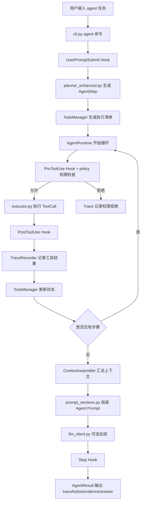
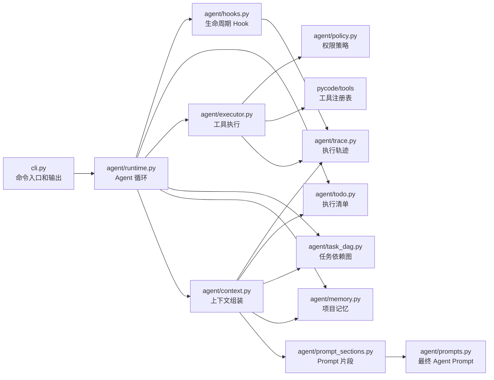
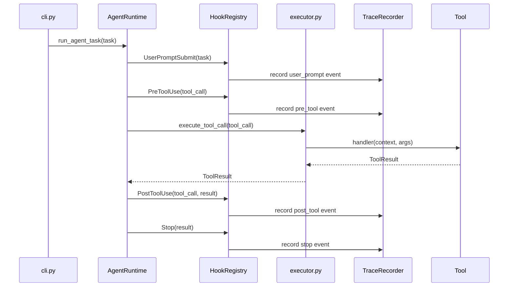
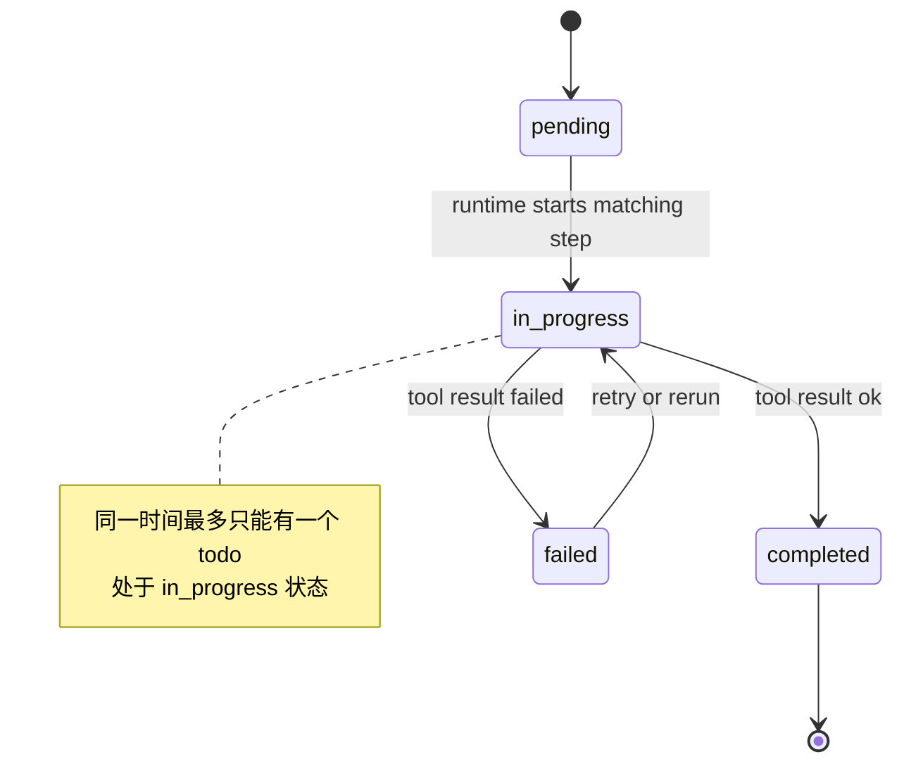
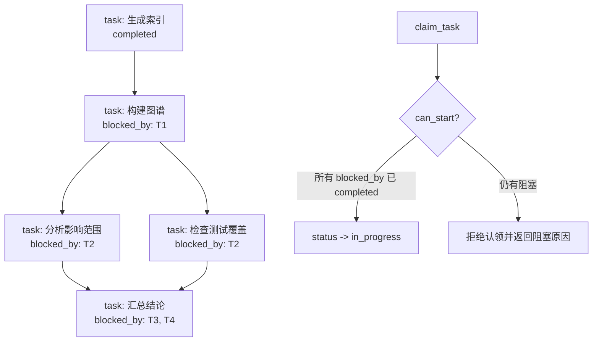
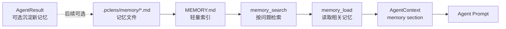
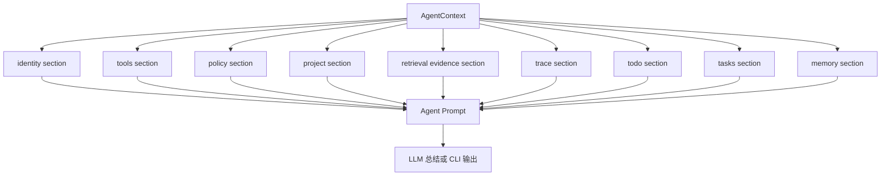

# 阶段五开发记录：Agent 内核增强与可观测化

## 1. 本阶段要完成的内容和目标效果

阶段五目标是把 PyCode 从“能按规则规划并调用工具的开发分析 Agent”，推进到“可观测、可恢复、可规划、可积累项目知识的 Agent 载体”。

阶段四已经完成了单 Agent、多工具、轻量 runtime loop、权限边界和阶段三上下文检索复用。本阶段不急着进入 Web 可视化，而是先补齐 Agent 工程里更有技术含量的基础设施，让后续可视化展示有足够丰富的数据和过程可以呈现。

本阶段要完成的核心效果：

- Agent 每次执行都能产生结构化 trace，记录用户任务、工具调用、权限判断、耗时、结果摘要和错误。
- Agent 多步任务不再只是一次性 `AgentStep` 列表，而是能映射到 TodoWrite 执行清单，并在 runtime 中更新状态。
- PyCode 支持基于文件的 Task DAG，用 `blocked_by` 表达任务依赖，支持任务创建、认领、完成和解除阻塞。
- PyCode 支持轻量项目记忆系统，用 `.pclens/memory/` 保存项目入口、工作流、分析结论和用户偏好等项目知识。
- Agent prompt / context 从单一字符串拼接升级为分层组装，能够按需组合 identity、tools、policy、retrieval、trace、todo、tasks、memory 等片段。
- CLI 能展示阶段五新增的关键状态，例如 trace 摘要、todo 进度、任务 DAG 状态和项目记忆列表。
- 阶段五产出的数据结构可以被后续阶段六可视化 Demo 直接复用。

本阶段按照五个子阶段推进：

```text
阶段 5A：Hook + Trace 工具调用观测系统
阶段 5B：TodoWrite / Agent 执行清单
阶段 5C：基于文件的 Task DAG
阶段 5D：轻量项目记忆系统
阶段 5E：Prompt / Context 分层组装器
```

本阶段暂时不做：

- 不做 Web UI 或 Streamlit 可视化，展示层顺延到阶段六。
- 不做复杂多 Agent 团队协作。
- 不做 git worktree 隔离。
- 不接完整 MCP 插件架构。
- 不做复杂向量数据库或自动长期记忆抽取。
- 不让 Agent 自动大规模修改代码、提交 git 或执行危险命令。
- 不做完整上下文压缩系统，只为后续压缩预留边界。

阶段五完成后，PyCode 应该能处理以下场景：

- 用户运行一次 `agent` 命令后，可以看到本次任务完整的工具调用轨迹。
- 用户可以知道 Agent 当前计划做什么、正在做什么、已经完成什么。
- 用户可以把复杂分析任务拆成带依赖关系的 Task DAG，并按依赖顺序执行。
- 用户可以把项目级分析结论保存为记忆，后续任务可按需读取这些记忆。
- Agent 总结 prompt 可以解释每个上下文片段来自哪里，避免证据、记忆和工具结果混在一起。

## 2. 阶段五工作拆解和文件级功能

### 阶段 5A：Hook + Trace 工具调用观测系统

目标是引入 Agent 生命周期 Hook 和结构化执行轨迹，让工具调用过程可观察、可审计、可复用。

计划新增文件：

- `pycode/agent/hooks.py`：定义 Hook 事件类型、Hook 注册表和触发函数。初期支持 `UserPromptSubmit`、`PreToolUse`、`PostToolUse`、`Stop` 四类事件。
- `pycode/agent/trace.py`：定义 trace 数据结构和记录器，例如 `TraceEvent`、`ToolTrace`、`AgentTrace`、`TraceRecorder`。

计划扩展文件：

- `pycode/agent/types.py`：补充 trace / hook 相关 dataclass，或在 `AgentResult` 中增加 `trace` 字段。
- `pycode/agent/runtime.py`：在用户任务进入、每轮工具调用前后、最终结束前触发对应 Hook，并把 trace 贯穿整个 runtime。
- `pycode/agent/executor.py`：在 `execute_tool_call` 周围记录工具开始、工具结束、异常、权限拒绝等事件。
- `pycode/agent/policy.py`：把当前权限判断逐步迁移为可被 `PreToolUse` 调用的策略函数，但 Hook 不能绕过策略拒绝。
- `pycode/cli.py`：在 `agent` 命令输出中增加 trace 摘要，例如工具耗时、失败数量、权限拒绝数量。

计划新增或扩展测试：

- `tests/test_agent_hooks.py`：验证 Hook 注册、触发顺序、返回值处理和异常隔离。
- `tests/test_agent_trace.py`：验证 trace 能记录工具调用生命周期、耗时、错误和权限拒绝。
- `tests/test_agent_runtime.py`：扩展 runtime 测试，验证执行过程中会产生 trace。
- `tests/test_cli.py`：扩展 `agent` 命令输出测试，验证 trace 摘要可见。

### 阶段 5B：TodoWrite / Agent 执行清单

目标是让 Agent 的多步计划具有运行时状态，避免复杂任务中途漂移。

计划新增文件：

- `pycode/agent/todo.py`：定义 `TodoItem`、`TodoList`、`TodoStatus`、`TodoManager`，负责创建、验证和更新执行清单。
- `pycode/tools/todo_write.py`：可选新增工具入口，让 TodoWrite 作为普通工具注册到 `TOOLS` 中，保持“规划能力也是工具”的架构一致性。

计划扩展文件：

- `pycode/agent/types.py`：在 `AgentResult` 中增加 `todos` 字段；必要时为 `AgentStep` 增加 `todo_id`。
- `pycode/agent/planner_enhanced.py`：为 planned steps 生成默认 todo 清单，或提供从 `AgentStep` 到 `TodoItem` 的映射。
- `pycode/agent/runtime.py`：执行每个工具前将对应 todo 标记为 `in_progress`，执行完成后标记为 `completed` 或记录错误。
- `pycode/tools/__init__.py`：如果采用工具形态，注册 `todo_write`。
- `pycode/cli.py`：在 `agent` 输出中展示 todo 状态和进度。

计划新增或扩展测试：

- `tests/test_agent_todo.py`：验证三态生命周期、单一 `in_progress` 约束、非法状态拒绝和错误记录。
- `tests/test_tools_todo_write.py`：如果新增工具，验证工具输入、输出和状态更新。
- `tests/test_agent_runtime.py`：验证 runtime 会按工具执行顺序更新 todo。
- `tests/test_agent_planner.py`：验证计划步骤可以生成合理 todo 清单。

### 阶段 5C：基于文件的 Task DAG

目标是为复杂开发分析任务提供依赖感知、可落盘、可恢复的任务图。

计划新增文件：

- `pycode/agent/task_dag.py`：定义 `TaskNode`、`TaskStatus`、`TaskDAGStore`、`can_start`、`create_task`、`list_tasks`、`get_task`、`claim_task`、`complete_task` 等核心逻辑。
- `pycode/tools/task_tools.py`：封装 Task DAG 工具能力，向 Agent 暴露 `create_task`、`list_tasks`、`get_task`、`claim_task`、`complete_task`。

计划扩展文件：

- `pycode/tools/__init__.py`：注册 Task DAG 相关工具。
- `pycode/tools/base.py`：复用 `ToolContext.resolve_in_project`，确保 `.pclens/tasks/` 写入不逃逸项目目录。
- `pycode/agent/policy.py`：明确 Task DAG 文件写入属于 PyCode 内部状态写入，不等同于修改用户源码，但仍必须限制在项目 `.pclens/` 内。
- `pycode/agent/runtime.py`：后续可根据任务类型决定是否读取 Task DAG 状态作为上下文。
- `pycode/cli.py`：可以新增或扩展命令，用于查看任务 DAG 状态；初期也可以只通过 `agent` 输出展示。

计划新增或扩展测试：

- `tests/test_agent_task_dag.py`：验证任务创建、文件保存、依赖判断、认领、完成和解除阻塞。
- `tests/test_tools_task_tools.py`：验证工具层能调用 Task DAG，并能拦截越界路径。
- `tests/test_agent_policy.py` 或 `tests/test_agent_executor.py`：验证内部状态写入和源码写入的权限边界不同。
- `tests/test_cli.py`：如果新增 CLI 查询入口，补充参数和输出测试。

### 阶段 5D：轻量项目记忆系统

目标是让 PyCode 能保存和按需读取项目级知识，避免每次分析都从零开始。

计划新增文件：

- `pycode/agent/memory.py`：定义 `MemoryItem`、`MemoryIndex`、`MemoryStore`，负责记忆文件读写、索引重建、搜索和加载。
- `pycode/tools/memory_tools.py`：封装 `memory_add`、`memory_list`、`memory_search`、`memory_load` 等工具。

计划存储结构：

```text
.pclens/memory/
  MEMORY.md
  project-entry.md
  test-command.md
  impact-user-service.md
```

计划扩展文件：

- `pycode/tools/__init__.py`：注册记忆工具。
- `pycode/agent/types.py`：可在 `AgentResult` 或 context 结构中增加 `memories` 摘要。
- `pycode/agent/runtime.py`：后续可在执行前加载相关记忆，执行后可选择沉淀分析结论。
- `pycode/agent/prompts.py`：在阶段 5E 前，可以先临时支持记忆片段注入。
- `pycode/cli.py`：增加记忆列表或在 `agent` 输出中展示使用了哪些记忆。

计划新增或扩展测试：

- `tests/test_agent_memory.py`：验证记忆写入、读取、索引重建、搜索、重复名称处理和 UTF-8 内容。
- `tests/test_tools_memory_tools.py`：验证工具层记忆操作和路径边界。
- `tests/test_agent_prompts.py`：验证 prompt 能包含相关记忆摘要。
- `tests/test_cli.py`：如果新增 CLI 入口，补充记忆命令测试。

### 阶段 5E：Prompt / Context 分层组装器

目标是将 Agent prompt 从单一字符串拼接升级为分层、按需、可测试的上下文组装系统。

计划新增文件：

- `pycode/agent/context.py`：定义 `AgentContext`、`ContextSection`、`ContextAssembler`，负责收集项目状态、工具状态、trace、todo、tasks、memory 和 retrieval evidence。
- `pycode/agent/prompt_sections.py`：定义各类 prompt section 的生成函数，例如 identity、tools、policy、project、retrieval、trace、todo、tasks、memory。

计划扩展文件：

- `pycode/agent/prompts.py`：从直接拼接总结 prompt，改为调用 context / sections 生成 Agent prompt。
- `pycode/prompt_builder.py`：保留阶段三代码问答 prompt，不把阶段五 Agent prompt 逻辑混入其中。
- `pycode/agent/runtime.py`：在构建最终 prompt 前生成 `AgentContext`。
- `pycode/agent/types.py`：必要时增加 context 摘要字段，方便测试和 CLI 输出。
- `pycode/cli.py`：可选增加 `--show-context` 或在 debug 输出中展示 prompt sections 摘要。

计划新增或扩展测试：

- `tests/test_agent_context.py`：验证上下文组装按真实状态选择 section，不存在的数据不会注入。
- `tests/test_agent_prompt_sections.py`：验证各 section 输出稳定、来源清晰、包含必要字段。
- `tests/test_agent_prompts.py`：更新 Agent prompt 测试，验证 trace / todo / memory / tasks 摘要能进入 prompt。
- `tests/test_prompt_builder.py`：保留阶段三 prompt 回归测试，确保问答 prompt 不被阶段五改坏。

### 文档和示例

计划新增或扩展文档：

- `docs/stage5_development_record.md`：记录阶段五开发前准备、开发中纪要、问题记录、开发后总结和运行方法。
- `README.md`：阶段五完成后补充 Hook/Trace、TodoWrite、Task DAG、Memory、Context Builder 的功能说明。
- `docs/stage4_development_record.md`：不修改历史结论，必要时只在后续文档中引用阶段四完成状态。

计划保留示例项目：

- `examples/demo_project/`：阶段五初期不为了演示强行改复杂，优先用已有多层调用链和测试样例验证 trace、todo、memory、DAG。

## 3. 阶段五流程图和关系图

### 阶段五整体执行流程



### 阶段五模块职责关系



### 5A Hook 与 Trace 生命周期



### 5B TodoWrite 状态流



### 5C Task DAG 依赖关系



### 5D Memory 注入关系



### 5E Prompt / Context 分层组装



## 4. 开发前准备记录

### 2026-07-02：建立阶段五开发记录

本次已完成阶段五开发前准备：

- 重新读取 `develop_requirements.md` 中新增的阶段五要求，确认阶段五范围是 Agent 内核增强与可观测化，而不是可视化展示。
- 确认阶段五拆分为 5A 到 5E：Hook/Trace、TodoWrite、Task DAG、Memory、Prompt/Context Builder。
- 结合阶段四已有实现，确认阶段五应主要扩展 `pycode/agent/`、`pycode/tools/`、`pycode/cli.py` 和 `tests/`，不推翻现有 runtime / executor / tools 边界。
- 建立本阶段开发记录文档，后续开发中会继续补充开发中纪要、问题记录、开发后总结和运行方法。

当前阶段五建议推进顺序：

1. 先做 5A Hook + Trace，因为它是后续 Todo、DAG、Memory 和可视化展示的观测基础。
2. 再做 5B TodoWrite，把现有 `AgentStep` 执行过程变成可追踪状态机。
3. 再做 5C Task DAG，引入跨步骤、跨会话的依赖感知任务管理。
4. 再做 5D Memory，让 PyCode 能保存和复用项目级知识。
5. 最后做 5E Prompt / Context 分层组装，把前面产生的 trace、todo、tasks、memory 都纳入清晰的上下文边界。

本阶段开发前的关键约束：

- 所有新增写入默认只写 `.pclens/` 下的 PyCode 内部状态文件，不修改用户源码。
- 所有文件路径仍必须通过项目根目录边界检查。
- Hook 只能拦截、记录或收紧权限，不能绕过用户配置或策略拒绝。
- TodoWrite 管当前会话执行清单，Task DAG 管跨会话任务依赖，两者不要混为一谈。
- Memory 记录的是项目级辅助知识，不能替代 index / graph / retrieve_context 提供的当前代码事实。

## 5. 开发中纪要

### 2026-07-02：完成 5A Hook + Trace 初版实现

本次围绕阶段 5A 完成了 Agent 工具调用观测系统的初版实现，重点是让现有 runtime loop 在不推翻阶段四结构的前提下，产生可复用的结构化 trace。

已完成内容：

- 新增 `pycode/agent/trace.py`，定义 `TraceEvent`、`ToolTrace`、`AgentTrace`、`TraceRecorder`。
- 新增 `pycode/agent/hooks.py`，定义 `HookEventType`、`HookContext`、`HookResult`、`HookRegistry` 和默认 trace hook。
- 扩展 `AgentResult`，新增 `trace` 字段；扩展 `RuntimeConfig`，新增 `enable_trace` 开关，默认开启。
- 扩展 `run_agent_runtime`，在用户任务进入、工具调用前、工具调用后、Agent 停止时触发生命周期 Hook。
- 支持自定义 `hook_registry` 注入，便于测试和后续扩展；默认 trace hook 始终保留，用于保证基础可观测性。
- 支持 `PreToolUse` Hook 返回 deny，作为比 policy 更收紧的执行边界；Hook 不能绕过 `policy.py` 的拒绝。
- 扩展 `policy.py` 的拒绝结果，在 `ToolResult.data` 中加入 `denied=True`、`denied_by="policy"`，便于 trace 区分权限拒绝。
- 扩展 `pycode/cli.py` 的 `agent` 输出，新增 `Trace:` 摘要，展示 run id、总耗时、事件数、工具数、成功数、失败数和拒绝数。
- 扩展 `pycode/agent/__init__.py`，导出 Hook / Trace 相关公共类型。
- 新增 `tests/test_agent_hooks.py`，覆盖 Hook 注册顺序、Hook deny、Hook 异常隔离。
- 新增 `tests/test_agent_trace.py`，覆盖成功工具调用、工具异常、policy 拒绝、大参数/大结果摘要截断。
- 扩展 `tests/test_agent_runtime.py`，验证正常执行、plan-only、max-turns 都会返回 trace。
- 扩展 `tests/test_cli.py`，验证 agent CLI 输出中能看到 trace 摘要。

实现边界：

- 5A 暂不把 trace 自动写入 `.pclens/traces/`，当前只在 `AgentResult.trace` 中返回，并通过 `AgentTrace.to_dict()` 提供可序列化结构。
- 5A 暂不实现 TodoWrite、Task DAG、Memory、Context Builder。
- Hook 初版不支持修改工具参数，不支持自动修改源码，不支持覆盖 policy 拒绝。
- trace 会对参数和结果数据做摘要截断，避免把完整 diff、文件内容或大输出复制进 trace。

### 2026-07-04：完成 5B TodoWrite / Agent 执行清单初版实现

本次围绕阶段 5B 完成了 Agent 执行清单的初版实现，重点是把阶段四已有的 `AgentStep` 一次性计划，升级为 runtime 中可以持续追踪状态的 Todo 列表。实现过程中继续复用 5A 的 trace 能力，让 todo 状态变化也能进入执行轨迹。

已完成内容：

- 新增 `pycode/agent/todo.py`，定义 `TodoStatus`、`TodoItem`、`TodoList`、`TodoManager`。
- Todo 状态支持 `pending`、`in_progress`、`completed`、`failed` 四类；其中 `failed` 用于记录工具失败、权限拒绝或 Hook 拒绝后的错误状态。
- `TodoList.from_steps()` 会把 planned steps 映射为稳定 todo id，例如 `todo-1`、`todo-2`，并把 `todo_id` 写回对应 `AgentStep`。
- `TodoManager` 提供 `start()`、`complete()`、`fail()`、`set_status()`、`summary()`、`to_dict()` 等接口，并强制同一时间最多只有一个 `in_progress`。
- 扩展 `AgentStep`，新增 `todo_id` 字段；扩展 `AgentResult`，新增 `todos` 字段，用于返回本次 Agent 执行清单。
- 扩展 `ToolContext`，新增 `state` 字典；runtime 会把当前 `TodoManager` 注入 `state["todo_manager"]`，供工具层访问。
- 扩展 `run_agent_runtime()`，在 `plan_task()` 后创建 todo 清单，并在每个工具调用前后更新对应 todo 状态。
- `plan_only=True` 时不执行工具，但仍返回 planned steps 对应的 `pending` todo 清单。
- 工具成功后 todo 标记为 `completed`；工具失败、policy deny、hook deny 等结果会标记为 `failed` 并保存错误摘要。
- `max_turns` 提前停止时，已执行步骤按结果更新，未执行步骤保持 `pending`。
- todo 清单创建和状态变化会写入 trace event，例如 `TodoListCreated`、`TodoStatusChanged`，让执行清单和执行轨迹可以互相印证。
- 新增 `pycode/tools/todo_write.py`，提供 `todo_write` 工具，支持 `operation="list"` 和 `operation="set_status"`。
- `todo_write` 只操作当前 runtime 内存中的 `TodoManager`；如果没有活动中的 todo manager，会返回失败结果。
- 在 `pycode/tools/__init__.py` 注册 `todo_write`，保持工具注册表可发现。
- 扩展 `pycode/cli.py` 的 `agent` 输出，新增 `Todos:` 区块，展示总数、完成数、失败数、pending 数、in_progress 数和每个 todo 的状态。
- 扩展 `pycode/agent/__init__.py`，导出 `TodoItem`、`TodoList`、`TodoManager`、`TodoStatus`。
- 新增 `tests/test_agent_todo.py`，覆盖 todo id 生成、状态流转、失败记录、单一 `in_progress` 约束、非法状态和序列化输出。
- 新增 `tests/test_tools_todo_write.py`，覆盖 `todo_write` 的 list、set_status、缺少 manager、非法状态、未知 id 和单一进行中约束。
- 扩展 `tests/test_agent_runtime.py`，验证 plan-only、成功执行、工具失败、policy deny、max-turns 和 trace 中 todo 事件。
- 扩展 `tests/test_cli.py`，验证 CLI 输出中包含 `Todos:`、completed / failed / pending 等进度信息。

实现边界：

- 5B 只实现内存态 todo，不写入 `.pclens/current_todos.json`。
- 5B 不把 TodoWrite 做成复杂项目管理系统，也不表达任务依赖；任务依赖留给 5C Task DAG。
- `todo_write` 工具不替代 planner，不自动决定后续工具调用，只读写当前 runtime 的 todo 状态。
- Agent prompt 暂不注入完整 todo 上下文；todo / trace / memory / tasks 的分层注入留到 5E Context Builder。
- 阶段 5B 不修改用户源码，也不扩大现有工具权限边界。

### 2026-07-04：完成 5C 基于文件的 Task DAG 初版实现

本次围绕阶段 5C 完成了项目级 Task DAG 的初版实现，重点是补齐跨会话、可落盘、带依赖关系的任务状态，而不是继续扩展 5B 的内存态 todo。

本次实现内容：

- 新增 `pycode/agent/task_dag.py`，定义 `TaskStatus`、`TaskNode`、`CanStartResult` 和 `TaskDAGStore`。
- Task DAG 默认写入 `<project>/.pclens/tasks/`，每个任务一个 JSON 文件，例如 `task_001.json`。
- 支持 `create_task`、`list_tasks`、`get_task`、`can_start`、`claim_task`、`complete_task`。
- `blocked_by` 为空时任务可开始；依赖全部 `completed` 时任务可开始；依赖缺失或未完成时任务保持阻塞。
- 状态流转保持单向：`pending -> in_progress -> completed`。`complete_task` 只允许完成 `in_progress` 任务，避免跳过认领阶段。
- `complete_task` 会返回因当前任务完成而新解除阻塞的下游任务，方便后续 CLI 或可视化展示 DAG 进展。
- 新增 `pycode/tools/task_tools.py`，以单个 `task_dag` 工具暴露 `create`、`list`、`get`、`claim`、`complete` 操作。
- 扩展 `ToolSpec`，新增 `writes_internal_state` 字段；`task_dag` 标记为 `read_only=False, writes_internal_state=True`。
- 更新 `pycode/agent/policy.py`，允许 PyCode 内部状态写入，但仍通过 `ToolContext.resolve_in_project(".pclens")` 限定在项目目录内。
- 在 `pycode/tools/__init__.py` 注册 `task_dag`。
- 扩展 `pycode/cli.py`，新增 `task` 子命令，用于直接创建、查看、认领和完成任务。
- 扩展 `pycode/agent/__init__.py`，导出 Task DAG 相关类型。
- 新增 `tests/test_agent_task_dag.py`，覆盖任务创建、落盘、依赖判断、认领、完成和越界存储拒绝。
- 新增 `tests/test_tools_task_tools.py`，覆盖工具层 create/list/get/claim/complete、缺参失败和内部任务文件写入。
- 扩展 `tests/test_agent_executor.py`，验证 `writes_internal_state=True` 的工具不会被普通非只读策略误拦截，同时保留普通非只读工具的拦截语义。
- 扩展 `tests/test_cli.py`，覆盖 `task` 子命令解析和 CLI 输出。

实现边界：

- `todo_write` 仍然只管理当前一次 Agent runtime 内的扁平执行清单，生命周期跟随本次运行。
- Task DAG 管理跨会话、可恢复、带依赖关系的项目级任务状态，生命周期跟随 `.pclens/tasks/*.json` 文件。
- Task DAG 不替代 planner，不自动决定 Agent 后续工具调用。
- Task DAG 不接入 Agent prompt；trace / todo / tasks / memory 的分层注入留到 5E Context Builder。
- 5C 不做多 Agent 并发认领，不做复杂锁机制，不做 git worktree 隔离，不做完整项目管理软件。

### 2026-07-05：根据 CCLearning_NO.3 完成 5D 轻量持久记忆系统初版实现

本次围绕阶段 5D 完成了轻量持久记忆系统的初版实现。实现前重新参考了 `CCLearning_NO.3` 中“记忆与恢复：持久化记忆系统”的设计，确认 5D 不应只做显式 `memory_add`，而应采用“索引常驻、正文按需、结束后自动提取”的运行时记忆模型。

本次实现采用的关键设计：

- 记忆类型采用笔记中的四类：`user`、`feedback`、`project`、`reference`。
- 记忆文件保存到 `<project>/.pclens/memory/`，每条记忆一个 Markdown 文件。
- `MEMORY.md` 作为轻量索引，由实际记忆文件自动重建。
- Agent 总结前读取记忆索引，并按任务相关性最多加载 5 条记忆正文。
- 相关记忆选择优先尝试 LLM；如果 LLM 失败或返回无效结果，则降级为关键词匹配。
- Agent 正常回答后会再次调用 LLM 做自动记忆提取，返回新增记忆 JSON 数组。
- 自动提取失败不会中断 Agent 主流程，只记录到 `AgentResult.memory` 和 trace event。

已完成代码内容：

- 新增 `pycode/agent/memory.py`：
  - 定义 `MemoryType`、`MemoryItem`、`MemoryIndexEntry`、`MemoryRunInfo`、`MemoryStore`。
  - 实现记忆新增、读取、列出、搜索、索引重建。
  - 实现 `load_relevant_memories()` 和 `extract_memories()`，为后续 RAG、压缩和整合预留边界。
- 新增 `pycode/tools/memory_tools.py`：
  - 新增 `memory` 工具，支持 `add/list/search/load/rebuild`。
  - 标记为 `writes_internal_state=True`，写入范围限制在 `.pclens/memory/`。
- 扩展 `pycode/agent/runtime.py`：
  - `RuntimeConfig` 增加 `enable_memory`、`enable_memory_extraction`、`max_relevant_memories`。
  - Agent summary prompt 前加载记忆索引和相关记忆。
  - Agent 回答后自动提取新记忆。
  - 新增 `MemoryIndexLoaded`、`MemoryRelevantLoaded`、`MemoryExtracted` 等 trace event。
- 扩展 `pycode/agent/prompts.py`：
  - 在现有 summary prompt 中临时加入 memory index 和 `<relevant_memories>` 片段。
  - 完整分层 prompt 组装仍留到阶段 5E。
- 扩展 `pycode/cli.py`：
  - 新增 `pycode memory <project> add/list/search/load/rebuild`。
  - `agent` 命令新增 `--no-memory` 和 `--no-memory-extract`。
  - `agent` 输出新增 `Memories:` 区块，展示索引数量、相关记忆数量、自动提取数量和错误信息。
- 扩展 `pycode/agent/__init__.py` 和 `pycode/tools/__init__.py`：
  - 导出记忆类型，注册 `memory` 工具。
- 新增或扩展测试文件：
  - `tests/test_agent_memory.py`
  - `tests/test_tools_memory_tools.py`
  - `tests/test_agent_runtime.py`
  - `tests/test_agent_prompts.py`
  - `tests/test_cli.py`

本阶段边界：

- 5D 不做向量数据库和 embedding 检索。
- 5D 不做完整 Dream / consolidate 整合流程，只保留后续扩展入口。
- 5D 不做上下文压缩系统，记忆层保持在压缩管道之外。
- 5D 不让记忆覆盖当前代码事实；`index / graph / retrieve_context` 仍是代码证据的优先来源。
- 5D 暂不新增复杂 planner 逻辑，记忆作为 runtime 层能力自动参与，而不是依赖用户显式说“记住”。

### 2026-07-05：完成 5E Prompt / Context 分层组装器初版实现

本次围绕阶段 5E 完成了 Prompt / Context 分层组装器。实现前参考了 `CCLearning NO.3` 的 Markdown 笔记，重点吸收三个设计原则：提示词应由运行时真实状态驱动，稳定片段和动态片段需要分层，记忆索引和相关记忆正文要走不同注入路径。

已完成内容：

- 新增 `pycode/agent/context.py`，定义 `ContextSection`、`AgentContext`、`ContextAssembler`。
- `ContextSection` 固定包含 `name/title/source/placement/content/metadata`；`placement` 使用 `system` 和 `user` 表达稳定系统片段与动态用户轮次片段的边界。
- `AgentContext.render_key()` 使用确定性 JSON 序列化生成 key，为后续 prompt 缓存预留入口。
- 新增 `pycode/agent/prompt_sections.py`，把 prompt 片段拆成静态 section 和动态 section。
- 静态 section 包括 `identity/tools/policy/project/output_rules`。
- 动态 section 包括 `plan/tool_results/retrieval_evidence/trace/todo/tasks/memory_index/relevant_memories`。
- `memory_index` 使用 `system` placement，只注入轻量索引；`relevant_memories` 使用 `user` placement，只注入 5D 已选择的相关记忆正文。
- 重构 `pycode/agent/prompts.py`，清理历史重复定义的 `build_agent_summary_prompt()`，保留公共入口，并新增 `build_agent_summary_context()` 和 `render_agent_prompt()`。
- 扩展 `run_agent_runtime()`，在 summary prompt 前生成完整 `AgentContext`，并写入 `AgentResult.context`。
- plan-only 路径也会返回 context，但不会伪造 tool evidence。
- 正常执行路径会把 tool results、trace、todo、memory、Task DAG 摘要纳入 context。
- 扩展 `pycode/cli.py`，新增 `agent --show-context`，只展示 section 名称、placement、source 和内容长度。
- 扩展 `pycode/agent/__init__.py`，导出 `AgentContext`、`ContextSection`、`ContextAssembler`、`build_agent_summary_context()`、`render_agent_prompt()`。
- 新增 `tests/test_agent_context.py` 和 `tests/test_agent_prompt_sections.py`，并扩展 prompt、runtime、CLI 相关测试断言。
- 更新 `README.md` 和本阶段开发记录，补充阶段五完成状态与 5E 使用方式。

实现边界：

- 5E 不改造 `LLMClient` 的 message API，当前仍渲染为单字符串 prompt。
- 5E 不实现 API 级 prompt cache，只保留稳定 render key 和静态/动态边界。
- 5E 不做 Dream / consolidate、反应式压缩或错误恢复策略。
- 5E 不改变 memory 存储结构、Task DAG 状态流或 planner 工具选择逻辑。
- `pycode/prompt_builder.py` 继续只服务阶段三代码问答，阶段五 Agent prompt 逻辑不混入其中。

## 6. 开发中问题记录

### 2026-07-02：pytest 默认临时目录权限问题

现象：

- 运行包含 `tmp_path` fixture 的测试时，pytest 默认尝试访问 `C:\Users\hp-pc\AppData\Local\Temp\pytest-of-hp-pc`。
- 当前环境返回 `PermissionError: [WinError 5] 拒绝访问`。
- 这不是 5A 代码逻辑失败，而是 Windows 默认临时目录权限导致测试 setup 阶段失败。

已验证情况：

- 首次运行中，5A 核心测试 `tests/test_agent_hooks.py`、`tests/test_agent_trace.py`、`tests/test_agent_runtime.py` 已通过。
- 同一轮中，`tests/test_cli.py` 中依赖 `tmp_path` 的用例在 setup 阶段失败，失败点发生在 pytest 创建临时目录之前，尚未进入业务断言。

建议处理：

- 测试时显式指定工作区内的 basetemp 和 cache 目录。
- 如果仍然卡住，可以先只跑 5A 核心测试，再单独跑 CLI 中新增的 trace 相关用例。

### 2026-07-04：5B 新增工具注册后的循环导入问题

现象：

- 新增 `pycode/tools/todo_write.py` 并在 `pycode/tools/__init__.py` 注册后，运行导入检查或 pytest 收集阶段时报错。
- 报错核心为 `ImportError: cannot import name 'AgentStep' from partially initialized module 'pycode.agent.types'`。

原因：

- `pycode/agent/types.py` 运行期从 `pycode.tools` 聚合入口导入 `ToolResult`。
- `pycode.tools.__init__` 注册 `todo_write` 时又导入 `pycode.agent.todo`。
- `pycode.agent.todo` 需要 `AgentStep` 类型，导致 `agent.types -> tools.__init__ -> tools.todo_write -> agent.todo -> agent.types` 的循环导入。

处理：

- 将 `pycode/agent/types.py` 中的 `ToolResult` 改为 `TYPE_CHECKING` 下的类型导入。
- 运行期依赖通过 `from __future__ import annotations` 延迟解析，避免执行期导入工具聚合入口。
- 保持 `AgentResult`、`AgentTurn` 等 dataclass 注解可读，同时切断新增工具注册带来的导入环。

### 2026-07-04：todo_write 工具数据字段与 success 参数名冲突

现象：

- `tests/test_tools_todo_write.py` 中 `operation="list"` 和 `operation="set_status"` 用例失败。
- 报错为 `TypeError: success() got multiple values for argument 'summary'`。

原因：

- `success(tool, summary, **data)` 的第二个位置参数已经叫 `summary`。
- `todo_write` 结果数据里也使用了 `summary=manager.summary()`，导致关键字参数冲突。

处理：

- 将工具返回数据中的 todo 进度摘要字段改名为 `progress`。
- `ToolResult.summary` 继续用于自然语言摘要，例如 `Todo list collected.`。
- `ToolResult.data["progress"]` 用于结构化 todo 进度信息。

### 2026-07-04：5B 测试执行卡顿处理

现象：

- 在运行 `tests/test_agent_runtime.py tests/test_cli.py` 组合测试时出现卡顿。
- 用户要求如果测试卡住，不继续等待，由用户在本地终端亲自运行测试命令。

处理：

- 已停止继续执行 pytest。
- 已给出 5B 小范围、runtime/CLI、完整 5B 和完整回归测试命令。
- 用户本地执行后反馈测试已通过，因此阶段 5B 当前按本地验证结果记录为通过。

### 2026-07-04：5C 工具注册后的循环导入问题

现象：
- 运行完整 pytest 时，收集阶段尝试导入 `pycode/tools/test_runner.py`。
- `pycode.tools.__init__` 注册 `task_dag` 时导入 `pycode.tools.task_tools`。
- `task_tools` 顶层导入 `pycode.agent.task_dag`，触发 `pycode.agent.__init__`。
- `pycode.agent.__init__` 导入 `executor`，而 `executor` 又从 `pycode.tools` 导入 `TOOLS`。
- 此时 `pycode.tools` 仍处于部分初始化状态，导致 `ImportError: cannot import name 'TOOLS' from partially initialized module 'pycode.tools'`。

原因：
- 工具聚合入口 `pycode.tools.__init__` 不应该在导入阶段触发 Agent 聚合入口。
- 这是 `tools -> task_tools -> agent.__init__ -> executor -> tools` 的循环导入。
- 同类风险也存在于 `todo_write` 顶层导入 `pycode.agent.todo` 的写法。

处理：
- 将 `pycode/tools/task_tools.py` 中的 `TaskDAGStore` 改为 `TYPE_CHECKING` 类型导入，并在 `_store_from_context()` 内部懒加载。
- 将 `pycode/tools/todo_write.py` 中的 `TodoManager` 改为 `TYPE_CHECKING` 类型导入，并在 `todo_write()` 执行时懒加载。
- 已用以下导入检查确认 `pycode.tools` 可以正常初始化：

```powershell
.\.venv\Scripts\python.exe -c "import pycode.tools; print('tools import ok')"
```

### 2026-07-04：完整回归中 LLM 测试受本机 OPENAI_API_TYPE 影响

现象：
- 完整回归测试中，`tests/test_llm_client.py::test_openai_responses_client_uses_env_file_model_and_base_url` 失败。
- 失败表现为期望 Responses API 返回 `"ok"`，实际走了 Chat Completions 分支并返回 `"chat ok"`。

原因：
- 本机开发环境中存在 `OPENAI_API_TYPE=chat`。
- `load_llm_settings()` 的设计是 shell 环境变量优先于 `.env` 文件。
- 该测试只清理了 `OPENAI_API_KEY`、`OPENAI_MODEL`、`OPENAI_BASE_URL`，没有清理 `OPENAI_API_TYPE`。
- 因此测试临时 `.env` 没有显式设置 API type 时，被本机 shell 环境中的 `chat` 覆盖，导致走错测试分支。

处理：
- 更新 `tests/test_llm_client.py`，在 `test_openai_responses_client_uses_env_file_model_and_base_url` 中增加：

```python
monkeypatch.delenv("OPENAI_API_TYPE", raising=False)
```

- 同时清理前一次修改中重复添加的 `OPENAI_API_TYPE` 删除语句。
- 本问题属于测试隔离性问题，不是阶段 5C Task DAG 实现逻辑失败。

### 2026-07-05：5D 中文关键词降级检索未命中问题

现象：

- 用户运行 5D 记忆核心和工具层测试时，`test_load_relevant_memories_uses_keyword_fallback_when_llm_fails` 失败。
- LLM 相关记忆选择失败后，系统会降级到关键词匹配。
- 查询文本是 `请分析项目入口`，记忆描述中包含 `入口 main.py`，但实际返回空列表。

原因：

- 初版 `_query_terms()` 会把连续中文当成一个完整 token：`请分析项目入口`。
- 该完整 token 无法命中记忆描述中的短词 `入口`。

处理：

- 更新 `pycode/agent/memory.py` 中的 `_query_terms()`。
- 对包含中文且长度大于 2 的 token 增加 2 字滑窗 term，例如 `请分`、`分析`、`项目`、`入口`。
- 增加去重逻辑，避免重复 term 影响搜索。

该修复保持当前轻量关键词 fallback 的边界，不引入分词库或 embedding。

### 2026-07-05：5D summary prompt 记忆参数签名问题

现象：

- 用户运行 5D runtime / prompt / CLI 相关测试时，多个用例失败。
- 错误集中为：

```text
TypeError: build_agent_summary_prompt() got an unexpected keyword argument 'memory_index'
```

原因：

- `pycode/agent/prompts.py` 中历史上存在两个同名 `build_agent_summary_prompt()` 定义。
- Python 实际生效的是后面的英文版定义。
- 5D 初次接入 memory prompt 时，后面的函数体已经使用了 `memory_index` 和 `relevant_memories`，但函数签名没有同步增加这两个关键字参数。

处理：

- 更新后一个实际生效的 `build_agent_summary_prompt()` 签名，增加 `memory_index` 和 `relevant_memories` 关键字参数。
- 后续阶段 5E 做 Prompt / Context 分层组装时，应顺手清理 `prompts.py` 中重复的旧定义，避免同名覆盖再次造成误判。

### 2026-07-05：5E 完整回归收集阶段 memory_tools 循环导入问题

现象：

- 用户运行完整回归时，pytest 在收集 `pycode/tools/test_runner.py` 阶段报错。
- 报错为 `ImportError: cannot import name 'TOOLS' from partially initialized module 'pycode.tools'`。

原因：

- `pycode.tools.__init__` 导入 `pycode.tools.memory_tools` 注册 memory 工具。
- `memory_tools.py` 顶层导入 `pycode.agent.memory`。
- 导入 `pycode.agent.memory` 会先初始化 `pycode.agent.__init__`，而 `agent.__init__` 导入 `executor`。
- `executor.py` 又从 `pycode.tools` 导入 `TOOLS`，但此时 `pycode.tools` 尚未完成初始化，于是形成循环导入。

处理：

- 将 `pycode/tools/memory_tools.py` 中的 `MemoryStore` 改为 `TYPE_CHECKING` 类型导入。
- 在 `_store_from_context()` 内部懒加载 `MemoryStore`，与 `task_tools.py` 的处理方式保持一致。
- 已用导入检查确认：

```powershell
.\.venv\Scripts\python.exe -c "import pycode.tools; import pycode.tools.test_runner; print('tools import ok')"
```

后续建议：

- 工具层模块不要在顶层导入 `pycode.agent` 聚合入口或会触发聚合入口的子模块。
- 涉及 agent 内部状态的工具优先使用 `TYPE_CHECKING` + 函数内懒加载，避免工具注册阶段拉起整个 Agent 层。

## 7. 当前测试命令

建议优先运行 5A 核心测试：

```powershell
.\.venv\Scripts\python.exe -m pytest `
  tests\test_agent_hooks.py `
  tests\test_agent_trace.py `
  tests\test_agent_runtime.py `
  --basetemp=.pytest_tmp_5a `
  -o cache_dir=.pytest_tmp_5a\.pytest_cache
```

单独运行 CLI 相关测试时，建议同样指定工作区临时目录：

```powershell
.\.venv\Scripts\python.exe -m pytest `
  tests\test_cli.py `
  --basetemp=.pytest_tmp_5a_cli `
  -o cache_dir=.pytest_tmp_5a_cli\.pytest_cache
```

只验证 5A 新增的 CLI trace 输出相关用例：

```powershell
.\.venv\Scripts\python.exe -m pytest `
  tests\test_cli.py::test_agent_project_uses_mock_llm_and_prints_steps `
  tests\test_cli.py::test_agent_project_answers_entry_and_onboard_question_through_runtime `
  --basetemp=.pytest_tmp_5a_cli `
  -o cache_dir=.pytest_tmp_5a_cli\.pytest_cache
```

完整回归测试建议命令：

```powershell
.\.venv\Scripts\python.exe -m pytest `
  --basetemp=.pytest_tmp_full `
  -o cache_dir=.pytest_tmp_full\.pytest_cache
```

阶段 5B Todo 核心和工具层测试：

```powershell
.\.venv\Scripts\python.exe -m pytest `
  tests\test_agent_todo.py `
  tests\test_tools_todo_write.py `
  --basetemp=.pytest_tmp_5b_unit `
  -o cache_dir=.pytest_tmp_5b_unit\.pytest_cache
```

阶段 5B runtime 和 CLI 相关测试：

```powershell
.\.venv\Scripts\python.exe -m pytest `
  tests\test_agent_runtime.py `
  tests\test_cli.py `
  --basetemp=.pytest_tmp_5b_runtime_cli `
  -o cache_dir=.pytest_tmp_5b_runtime_cli\.pytest_cache
```

阶段 5B 相关完整测试：

```powershell
.\.venv\Scripts\python.exe -m pytest `
  tests\test_agent_todo.py `
  tests\test_tools_todo_write.py `
  tests\test_agent_runtime.py `
  tests\test_cli.py `
  --basetemp=.pytest_tmp_5b `
  -o cache_dir=.pytest_tmp_5b\.pytest_cache
```

阶段 5B 后完整回归测试建议命令：

```powershell
.\.venv\Scripts\python.exe -m pytest `
  --basetemp=.pytest_tmp_full_5b `
  -o cache_dir=.pytest_tmp_full_5b\.pytest_cache
```

阶段 5C Task DAG 核心和工具层测试：
```powershell
.\.venv\Scripts\python.exe -m pytest `
  tests\test_agent_task_dag.py `
  tests\test_tools_task_tools.py `
  --basetemp=.pytest_tmp_5c_unit `
  -o cache_dir=.pytest_tmp_5c_unit\.pytest_cache
```

阶段 5C runtime / CLI 相关回归测试：
```powershell
.\.venv\Scripts\python.exe -m pytest `
  tests\test_agent_executor.py `
  tests\test_agent_runtime.py `
  tests\test_cli.py `
  --basetemp=.pytest_tmp_5c_runtime_cli `
  -o cache_dir=.pytest_tmp_5c_runtime_cli\.pytest_cache
```

阶段 5C 相关完整测试：
```powershell
.\.venv\Scripts\python.exe -m pytest `
  tests\test_agent_task_dag.py `
  tests\test_tools_task_tools.py `
  tests\test_agent_executor.py `
  tests\test_agent_runtime.py `
  tests\test_cli.py `
  --basetemp=.pytest_tmp_5c `
  -o cache_dir=.pytest_tmp_5c\.pytest_cache
```

阶段 5C 后完整回归建议命令：
```powershell
.\.venv\Scripts\python.exe -m pytest `
  --basetemp=.pytest_tmp_full_5c `
  -o cache_dir=.pytest_tmp_full_5c\.pytest_cache
```

阶段 5D Memory 核心和工具层测试：
```powershell
.\.venv\Scripts\python.exe -m pytest `
  tests\test_agent_memory.py `
  tests\test_tools_memory_tools.py `
  --basetemp=.pytest_tmp_5d_unit `
  -o cache_dir=.pytest_tmp_5d_unit\.pytest_cache
```

阶段 5D runtime / prompt / CLI 相关测试：
```powershell
.\.venv\Scripts\python.exe -m pytest `
  tests\test_agent_runtime.py `
  tests\test_agent_prompts.py `
  tests\test_cli.py `
  --basetemp=.pytest_tmp_5d_runtime_cli `
  -o cache_dir=.pytest_tmp_5d_runtime_cli\.pytest_cache
```

阶段 5D 相关完整测试：
```powershell
.\.venv\Scripts\python.exe -m pytest `
  tests\test_agent_memory.py `
  tests\test_tools_memory_tools.py `
  tests\test_agent_runtime.py `
  tests\test_agent_prompts.py `
  tests\test_cli.py `
  --basetemp=.pytest_tmp_5d `
  -o cache_dir=.pytest_tmp_5d\.pytest_cache
```

阶段 5D 后完整回归建议命令：
```powershell
.\.venv\Scripts\python.exe -m pytest `
  --basetemp=.pytest_tmp_full_5d `
  -o cache_dir=.pytest_tmp_full_5d\.pytest_cache
```

## 8. 5A 当前完成情况

阶段 5A 当前实现已经覆盖计划中的主要目标：

- 每次 `run_agent_runtime` / `run_agent_task` 默认生成结构化 trace。
- trace 包含用户任务、工具调用前后事件、工具开始/结束时间、耗时、状态、摘要、错误和权限拒绝标记。
- policy 拒绝和 Hook 拒绝都会进入 `ToolResult` 和 `AgentTrace`。
- CLI `agent` 命令可以打印简要执行轨迹。
- 后续阶段六可视化可以直接读取 `AgentTrace.to_dict()` 的结构。

后续可改进点：

- 可以在阶段 5E 把 trace 摘要注入 Agent prompt 的独立 section。
- 可以在阶段六或后续增强中增加可选 `.pclens/traces/*.json` 落盘能力。
- 可以为 Hook 增加命名、启停和优先级，但初版暂不需要复杂插件系统。

## 9. 阶段 5A 开发后总结

### 2026-07-04：阶段 5A 完成确认

阶段 5A 的目标是把阶段四中“执行工具并返回结果”的 Agent runtime，增强为可以观察、可以追踪、可以审计的工具调用事件流。当前实现已经完成 5A 的核心要求，并通过测试验证。

本阶段实际完成内容：

- 建立 Hook 生命周期：支持 `UserPromptSubmit`、`PreToolUse`、`PostToolUse`、`Stop` 四类事件。
- 建立 Trace 数据结构：支持记录 run id、任务描述、项目路径、开始/结束时间、总耗时、停止原因、事件列表和工具调用列表。
- 建立工具调用轨迹：每个工具调用都会记录 turn index、工具名、参数摘要、开始/结束时间、耗时、状态、结果摘要、错误信息和拒绝来源。
- 接入 runtime：`run_agent_runtime` 默认生成 trace，并将 trace 返回到 `AgentResult.trace`。
- 接入权限边界：`policy.py` 的拒绝结果会标记 `denied=True`、`denied_by="policy"`；`PreToolUse` Hook 可以进一步收紧权限，但不能绕过 policy 拒绝。
- 接入 CLI：`agent` 命令输出新增 `Trace:` 区块，展示 run id、耗时、事件数、工具数、成功数、失败数和拒绝数。
- 接入测试：新增 Hook / Trace 单元测试，并扩展 runtime / CLI 测试，覆盖成功调用、Hook 拒绝、Hook 异常、工具异常、policy 拒绝、plan-only、max-turns 和 CLI trace 输出。
- 保持阶段边界：5A 不实现 TodoWrite、Task DAG、Memory、Context Builder，也不自动写入 `.pclens/traces/`。

完成情况：

- `AgentResult.trace` 已成为阶段 5A 的主要产物。
- `AgentTrace.to_dict()` 已提供可序列化结构，可供后续阶段六可视化或可选落盘复用。
- trace 会对大参数和大结果做摘要截断，避免把完整 diff、文件内容或大输出复制进 trace。
- 用户本地验证中，5A 核心测试与 CLI trace 相关测试已通过。

### 后续可改进或升级点

- 在阶段 5B TodoWrite 中，把 todo 状态变化也记录为 trace event，让执行清单和执行轨迹可以互相印证。
- 在阶段 5E Prompt / Context 分层组装中，把 trace 摘要作为独立 context section 注入最终总结 prompt。
- 在阶段六可视化中，直接复用 `AgentTrace.to_dict()` 展示工具时间线、失败点、权限拒绝和 evidence 来源。
- 后续可以增加可选落盘能力，例如 `.pclens/traces/<run_id>.json`，但 5A 暂不默认写文件。
- 后续可以为 Hook 增加名称、优先级、启停配置和更细的审计字段，但初版保持轻量，避免过早做复杂插件系统。
- 当前 Hook 不允许修改工具参数；如果后续确实需要参数重写，应单独设计权限和测试边界。

### 阶段 5A 功能运行方法

运行一次 agent 并查看 trace 摘要：

```powershell
.\.venv\Scripts\python.exe -m pycode.cli agent `
  .\examples\demo_project `
  "这个项目的入口在哪里？阅读顺序应该是怎样的？" `
  --plan-only
```

如果需要执行工具并生成完整 trace，可以先确保示例项目已有索引和图谱：

```powershell
.\.venv\Scripts\python.exe -m pycode.cli index .\examples\demo_project
.\.venv\Scripts\python.exe -m pycode.cli graph .\examples\demo_project
```

然后运行：

```powershell
.\.venv\Scripts\python.exe -m pycode.cli agent `
  .\examples\demo_project `
  "这个项目的入口在哪里？阅读顺序应该是怎样的？"
```

CLI 输出中应能看到类似区块：

```text
Trace:
- run_id: <uuid>
- duration_ms: <number>
- counts: events=<n>, tools=<n>, ok=<n>, failed=<n>, denied=<n>
```

### 阶段 5A 测试方法

运行 5A 核心测试：

```powershell
.\.venv\Scripts\python.exe -m pytest `
  tests\test_agent_hooks.py `
  tests\test_agent_trace.py `
  tests\test_agent_runtime.py `
  --basetemp=.pytest_tmp_5a `
  -o cache_dir=.pytest_tmp_5a\.pytest_cache
```

运行 CLI trace 相关测试：

```powershell
.\.venv\Scripts\python.exe -m pytest `
  tests\test_cli.py::test_agent_project_uses_mock_llm_and_prints_steps `
  tests\test_cli.py::test_agent_project_answers_entry_and_onboard_question_through_runtime `
  --basetemp=.pytest_tmp_5a_cli `
  -o cache_dir=.pytest_tmp_5a_cli\.pytest_cache
```

运行完整回归测试：

```powershell
.\.venv\Scripts\python.exe -m pytest `
  --basetemp=.pytest_tmp_full_5a `
  -o cache_dir=.pytest_tmp_full_5a\.pytest_cache
```

注意：Windows 环境下如果 pytest 默认临时目录或旧的 `.pytest_tmp_*` 目录被占用，可能出现 `PermissionError: [WinError 5] 拒绝访问`。此时可以换一个新的 `--basetemp` 目录名后重试。

## 10. 阶段 5B 开发后总结

### 2026-07-04：阶段 5B 完成确认

阶段 5B 的目标是让 Agent 在多步开发分析任务中拥有明确、可追踪的执行清单。当前实现已经把 planner 生成的 `AgentStep` 列表映射为 runtime 中的 todo 状态机，并把状态结果返回给 `AgentResult`、CLI 和 trace。

本阶段实际完成内容：

- 建立 Todo 数据结构：`TodoStatus`、`TodoItem`、`TodoList`、`TodoManager`。
- 建立 planned step 到 todo 的映射：每个 `AgentStep` 会获得稳定 `todo_id`，并对应一个 `TodoItem`。
- 建立运行时状态流：工具执行前 `pending -> in_progress`，执行成功后 `completed`，执行失败或被拒绝后 `failed`。
- 建立约束：同一时间最多一个 todo 处于 `in_progress`。
- 建立结果输出：`AgentResult.todos` 返回本次执行清单，便于后续可视化或调试。
- 建立 trace 联动：todo 清单创建和状态变化会记录为 `TodoListCreated`、`TodoStatusChanged` 事件。
- 建立工具入口：`todo_write` 支持读取和更新当前 runtime 内存中的 todo 清单。
- 建立 CLI 展示：`agent` 命令输出新增 `Todos:` 区块，展示执行进度和每个 todo 状态。
- 建立测试覆盖：新增 todo 模型和 todo_write 工具测试，并扩展 runtime / CLI 测试。

完成情况：

- `AgentResult.todos` 已成为阶段 5B 的主要产物。
- `TodoManager.summary()` 和 `TodoManager.to_dict()` 已提供结构化结果，后续阶段六可视化可以直接复用。
- `todo_write` 已注册到 `TOOLS`，但只操作当前 runtime 内存状态，不做跨会话恢复。
- 用户本地验证中，5B 相关测试已通过。

### 后续可改进或升级点

- 在阶段 5C Task DAG 中补充跨会话、带依赖关系的任务状态；不要把它和当前会话内 todo 混在一起。
- 在阶段 5E Prompt / Context Builder 中，把 todo 摘要作为独立 context section 注入最终总结 prompt。
- 在阶段六可视化中，可以直接使用 `AgentResult.todos` 和 trace todo event 展示执行进度条、当前步骤和失败点。
- 后续如需恢复能力，可以再增加可选 `.pclens/current_todos.json`，但 5B 当前保持内存态。
- `todo_write` 当前只支持 `list` 和 `set_status`，后续如果需要更复杂操作，应先明确它与 Task DAG 的边界。

### 阶段 5B 功能运行方法

运行 plan-only，查看 planned steps 对应的 pending todo 清单：

```powershell
.\.venv\Scripts\python.exe -m pycode.cli agent `
  .\examples\demo_project `
  "检查 services/user_service.py 的改动影响" `
  --plan-only
```

如果需要执行工具并查看 todo 状态变化，可以先确保示例项目已有索引和图谱：

```powershell
.\.venv\Scripts\python.exe -m pycode.cli index .\examples\demo_project
.\.venv\Scripts\python.exe -m pycode.cli graph .\examples\demo_project
```

然后运行：

```powershell
.\.venv\Scripts\python.exe -m pycode.cli agent `
  .\examples\demo_project `
  "这个项目的入口在哪里？阅读顺序应该是怎样的？"
```

CLI 输出中应能看到类似区块：

```text
Todos:
- progress: total=<n>, completed=<n>, failed=<n>, pending=<n>, in_progress=<n>, current=<id-or-N/A>
- todo-1: completed - retrieve_context - <reason>
```

如果工具失败或被权限策略拒绝，对应 todo 会显示为：

```text
- todo-<n>: failed - <tool> - <reason> Error: <error>
```

### 阶段 5B 测试方法

运行 Todo 模型和工具层测试：

```powershell
.\.venv\Scripts\python.exe -m pytest `
  tests\test_agent_todo.py `
  tests\test_tools_todo_write.py `
  --basetemp=.pytest_tmp_5b_unit `
  -o cache_dir=.pytest_tmp_5b_unit\.pytest_cache
```

运行 runtime 和 CLI 相关测试：

```powershell
.\.venv\Scripts\python.exe -m pytest `
  tests\test_agent_runtime.py `
  tests\test_cli.py `
  --basetemp=.pytest_tmp_5b_runtime_cli `
  -o cache_dir=.pytest_tmp_5b_runtime_cli\.pytest_cache
```

运行阶段 5B 相关完整测试：

```powershell
.\.venv\Scripts\python.exe -m pytest `
  tests\test_agent_todo.py `
  tests\test_tools_todo_write.py `
  tests\test_agent_runtime.py `
  tests\test_cli.py `
  --basetemp=.pytest_tmp_5b `
  -o cache_dir=.pytest_tmp_5b\.pytest_cache
```

运行完整回归测试：

```powershell
.\.venv\Scripts\python.exe -m pytest `
  --basetemp=.pytest_tmp_full_5b `
  -o cache_dir=.pytest_tmp_full_5b\.pytest_cache
```

注意：如果 Windows 环境下 pytest 临时目录或 cache 目录权限异常，可以换一个新的 `--basetemp` 目录名后重试。若测试长时间卡住，可以先停止测试，拆分为 Todo 单元测试、runtime 测试、CLI 测试三组分别运行。

## 11. 阶段 5C 开发后总结

### 2026-07-04：阶段 5C 完成确认

阶段 5C 的目标是引入基于文件的 Task DAG，让 PyCode 可以管理跨步骤、跨会话、带依赖关系的开发分析任务。当前实现已经覆盖阶段 5C 的核心目标：任务可以保存到 `.pclens/tasks/*.json`，可以用 `blocked_by` 表达依赖，可以按依赖状态认领和完成，并能返回新解除阻塞的下游任务。

本阶段实际完成内容：

- 建立 Task DAG 数据结构：`TaskStatus`、`TaskNode`、`CanStartResult`、`TaskDAGStore`。
- 建立文件态存储：默认目录为 `<project>/.pclens/tasks/`，每个任务保存为独立 JSON 文件。
- 建立核心任务操作：`create_task`、`list_tasks`、`get_task`、`can_start`、`claim_task`、`complete_task`。
- 建立依赖判断规则：无依赖可开始；依赖全部完成可开始；依赖缺失或未完成时保持阻塞。
- 建立单向状态流：`pending -> in_progress -> completed`，已完成任务不能重新认领。
- 建立下游解锁能力：`complete_task` 返回因当前任务完成而新变为可开始的任务。
- 建立工具入口：新增 `task_dag` 工具，支持 `create`、`list`、`get`、`claim`、`complete` 操作。
- 建立权限边界：`task_dag` 标记为内部状态写入工具，只允许写入项目内 `.pclens/` 状态目录，不等同于修改用户源码。
- 建立 CLI 入口：新增 `pycode task` 子命令，支持创建、列出、查看、认领和完成任务，并展示依赖与可开始状态。
- 建立测试覆盖：新增 Task DAG 核心测试和工具层测试，扩展 executor / CLI 测试，并修复完整回归中暴露出的循环导入和本机环境变量隔离问题。

完成情况：

- 阶段 5C 的主要产物是 `pycode/agent/task_dag.py`、`pycode/tools/task_tools.py` 和 `pycode task` CLI。
- Task DAG 与 5B TodoWrite 的边界保持清晰：TodoWrite 管当前 runtime 的扁平执行清单；Task DAG 管项目级、跨会话、带依赖关系的任务状态。
- 当前实现没有把 Task DAG 自动接入 planner，也没有注入 Agent prompt；这符合 5C 边界，后续在 5E Context Builder 中再处理 tasks section。
- 用户本地完整回归曾暴露两个非 5C 业务逻辑问题：工具注册循环导入、LLM 测试受本机 `OPENAI_API_TYPE` 影响。当前已记录并修复对应代码或测试隔离问题。

### 后续可改进或升级点

- 在阶段 5E 中，把 Task DAG 摘要作为独立 `tasks` context section 注入 Agent prompt。
- 在阶段六可视化中，直接读取 `.pclens/tasks/*.json` 绘制任务 DAG。
- 后续可以增加 `cancelled` 或 `failed` 任务状态，但 5C 初版保持 `pending / in_progress / completed` 三态即可。
- 后续可以为任务增加更丰富的元数据，例如 evidence、trace run id、关联文件、测试命令等。
- 后续如果要支持多 Agent 并发认领，再单独设计锁机制；5C 当前不做并发锁。
- 后续可以增加任务文件索引或 DAG 校验命令，例如检测循环依赖、孤立依赖和不可达任务。

### 阶段 5C 功能运行方法

创建一个无依赖任务：

```powershell
.\.venv\Scripts\python.exe -m pycode.cli task `
  .\examples\demo_project `
  create `
  --id task_001 `
  --title "Build project index" `
  --description "Scan files and generate index."
```

创建一个依赖任务：

```powershell
.\.venv\Scripts\python.exe -m pycode.cli task `
  .\examples\demo_project `
  create `
  --id task_002 `
  --title "Build code graph" `
  --blocked-by task_001
```

查看任务列表：

```powershell
.\.venv\Scripts\python.exe -m pycode.cli task `
  .\examples\demo_project `
  list
```

查看单个任务：

```powershell
.\.venv\Scripts\python.exe -m pycode.cli task `
  .\examples\demo_project `
  get `
  task_001
```

认领可开始任务：

```powershell
.\.venv\Scripts\python.exe -m pycode.cli task `
  .\examples\demo_project `
  claim `
  task_001 `
  --owner codex
```

完成任务并查看新解除阻塞的下游任务：

```powershell
.\.venv\Scripts\python.exe -m pycode.cli task `
  .\examples\demo_project `
  complete `
  task_001
```

CLI 输出中应能看到类似信息：

```text
PyCode Task completed.
Project path: examples\demo_project
Task storage: <project>\.pclens\tasks
- task_001: completed - Build project index (owner=codex, blocked_by=N/A, can_start=True, active_blocks=N/A, missing=N/A)
Ready tasks: 1
- task_002: pending - Build code graph (owner=N/A, blocked_by=task_001, can_start=True, active_blocks=N/A, missing=N/A)
```

### 阶段 5C 测试方法

运行 Task DAG 核心和工具层测试：

```powershell
.\.venv\Scripts\python.exe -m pytest `
  tests\test_agent_task_dag.py `
  tests\test_tools_task_tools.py `
  --basetemp=.pytest_tmp_5c_unit `
  -o cache_dir=.pytest_tmp_5c_unit\.pytest_cache
```

运行 runtime / CLI 相关回归测试：

```powershell
.\.venv\Scripts\python.exe -m pytest `
  tests\test_agent_executor.py `
  tests\test_agent_runtime.py `
  tests\test_cli.py `
  --basetemp=.pytest_tmp_5c_runtime_cli `
  -o cache_dir=.pytest_tmp_5c_runtime_cli\.pytest_cache
```

运行阶段 5C 相关完整测试：

```powershell
.\.venv\Scripts\python.exe -m pytest `
  tests\test_agent_task_dag.py `
  tests\test_tools_task_tools.py `
  tests\test_agent_executor.py `
  tests\test_agent_runtime.py `
  tests\test_cli.py `
  --basetemp=.pytest_tmp_5c `
  -o cache_dir=.pytest_tmp_5c\.pytest_cache
```

运行完整回归测试：

```powershell
.\.venv\Scripts\python.exe -m pytest `
  --basetemp=.pytest_tmp_full_5c `
  -o cache_dir=.pytest_tmp_full_5c\.pytest_cache
```

注意：如果本机 shell 中存在 `OPENAI_API_TYPE` 等 LLM 相关环境变量，LLM 单元测试应通过 `monkeypatch` 清理对应变量，避免真实开发配置影响测试隔离性。

## 12. 阶段 5D 开发后总结

### 2026-07-05：阶段 5D 完成确认

阶段 5D 的目标是让 PyCode 具备轻量持久记忆能力，使 Agent 能跨会话保存和复用项目级知识。当前实现已经完成 5D 的核心要求，并根据 `CCLearning_NO.3` 的记忆系统笔记，将初版从“显式记忆工具”调整为“索引常驻、正文按需、结束后自动提取”的轻量长期记忆层。

本阶段实际完成内容：

- 建立记忆数据结构：`MemoryType`、`MemoryItem`、`MemoryIndexEntry`、`MemoryRunInfo`、`MemoryStore`。
- 建立文件态存储：默认目录为 `<project>/.pclens/memory/`，每条记忆保存为独立 Markdown 文件。
- 建立四类记忆类型：`user`、`feedback`、`project`、`reference`。
- 建立索引机制：`MEMORY.md` 从实际记忆文件自动重建，用作轻量记忆目录。
- 建立记忆工具：新增 `memory` 工具，支持 `add/list/search/load/rebuild`。
- 建立 CLI 入口：新增 `pycode memory` 子命令，支持手动管理项目记忆。
- 建立 Agent runtime 接入：Agent 总结前读取记忆索引和相关记忆，回答后自动提取新记忆。
- 建立降级机制：相关记忆选择优先尝试 LLM，失败时回退到关键词匹配。
- 建立输出摘要：`AgentResult.memory` 和 CLI `Memories:` 区块展示记忆索引、相关记忆和自动提取结果。
- 建立测试覆盖：新增记忆核心和工具层测试，并扩展 runtime、prompt、CLI 测试。

完成情况：

- 阶段 5D 的主要产物是 `pycode/agent/memory.py`、`pycode/tools/memory_tools.py`、`pycode memory` CLI 和 `AgentResult.memory`。
- 当前记忆系统是项目本地记忆系统，只写入 `.pclens/memory/`，不写用户源码。
- 当前实现已支持自动提取，但只新增或更新记忆，不自动删除旧记忆。
- 当前实现已为后续 RAG、压缩和 Dream / consolidate 整合预留边界，但不在 5D 中实现这些复杂能力。

本阶段边界：

- 5D 不做向量数据库和 embedding 检索。
- 5D 不做完整 Dream / consolidate 整合流程，只保留后续扩展入口。
- 5D 不做上下文压缩系统，记忆层保持在压缩管道之外。
- 5D 不让记忆覆盖当前代码事实；`index / graph / retrieve_context` 仍是代码证据的优先来源。
- 5D 暂不新增复杂 planner 逻辑，记忆作为 runtime 层能力自动参与，而不是依赖用户显式说“记住”。

### 阶段 5D 功能运行方法

新增一条项目记忆：

```powershell
.\.venv\Scripts\python.exe -m pycode.cli memory `
  .\examples\demo_project `
  add `
  --name "Project Entry" `
  --type project `
  --description "Project entry file" `
  --content "The demo project starts from main.py." `
  --tag entry
```

列出项目记忆：

```powershell
.\.venv\Scripts\python.exe -m pycode.cli memory `
  .\examples\demo_project `
  list
```

搜索项目记忆：

```powershell
.\.venv\Scripts\python.exe -m pycode.cli memory `
  .\examples\demo_project `
  search `
  --query "entry" `
  --type project
```

读取单条记忆：

```powershell
.\.venv\Scripts\python.exe -m pycode.cli memory `
  .\examples\demo_project `
  load `
  project-entry
```

重建记忆索引：

```powershell
.\.venv\Scripts\python.exe -m pycode.cli memory `
  .\examples\demo_project `
  rebuild
```

运行 Agent 并启用默认记忆加载和自动提取：

```powershell
.\.venv\Scripts\python.exe -m pycode.cli agent `
  .\examples\demo_project `
  "这个项目的入口在哪里？阅读顺序应该是怎样的？"
```

运行 Agent 但关闭记忆：

```powershell
.\.venv\Scripts\python.exe -m pycode.cli agent `
  .\examples\demo_project `
  "这个项目的入口在哪里？阅读顺序应该是怎样的？" `
  --no-memory
```

运行 Agent 并加载记忆，但关闭结束后的自动提取：

```powershell
.\.venv\Scripts\python.exe -m pycode.cli agent `
  .\examples\demo_project `
  "这个项目的入口在哪里？阅读顺序应该是怎样的？" `
  --no-memory-extract
```

### 阶段 5D 测试方法

按照本阶段要求，本次不由 Codex 执行测试。建议手动运行以下命令。

运行 5D 记忆核心和工具层测试：

```powershell
.\.venv\Scripts\python.exe -m pytest `
  tests\test_agent_memory.py `
  tests\test_tools_memory_tools.py `
  --basetemp=.pytest_tmp_5d_unit `
  -o cache_dir=.pytest_tmp_5d_unit\.pytest_cache
```

运行 5D runtime / prompt / CLI 相关测试：

```powershell
.\.venv\Scripts\python.exe -m pytest `
  tests\test_agent_runtime.py `
  tests\test_agent_prompts.py `
  tests\test_cli.py `
  --basetemp=.pytest_tmp_5d_runtime_cli `
  -o cache_dir=.pytest_tmp_5d_runtime_cli\.pytest_cache
```

运行完整回归测试：

```powershell
.\.venv\Scripts\python.exe -m pytest `
  --basetemp=.pytest_tmp_full_5d `
  -o cache_dir=.pytest_tmp_full_5d\.pytest_cache
```

### 阶段 5D 后续可改进点

- 阶段 5E 中把 `memory_index` 和 `relevant_memories` 从 summary prompt 临时参数迁移到正式 `ContextSection`。
- 增加低频记忆整合流程，合并重复记忆、修剪过期 reference，并保持 user 偏好最高保留优先级。
- 为相关记忆选择增加更稳定的结构化 LLM client 或 JSON schema 校验。
- 后续可以把关键词降级升级为 embedding / RAG 检索，但当前文件索引结构已经预留了迁移边界。
- 后续可以区分项目本地记忆和用户全局记忆；当前 5D 只做项目本地 `.pclens/memory/`。

## 13. 阶段 5E 开发后总结

### 2026-07-05：阶段 5E Prompt / Context 分层组装器完成

本次围绕阶段 5E 完成了 Prompt / Context 分层组装器。实现前参考了 `CCLearning NO.3` 的 Markdown 笔记，重点吸收三个设计原则：提示词应由运行时真实状态驱动，稳定片段和动态片段需要分层，记忆索引和相关记忆正文要走不同注入路径。

本阶段实际完成内容：

- 新增 `pycode/agent/context.py`：
  - 定义 `ContextSection`、`AgentContext`、`ContextAssembler`。
  - `ContextSection` 固定包含 `name/title/source/placement/content/metadata`。
  - `placement` 使用 `system` 和 `user` 表达稳定系统片段与动态用户轮次片段的边界。
  - `AgentContext.render_key()` 使用 `json.dumps(..., sort_keys=True, ensure_ascii=False, default=str)` 生成确定性 key。
  - `ContextAssembler` 只从真实 runtime 状态组装上下文，不根据用户消息关键词猜测。

- 新增 `pycode/agent/prompt_sections.py`：
  - 静态 section 包括 `identity/tools/policy/project/output_rules`。
  - 动态 section 包括 `plan/tool_results/retrieval_evidence/trace/todo/tasks/memory_index/relevant_memories`。
  - `memory_index` 使用 `system` placement，只注入轻量索引。
  - `relevant_memories` 使用 `user` placement，只注入 5D 已选择的相关记忆正文，并保留 `<relevant_memories>` 标签。
  - 不存在的数据不会生成 section，例如没有 trace、task 文件或相关记忆时不会注入对应片段。

- 重构 `pycode/agent/prompts.py`：
  - 清理历史上重复定义的 `build_agent_summary_prompt()`。
  - 保留公共入口 `build_agent_summary_prompt()`，并新增 `build_agent_summary_context()` 和 `render_agent_prompt()`。
  - 最终 prompt 通过 `--- Static Context ---` 和 `--- Dynamic Context ---` 分区展示。
  - 保留原有关键约束文本，例如 `You are the PyCode project-understanding Agent.`、`User task:`、`Do not claim code was modified`、`Project memory index:` 和 `<relevant_memories>`。

- 扩展 `pycode/agent/runtime.py` 和 `pycode/agent/types.py`：
  - `AgentResult` 新增 `context` 字段。
  - plan-only 路径也会返回 context，但不会伪造 tool evidence。
  - 正常执行路径会把 tool results、trace、todo、memory、Task DAG 摘要纳入 context。
  - Task DAG 只读加载 `.pclens/tasks/*.json`，失败时记录 context warning，不中断 Agent 主流程。

- 扩展 `pycode/cli.py`：
  - `agent` 命令新增 `--show-context`。
  - CLI 只展示 section 名称、placement、source 和 content 长度，不打印完整 prompt。

- 扩展导出和测试：
  - `pycode/agent/__init__.py` 导出 `AgentContext`、`ContextSection`、`ContextAssembler`、`build_agent_summary_context()`、`render_agent_prompt()`。
  - 新增 `tests/test_agent_context.py` 和 `tests/test_agent_prompt_sections.py`。
  - 扩展 prompt、runtime、CLI 测试断言，覆盖分层边界、memory section 和 `--show-context`。

本阶段边界：

- 5E 不改造 `LLMClient` 的 message API，当前仍渲染为单字符串 prompt。
- 5E 不实现 API 级 prompt cache，只保留稳定 render key 和静态/动态边界。
- 5E 不做 Dream / consolidate、反应式压缩或错误恢复策略。
- 5E 不改变 memory 存储结构、Task DAG 状态流或 planner 工具选择逻辑。
- `pycode/prompt_builder.py` 继续只服务阶段三代码问答，阶段五 Agent prompt 逻辑不混入其中。

完成情况：

- 阶段 5A-5D 的核心产物已经可以进入统一 `AgentContext`。
- Agent prompt 从单体字符串拼接升级为按 section 组装。
- 记忆索引和相关记忆正文的注入边界更接近 `CCLearning NO.3` 中的双重注入架构。
- 阶段六可视化可以直接读取 `AgentResult.context.to_dict()` 展示上下文来源、placement 和内容摘要。

### 阶段 5E 功能运行方法

运行 plan-only 并查看 context section 摘要：

```powershell
.\.venv\Scripts\python.exe -m pycode.cli agent `
  .\examples\demo_project `
  "这个项目的入口在哪里？阅读顺序应该是怎样的？" `
  --plan-only `
  --show-context
```

运行普通 Agent 并查看 context section 摘要：

```powershell
.\.venv\Scripts\python.exe -m pycode.cli agent `
  .\examples\demo_project `
  "这个项目的入口在哪里？阅读顺序应该是怎样的？" `
  --show-context
```

CLI 输出中应能看到类似区块：

```text
Context:
- sections: <n>
- identity: placement=system, source=pycode.agent.prompt_sections.identity_section, chars=<n>
- plan: placement=user, source=pycode.agent.planner, chars=<n>
```

### 阶段 5E 测试方法

按照本阶段要求，本次不由 Codex 执行 pytest。建议手动运行以下命令。

运行 5E Context / Section 单元测试：

```powershell
.\.venv\Scripts\python.exe -m pytest `
  tests\test_agent_context.py `
  tests\test_agent_prompt_sections.py `
  --basetemp=.pytest_tmp_5e_unit `
  -o cache_dir=.pytest_tmp_5e_unit\.pytest_cache
```

运行 prompt / runtime / CLI 回归：

```powershell
.\.venv\Scripts\python.exe -m pytest `
  tests\test_agent_prompts.py `
  tests\test_agent_runtime.py `
  tests\test_cli.py `
  tests\test_prompt_builder.py `
  --basetemp=.pytest_tmp_5e_runtime_cli `
  -o cache_dir=.pytest_tmp_5e_runtime_cli\.pytest_cache
```

运行阶段五相关回归：

```powershell
.\.venv\Scripts\python.exe -m pytest `
  tests\test_agent_hooks.py `
  tests\test_agent_trace.py `
  tests\test_agent_todo.py `
  tests\test_agent_task_dag.py `
  tests\test_agent_memory.py `
  tests\test_agent_context.py `
  tests\test_agent_prompt_sections.py `
  tests\test_agent_prompts.py `
  tests\test_agent_runtime.py `
  tests\test_cli.py `
  --basetemp=.pytest_tmp_5e `
  -o cache_dir=.pytest_tmp_5e\.pytest_cache
```

运行完整回归：

```powershell
.\.venv\Scripts\python.exe -m pytest `
  --basetemp=.pytest_tmp_full_5e `
  -o cache_dir=.pytest_tmp_full_5e\.pytest_cache
```

### 阶段 5E 后续可改进点

- 后续可以把 `ContextSection.placement` 映射到真正的 system/user message API，而不是继续渲染为单字符串。
- 后续可以把 `render_key()` 接入进程内 prompt 缓存，减少重复组装。
- 后续可以为 `memory_index` 和动态 section 引入更明确的 token 预算和截断策略。
- 后续可以把 context warnings 展示到阶段六可视化页面中。
- 后续错误恢复阶段可参考 `CCLearning NO.3` 中的 prompt_too_long、max_tokens 和瞬态错误分类策略。
