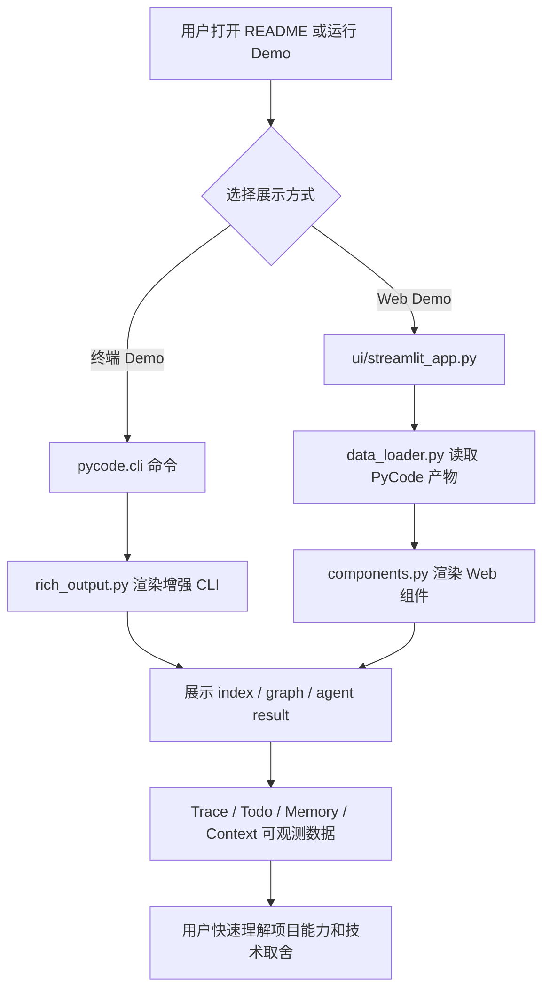
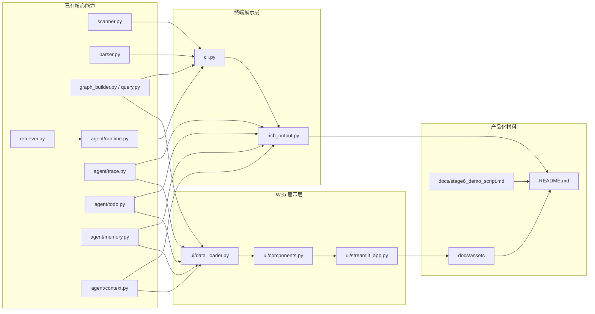
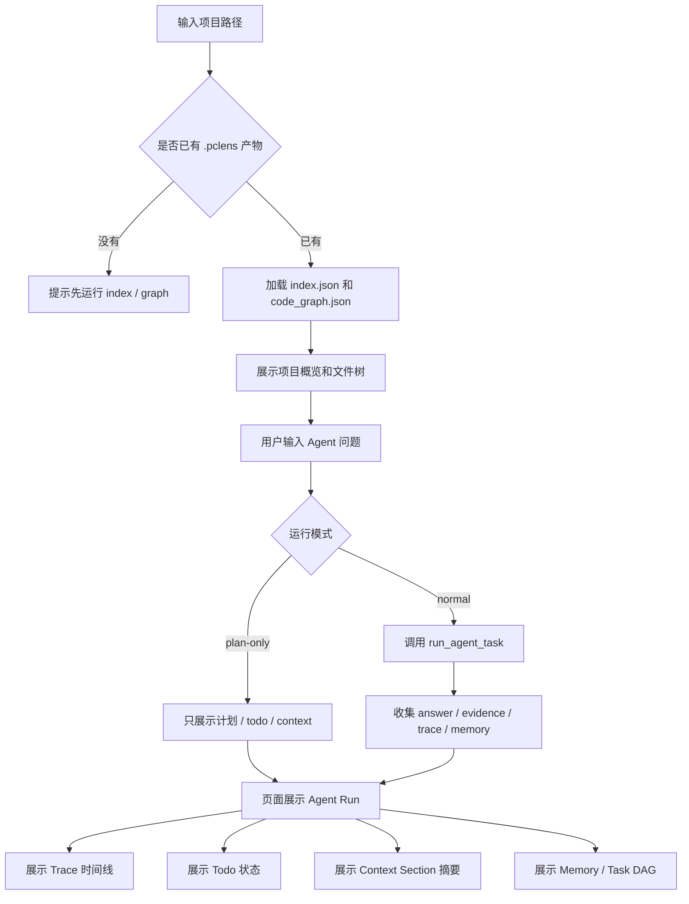
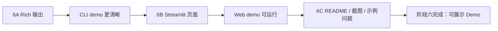

# 阶段六开发记录：可视化和产品化展示

## 1. 本阶段要完成的内容和目标效果

阶段六目标是把 PyCode 从“功能已经可运行的代码库理解与开发分析 Agent”，推进到“别人打开 README 或运行 demo 后能快速理解价值的可展示产品雏形”。

前五个阶段已经完成了索引、代码图谱、LLM 问答、Agent 工具调用、Trace、TodoWrite、Task DAG、Memory 和 Context Builder。本阶段不再扩展核心算法，而是把这些能力用更清晰的终端输出、轻量 Web UI、示例问题、截图和架构说明展示出来。

本阶段要达到的效果：

- 终端输出更清楚：用 Rich 展示项目统计、文件树、代码图谱摘要、Agent 计划、工具 trace、todo 进度、memory 和 evidence。
- CLI 仍保持可脚本化：增强展示不破坏现有命令返回逻辑，必要时保留 plain text 退路。
- Web UI 能跑一个最小可用 Demo：用户可以选择项目路径，查看文件树、索引统计、图谱关系、Agent 问答结果和阶段五可观测数据。
- README 更像项目展示页：补充功能截图、示例问题、运行命令、项目架构图和当前边界。
- 阶段六产物可以直接服务简历、面试讲解和 GitHub 展示。

本阶段暂时不做：

- 不重写 Agent 核心调度逻辑。
- 不做复杂前端工程、用户登录、数据库或部署系统。
- 不引入大型图数据库或复杂交互图编辑器。
- 不让 Web UI 自动修改代码或自动提交 git。
- 不把 Streamlit 页面做成完整 IDE，只做展示 PyCode 能力的 Demo。

阶段六建议拆成三个小阶段：

```text
阶段 6A：Rich 终端增强
阶段 6B：Streamlit 可视化 Demo
阶段 6C：README / 截图 / 产品化展示材料
```

## 2. 阶段六工作拆解和文件级功能

### 阶段 6A：Rich 终端增强

目标是先把现有 CLI 输出变得更清晰，让 demo 不依赖 Web UI 也能看出项目价值。

计划新增文件：

- `pycode/rich_output.py`：集中封装 Rich 输出逻辑，避免把颜色、表格、树形结构和 panel 代码散落在 `cli.py` 中。
  - `print_index_summary_rich()`：用表格展示 Python 文件数、import 数、class 数、function 数、输出路径。
  - `print_graph_summary_rich()`：用表格展示 nodes / edges / file / class / function / method / import edges / call edges。
  - `print_query_result_rich()`：用表格或树展示 imports、imported-by、calls、entry 查询结果。
  - `print_agent_result_rich()`：展示 Agent task、steps、runtime turns、todos、trace、memory、context section 和 evidence。
  - `build_project_tree()`：根据 `ProjectIndex.files` 构建项目文件树。
  - `format_code_location()`：统一高亮 `path:line`、node id 和 graph edge。

计划扩展文件：

- `requirements.txt`：新增 `rich` 依赖。
- `pycode/cli.py`：
  - 增加统一的 Rich 开关，例如默认启用 Rich，提供 `--plain` 或环境降级策略。
  - 将 `_print_index_summary()`、`_print_graph_summary()`、`_print_query_result()`、`_print_agent_result()` 中适合展示的部分迁移到 `rich_output.py`。
  - 保留现有 `_safe_print()`，用于 plain text 和异常兜底。
- `README.md`：补充 Rich CLI 示例输出和推荐 demo 命令。

计划新增或扩展测试：

- `tests/test_rich_output.py`：验证 Rich 输出函数可以接收现有 dataclass，不抛异常，并包含关键文本。
- `tests/test_cli.py`：扩展 CLI 测试，验证 `--plain` 或默认 Rich 输出不破坏现有命令。

### 阶段 6B：Streamlit 可视化 Demo

目标是提供一个轻量 Web 页面，把阶段一到阶段五的数据和流程串起来展示。

计划新增文件：

- `ui/streamlit_app.py`：Streamlit 页面入口。
  - 侧边栏输入或选择项目路径。
  - 按钮触发 index / graph 生成或加载已有 `.pclens` 产物。
  - 主区域展示项目概览、文件树、代码图谱摘要、查询结果、Agent 问答结果。
  - 展示阶段五数据：trace 时间线、todo 清单、memory 列表、context section 摘要。
- `ui/__init__.py`：让 `ui` 目录结构清晰，后续可逐步拆分组件。
- `ui/data_loader.py`：封装 Web UI 读取 index、graph、memory、tasks 的逻辑，避免页面文件过长。
- `ui/components.py`：封装 Streamlit 组件渲染函数，例如文件树、图谱边表、trace 表、todo 表、memory 列表。

计划扩展文件：

- `requirements.txt`：新增 `streamlit` 依赖。
- `README.md`：补充 Web UI 启动命令和推荐演示流程。
- `.gitignore`：如后续生成截图、Streamlit 缓存或临时导出文件，需要确认忽略规则。

计划新增或扩展测试：

- `tests/test_ui_data_loader.py`：优先测试数据加载和转换逻辑。
- `tests/test_ui_components.py`：如组件函数能返回纯数据或可测试文本，则补充轻量测试；Streamlit 运行本身不强行做端到端测试。

Web UI 初版页面结构：

```text
Sidebar:
  Project path
  Load index / graph
  Run agent task
  Options: plan-only, run-tests, show-context

Main:
  Tab 1: Project Overview
  Tab 2: File Tree
  Tab 3: Code Graph
  Tab 4: Agent Run
  Tab 5: Memory / Tasks
```

### 阶段 6C：README / 截图 / 产品化展示材料

目标是让项目不只“能跑”，也能“被快速看懂”。

计划新增或扩展文件：

- `README.md`：
  - 更新项目一句话介绍。
  - 补充功能矩阵：索引、图谱、问答、Agent、Trace/Todo/Memory/Context、可视化。
  - 补充快速开始：安装依赖、生成 index、生成 graph、运行 agent、启动 Streamlit。
  - 补充示例问题，例如“入口在哪里？”、“修改 user_service.py 影响哪些地方？”、“这次 git diff 有什么风险？”。
  - 补充架构图和阶段路线图。
  - 补充当前局限性和后续计划。
- `docs/assets/`：存放截图或 GIF，例如 CLI 输出、Web UI 首页、Agent trace 页面。
- `docs/stage6_development_record.md`：持续记录阶段六开发纪要、问题记录、开发后总结和运行方法。

计划新增文件：

- `docs/stage6_demo_script.md`：可选，记录面试或 README 演示脚本，包含从 clone 到运行 demo 的完整步骤。

计划扩展测试或验证：

- 手动验证 README 中所有命令可以在 Windows PowerShell 下运行。
- 手动验证截图对应当前真实 UI，不使用过期输出。

## 3. 阶段六流程图和关系图

### 阶段六整体展示流程



### 阶段六模块关系图



### Web UI 交互流程



### 阶段六开发顺序



## 4. 开发中纪要

> 本区域用于阶段六开发过程中持续追加记录。每完成或修改一块内容时，记录本次动作、影响文件和验证方式。

### 2026-07-07：阶段六开发前准备

- 新建 `docs/stage6_development_record.md`。
- 根据 `develop_requirements.md` 的阶段六要求，结合当前阶段五已完成的 trace、todo、memory、context 能力，拆解阶段六目标、文件级任务和展示流程图。

### 2026-07-07：阶段 6A Rich 终端增强完成

- 新增 `pycode/rich_output.py`，集中封装 Rich 展示逻辑。
- 支持 index、graph、query、LLM answer 和 Agent result 的 Rich 输出。
- Agent Rich 输出覆盖 steps、runtime turns、todos、trace、memory、context section、evidence 和 answer。
- `build_project_tree()` 可以根据 `ProjectIndex.files` 展示项目文件树。
- `format_code_location()` 统一处理 `path:line`、node id 和 graph edge 的展示文本。
- 修改 `pycode/cli.py`，主要命令支持 `--plain` 参数。
- CLI 入口默认尝试 Rich 输出；如果 `rich` 未安装，自动回退旧式 plain text。
- 直接调用 `index_project()`、`graph_project()`、`agent_project()` 等 Python 函数时默认仍使用 plain text，避免破坏既有单元测试断言。
- 修改 `requirements.txt`，新增 `rich`。
- 新增 `tests/test_rich_output.py`，覆盖 Rich 输出函数可以消费现有 dataclass。
- 扩展 `tests/test_cli.py`，覆盖 `--plain` 参数解析。

### 2026-07-07：阶段 6B Streamlit Web Demo 初版完成

- 新增 `ui/__init__.py`。
- 新增 `ui/data_loader.py`，作为不依赖 Streamlit 的数据读取层。
- `ui/data_loader.py` 支持读取 `.pclens/index.json`、`.pclens/code_graph.json`、`.pclens/memory/` 和 `.pclens/tasks/`。
- 数据层提供项目 overview、文件树 rows、图谱 node/edge rows、memory rows 和 task rows。
- 新增 `ui/components.py`，封装 Streamlit 组件渲染函数。
- 新增 `ui/streamlit_app.py`，提供五个页面 tab：Project Overview、File Tree、Code Graph、Agent Run、Memory / Tasks。
- Web UI 中 Agent Run 默认 `plan-only=True`，`run-tests=False`，避免展示时误触发测试或真实 LLM 调用。
- 修改 `requirements.txt`，新增 `streamlit`。
- 新增 `tests/test_ui_data_loader.py`，覆盖 UI 数据层能读取 index、graph、memory 和 Task DAG。

### 2026-07-07：Streamlit 页面中文化

- 将 `ui/streamlit_app.py` 中的页面标题、侧边栏、按钮、tab、表单标签、提示语和错误提示改为中文。
- 保留 `PyCode`、`Agent`、`index`、`graph`、`plan-only`、`run-tests`、`show-context`、`Task DAG`、`Memory` 等产品名、命令参数或技术名词。
- 将 `ui/components.py` 中的指标名、空状态提示、分区标题和表格列名改为中文显示。
- 对内部数据层返回的英文错误文本，在组件展示时做中文转换，不修改 `ui/data_loader.py` 的内部字段结构，避免影响测试和数据接口。
- 对 `ok`、`failed`、`planned`、`pending`、`completed` 等状态值做中文显示映射。

### 2026-07-07：阶段 6C README 和展示材料完成

- 更新 `README.md` 的项目定位，将当前状态更新为阶段六可视化和产品化展示。
- README 新增阶段六展示能力、快速演示、示例问题、架构图和当前局限。
- README 项目结构补充 `pycode/rich_output.py`、`ui/` 和阶段六文档。
- 新增 `docs/assets/README.md`，说明截图/GIF 存放位置和建议截图清单。
- 新增 `docs/stage6_demo_script.md`，记录从安装依赖到运行 CLI 和 Streamlit Demo 的完整演示脚本。

## 5. 开发中问题记录

> 本区域用于记录阶段六开发过程中遇到的报错、设计冲突、依赖问题和解决方式。

### 2026-07-07：Rich 输出默认值和旧测试兼容

问题：

- 计划要求 CLI 默认使用 Rich，但现有测试直接调用 `graph_project()`、`agent_project()` 等函数，并断言 plain text 里的固定短语。

处理：

- 将 Python 函数层默认设为 `rich_output=False`。
- 将命令行入口 `_dispatch_command()` 默认设为 Rich，用户传 `--plain` 时回到旧输出。
- 这样命令行 demo 默认更漂亮，同时不破坏已有函数级测试。

### 2026-07-07：Rich / Streamlit 依赖缺失处理

问题：

- 阶段六新增 `rich` 和 `streamlit`，如果用户未安装依赖，CLI 或 UI 可能启动失败。

处理：

- `pycode/rich_output.py` 对 `rich` 使用可选导入，缺失时 Rich 函数返回 `False`，CLI 自动回退 plain text。
- `ui/components.py` 在组件实际渲染时导入 Streamlit，缺失时给出明确安装提示。
- `requirements.txt` 已加入 `rich` 和 `streamlit`，README 和 demo 脚本都把安装依赖作为第一步。

### 2026-07-07：compileall 写入 pycache 被拒绝

问题：

- 尝试运行 `python -m compileall pycode ui tests` 做语法检查时，当前 Windows 环境对多个 `__pycache__/*.pyc` 替换操作返回 `PermissionError: [WinError 5] 拒绝访问`。

处理：

- 未将该错误视为 pytest 结果或代码语法错误。
- 改用只读 AST 解析检查所有 `pycode/`、`ui/`、`tests/` 下的 `.py` 文件，不写入 pyc。
- AST 解析结果为 `AST parse OK`。
- 额外使用 `PYTHONDONTWRITEBYTECODE=1` 做只读 smoke check：
  - `build_parser()` 可以解析 `agent examples/demo_project demo --plain`。
  - `ui.data_loader.load_project_ui_data("examples/demo_project")` 可以正常导入并返回项目路径。

### 2026-07-07：Streamlit 启动时找不到 pycode 包

问题：

- 使用 `.\.venv\Scripts\streamlit.exe run .\ui\streamlit_app.py` 启动时，页面报错 `ModuleNotFoundError: No module named 'pycode'`。
- 原因是 Streamlit 直接执行 `ui/streamlit_app.py` 时，脚本入口目录是 `ui/`，项目根目录没有稳定加入 `sys.path`，因此无法导入同级目录下的 `pycode/` 包。
- 终端里出现的 `streamlit skills` / symlink 提示是 Streamlit 自己的技能安装提示，与本次 `pycode` 导入失败不是同一个问题。

处理：

- 在 `ui/streamlit_app.py` 顶部根据 `__file__` 计算项目根目录，并在导入 `pycode` 前将项目根目录插入 `sys.path`。
- 使用 `PYTHONDONTWRITEBYTECODE=1` 做只读导入检查，结果为 `streamlit_app import OK`。
- 使用只读 AST 解析检查 `ui/streamlit_app.py`，结果为 `AST OK`。

### 2026-07-07：Streamlit 页面中文化检查

问题：

- Web UI 初版中还存在较多英文引导词，例如 `Project`、`Artifacts`、`Run Agent`、`Task`、`Model`、`Agent Summary` 等。

处理：

- 将面向用户的引导性词语和说明语句改为中文。
- 保留必要技术名词，例如 `PyCode`、`Agent`、`Task DAG`、`Memory` 和命令参数名。
- 使用只读导入检查确认 `streamlit_app import OK`。
- 使用只读 AST 检查确认 `ui AST OK`。

## 6. 开发后总结

> 本区域记录阶段六收尾总结：实际完成内容、完成情况、未完成事项和后续可改进点。

### 2026-07-07：阶段六开发后总结

本阶段的目标是把阶段一到阶段五形成的代码理解、图谱、Agent、Trace、Todo、Memory、Context 等能力，用更适合展示的方式呈现出来。阶段六不继续扩展核心算法，而是围绕“别人能快速看懂、能运行 demo、能看到 Agent 过程数据”完成产品化展示层。

实际完成内容：

- 完成 Rich CLI 展示层：
  - 新增 `pycode/rich_output.py`。
  - 支持 index、graph、query、answer 和 Agent result 的表格化展示。
  - Agent result 展示 steps、runtime turns、todos、trace、memory、context section、evidence 和 answer。
  - 支持 `--plain` 回退旧式文本输出，保留脚本化和测试断言友好输出。

- 完成 Streamlit Web Demo 初版：
  - 新增 `ui/__init__.py`、`ui/data_loader.py`、`ui/components.py`、`ui/streamlit_app.py`。
  - 页面包含“项目概览 / 文件树 / 代码图谱 / Agent 运行 / 记忆与任务”五个 tab。
  - `ui/data_loader.py` 不依赖 Streamlit，负责读取 `.pclens/index.json`、`.pclens/code_graph.json`、`.pclens/memory/` 和 `.pclens/tasks/`。
  - Web UI 默认展示型使用，不自动修改源码、不提交 git。

- 完成 Web UI 中文化：
  - 将页面标题、侧边栏、按钮、tab、表单标签、提示语、错误提示、指标名、表格列名改为中文。
  - 保留 `PyCode`、`Agent`、`index`、`graph`、`plan-only`、`run-tests`、`show-context`、`Task DAG`、`Memory` 等产品名、参数名和技术名词。

- 完成展示材料：
  - 更新 `README.md`，补充阶段六定位、快速演示、示例问题、架构图、当前局限和项目结构。
  - 新增 `docs/assets/README.md`，说明截图/GIF 存放位置和建议截图清单。
  - 新增 `docs/stage6_demo_script.md`，记录从安装依赖到运行 CLI 和 Streamlit Demo 的演示脚本。

- 完成阶段六测试文件补充：
  - 新增 `tests/test_rich_output.py`。
  - 新增 `tests/test_ui_data_loader.py`。
  - 扩展 `tests/test_cli.py` 的 `--plain` 参数解析测试。
  - 按要求未由 Codex 运行 pytest，只保留手动运行命令。

### 完成情况

- 阶段 6A：已完成。
- 阶段 6B：已完成初版，并完成中文化与 Streamlit 导入路径修复。
- 阶段 6C：已完成文档和展示材料初版。

当前未完成或暂不做的内容：

- 未补充真实截图或 GIF 到 `docs/assets/`，目前只提供截图清单。
- Web UI 中代码图谱目前以表格和统计展示为主，还没有交互式关系图。
- Web UI 暂未做导出报告功能。
- Streamlit 页面仍是展示型 Demo，不是完整 IDE。
- 阶段六没有新增部署能力。

### 后续可改进点

- 后续可以给 Streamlit 图谱页加入更直观的关系图组件，而不是只展示表格。
- 后续可以补充真实截图或 GIF 到 `docs/assets/`。
- 后续可以给 Web UI 增加导出当前 Agent run 报告的按钮。
- 后续可以让 Rich 输出支持更多主题或 compact 模式。
- 后续可以把 `ContextSection` 的内容预览做成可折叠 UI。
- 后续可以把 Agent Run 页面里的 plan、trace、todo、context 做成更明确的时间线视图。
- 后续可以在 README 中补充真实运行截图，让面试官不运行项目也能理解效果。

## 7. 阶段六功能运行方法

> 本区域给出阶段六已实现功能的运行方法。测试命令只提供给用户手动运行；本次开发未由 Codex 执行 pytest。

### 安装依赖

```powershell
.\.venv\Scripts\python.exe -m pip install -r requirements.txt
```

### Rich CLI 示例

```powershell
.\.venv\Scripts\python.exe -m pycode.cli index .\examples\demo_project
.\.venv\Scripts\python.exe -m pycode.cli graph .\examples\demo_project
.\.venv\Scripts\python.exe -m pycode.cli agent .\examples\demo_project "这个项目的入口在哪里？" --plan-only --show-context
```

说明：

- 前两条命令生成 `.pclens/index.json` 和 `.pclens/code_graph.json`。
- 第三条命令展示 Agent 计划、todo、trace 和 context。
- 当前阶段五增强后，`--plan-only` 的语义是“只生成计划，不执行工具”。如果配置了 LLM，会优先尝试 LLM Planner；如果 LLM 不可用，会回退规则 planner。

### 离线安全演示命令

如果未配置 LLM API，或者只想看规则 planner 的稳定兜底效果，可以运行：

```powershell
.\.venv\Scripts\python.exe -m pycode.cli agent .\examples\demo_project "这个项目的入口在哪里？" --plan-only --show-context --rule-plan
```

### Plain text 退路

```powershell
.\.venv\Scripts\python.exe -m pycode.cli graph .\examples\demo_project --plain
```

说明：

- `--plain` 用于关闭 Rich 输出，回到旧式文本输出。
- 适合调试、复制日志或配合测试断言。

### Web UI 启动示例

```powershell
.\.venv\Scripts\streamlit.exe run .\ui\streamlit_app.py
```

启动后可在页面中查看：

- 项目概览：展示 Python 文件数、图谱节点数、图谱关系数和项目记忆数。
- 文件树：展示 index 中的文件结构和每个文件的 import/class/function 数量。
- 代码图谱：展示节点类型、关系类型、节点列表和关系列表。
- Agent 运行：输入任务，展示计划、todo、trace、context 和回答。
- 记忆 / 任务：展示 `.pclens/memory/` 与 `.pclens/tasks/` 的内容。

### Demo 演示脚本

完整演示步骤见：

```text
docs/stage6_demo_script.md
```

截图/GIF 建议存放位置见：

```text
docs/assets/README.md
```

### 阶段 6A Rich 输出测试

本次开发按照要求未由 Codex 运行 pytest。建议手动运行：

```powershell
.\.venv\Scripts\python.exe -m pytest tests\test_rich_output.py tests\test_cli.py --basetemp=.pytest_tmp_6a -o cache_dir=.pytest_tmp_6a\.pytest_cache
```

### 阶段 6B UI 数据层测试

```powershell
.\.venv\Scripts\python.exe -m pytest tests\test_ui_data_loader.py --basetemp=.pytest_tmp_6b -o cache_dir=.pytest_tmp_6b\.pytest_cache
```

### 阶段六相关回归

```powershell
.\.venv\Scripts\python.exe -m pytest tests\test_rich_output.py tests\test_ui_data_loader.py tests\test_cli.py --basetemp=.pytest_tmp_6 -o cache_dir=.pytest_tmp_6\.pytest_cache
```

### 完整回归

```powershell
.\.venv\Scripts\python.exe -m pytest --basetemp=.pytest_tmp_full_6 -o cache_dir=.pytest_tmp_full_6\.pytest_cache
```
