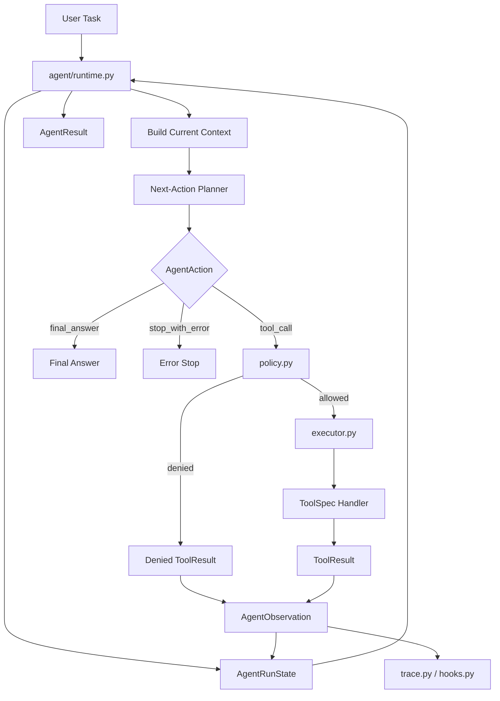
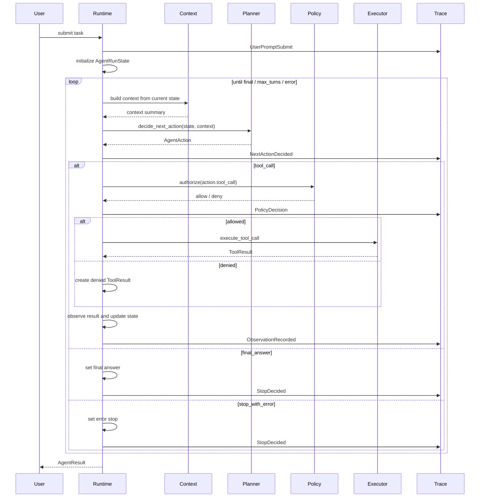

# V1.0-A 开发记录：Harness 核心稳定化

> 所属版本：PyCode V1.0  
> 阶段编号：V1.0-A  
> 创建日期：2026-07-09  
> 当前状态：开发前规划  
> 依据文档：`docs_v1.0/v1.0_roadmap.md`、`docs_v1.0/v1.0_develop_requirements.md`、`CCLearning NO.1-6`

## 1. 开发前：本阶段主要目标和目标效果

V1.0-A 是 V1.0 的第一阶段，也是整个 V1.0 harness 升级的基础阶段。本阶段不优先新增展示功能，也不优先扩展更多工具，而是先把 Agent 的核心执行载体稳定下来。

当前 demo 版 PyCode 已经有 `runtime.py`、`planner.py`、`executor.py`、`policy.py`、`trace.py`、`hooks.py` 和 `tools/base.py`，能够完成一个轻量开发分析 Agent 的基本流程。但当前 runtime 的实际工作方式更接近：

```text
用户任务
-> planner 一次性生成 steps
-> runtime 遍历 steps
-> executor 顺序执行工具
-> 汇总 tool_results / trace / todo / context
-> 输出 AgentResult
```

这是一种 `plan-and-execute` 模式。它已经适合 demo 展示，但还不完全等同于 `CCLearning NO.1` 中强调的最小 Agent loop。真正的 loop 应该在每次工具执行后观察结果，并基于当前状态重新决定下一步：

```text
用户任务
-> 初始化 AgentState
-> 第 1 轮：build context -> decide next action -> policy check -> act -> observe -> update state
-> 第 2 轮：build context -> decide next action -> policy check -> act -> observe -> update state
-> ...
-> decide final_answer / stop
-> 输出 AgentResult
```

因此，V1.0-A 的核心目标是：

```text
把当前 plan-and-execute runtime，升级为 observe-decide-act 的单 Agent harness loop。
```

本阶段要达到的效果：

1. Runtime 成为真正的 loop 控制中心
   - 每一轮都有明确的 turn。
   - 每一轮都基于当前 state 组装 context。
   - 每一轮都调用 planner 决定下一步 action。
   - 每一轮执行后都会 observe 工具结果，并更新 state。
   - Runtime 能判断继续、停止、失败、达到最大轮数。

2. Planner 从一次性计划器升级为 next-action planner
   - 当前 planner 仍可保留一次性 `plan_task()` 能力，用于兼容 `plan-only` 和已有测试。
   - 新增或扩展 next-action 决策能力。
   - next-action planner 的问题不再是“完整计划是什么”，而是“在当前状态下下一步该做什么”。

3. Agent 类型系统支持 run / turn / action / observation
   - 明确 `AgentRunState`。
   - 明确 `AgentTurnState` 或等价结构。
   - 明确 `AgentAction` / `NextAction`。
   - 明确 `AgentObservation`。
   - `AgentResult` 能表达 loop turns，而不只是 steps 和 tool results。

4. ToolRegistry / ToolSpec 更稳定
   - 现有 `TOOLS` 可作为内置工具注册表继续使用。
   - V1.0-A 需要让工具元数据更适合 planner、executor、policy、context 共同使用。
   - 工具说明、输入 schema、只读/写状态/测试权限等信息应来自同一来源。

5. Policy 成为 loop 内的统一权限关口
   - 每个 next action 在执行前必须经过 policy。
   - 权限拒绝不是异常，而是一种可观察的 tool result / observation。
   - 权限拒绝必须进入 trace，并反馈给 loop 继续判断是否换动作、停止或总结。

6. Trace / Hook 能记录 loop 级事件
   - 不只记录工具 pre/post，还要记录每一轮 turn 开始、next action 决策、observation、continue/stop。
   - trace 应能回答：
     - Agent 第几轮做了什么？
     - 为什么选择这个工具？
     - 工具返回了什么？
     - 是否因为工具结果改变了下一步？
     - 为什么最终停止？

7. 保持 demo 版兼容
   - 不破坏现有 CLI 基本命令。
   - 不破坏已有 `plan-only` 的展示能力。
   - 不要求本阶段完成多 Agent、MCP、后台任务、完整技能系统。
   - 尽量用兼容层或渐进重构，避免一次性大拆。

### 1.1 本阶段完成后的理想运行语义

V1.0-A 完成后，Agent runtime 的核心语义应该接近下面这个伪代码：

```python
state = AgentRunState.from_task(task)

for turn_index in range(1, max_turns + 1):
    context = build_context_for_turn(state)
    action = planner.decide_next_action(state, context, tools)
    trace.record_next_action(turn_index, action)

    if action.type == "final_answer":
        state.answer = action.answer
        state.stop_reason = "final"
        break

    if action.type == "stop_with_error":
        state.error = action.error
        state.stop_reason = "error"
        break

    if action.type == "tool_call":
        policy_decision = policy.authorize(action.tool_call)
        if policy_decision.allowed:
            result = executor.execute_tool_call(action.tool_call)
        else:
            result = policy_decision.to_tool_result()

        observation = AgentObservation.from_tool_result(result)
        state.observe(observation)
        trace.record_observation(turn_index, observation)
        continue

state.finish()
return AgentResult.from_state(state)
```

这个伪代码不是最终实现要求，但它表达了本阶段最重要的结构变化：**runtime 每轮重新决策，而不是只执行预生成列表**。

## 2. 开发前：文件级工作拆解

### 2.1 `pycode/agent/types.py`

当前现状：

- 已有 `AgentTask`、`AgentStep`、`ToolCall`、`AgentMessage`、`AgentStopReason`、`RuntimeConfig`、`AgentTurn`、`AgentResult`。
- `AgentTurn` 当前主要是 `tool_call + tool_result`。
- `AgentResult` 当前主要保存 `steps`、`tool_results`、`turns`、`trace`、`todos`、`memory`、`context`。

本阶段计划：

1. 新增或扩展 run / turn 状态模型：
   - `AgentRunStatus`
     - `created`
     - `initializing`
     - `deciding`
     - `acting`
     - `observing`
     - `summarizing`
     - `completed`
     - `failed`
   - `AgentTurnStatus`
     - `deciding`
     - `acting`
     - `observed`
     - `skipped`
     - `failed`

2. 新增 next action 相关类型：
   - `AgentActionType`
     - `tool_call`
     - `final_answer`
     - `ask_user`
     - `stop_with_error`
     - `no_op`
   - `AgentAction`
     - `type`
     - `tool_call`
     - `answer`
     - `reason`
     - `stop_reason`
     - `error`

3. 新增 observation 相关类型：
   - `AgentObservation`
     - `turn_index`
     - `action`
     - `tool_result`
     - `summary`
     - `ok`
     - `error`

4. 扩展 `AgentTurn`：
   - 保留对 `tool_call` / `tool_result` 的兼容。
   - 增加 `action`、`observation`、`status`、`reason` 等字段。
   - 让 Rich / UI 仍能读取原有字段。

5. 扩展 `AgentResult`：
   - 保留 `steps`，用于兼容初始计划和 plan-only。
   - 增加 loop 语义字段，例如 `run_status`、`turns`、`observations`、`errors`。
   - `ok` 的判断需要从“required steps 全部成功”逐步升级为“required observations / final stop 状态成功”。

设计要求：

- 类型扩展要兼容已有测试。
- 不一次性删除 `AgentStep`。
- `AgentStep` 可以继续作为初始计划和 todo 来源。
- `AgentAction` 是 V1.0-A 的核心新增概念。

### 2.2 `pycode/agent/runtime.py`

当前现状：

- `run_agent_runtime()` 会先调用 `build_runtime_plan()`。
- 然后用 `for turn_index, step in enumerate(steps)` 顺序执行。
- 工具执行后会记录 todo、hooks、tool_results、messages。
- 最后统一构建 summary context，再由 LLM 生成 answer。

本阶段计划：

1. 保留 `build_runtime_plan()` 作为兼容入口
   - `plan-only` 继续可以展示初始 steps。
   - 规则 planner 仍可给 loop 提供初始建议。
   - LLM planner 失败仍可 fallback 到规则 planner。

2. 新增 loop 主体
   - 可以在 `run_agent_runtime()` 内部引入 `_run_loop()`。
   - 也可以新增小型内部函数，例如：
     - `_initialize_run_state()`
     - `_decide_next_action()`
     - `_execute_action()`
     - `_observe_result()`
     - `_should_stop()`
     - `_build_result_from_state()`

3. Loop 执行流程
   - 初始化 messages、trace、memory、initial steps、todo。
   - 每轮构建当前 loop context。
   - 调用 next-action planner。
   - 如果 action 是 `final_answer`，停止。
   - 如果 action 是 `tool_call`，走 policy + executor。
   - 工具结果进入 observation。
   - observation 更新 tool_results、turns、messages、todo、evidence。
   - 达到 max_turns 时以 `MAX_TURNS` 停止。

4. plan-only 语义
   - `plan_only=True` 时不进入完整工具执行 loop。
   - 可以展示 initial steps、todo、context。
   - 后续可以增加 `show_loop_preview`，但 V1.0-A 不必做。

5. stop reason 语义
   - `FINAL`：planner 或 runtime 判断证据足够，生成最终回答。
   - `PLAN_ONLY`：只展示计划。
   - `MAX_TURNS`：达到最大轮数。
   - `ERROR`：无法恢复的 runtime 错误。

设计要求：

- `runtime.py` 是本阶段核心文件。
- 先保持单 Agent，不引入 subagent。
- 先保持同步执行，不引入后台任务。
- 先保持只读默认，不引入自动写代码。

### 2.3 `pycode/agent/planner.py` 与 `pycode/agent/planner_enhanced.py`

当前现状：

- `planner.py` 是兼容 re-export。
- 实际规则规划逻辑在 `planner_enhanced.py`。
- 当前主要通过 `plan_task(task)` 一次性生成 `AgentStep` 列表。

本阶段计划：

1. 保留 `plan_task(task)`
   - 作为 plan-only 和初始 todo 的来源。
   - 作为 LLM planner 不可用时的初始计划兜底。

2. 新增 next-action planner 能力
   - 可以命名为：
     - `decide_next_action(...)`
     - 或 `plan_next_action(...)`
   - 输入应包含：
     - `task`
     - `turn_index`
     - `steps`
     - `turns`
     - `tool_results`
     - `todos`
     - `trace`
     - `available_tools`
   - 输出 `AgentAction`。

3. 规则 next-action planner 的基础策略
   - 如果还有未执行的 required step，则选择下一个未执行 step 作为 `tool_call`。
   - 如果 required step 都执行完，则返回 `final_answer` 或进入 summary 阶段。
   - 如果某个 required tool 失败，可以选择：
     - 停止并总结失败。
     - 或选择一个替代工具。
   - 初版可以先简单处理，不必实现复杂重规划。

4. LLM planner 的衔接
   - V1.0-A 可以先让 LLM planner 继续只生成初始 steps。
   - 但接口上要给 V1.0-C 的 next-action LLM planner 留位置。

设计要求：

- 不破坏已有 `plan_task()` 测试。
- next-action planner 初版可以是规则版。
- “planner 当前状态下决定下一步”是本阶段的核心语义，不要求第一版就做到非常聪明。

### 2.4 `pycode/agent/llm_planner.py`

当前现状：

- 负责 LLM planner。
- 失败时 runtime 会 fallback 到规则 planner。

本阶段计划：

1. V1.0-A 不强制改成完整 LLM next-action planner。
2. 可以补充类型和文档，说明当前 LLM planner 仍用于初始计划。
3. 为 V1.0-C 预留 next-action schema：
   - `action_type`
   - `tool_name`
   - `arguments`
   - `reason`
   - `final_answer`
   - `stop_reason`
4. LLM planner 错误继续进入 trace。

设计要求：

- V1.0-A 重点是 runtime loop 化，不把 LLM planner 作为阻塞项。
- 离线规则 loop 必须可运行。

### 2.5 `pycode/agent/executor.py`

当前现状：

- `execute_tool_call()` 已经能执行单个工具。
- `execute_plan()` 能执行完整 steps。
- `run_agent_task()` 是对 runtime 的外层入口。

本阶段计划：

1. 强化单工具执行入口
   - `execute_tool_call()` 继续作为 runtime loop 的 action 执行点。
   - 确保所有工具执行都经过：
     - registry 查找
     - policy 授权
     - 参数校验
     - 异常捕获

2. 降低 `execute_plan()` 在 runtime 中的核心地位
   - `execute_plan()` 可以保留给测试或兼容。
   - 新 runtime 不应依赖一次性执行完整 plan。

3. 返回结果作为 observation 输入
   - `ToolResult` 应能被包装成 `AgentObservation`。
   - executor 不负责决定下一步。

设计要求：

- executor 只做执行，不做规划。
- executor 不直接处理 loop 停止。
- executor 不直接写 trace，trace 由 runtime / hook 统一记录。

### 2.6 `pycode/agent/policy.py`

当前现状：

- `authorize_tool_call()` 基于 `ToolSpec.read_only`、`writes_internal_state`、`context.allow_tests` 判断是否允许。
- 权限拒绝返回 `ToolResult` failure。

本阶段计划：

1. 保持 policy 是工具执行前的统一关口。
2. 为 loop 增加 policy decision 语义：
   - allowed
   - denied
   - reason
   - denied_by
   - tool_name
3. 权限拒绝应进入 observation
   - 对 loop 来说，权限拒绝也是一种观察结果。
   - planner 可以在下一轮看到“这个工具被拒绝”，然后决定停止或选择替代工具。
4. 保持默认安全策略
   - 只读工具允许。
   - internal state 写入工具受限允许。
   - 测试运行必须显式 `allow_tests=True`。
   - 自动写代码、删除文件、git reset / commit 不进入 V1.0-A。

设计要求：

- 不让工具自己绕过 policy。
- 不让 hook 绕过 policy。
- policy 的拒绝结果必须可追踪、可展示。

### 2.7 `pycode/agent/trace.py`

当前现状：

- 已有 `TraceEvent`、`ToolTrace`、`AgentTrace`、`TraceRecorder`。
- 可以记录普通事件和工具调用。

本阶段计划：

1. 增加 loop 级事件类型使用约定
   - `RunInitialized`
   - `TurnStarted`
   - `ContextBuilt`
   - `NextActionDecided`
   - `PolicyDecision`
   - `ActionExecuted`
   - `ObservationRecorded`
   - `TurnFinished`
   - `StopDecided`

2. 保持兼容已有 HookEventType
   - `UserPromptSubmit`
   - `PreToolUse`
   - `PostToolUse`
   - `Stop`

3. ToolTrace 继续记录工具级信息
   - turn index
   - tool name
   - arguments
   - duration
   - status
   - summary
   - error
   - denied_by

4. AgentTrace 应能表达 loop 过程
   - 即使不新增复杂结构，也要通过 events 清楚记录每轮。

设计要求：

- trace 不能影响主流程。
- trace 中的大输出要继续截断。
- trace 是后续 CLI / UI 展示 Agent 行为的依据。

### 2.8 `pycode/agent/hooks.py`

当前现状：

- 已有 Hook 类型：
  - `USER_PROMPT_SUBMIT`
  - `PRE_TOOL_USE`
  - `POST_TOOL_USE`
  - `STOP`
- 默认 hook 会记录 trace。

本阶段计划：

1. 可以新增 loop 相关 HookEventType
   - `TURN_START`
   - `NEXT_ACTION`
   - `OBSERVATION`
   - `TURN_END`
2. 或者先通过 `TraceRecorder.record_event()` 记录 loop 事件，Hook 类型后续再扩展。
3. 继续保证默认 hook 不改变业务逻辑。
4. hook 报错不能中断主流程。

设计要求：

- Hook 是观测和扩展点，不是权限绕过点。
- 权限判断仍由 policy 负责。

### 2.9 `pycode/tools/base.py`

当前现状：

- 已有 `ToolContext`、`ToolResult`、`ToolSpec`。
- `ToolSpec` 包含：
  - name
  - handler
  - read_only
  - writes_internal_state
  - description
  - input_schema
  - examples

本阶段计划：

1. 为 ToolRegistry 打基础
   - 可以继续用 `pycode.tools.TOOLS`，但要明确它就是内置 ToolRegistry。
   - 可以新增 `ToolRegistry` 类，也可以先新增辅助函数。

2. 扩展 ToolSpec 元数据
   - `requires_confirmation`
   - `destructive`
   - `allowed_in_plan_only`
   - `output_summary_policy`
   - `category`

3. 让 planner / context 使用 ToolSpec
   - planner 决策时知道哪些工具可用。
   - context 中的工具说明来自 ToolSpec。
   - policy 使用 ToolSpec 做权限判断。

设计要求：

- ToolSpec 扩展要有默认值，避免破坏已有工具定义。
- 不在 V1.0-A 引入真实 MCP。
- 不在 V1.0-A 引入复杂插件加载。

### 2.10 `pycode/tools/__init__.py`

当前现状：

- 通常用于集中导出工具注册表 `TOOLS`。

本阶段计划：

1. 确认 `TOOLS` 是内置工具注册表。
2. 如新增 `ToolRegistry`，这里负责构建默认 registry。
3. 保持 `tools: dict[str, ToolSpec]` 的兼容输入，避免大范围破坏测试。

### 2.11 `pycode/agent/prompts.py`、`pycode/agent/context.py`、`pycode/agent/prompt_sections.py`

当前现状：

- 已有 Agent summary context 和 prompt 渲染。
- V1.0-B 才会重点做 Context / Memory / Todo / Task 统一。

本阶段计划：

1. V1.0-A 只做 loop 所需的最小接入。
2. 需要支持每轮 next-action planner 的基础上下文。
3. 不在本阶段大改 context builder。
4. 为 V1.0-B 留出按 turn 输出 context 摘要的接口。

设计要求：

- 本阶段不把 prompt/context 作为主战场。
- 只要 loop 能拿到当前 state 的摘要即可。

### 2.12 `pycode/cli.py` 与 `pycode/rich_output.py`

当前现状：

- CLI 能运行 agent 命令。
- Rich 输出可以展示 Agent result、steps、turns、todos、trace、memory、context。

本阶段计划：

1. 尽量保持 CLI 参数不变。
2. Agent result 中新增 loop turns 后，Rich 输出需要能展示：
   - turn index
   - action type
   - tool
   - status
   - observation summary
3. `--plain` 输出也要保持可读。

设计要求：

- CLI 展示不是 V1.0-A 的主目标，但不能被破坏。
- UI 深度调整可以放到后续阶段。

### 2.13 测试文件

本阶段预计新增或扩展测试：

- `tests/test_agent_runtime.py`
  - runtime 能进入 loop。
  - loop 能执行一个 tool action。
  - loop 能根据 final action 停止。
  - max_turns 能停止。

- `tests/test_agent_planner.py`
  - 规则 planner 能输出 next action。
  - 已执行步骤不会重复执行。
  - required step 失败时有合理停止或失败策略。

- `tests/test_agent_executor.py`
  - executor 仍能执行单个 tool call。
  - 未知工具、参数错误、工具异常仍返回 failure。

- `tests/test_agent_policy.py` 或现有 policy 相关测试
  - 只读工具允许。
  - 测试工具在未授权时被拒绝。
  - policy 拒绝可被 runtime 观察。

- `tests/test_agent_trace.py`
  - trace 包含 turn / next action / observation 事件。
  - 权限拒绝进入 trace。

- `tests/test_tools_*.py`
  - ToolSpec 扩展不破坏已有工具。

## 3. 开发前：为什么要做这些修改

### 3.1 依据一：CCLearning NO.1 的最小 Agent 循环

`CCLearning NO.1` 的核心观点是：Agent 不是“生成一份计划然后机械执行”，而是一个持续循环：

```text
接收任务
-> 决定下一步
-> 调用工具
-> 观察结果
-> 再决定下一步
-> 直到停止
```

这个循环里最重要的不是工具本身，而是“观察后重新决策”。如果缺少这一步，Agent 就只是一个计划执行器，不是真正意义上的 loop。

PyCode 当前 runtime 已经具备 harness 的雏形：

- 有 runtime。
- 有 planner。
- 有 executor。
- 有 policy。
- 有 trace。
- 有 todo。
- 有 memory。
- 有 context。

但当前 runtime 的执行方式仍然偏：

```text
plan once -> execute all -> summarize
```

因此 V1.0-A 的必要升级就是把 runtime 改造成：

```text
observe -> decide -> act -> observe -> decide -> stop
```

这一步是 PyCode 从 demo Agent 走向 harness Agent 的关键。

### 3.2 依据二：Planner 的职责必须变化

demo 版 planner 的职责是：

```text
根据用户任务生成完整步骤列表
```

V1.0-A 之后 planner 的核心职责应该变成：

```text
根据当前状态决定下一步该干什么
```

这两者的差别非常大。

一次性 planner 只看初始用户任务。next-action planner 还要看：

- 已经调用过哪些工具。
- 工具结果是什么。
- 哪些证据已经足够。
- 哪些 todo 已完成。
- 哪些工具失败或被拒绝。
- 是否已经应该停止。
- 是否需要换一个工具继续查。

这正是 Agent harness 和普通脚本编排的区别。V1.0-A 不要求 next-action planner 立刻很智能，但必须先把接口和 loop 语义立起来。

### 3.3 依据三：工具生命周期需要被 runtime 管理

`CCLearning NO.1` 中工具调度不是简单函数调用，而是有完整生命周期：

```text
tool selected
-> permission checked
-> arguments validated
-> tool executed
-> result observed
-> trace recorded
-> next decision made
```

当前 PyCode 已经有 `execute_tool_call()`、`authorize_tool_call()`、`TraceRecorder` 和 hooks，这些是很好的基础。V1.0-A 要做的是把它们放回 loop 语义里：

- policy 不只是 executor 的内部细节，而是 action 执行前的关口。
- ToolResult 不只是最终汇总材料，而是下一轮决策的 observation。
- trace 不只是日志，而是 loop 每轮行为的可解释证据。

### 3.4 依据四：权限安全必须是 harness 层能力

`CCLearning NO.1` 强调 safe path 和权限门控。对于 PyCode，这一点尤其重要，因为项目未来可能逐渐加入：

- 测试运行。
- 文件写入。
- git 操作。
- MCP 工具。
- 子 Agent。
- 多 Agent。

如果 V1.0-A 不先把 policy 稳定下来，后续能力越多，风险越大。

所以本阶段要求：

- 每个 tool action 都必须经过 policy。
- policy 拒绝要进入 trace。
- policy 拒绝要变成 observation。
- runtime 不能因为拒绝直接崩溃。
- planner 下一轮要能看到拒绝结果。

这也是为什么 policy 要成为 harness 的一部分，而不是散落在各个工具内部。

### 3.5 依据五：Trace / Hook 是可观测 harness 的基础

`CCLearning NO.1` 中生产级 Agent 不只是能运行，还要能解释自己做了什么。PyCode demo 版已经完成了阶段五可观测能力，但在 V1.0-A 中 trace 需要从“工具调用记录”进一步升级为“loop 行为记录”。

本阶段 trace 要服务几个问题：

- 这一轮 Agent 看到了什么？
- 它为什么决定调用这个工具？
- 工具有没有被 policy 拒绝？
- 工具结果是否改变了下一轮决策？
- 为什么停止？

这些信息会直接服务后续 Rich CLI、Streamlit UI、Agent report 和面试讲解。

### 3.6 依据六：ToolRegistry 是 MCP / Skill / Subagent 的前置基础

`CCLearning NO.6` 讲 MCP 和动态工具池，但 V1.0-A 不做完整 MCP。原因是完整 MCP 涉及连接、发现、命名空间、缓存失效、远程认证和错误恢复，复杂度远超当前阶段。

但 V1.0-A 必须先做一件更基础的事：

```text
让工具在 PyCode 内部拥有稳定、统一、可描述、可授权的注册形态。
```

也就是 ToolRegistry / ToolSpec。

这样未来接 MCP 时，MCP 工具只需要被转换成同样的 ToolSpec，就可以进入：

- planner。
- context。
- policy。
- executor。
- trace。

这就是 V1.0-A 做 ToolRegistry 的理由：不是为了马上做插件生态，而是为了让当前内置工具也符合 harness 的扩展模型。

### 3.7 依据七：为什么本阶段不做多 Agent、后台任务、完整 MCP

`CCLearning NO.4`、`NO.5`、`NO.6` 里有后台任务、多 Agent 团队、邮箱协议、MCP 架构等内容。这些都很有价值，但它们依赖一个更基础的前提：

```text
单 Agent loop 必须先稳定。
```

如果当前 runtime 仍然只是 plan-and-execute，那么多 Agent 只会放大混乱：

- 多个 Agent 由谁决定下一步？
- 子 Agent 的工具权限怎么继承？
- 后台任务的结果怎么注入 loop？
- MCP 工具的 readOnly / destructive 怎么被 policy 理解？
- 不同 Agent 的 trace 怎么串起来？

所以 V1.0-A 的边界是正确且必要的：

- 先做单 Agent loop。
- 先做 ToolRegistry。
- 先做 Policy。
- 先做 Trace lifecycle。
- 不做多 Agent。
- 不做完整 MCP。
- 不做后台任务。

### 3.8 本阶段核心关系图



### 3.9 V1.0-A 内部执行流程图



### 3.10 本阶段完成标准

V1.0-A 完成后，至少应满足：

1. `run_agent_runtime()` 内部存在清晰的 loop 执行路径。
2. planner 能提供 next action，而不只是完整 steps。
3. runtime 可以根据 action 类型决定执行工具、停止、失败或跳过。
4. 工具执行结果会被包装为 observation 并反馈给下一轮。
5. policy 拒绝会成为 observation，而不是不可见异常。
6. trace 中能看到 turn / next action / policy / observation / stop。
7. `AgentResult.turns` 能表达 loop 过程。
8. `plan_only` 仍可用。
9. 现有核心 CLI 不被破坏。
10. 新增或更新测试覆盖 runtime loop 的关键路径。

## 4. 开发中纪要

> 本区域用于 V1.0-A 开发过程中持续追加记录。每完成或修改一块内容时，记录本次动作、影响文件和验证方式。

### 2026-07-09：Agent 类型系统补充 action / observation

- 修改 `pycode/agent/types.py`。
- 新增 `AgentActionType`、`AgentAction`、`AgentObservation`。
- 扩展 `AgentTurn`，在保留 `index`、`tool_call`、`tool_result` 的基础上，增加 `action`、`observation`、`status`。
- 扩展 `AgentResult`，新增 `observations` 字段。
- 扩展 `AgentStopReason`，新增 `NO_ACTION`，用于 planner 无动作时的显式停止语义。
- 设计取舍：不删除 `AgentStep`，因为它仍然用于初始计划、`plan-only` 展示和 todo 生成；V1.0-A 的新语义通过 `AgentAction` 接入。

建议用户运行：

```powershell
.\.venv\Scripts\python.exe -m pytest tests\test_agent_runtime.py tests\test_agent_planner.py --basetemp=.pytest_tmp_v1a_types -o cache_dir=.pytest_tmp_v1a_types\.pytest_cache
```

### 2026-07-09：新增规则版 next-action planner

- 修改 `pycode/agent/planner_enhanced.py` 和 `pycode/agent/planner.py`。
- 新增 `decide_next_action(task, steps, turns, tool_results, turn_index)`。
- 初版规则：
  - 如果 required step 已失败，则返回 `final_answer`，让 summary 阶段解释失败证据。
  - 如果还有未观察的 step，则返回 `tool_call`。
  - 如果所有 step 已观察，则返回 `final_answer`。
- 修改 `pycode/agent/__init__.py`，导出 `decide_next_action`、`AgentAction`、`AgentActionType`、`AgentObservation`。
- 扩展 `tests/test_agent_planner.py`，覆盖 next-action planner 的选择、推进、完成和 required failure 场景。
- 设计取舍：V1.0-A 只做规则版 next-action planner，不做 LLM next-action planner；LLM planner 仍保留为初始计划生成能力。

建议用户运行：

```powershell
.\.venv\Scripts\python.exe -m pytest tests\test_agent_planner.py --basetemp=.pytest_tmp_v1a_planner -o cache_dir=.pytest_tmp_v1a_planner\.pytest_cache
```

### 2026-07-09：runtime 改造为 observe-decide-act loop

- 修改 `pycode/agent/runtime.py`。
- 保留 `build_runtime_plan()`，但它只负责生成初始 steps。
- 新增 `_run_observe_decide_act_loop()`，将主执行路径改为：
  - `TurnStarted`
  - `decide_next_action`
  - `NextActionDecided`
  - tool action 执行
  - `AgentObservation`
  - `ObservationRecorded`
  - `TurnFinished`
  - `StopDecided`
- 新增 `_execute_tool_action()`，把单轮 tool action 执行与 todo、hooks、messages、executor 串起来。
- 新增 `AgentObservation` 写入 `AgentResult.observations` 和 `AgentTurn.observation`。
- 保持 `plan_only=True` 不进入工具执行 loop，继续返回初始 steps、todos、context、trace。
- 扩展 `tests/test_agent_runtime.py`，验证 turn action、observation、loop trace event 和 policy denial observation。
- 设计取舍：没有删除 `execute_plan()`；它仍作为兼容工具函数存在，但 runtime 主路径不再依赖一次性执行完整 plan。

建议用户运行：

```powershell
.\.venv\Scripts\python.exe -m pytest tests\test_agent_runtime.py --basetemp=.pytest_tmp_v1a_runtime -o cache_dir=.pytest_tmp_v1a_runtime\.pytest_cache
```

### 2026-07-09：补充 loop 级 trace 事件

- 修改 `pycode/agent/runtime.py` 中的 trace 记录逻辑。
- 新增事件：
  - `TurnStarted`
  - `NextActionDecided`
  - `PolicyDecision`
  - `ObservationRecorded`
  - `TurnFinished`
  - `StopDecided`
- 扩展 `tests/test_agent_trace.py`，验证成功工具调用和 policy denial 都能在 trace 中体现 loop 事件。
- 设计取舍：暂不扩展复杂 HookEventType；V1.0-A 先通过 `TraceRecorder.record_event()` 记录 loop 级事件，避免 hook 系统过早膨胀。

建议用户运行：

```powershell
.\.venv\Scripts\python.exe -m pytest tests\test_agent_trace.py tests\test_agent_hooks.py --basetemp=.pytest_tmp_v1a_trace -o cache_dir=.pytest_tmp_v1a_trace\.pytest_cache
```

### 2026-07-09：扩展 ToolSpec 元数据

- 修改 `pycode/tools/base.py`。
- 为 `ToolSpec` 增加默认字段：
  - `requires_confirmation`
  - `destructive`
  - `allowed_in_plan_only`
  - `category`
  - `output_summary_policy`
- 扩展 `tests/test_agent_executor.py`，验证新增元数据默认值。
- 设计取舍：没有新增复杂 `ToolRegistry` 类；当前 `pycode.tools.TOOLS` 继续作为内置 registry 使用，先让 ToolSpec 具备后续 MCP / skill / subagent 可复用的描述能力。

建议用户运行：

```powershell
.\.venv\Scripts\python.exe -m pytest tests\test_agent_executor.py --basetemp=.pytest_tmp_v1a_executor -o cache_dir=.pytest_tmp_v1a_executor\.pytest_cache
```

### 2026-07-09：Rich runtime 展示兼容新 AgentTurn 类型

- 修改 `pycode/rich_output.py`。
- `_print_runtime()` 不再假设每个 `AgentTurn` 都一定有 `tool_call` 和 `tool_result`。
- 如果后续出现 final / no-op 等非工具 turn，Rich 表格会展示 action type 和 turn status，而不是直接访问空字段。
- 设计取舍：当前 runtime 仍只把工具动作写入 `turns`，但展示层提前兼容新类型，避免后续 V1.0-B/C 扩展时出现 UI 崩溃。

建议用户运行：

```powershell
.\.venv\Scripts\python.exe -m pytest tests\test_rich_output.py --basetemp=.pytest_tmp_v1a_rich -o cache_dir=.pytest_tmp_v1a_rich\.pytest_cache
```

## 5. 开发中问题记录

> 本区域用于记录 V1.0-A 开发过程中遇到的报错、设计冲突、依赖问题和解决方式。

### 2026-07-09：max_turns 与 final stop 的语义冲突

问题：

- runtime 改为 loop 后，如果 `max_turns=1` 且只有一个工具步骤，容易在执行完第一个工具后因为没有下一轮判断而误判为 `MAX_TURNS`。
- 旧测试中存在 `max_turns=1` 执行单工具并期望 `FINAL` 的场景。

处理：

- 在每次工具 observation 记录后，显式判断 `len(tool_results) >= len(steps)`。
- 如果所有初始 steps 已观察，则立即记录 `StopDecided` 并以 `FINAL` 停止。
- 如果还有未执行 steps 且 loop 自然耗尽，才返回 `MAX_TURNS`。

### 2026-07-09：planner 与 tools 包的潜在导入耦合

问题：

- `planner_enhanced.py` 初始实现中为类型标注从 `pycode.tools` 顶层导入 `ToolResult`。
- 顶层 `pycode.tools` 会初始化内置工具注册表，容易让 planner 和 tools 产生不必要的包级耦合。

处理：

- 改为从 `pycode.tools.base` 导入 `ToolResult`。
- 保持 planner 只依赖工具基础类型，不触发完整工具注册表初始化。

### 2026-07-09：loop 级事件是否扩展 HookEventType

问题：

- V1.0-A 需要记录 `TurnStarted`、`NextActionDecided`、`ObservationRecorded` 等 loop 级事件。
- 如果立刻扩展 HookEventType，hook 系统会跟着膨胀，且本阶段主要目标不是插件化 hook。

处理：

- 本阶段先通过 `TraceRecorder.record_event()` 直接记录 loop 级事件。
- 保留现有 `UserPromptSubmit`、`PreToolUse`、`PostToolUse`、`Stop` hook 生命周期。
- 后续如果需要外部扩展点，再在单独阶段扩展 HookEventType。

## 6. 开发后总结

> 本区域在 V1.0-A 开发完成后补充：实际完成内容、完成情况、未完成事项和后续可改进点。

### 2026-07-09：V1.0-A 开发后总结

本阶段已完成 PyCode Agent harness 的第一步核心升级：runtime 主执行语义从 `plan-and-execute` 转向 `observe-decide-act` loop。

需要特别说明的是：V1.0-A 完成的是 loop 工程结构和规则版 next-action planner。当前每一轮“下一步做什么 / 是否继续 / 是否停止”还不是 LLM 决定，而是由规则版 `decide_next_action()` 根据当前 steps、turns 和 tool_results 决定。LLM 在当前阶段仍主要用于两件事：可选的初始计划生成，以及最终 summary answer 生成。

当前结果输出机制：

```text
如果传入 llm_client：
runtime 收集 tool_results / trace / todo / memory / context
-> build_agent_summary_context()
-> render_agent_prompt()
-> llm_client.generate(prompt)
-> result.answer 保存 LLM 总结

如果未传入 llm_client：
runtime 仍返回 steps / tool_results / turns / observations / trace / todos / context / prompt
-> result.answer 为 None
```

因此，V1.0-A 不是完整 LLM-driven loop；V1.0-C 必须补齐 LLM next-action planner，让 LLM 参与每一轮 action 决策。

实际完成内容：

- 类型系统：
  - 新增 `AgentActionType`。
  - 新增 `AgentAction`。
  - 新增 `AgentObservation`。
  - 扩展 `AgentTurn` 支持 action / observation / status。
  - 扩展 `AgentResult` 支持 observations。

- planner：
  - 保留 `plan_task()`。
  - 新增规则版 `decide_next_action()`。
  - 通过 `pycode.agent.planner` 和 `pycode.agent.__init__` 导出新接口。

- runtime：
  - 保留 `build_runtime_plan()` 作为初始 steps 生成。
  - 新增 `_run_observe_decide_act_loop()`。
  - 每轮执行 next-action 决策、工具执行、observation 记录、停止判断。
  - `plan-only` 仍跳过工具执行。

- trace：
  - 新增 loop 级事件记录。
  - policy denial、tool result、observation 都可以进入 trace。

- ToolSpec：
  - 扩展工具元数据，为后续 ToolRegistry / MCP / skill 预留基础。

- Rich 输出：
  - Runtime Turns 表格兼容新 `AgentTurn` 的 action / observation 结构。

- 测试：
  - 扩展 runtime、planner、trace、executor 测试文件。
  - 按用户要求，本次开发未运行命令行测试。

当前未完成或留到后续阶段的内容：

- 未实现 LLM next-action planner，留到 V1.0-C。
- 当前 LLM 不负责每一轮 next action / continue / stop 决策。
- 当前 LLM 仍主要负责初始 LLM plan 和最终 summary answer。
- 未新增复杂 `ToolRegistry` 类，当前继续使用 `pycode.tools.TOOLS` 作为内置 registry。
- 未扩展 HookEventType 到完整 loop 生命周期，当前 loop 事件直接写入 trace。
- 未引入 MCP、多 Agent、后台任务或自动写代码能力。

后续可改进点：

- V1.0-B 可以让 context builder 支持每轮 turn context 摘要。
- V1.0-C 必须为 LLM planner 增加 next-action schema 和解析失败恢复。
- V1.0-C 必须让 LLM 能结构化输出 `tool_call`、`final_answer`、`stop_with_error` 等 action。
- V1.0-C 必须让 LLM 基于当前 context / evidence / trace / todo / tool_results 判断是否继续下一轮。
- 后续可以把 ToolRegistry 从 `dict[str, ToolSpec]` 演进为显式类，但不应影响当前内置工具使用。
- Rich / UI 后续可以更清楚展示 action type、observation summary 和 stop decision。

## 7. V1.0-A 功能运行方法

> 本区域在 V1.0-A 开发完成后补充：本阶段各项功能或测试的具体运行方法。

### 7.1 分组测试命令

按用户要求，Codex 本次未运行测试。请用户自行运行以下命令。

Runtime loop 测试：

```powershell
.\.venv\Scripts\python.exe -m pytest tests\test_agent_runtime.py --basetemp=.pytest_tmp_v1a_runtime -o cache_dir=.pytest_tmp_v1a_runtime\.pytest_cache
```

Planner / Executor 测试：

```powershell
.\.venv\Scripts\python.exe -m pytest tests\test_agent_planner.py tests\test_agent_executor.py --basetemp=.pytest_tmp_v1a_planner_executor -o cache_dir=.pytest_tmp_v1a_planner_executor\.pytest_cache
```

Trace / Hook 测试：

```powershell
.\.venv\Scripts\python.exe -m pytest tests\test_agent_trace.py tests\test_agent_hooks.py --basetemp=.pytest_tmp_v1a_trace -o cache_dir=.pytest_tmp_v1a_trace\.pytest_cache
```

Rich 输出测试：

```powershell
.\.venv\Scripts\python.exe -m pytest tests\test_rich_output.py --basetemp=.pytest_tmp_v1a_rich -o cache_dir=.pytest_tmp_v1a_rich\.pytest_cache
```

Tools 测试：

```powershell
.\.venv\Scripts\python.exe -m pytest tests\test_tools_*.py --basetemp=.pytest_tmp_v1a_tools -o cache_dir=.pytest_tmp_v1a_tools\.pytest_cache
```

完整回归：

```powershell
.\.venv\Scripts\python.exe -m pytest tests --basetemp=.pytest_tmp_v1a_full -o cache_dir=.pytest_tmp_v1a_full\.pytest_cache
```

### 7.2 手动演示命令

plan-only 离线演示：

```powershell
.\.venv\Scripts\python.exe -m pycode.cli agent .\examples\demo_project "这个项目的入口在哪里？" --plan-only --show-context --rule-plan
```

loop 模式离线演示：

```powershell
.\.venv\Scripts\python.exe -m pycode.cli agent .\examples\demo_project "这个项目的入口在哪里？" --show-context --rule-plan
```

### 7.3 预期观察点

运行后建议重点检查：

- `plan-only` 不执行工具，todos 保持 pending。
- loop 模式会执行工具，并在 trace 中出现：
  - `TurnStarted`
  - `NextActionDecided`
  - `PolicyDecision`
  - `ObservationRecorded`
  - `TurnFinished`
  - `StopDecided`
- Agent result 中应包含 turns 和 observations。
- policy 拒绝时不应崩溃，应作为失败 ToolResult 和 observation 展示。
