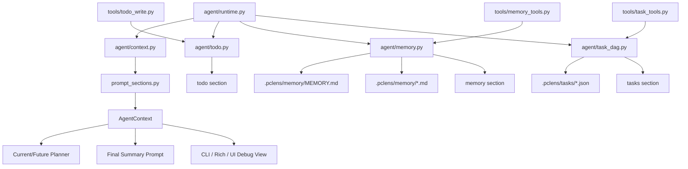
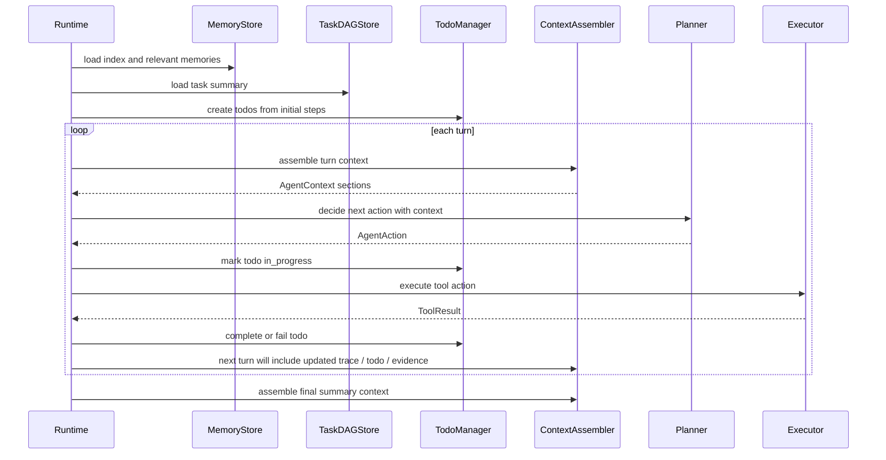

# V1.0-B 开发记录：Context / Memory / Todo / Task 统一

> 所属版本：PyCode V1.0  
> 阶段编号：V1.0-B  
> 创建日期：2026-07-13  
> 当前状态：开发前规划  
> 依据文档：`docs_v1.0/v1.0_roadmap.md`、`docs_v1.0/v1.0_develop_requirements.md`、`CCLearning NO.1-6`

## 1. 开发前：本阶段主要目标和目标效果

V1.0-A 已经把 PyCode Agent 的主执行语义从 `plan-and-execute` 推进到规则版 `observe-decide-act` loop。V1.0-B 的任务不是继续扩大工具数量，而是把每轮 loop 会看到、会更新、会持久化的状态统一起来。

本阶段关注四类状态：

```text
Context：Agent 每轮可见的信息入口。
Todo：单次 Agent run 内的执行进度。
Memory：跨运行保存的项目级知识。
Task DAG：跨会话保存的任务依赖与恢复状态。
```

V1.0-B 的核心目标是：

```text
让 Context Builder 成为 Agent 可见信息的唯一组装入口，并让 Memory、Todo、Task DAG 都以可审查、可追踪、可恢复的方式进入 Agent loop。
```

当前代码已经具备基础能力：

- `pycode/agent/context.py` 已有 `ContextSection`、`AgentContext`、`ContextAssembler`。
- `pycode/agent/prompt_sections.py` 已有 identity、tools、policy、project、plan、tool results、trace、todo、tasks、memory 等 section。
- `pycode/agent/todo.py` 已有 `TodoItem`、`TodoList`、`TodoManager` 和 pending / in_progress / completed / failed 状态。
- `pycode/agent/memory.py` 已有 Markdown memory 存储、索引、搜索、相关 memory 选择和提取。
- `pycode/agent/task_dag.py` 已有 `.pclens/tasks/*.json` 任务存储、依赖阻塞、claim、complete。
- `pycode/tools/todo_write.py`、`memory_tools.py`、`task_tools.py` 已把这些能力暴露为 Agent 工具。

但这些能力目前仍然偏“各自可用”。V1.0-B 要完成的是“统一语义”：

1. Context Builder 中心化
   - Agent prompt 不再由零散字符串拼接决定。
   - 每个 section 都有稳定的名称、来源、优先级、内容大小、注入位置和 included / skipped reason。
   - 不存在的数据不注入；被跳过的数据要能在 debug 视图中解释原因。
   - Context 支持按 turn 组装，让后续 V1.0-C 的 LLM next-action planner 知道每轮看到了什么。

2. Todo 与 plan step / loop observation 一致
   - 初始 `AgentStep` 继续生成 todo。
   - 每轮 tool action 执行前后自动推动 todo 状态。
   - `todo_write` 工具更新与 runtime 自动更新遵守同一套状态机。
   - 同一时间最多一个 `in_progress`。
   - 工具失败时 todo 保留失败原因，并能进入 context / trace / UI。

3. Memory 注入策略稳定
   - Memory 用于项目级长期知识，不保存所有聊天流水。
   - Memory index 可作为摘要进入 context；正文只按任务相关性注入。
   - Memory 类型、frontmatter、置信度、来源、关联文件要稳定。
   - 当前代码事实优先于历史 memory；低置信度或可能过期的 memory 需要标注。
   - LLM 选择 memory 失败时，可以使用规则检索降级，但降级原因要进入 `MemoryRunInfo` 和 trace。

4. Task DAG schema 稳定
   - Task DAG 表达跨会话、带依赖的任务恢复，不替代完整项目管理系统。
   - 任务 schema 要有版本号，方便后续演进。
   - 依赖不存在、循环依赖、重复 id、非法状态转换需要有明确错误。
   - `complete_task` 继续返回 newly ready tasks，服务后续任务恢复展示。
   - Task DAG 可以进入 context，让 Agent 知道跨会话任务状态。

5. CLI / Rich / UI 展示保持可审查
   - CLI 的 `--show-context` 能展示本轮 context sections。
   - Rich 输出继续展示 todo、memory、trace。
   - Streamlit UI 的 memory / tasks 视图能读懂稳定 schema。
   - 展示层不夸大能力，只展示已有状态、证据和边界。

### 1.1 本阶段完成后的理想运行语义

V1.0-B 完成后，单次 Agent run 的状态流应接近：

```text
用户任务
-> runtime 生成 initial steps
-> TodoManager.from_steps(steps)
-> MemoryStore 读取 MEMORY index
-> 选择相关 memory 正文
-> TaskDAGStore 读取跨会话任务摘要
-> 每轮 loop：
   -> ContextAssembler.for_turn(...)
   -> 输出 identity / tools / policy / project / evidence / trace / todo / tasks / memory / response_contract
   -> planner 基于 context 决策
   -> runtime 执行 tool action
   -> observation 更新 todo / trace / evidence
   -> 下一轮重新组装 context
-> final summary 使用同一套 context section
```

其中最关键的变化是：

```text
Context 不再只是最终总结前的一次汇总，而是每轮 Agent 决策前的可审查输入。
```

### 1.2 本阶段边界

V1.0-B 要做：

- 稳定 Context / Memory / Todo / Task 的数据模型和组装规则。
- 更新相关工具、测试和展示。
- 为 V1.0-C 的 LLM next-action planner 提供可用 context contract。

V1.0-B 暂不做：

- 不实现完整 LLM next-action planner，留到 V1.0-C。
- 不实现完整多 Agent 团队。
- 不实现后台 worker 或异步任务调度。
- 不接真实 MCP server。
- 不开放自动代码修改或自动 git 提交。

## 2. 开发前：文件级工作拆解

### 2.1 `pycode/agent/context.py`

当前现状：

- 已有 `ContextSection`，字段包括 `name`、`title`、`source`、`placement`、`content`、`metadata`。
- 已有 `AgentContext`，可以导出 sections 和 warnings。
- 已有 `ContextAssembler`，能组装 identity、tools、policy、project、output_rules、plan、tool_results、retrieval_evidence、trace、todo、tasks、memory_index、relevant_memories。
- 当前 section 还缺少统一的优先级、大小估算、included / skipped reason、turn 维度等调试信息。

本阶段计划：

1. 扩展 `ContextSection`
   - 增加 `priority`。
   - 增加 `size_estimate` 或 `token_estimate`。
   - 增加 `included`。
   - 增加 `reason`，用于解释 included 或 skipped。
   - 增加 `turn_index` 或放入 metadata，标明该 section 属于哪一轮。

2. 明确 section placement
   - `system`：identity、tools、policy、response contract 等稳定规则。
   - `user`：user_task、retrieval、evidence、trace、todo、tasks、memory 正文等动态材料。

3. 增强 `AgentContext`
   - 提供稳定 debug 视图。
   - 区分 included sections 和 skipped sections。
   - `render_key()` 继续保持确定性，方便测试和缓存判断。

4. 增强 `ContextAssembler`
   - 支持按 turn 组装 context。
   - 支持从当前 loop 状态输入 observations / tool_results / todos / trace / tasks / memory。
   - 空数据不注入，但记录 skipped reason。
   - Task DAG 加载失败、Memory 加载失败等进入 warnings，而不是中断主流程。

设计要求：

- Context Builder 只负责组装和解释上下文，不执行工具、不修改 memory、不修改 task。
- 不引入复杂 token 预算系统；第一版可以用字符数或粗略 size estimate。
- 不做多套 context builder，避免 summary context、planner context、debug context 各自分叉。

### 2.2 `pycode/agent/prompt_sections.py`

当前现状：

- 已有多个 section 函数。
- `tools_section()` 来自 `pycode.tools.TOOLS`。
- `policy_section()` 已说明基础安全策略。
- `todo_section()`、`tasks_section()`、`memory_index_section()`、`relevant_memories_section()` 已可注入状态。
- 当前 section 名称还没有完全对齐 roadmap 中的标准 section 类型。

本阶段计划：

1. 固化标准 section 类型
   - `identity`
   - `tools`
   - `policy`
   - `project`
   - `user_task`
   - `retrieval`
   - `evidence`
   - `trace`
   - `todo`
   - `tasks`
   - `memory`
   - `response_contract`

2. 调整现有 section 语义
   - `output_rules` 可升级或归并为 `response_contract`。
   - `retrieval_evidence` 可归并到更通用的 `evidence`。
   - `plan` 可以保留，但要明确它是 initial plan，不等于当前事实。
   - `tool_results` 可以作为 evidence 来源之一。

3. 为每个 section 返回更完整 metadata
   - `priority`
   - `static`
   - `source`
   - `count`
   - `included_reason`
   - `skipped_reason`

4. 强化内容规则
   - 工具说明来自 ToolSpec。
   - Memory 正文必须带来源、类型、置信度和路径。
   - Task DAG 必须标明 blocked / ready 状态。
   - Todo 必须显示 failed error。
   - Evidence 必须尽量保留 file / graph / tool / memory / trace 来源。

设计要求：

- section 内容要给 LLM 看，也要给用户审查，所以不能只面向机器结构。
- 不把所有原始大数据塞进 prompt；大输出继续摘要化。
- 当前代码事实优先级高于 memory 和历史 task。

### 2.3 `pycode/agent/prompts.py`

当前现状：

- `build_agent_summary_context()` 是 `ContextAssembler` 的封装入口。
- `render_agent_prompt()` 使用 context sections 渲染 summary prompt。

本阶段计划：

1. 保持 `build_agent_summary_context()` 作为兼容入口。
2. 增加或调整为更通用的 context 构建入口，例如：
   - `build_agent_context(...)`
   - `build_agent_turn_context(...)`
   - `build_agent_summary_context(...)`
3. 保证 summary prompt 和后续 planner prompt 使用同一套 section contract。
4. `render_agent_prompt()` 不直接拼接外部状态，只消费 `AgentContext`。

设计要求：

- prompt 渲染层不负责选择 memory / tasks / todo。
- prompt 渲染层只负责把已组装的 section 变成最终文本。

### 2.4 `pycode/agent/todo.py`

当前现状：

- `TodoList.from_steps()` 已能从 `AgentStep` 创建稳定 todo id。
- `TodoManager` 已支持 `start()`、`complete()`、`fail()`、`set_status()`。
- 已限制同一时间最多一个 `in_progress`。
- 已阻止 completed todo 回退。

本阶段计划：

1. 稳定 Todo schema
   - `id`
   - `title`
   - `tool`
   - `reason`
   - `status`
   - `error`
   - `step_index`
   - `required`
   - 可选 `source`、`created_at`、`updated_at`

2. 强化 todo 与 step 的关系
   - 每个 plan step 必须有 `todo_id`。
   - runtime 执行 action 时能找到对应 todo。
   - final summary 能说明 todo 完成情况。

3. 统一状态转换
   - `pending -> in_progress -> completed`
   - `pending -> in_progress -> failed`
   - `pending -> failed` 可用于 policy denial 或预执行失败。
   - completed 不回退。

4. 增加 context 摘要能力
   - `TodoManager.summary()` 继续保留。
   - 可增加面向 context 的 compact summary。

设计要求：

- Todo 是单次 Agent run 内的执行清单，不跨会话持久化。
- 跨会话任务恢复交给 Task DAG。
- `todo_write` 工具不能破坏状态机。

### 2.5 `pycode/tools/todo_write.py`

当前现状：

- 支持 `list` 和 `set_status`。
- 依赖 runtime 注入 `ToolContext.state["todo_manager"]`。
- 缺少更明确的操作 schema 和 context/debug 输出约定。

本阶段计划：

1. 稳定工具输入 schema
   - `operation=list`
   - `operation=set_status`
   - `todo_id`
   - `status`
   - `error`

2. 保持工具只更新当前 run 内 todo
   - 不写 `.pclens/tasks`。
   - 不写 memory。

3. 强化失败输出
   - manager 不存在。
   - todo id 不存在。
   - 状态非法。
   - 单一 in_progress 约束冲突。

4. 确保所有结果可作为 observation 进入 trace / context。

设计要求：

- `todo_write` 是 internal state tool，不是跨会话任务工具。
- 它必须继续经过 policy。

### 2.6 `pycode/agent/memory.py`

当前现状：

- `MemoryStore` 使用 `.pclens/memory/*.md` 和 `MEMORY.md`。
- 当前 `MemoryType` 为 `user`、`feedback`、`project`、`reference`。
- `MemoryItem` 包含 `name`、`type`、`description`、`body`、`tags`、`source`、`created_at`、`updated_at`、`path`。
- roadmap 要求的目标类型是 `project`、`workflow`、`analysis`、`preference`、`limitation`，frontmatter 也更偏 `id`、`title`、`confidence`、`related_files`。

本阶段计划：

1. 统一 Memory 类型
   - 以 roadmap 为准，固化为：
     - `project`
     - `workflow`
     - `analysis`
     - `preference`
     - `limitation`
   - 不长期保留两套 taxonomy，避免兼容代码膨胀。
   - 如需迁移当前测试和示例，应一次性更新到新类型。

2. 稳定 Memory frontmatter
   - `id`
   - `type`
   - `title`
   - `summary` 或 `description`
   - `created_at`
   - `updated_at`
   - `source`
   - `confidence`
   - `related_files`
   - `tags`

3. 强化注入策略
   - index 摘要可以常规注入。
   - 正文只注入相关 memory。
   - 最多注入数量继续受 `MAX_RELEVANT_MEMORIES` 限制。
   - LLM 选择失败时使用规则搜索降级，并记录 selection_error。
   - memory 正文必须标注来源和置信度。

4. 强化写入策略
   - Agent 不默认保存所有对话。
   - 只保存长期有效、可复用的项目知识、工作流、分析结论、偏好或限制。
   - 去重逻辑继续保留，但要适配新 schema。

5. 强化路径安全
   - Memory 文件仍只能写入项目 `.pclens/memory`。
   - 文件名 / id 继续校验，禁止路径逃逸。

设计要求：

- Memory 是可审查项目知识库，不是聊天记录缓存。
- 当前代码事实优先于 memory。
- 低置信度或可能过期 memory 不能无提示地覆盖工具证据。

### 2.7 `pycode/tools/memory_tools.py`

当前现状：

- 支持 `add`、`list`、`search`、`load`、`rebuild`。
- 写入 `.pclens/memory`。
- 返回 evidence 指向 memory 文件路径。

本阶段计划：

1. 更新工具参数到新 Memory schema
   - `name` 可调整为 `id` 或保留为输入别名，但内部 schema 应统一。
   - `memory_type` 使用新类型。
   - 增加 `title`、`confidence`、`related_files`。

2. 稳定工具输出
   - 所有操作返回 `storage_dir`。
   - `add` / `load` / `search` 返回可作为 evidence 的 memory refs。
   - 参数错误返回结构化 failure。

3. 明确写入边界
   - `memory` 工具可以写内部 memory state。
   - 不修改代码文件。
   - 不写项目根目录任意位置。

设计要求：

- 工具层只负责 memory 操作，不负责判断哪些 memory 应注入 prompt。
- 注入策略仍由 context / runtime 控制。

### 2.8 `pycode/agent/task_dag.py`

当前现状：

- `TaskNode` 包含 `id`、`title`、`description`、`status`、`owner`、`blocked_by`、时间戳和 metadata。
- 支持 `pending -> in_progress -> completed`。
- 支持 missing dependencies 作为 blocking。
- `complete_task()` 返回 newly ready downstream tasks。
- 当前没有 schema version，没有循环依赖检测。

本阶段计划：

1. 稳定 Task schema
   - `schema_version`
   - `id`
   - `title`
   - `description`
   - `status`
   - `owner`
   - `blocked_by`
   - `created_at`
   - `updated_at`
   - `source`
   - `run_id`
   - `parent_run_id`
   - `metadata`

2. 强化依赖校验
   - missing dependency 明确阻塞。
   - 循环依赖明确报错。
   - 重复 task id 明确报错。
   - task id 继续禁止路径逃逸。

3. 强化状态机
   - completed 不可 claim。
   - in_progress 不可重复 claim。
   - pending 且 blocked 不可 claim。
   - complete 必须从 in_progress 进入。

4. Context 摘要
   - 列出 pending / in_progress / completed 数量。
   - 标明 blocked_by 和 missing dependencies。
   - 标明 newly ready tasks。

设计要求：

- Task DAG 负责跨会话任务恢复，不负责后台执行。
- 不做并发锁和 worker。
- metadata 预留 multi-agent / async 字段，但不实现调度。

### 2.9 `pycode/tools/task_tools.py`

当前现状：

- 支持 `create`、`list`、`get`、`claim`、`complete`。
- 写入 `.pclens/tasks`。
- 支持 blocked_by 字符串或列表输入。

本阶段计划：

1. 更新工具输出以匹配新 Task schema。
2. `create` 支持 `source`、`run_id`、`parent_run_id` 等 metadata。
3. `get` 返回 `can_start`、`blocked_by`、`missing_dependencies`。
4. `complete` 返回 `ready_tasks`。
5. 所有失败原因保持结构化。

设计要求：

- `task_dag` 工具是跨会话 state tool，不等于当前 run todo。
- 不允许任务工具绕过项目内路径约束。

### 2.10 `pycode/agent/runtime.py`

当前现状：

- V1.0-A 已经引入 observe-decide-act loop。
- runtime 已在启动时准备 memory context、todo manager，并在工具执行前后更新 todo。
- context 当前主要在 plan-only 和最终 summary 前构建，loop 内 context 仍需进一步中心化。

本阶段计划：

1. 每轮 loop 构建 turn context
   - 传入 task、steps、tool_results、trace、todos、memory、tasks。
   - trace 记录 context assembled 事件或等价事件。

2. 统一 summary context 和 turn context
   - 不再让 summary 使用另一套隐式材料。
   - final answer 依据同一套 section contract。

3. 统一 memory / task loading 错误
   - 不因 memory 或 task 文件异常中断可继续分析的 Agent run。
   - 错误进入 warnings、trace 和 result。

4. 继续保持 V1.0-A 的 loop 语义
   - 本阶段不重写 planner。
   - 本阶段不引入 LLM next-action 决策。

设计要求：

- runtime 编排状态流，但不直接实现 memory / task 业务细节。
- runtime 负责把 observation 更新反馈给 context builder。

### 2.11 `pycode/agent/types.py`

当前现状：

- `RuntimeConfig` 已包含 `enable_memory`、`enable_memory_extraction`。
- `AgentResult` 已包含 `todos`、`memory`、`context` 等字段。
- V1.0-A 已扩展 action / observation 相关类型。

本阶段计划：

1. 如 context section schema 扩展，需要同步更新类型导出。
2. `AgentResult` 中 context / warnings / errors 的表达要稳定。
3. 保证 `memory`、`todos`、`context` 仍能被 CLI、Rich、UI 使用。

设计要求：

- 不引入和 runtime 强绑定的大型状态对象，除非确实能降低复杂度。
- 类型扩展要服务可审查输出。

### 2.12 `pycode/agent/evidence.py`

当前现状：

- 已能从 result 中提取 memory 相关 evidence。
- Evidence 仍需更统一地覆盖 file、graph、tool、memory、trace。

本阶段计划：

1. 定义统一 evidence ref 格式。
2. 从 tool result、memory、task、trace 中提取来源。
3. Context 的 `evidence` section 使用统一 evidence refs。

设计要求：

- Evidence 是最终回答可信度的来源。
- Memory 可以作为 evidence，但优先级低于当前工具读取到的代码事实。

### 2.13 `pycode/cli.py`

当前现状：

- Agent 命令支持 `--no-memory`、`--no-memory-extract`、`--show-context`。
- Memory 子命令支持 add / list / search / load / rebuild。
- 当前没有独立 Task DAG CLI 子命令；Task DAG 主要通过工具和 UI 使用。

本阶段计划：

1. 更新 memory CLI 参数到新 Memory schema。
2. `--show-context` 展示 included / skipped sections 和 warnings。
3. 根据工作量决定是否新增 task CLI：
   - `task create`
   - `task list`
   - `task get`
   - `task claim`
   - `task complete`
4. Plain 输出保持可读。

设计要求：

- CLI 是审查入口，不只用于 demo。
- 不因为 UI 已有展示就忽略命令行可验证性。

### 2.14 `pycode/rich_output.py`

当前现状：

- 已能展示 runtime、todos、memory、context。
- V1.0-A 已兼容新 `AgentTurn` 类型。

本阶段计划：

1. Context 展示新增：
   - section name
   - source
   - placement
   - priority
   - included / skipped reason
   - size estimate

2. Todo 展示新增：
   - failed error 更突出。
   - 当前 in_progress 标记。

3. Memory 展示新增：
   - type
   - confidence
   - source
   - related_files
   - selection / extraction error。

4. Task DAG 展示新增：
   - blocked_by
   - missing dependencies
   - ready tasks。

设计要求：

- Rich 输出要服务调试，不要只追求漂亮。
- 大内容继续摘要，避免终端输出过载。

### 2.15 `ui/data_loader.py`、`ui/components.py`、`ui/streamlit_app.py`

当前现状：

- Streamlit UI 能展示 memory 和 tasks。
- Agent run 面板能展示 context、todo、memory summary。

本阶段计划：

1. 更新 UI data loader 适配 Memory / Task 新 schema。
2. Memory 表格展示新类型、置信度、关联文件。
3. Task 表格展示 schema version、blocked / ready 状态。
4. Agent result 中的 context debug 视图支持新 section metadata。

设计要求：

- UI 只展示真实 state，不制造不存在的能力。
- V1.0-B 不做完整 Web IDE。

### 2.16 测试文件

本阶段预计新增或扩展测试：

- `tests/test_agent_context.py`
  - section contract 包含 priority / size / included reason。
  - 空数据 section 被跳过且 debug 可解释。
  - turn context 输出确定。

- `tests/test_agent_prompt_sections.py`
  - 标准 section 名称稳定。
  - tools / policy / todo / tasks / memory / evidence section 内容符合 contract。

- `tests/test_agent_todo.py`
  - 状态机覆盖 pending / in_progress / completed / failed。
  - 单一 in_progress 约束。
  - step 与 todo_id 对齐。

- `tests/test_tools_todo_write.py`
  - 工具更新不破坏状态机。
  - 缺少 runtime manager 时返回 failure。

- `tests/test_agent_memory.py`
  - 新 Memory 类型和 frontmatter。
  - index rebuild。
  - relevant memory selection fallback。
  - 低置信度 / related_files 输出。

- `tests/test_tools_memory_tools.py`
  - add / list / search / load / rebuild 适配新 schema。
  - 路径限制。
  - 参数错误。

- `tests/test_agent_task_dag.py`
  - schema_version。
  - missing dependency。
  - cycle detection。
  - duplicate id。
  - status transition。

- `tests/test_tools_task_tools.py`
  - task tool create / list / get / claim / complete。
  - blocked claim。
  - ready tasks。

- `tests/test_agent_runtime.py`
  - loop 每轮 context 组装。
  - todo / memory / task 进入 result。
  - memory / task 加载失败不会破坏可继续运行的只读分析。

- `tests/test_rich_output.py`
  - 新 context metadata、memory、task 输出不崩溃。

## 3. 开发前：为什么要做这些修改

### 3.1 依据一：CCLearning NO.2 的 TodoWrite 与上下文漂移治理

`CCLearning NO.2` 的核心启发是：复杂任务中，Agent 很容易因为工具结果、用户目标和中间判断不断增加而丢失当前进度。TodoWrite 的价值不是“列一个好看的任务清单”，而是让 Agent 和用户都能看到：

- 当前正在做什么。
- 哪些步骤已完成。
- 哪些步骤失败。
- 是否还有未处理事项。

V1.0-A 已经有 loop 和 observation。V1.0-B 必须让 todo 成为 loop 进度的一等状态：

```text
plan step -> todo item -> tool action -> observation -> todo status -> context
```

如果 todo 与 step、tool result 脱节，后续 LLM planner 即使能看到 context，也无法稳定判断“下一步是否还需要继续”。因此 V1.0-B 要强化 todo 的状态机和 context 注入。

### 3.2 依据二：CCLearning NO.3 的 Memory 与 Prompt Section 组装

`CCLearning NO.3` 强调 Memory 不能无差别注入。长期记忆如果全部塞进 prompt，会带来两个问题：

- token 浪费。
- 过期或低质量 memory 污染当前判断。

因此 PyCode 的 memory 应该采用分层策略：

```text
MEMORY index：可摘要注入。
Memory body：按任务相关性选择后注入。
Memory source / confidence / related_files：必须可审查。
```

同时，prompt 不应该由散落在 runtime、planner、summary 中的字符串拼接组成，而应该由 context section pipeline 统一管理。这样每个 section 都能回答：

- 它来自哪里？
- 为什么被注入？
- 为什么被跳过？
- 它的优先级是多少？
- 它对最终回答有什么证据价值？

这就是 V1.0-B 要把 Context Builder 中心化的理由。

### 3.3 依据三：CCLearning NO.4 的 Task DAG 与跨会话恢复

`CCLearning NO.4` 区分了 Todo 和 Task DAG：

```text
Todo：单次运行内的扁平进度。
Task DAG：跨会话、带依赖的任务网络。
```

这对 PyCode 很重要。一次 Agent run 可以回答“这次分析做到了哪一步”，但真实开发任务常常跨越多次会话：

- 先补索引。
- 再分析入口。
- 再做影响分析。
- 再补测试覆盖。
- 最后整理报告。

这些跨会话依赖不应该塞进单次 todo，也不应该只靠聊天历史保存。Task DAG 用 `.pclens/tasks/*.json` 保存轻量任务状态，正好服务 V1.0 的“可恢复任务”目标。

因此 V1.0-B 要稳定 Task DAG schema、依赖校验和 context 注入，为后续真实场景验收打基础。

### 3.4 依据四：CCLearning NO.1 的 loop 需要每轮可审查 context

V1.0-A 完成了规则版 observe-decide-act loop，但 loop 的质量取决于每轮决策能看到什么。

如果每轮 context 不稳定，V1.0-C 的 LLM next-action planner 会遇到直接风险：

- 看不到最新 observation。
- 看不到失败 todo。
- 看不到 memory 选择来源。
- 看不到 task blocking 状态。
- 看不到 trace 中的权限拒绝。

所以 V1.0-B 是 V1.0-C 的前置条件。先把 context contract 做稳，后续 LLM planner 才能基于同一套材料输出结构化 action。

### 3.5 依据五：CCLearning NO.6 的工具描述与动态上下文

`CCLearning NO.6` 讲 MCP 和动态工具池，但 V1.0-B 不接真实 MCP。对本阶段有价值的是另一个原则：

```text
模型看到的工具说明、executor 调用的工具、policy 判断的工具，必须来自同一套 ToolSpec / registry 语义。
```

V1.0-A 已经扩展 ToolSpec。V1.0-B 要让 Context Builder 中的 `tools` section 更稳定地消费 ToolSpec，并把工具权限、写状态能力、测试权限等信息清楚展示给 planner / LLM / 用户。

这一步不是为了炫技，而是为了减少“prompt 说能做”和“executor 实际能做”不一致的风险。

### 3.6 依据六：为什么要统一 Memory 类型与 schema

当前 `MemoryType` 使用 `user`、`feedback`、`project`、`reference`，而 V1.0 roadmap 明确提出 `project`、`workflow`、`analysis`、`preference`、`limitation`。如果长期保留两套类型，会产生大量兼容分支：

- CLI 要支持两套类型。
- 工具要支持两套类型。
- memory extraction prompt 要解释两套类型。
- context 注入要解释两套类型。
- 测试要覆盖两套类型。

这违反开发要求中“尽可能减少兜底、兼容代码”的原则。因此 V1.0-B 应以 V1.0 roadmap 为准，统一到新类型，并同步更新测试和文档。

类型含义建议：

- `project`：项目结构、入口、模块职责等长期事实。
- `workflow`：常用命令、分析流程、项目操作约定。
- `analysis`：可复用的分析结论，例如某模块影响范围。
- `preference`：用户偏好的输出方式或协作方式。
- `limitation`：项目限制、已知风险、不能做的事。

### 3.7 依据七：为什么不把 Task DAG 做成后台任务系统

`CCLearning NO.4` 中后台任务很有价值，但后台 worker 会引入：

- 并发 claim。
- 取消。
- 进度通知。
- 长任务恢复。
- 锁与竞争。

这些不是 V1.0-B 的主线。V1.0-B 只需要把 Task DAG 作为可恢复状态存储：

```text
create / list / get / claim / complete
依赖阻塞
完成后释放下游任务
进入 context 和 UI
```

这样既满足 V1.0 的“可恢复任务”目标，又不把项目拖入复杂后台调度系统。

### 3.8 本阶段核心关系图



### 3.9 V1.0-B 内部执行流程图



### 3.10 本阶段完成标准

V1.0-B 完成后，至少应满足：

1. Context section contract 稳定包含 name、source、placement、priority、content、metadata、size estimate、included / skipped reason。
2. `ContextAssembler` 能按当前 run / turn 状态组装 context。
3. `--show-context` 能审查 included / skipped sections 和 warnings。
4. Todo 与 initial steps、runtime tool action、tool observation 保持一致。
5. `todo_write` 不能破坏 Todo 状态机。
6. Memory 类型和 frontmatter 与 V1.0 roadmap 对齐。
7. Memory index 与正文分层注入，正文只按相关性进入 context。
8. Memory selection / extraction 错误可见，不静默失败。
9. Task DAG 包含 schema version，并能处理 missing dependency、blocked claim、完成后释放下游任务。
10. Task DAG context 能展示 blocked / ready 状态。
11. CLI / Rich / UI 能展示 Memory、Todo、Task、Context 的核心状态。
12. 测试覆盖 context、todo、memory、task tools、runtime integration 的关键路径。

## 4. 开发中纪要

> 本区域用于 V1.0-B 开发过程中持续追加记录。每完成或修改一块内容时，记录本次动作、影响文件和验证方式。

### 2026-07-13：Context section contract 扩展

- 修改 `pycode/agent/context.py`、`pycode/agent/prompt_sections.py`、`pycode/agent/prompts.py`。
- 为 `ContextSection` 增加 `priority`、`size_estimate`、`included`、`reason`。
- 为 `AgentContext` 增加 `skipped_sections` 和 `debug_dict()`。
- 将 `output_rules` 统一为 `response_contract`，将 `retrieval_evidence` 统一为 `evidence`。
- `ContextAssembler` 现在会记录 skipped sections，空数据不注入正文但保留跳过原因。
- `render_agent_prompt()` 会输出 section metadata，便于审查和后续 V1.0-C planner 使用。

建议用户运行：

```powershell
.\.venv\Scripts\python.exe -m pytest tests\test_agent_context.py tests\test_agent_prompt_sections.py --basetemp=.pytest_tmp_v1b_context -o cache_dir=.pytest_tmp_v1b_context\.pytest_cache
```

### 2026-07-13：Todo schema 补充 source / timestamp

- 修改 `pycode/agent/todo.py` 和相关测试。
- `TodoItem` 增加 `source`、`created_at`、`updated_at`。
- 状态变更时自动刷新 `updated_at`。
- 保持单一 `in_progress` 约束，保留 completed 不回退规则。
- 保留 `pending -> failed`，用于 policy denial 或预执行失败。

建议用户运行：

```powershell
.\.venv\Scripts\python.exe -m pytest tests\test_agent_todo.py tests\test_tools_todo_write.py --basetemp=.pytest_tmp_v1b_todo -o cache_dir=.pytest_tmp_v1b_todo\.pytest_cache
```

### 2026-07-13：Memory schema 统一到 V1.0 五类

- 修改 `pycode/agent/memory.py`、`pycode/tools/memory_tools.py`、`pycode/tools/__init__.py`、`pycode/agent/llm_planner.py`、`pycode/cli.py`。
- Memory 类型统一为 `project`、`workflow`、`analysis`、`preference`、`limitation`。
- Memory frontmatter 和工具输出统一为 `id`、`type`、`title`、`summary`、`body`、`created_at`、`updated_at`、`source`、`confidence`、`related_files`、`tags`。
- `memory` 工具参数更新为 `id`、`title`、`summary`、`confidence`、`related_files`。
- LLM memory selection / extraction prompt 同步到新 schema。
- 按开发要求，不保留旧 memory 类型的长期兼容分支。

建议用户运行：

```powershell
.\.venv\Scripts\python.exe -m pytest tests\test_agent_memory.py tests\test_tools_memory_tools.py --basetemp=.pytest_tmp_v1b_memory -o cache_dir=.pytest_tmp_v1b_memory\.pytest_cache
```

### 2026-07-13：Task DAG schema 增加版本与 lineage 字段

- 修改 `pycode/agent/task_dag.py`、`pycode/tools/task_tools.py`、`pycode/tools/__init__.py`。
- `TaskNode` 增加 `schema_version`、`source`、`run_id`、`parent_run_id`。
- `TaskDAGStore.create_task()` 支持写入这些字段。
- 增加循环依赖检测。
- Context / UI 加载 task 时即时计算 `can_start`、`active_blocks`、`missing_dependencies`。

建议用户运行：

```powershell
.\.venv\Scripts\python.exe -m pytest tests\test_agent_task_dag.py tests\test_tools_task_tools.py --basetemp=.pytest_tmp_v1b_tasks -o cache_dir=.pytest_tmp_v1b_tasks\.pytest_cache
```

### 2026-07-13：Runtime 接入 turn-level context

- 修改 `pycode/agent/runtime.py`。
- 每轮 loop 开始后构建当前 turn context。
- trace 中新增 `ContextAssembled` 事件，记录 included / skipped sections、warnings 和 size metadata。
- 本阶段仍保持规则版 next-action planner，不实现 LLM-driven next-action。

建议用户运行：

```powershell
.\.venv\Scripts\python.exe -m pytest tests\test_agent_runtime.py tests\test_rich_output.py --basetemp=.pytest_tmp_v1b_runtime -o cache_dir=.pytest_tmp_v1b_runtime\.pytest_cache
```

### 2026-07-13：CLI / Rich / UI 展示适配 V1.0-B schema

- 修改 `pycode/cli.py`、`pycode/rich_output.py`、`ui/data_loader.py`、`ui/components.py`。
- `--show-context` 展示 priority、included、reason、size_estimate 和 skipped sections。
- Memory CLI 使用 `--id`、`--title`、`--summary`、`--confidence`、`--related-file`。
- Task CLI 保留 create / list / get / claim / complete，并增加 `--source`、`--run-id`、`--parent-run-id`。
- Rich / UI 展示 Memory confidence / related_files 和 Task schema / dependency 状态。

建议用户运行：

```powershell
.\.venv\Scripts\python.exe -m pytest tests\test_cli.py tests\test_ui_data_loader.py --basetemp=.pytest_tmp_v1b_cli_ui -o cache_dir=.pytest_tmp_v1b_cli_ui\.pytest_cache
```

## 5. 开发中问题记录

> 本区域用于记录 V1.0-B 开发过程中遇到的报错、设计冲突、依赖问题和解决方式。

### 2026-07-13：Memory 旧类型与 roadmap 类型冲突

问题：

- 原实现使用 `user`、`feedback`、`project`、`reference`。
- V1.0 roadmap 要求使用 `project`、`workflow`、`analysis`、`preference`、`limitation`。
- 如果同时保留两套类型，会让 CLI、工具、prompt、测试都长期带兼容分支。

处理：

- 以 V1.0 roadmap 为准，统一到五类新类型。
- 同步修改 MemoryStore、memory tool、CLI、LLM prompt、UI 和测试。
- 不保留旧 memory 类型兼容层。

### 2026-07-13：Context section 旧名称与标准名称冲突

问题：

- 原实现已有 `output_rules`、`retrieval_evidence`、`relevant_memories`。
- V1.0-B 计划要求标准 section 使用 `response_contract`、`evidence`、`memory`。

处理：

- 渲染出来的 section 名称统一为 `response_contract`、`evidence`、`memory`。
- 保留少量旧函数名作为内部函数入口，但函数返回的新 section 名称已收敛到 V1.0-B 标准。

### 2026-07-13：Task 依赖状态不应持久依赖派生字段

问题：

- `can_start`、`active_blocks`、`missing_dependencies` 是派生状态。
- 如果直接依赖任务 JSON 内缓存，容易和真实依赖状态不一致。

处理：

- Task 文件保存 schema / lineage 等稳定字段。
- Context / UI 加载任务时即时调用 `TaskDAGStore.can_start()` 计算派生依赖状态。

## 6. 开发后总结

> 本区域在 V1.0-B 开发完成后补充：实际完成内容、完成情况、未完成事项和后续可改进点。

### 2026-07-13：V1.0-B 开发后总结

本阶段已完成 Context / Memory / Todo / Task 的统一升级：

- Context：
  - section contract 增加 priority、size_estimate、included、reason。
  - AgentContext 增加 skipped sections 和 debug dict。
  - runtime 每轮生成 turn context，并写入 `ContextAssembled` trace 事件。

- Todo：
  - TodoItem 增加 source、created_at、updated_at。
  - 状态转换继续由 TodoManager 统一管理。

- Memory：
  - 类型统一为 `project / workflow / analysis / preference / limitation`。
  - frontmatter 和工具输出统一为新 schema。
  - memory selection / extraction prompt 已更新。
  - CLI / UI / Rich 已适配新字段。

- Task DAG：
  - TaskNode 增加 schema_version、source、run_id、parent_run_id。
  - 增加循环依赖检测。
  - Context / UI 可展示 can_start、active_blocks、missing_dependencies。

- 展示层：
  - CLI `--show-context` 展示 section metadata。
  - Rich 和 Streamlit UI 展示 Memory / Task 新字段。

当前仍保留到后续阶段的内容：

- 未实现 LLM-driven next-action planner，留到 V1.0-C。
- 未实现后台 worker、并发 claim 锁或自动任务调度。
- 未实现真实 MCP。
- 未开放自动代码修改或 git 提交。

按用户要求，本次开发未运行测试命令。

## 7. V1.0-B 功能运行方法

> 本区域在 V1.0-B 开发完成后补充：本阶段各项功能或测试的具体运行方法。

按用户要求，Codex 不运行测试。请用户自行运行以下命令。

Context / Prompt Sections：

```powershell
.\.venv\Scripts\python.exe -m pytest tests\test_agent_context.py tests\test_agent_prompt_sections.py --basetemp=.pytest_tmp_v1b_context -o cache_dir=.pytest_tmp_v1b_context\.pytest_cache
```

Todo / Todo Tool：

```powershell
.\.venv\Scripts\python.exe -m pytest tests\test_agent_todo.py tests\test_tools_todo_write.py --basetemp=.pytest_tmp_v1b_todo -o cache_dir=.pytest_tmp_v1b_todo\.pytest_cache
```

Memory / Memory Tool：

```powershell
.\.venv\Scripts\python.exe -m pytest tests\test_agent_memory.py tests\test_tools_memory_tools.py --basetemp=.pytest_tmp_v1b_memory -o cache_dir=.pytest_tmp_v1b_memory\.pytest_cache
```

Task DAG / Task Tool：

```powershell
.\.venv\Scripts\python.exe -m pytest tests\test_agent_task_dag.py tests\test_tools_task_tools.py --basetemp=.pytest_tmp_v1b_tasks -o cache_dir=.pytest_tmp_v1b_tasks\.pytest_cache
```

Runtime / Rich 输出：

```powershell
.\.venv\Scripts\python.exe -m pytest tests\test_agent_runtime.py tests\test_rich_output.py --basetemp=.pytest_tmp_v1b_runtime -o cache_dir=.pytest_tmp_v1b_runtime\.pytest_cache
```

CLI / UI data loader：

```powershell
.\.venv\Scripts\python.exe -m pytest tests\test_cli.py tests\test_ui_data_loader.py --basetemp=.pytest_tmp_v1b_cli_ui -o cache_dir=.pytest_tmp_v1b_cli_ui\.pytest_cache
```

完整回归：

```powershell
.\.venv\Scripts\python.exe -m pytest tests --basetemp=.pytest_tmp_v1b_full -o cache_dir=.pytest_tmp_v1b_full\.pytest_cache
```

手动验收：

```powershell
.\.venv\Scripts\python.exe -m pycode.cli agent .\examples\demo_project "这个项目的入口在哪里？" --show-context --rule-plan
```

```powershell
.\.venv\Scripts\python.exe -m pycode.cli memory .\examples\demo_project list
```

```powershell
.\.venv\Scripts\python.exe -m pycode.cli task .\examples\demo_project list
```
