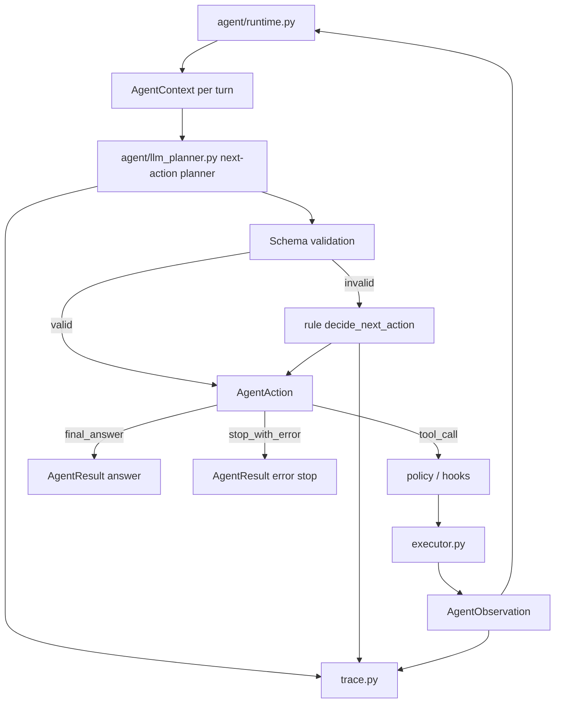

# V1.0-C 开发记录：Planner 与错误恢复

> 所属版本：PyCode V1.0  
> 阶段编号：V1.0-C  
> 创建日期：2026-07-13  
> 当前状态：开发前规划  
> 依据文档：`docs_v1.0/v1.0_roadmap.md`、`docs_v1.0/v1.0_develop_requirements.md`、`CCLearning NO.1-6`

## 1. 开发前：本阶段主要目标和目标效果

V1.0-A 已经把 PyCode Agent 的主执行路径从一次性 `plan-and-execute` 推进为规则版 `observe-decide-act` loop。V1.0-B 已经把 Context / Memory / Todo / Task DAG 接入到可审查的 turn-level context 中。V1.0-C 是前两阶段真正合流的关键阶段：让 LLM 不再只负责初始计划或最终总结，而是参与每一轮 next action 决策。

本阶段的核心目标是：

```text
实现 LLM-driven next-action planner，让 LLM 基于当前 context / evidence / trace / todo / tool results 决定下一步工具调用、继续、终止或错误停止。
```

本阶段完成后，Agent loop 的理想语义应接近：

```text
user task
-> runtime 初始化 state
-> turn 1:
   -> build turn context
   -> LLM planner 输出结构化 action
   -> 校验 action schema
   -> policy check
   -> execute tool 或 final / stop
   -> observe result
-> turn 2:
   -> 使用最新 context / trace / todo / evidence 再次请求 LLM 决策
   -> ...
-> LLM planner 输出 final_answer 或 stop_with_error
-> runtime 生成 AgentResult
```

本阶段要达到的效果：

1. LLM planner 真正参与每轮 next-action 决策
   - 不再只生成初始 `AgentStep` 列表。
   - 每轮都读取当前 `AgentContext`。
   - 每轮都可以选择 `tool_call`、`final_answer`、`stop_with_error` 或 `no_op`。
   - 每轮都必须给出 `reason`，便于 trace 和 UI 审查。

2. next-action schema 稳定可校验
   - 明确定义 LLM 输出 JSON schema。
   - 工具名必须来自已注册 `ToolSpec`。
   - 工具参数必须通过 `validate_tool_arguments()`。
   - `run_tests` 必须继续受 `allow_tests` 和 policy 约束。
   - 非法 schema 不直接崩溃，而是进入可解释的错误恢复路径。

3. 规则 planner 成为稳定 fallback，而不是主要判断方式
   - 默认路径在启用 LLM 且提供 `llm_client` 时使用 LLM next-action planner。
   - LLM 缺失、配置错误、返回非法 JSON、schema 校验失败、工具名非法、参数非法时，runtime 可以降级到规则版 `decide_next_action()`。
   - fallback 原因必须进入 trace、`AgentResult.planner_error` 或等价字段。

4. final_answer 由 loop 决策产生
   - LLM 可以在证据足够时直接输出 `final_answer`。
   - final answer 需要说明依据和已收集证据。
   - 当 LLM 输出 final action 后，runtime 不应继续机械执行初始 steps。
   - 如果 LLM 未返回最终正文，但选择 final action，runtime 可以用已有 summary prompt 补全最终回答。

5. stop_with_error 可恢复、可审查
   - LLM 可以在无法继续时显式输出 `stop_with_error`。
   - 工具连续失败、权限拒绝、证据不足且无可用工具时，应有清晰停止语义。
   - 错误必须进入 trace，不允许静默失败。

6. LLM client 错误分类
   - 缺少配置、鉴权失败、限流、超时、无效响应、schema parse failed 等错误应分类。
   - 分类结果进入 trace 和 planner fallback 信息。
   - 不要求本阶段实现复杂重试系统，但需要让错误足够可诊断。

7. 保持离线演示路径
   - `--rule-plan` 或未提供 LLM 时，规则版 loop 仍可运行。
   - V1.0-C 的成功不是移除规则 planner，而是把它从主判断方式调整为 fallback。
   - 离线演示仍能展示 loop turns、context、todo、trace。

### 1.1 本阶段边界

V1.0-C 要做：

- 定义并实现 LLM next-action schema。
- 实现 `plan_next_action_with_llm()` 或等价接口。
- runtime 每轮可选择 LLM next-action planner。
- LLM action schema 校验和 fallback。
- LLM client 错误分类。
- 工具错误、LLM 错误、schema 错误进入 trace。
- 测试覆盖 LLM next-action、fallback、runtime integration、错误分类。

V1.0-C 暂不做：

- 不开放自动代码写入。
- 不自动 git commit / reset / push。
- 不实现完整多 Agent 团队。
- 不接真实 MCP server。
- 不做后台 worker 或异步任务调度。
- 不把规则 planner 删除。
- 不让 LLM 绕过 `ToolSpec`、policy、executor、trace。

## 2. 开发前：文件级工作拆解

### 2.1 `pycode/agent/types.py`

当前现状：

- 已有 `AgentActionType`：`tool_call`、`final_answer`、`stop_with_error`、`no_op`。
- 已有 `AgentAction`、`ToolCall`、`AgentObservation`、`AgentTurn`、`AgentResult`。
- 当前 `AgentResult.planner_source` 和 `planner_error` 仍偏向初始计划阶段语义。

本阶段计划：

1. 复用现有 `AgentAction` 作为 LLM next-action 输出的内部表示。
2. 视实现需要补充 planner 决策元数据，例如：
   - `planner_source`
   - `raw_response`
   - `schema_error`
   - `fallback_used`
3. 如果不扩展 `AgentAction`，则在 `LLMNextActionResult` 中保存这些调试信息，避免污染核心 action 类型。
4. 保持 `AgentActionType` 的枚举稳定，不新增不必要 action 类型。

设计要求：

- `AgentAction` 是 runtime 能理解的唯一行动结构。
- LLM schema 解析结果必须转换为 `AgentAction` 后再交给 runtime。
- 类型扩展要兼容 A/B 阶段已有测试。

### 2.2 `pycode/agent/llm_planner.py`

当前现状：

- 已有 `plan_task_with_llm()`，用于 LLM 生成初始 `AgentStep` 列表。
- 已有 `build_llm_planner_prompt()` 和 `parse_llm_plan()`。
- 当前 LLM planner prompt 要求返回 JSON array，对应初始计划，不是每轮 action。

本阶段计划：

1. 新增 next-action planner 结果类型
   - 建议命名为 `LLMNextActionResult`。
   - 字段建议：
     - `action: AgentAction`
     - `source`
     - `raw_response`
     - `error`
     - `warnings`

2. 新增 prompt 构建入口
   - 建议命名为 `build_llm_next_action_prompt()`。
   - 输入包括：
     - `task`
     - `agent_context`
     - `tools`
     - `turn_index`
     - `max_turns`
     - `steps`
     - `turns`
     - `tool_results`
     - `todos`
   - prompt 必须强调：
     - 只返回 JSON object。
     - 只能选择注册工具。
     - 不得声称未执行工具已经执行。
     - 不得请求写代码、删除文件、git commit 等非 V1.0 能力。
     - 证据不足时优先继续收集证据，而不是编造结论。
     - 已有证据足够时输出 final_answer。

3. 定义 LLM next-action JSON schema

推荐结构：

```json
{
  "action_type": "tool_call",
  "tool_name": "retrieve_context",
  "arguments": {"question": "用户问题", "intent": "general"},
  "reason": "为什么下一步调用这个工具",
  "final_answer": null,
  "stop_reason": null,
  "error": null
}
```

允许的 `action_type`：

- `tool_call`
- `final_answer`
- `stop_with_error`
- `no_op`

4. 新增解析和校验入口
   - 建议命名为 `parse_llm_next_action()`。
   - 校验要求：
     - JSON 必须是 object。
     - `action_type` 必须合法。
     - `tool_call` 必须提供合法 `tool_name` 和 dict `arguments`。
     - 工具必须存在于 `tools`。
     - 参数必须通过 `validate_tool_arguments()`。
     - `run_tests` 在 `allow_tests=False` 时不得通过。
     - `final_answer` 可选，但 `final_answer` action 至少要有 `reason` 或正文。
     - `stop_with_error` 必须有 `error` 或 `reason`。

5. 新增执行入口
   - 建议命名为 `plan_next_action_with_llm()`。
   - 流程：
     - 构建 prompt。
     - 调用 `llm_client.generate()`。
     - 解析 schema。
     - 返回 `LLMNextActionResult`。
   - 异常不在这里吞掉全部语义，要让 runtime 能记录分类错误并 fallback。

设计要求：

- 保留 `plan_task_with_llm()`，用于兼容初始计划生成。
- next-action planner 是 V1.0-C 主线，不应只在测试里存在。
- 输出 schema 越小越好，避免 LLM 返回复杂嵌套导致恢复困难。

### 2.3 `pycode/agent/planner.py` 和 `pycode/agent/planner_enhanced.py`

当前现状：

- `planner.py` 是兼容 re-export。
- `planner_enhanced.py` 中已有规则版 `plan_task()` 和 `decide_next_action()`。
- 规则版 `decide_next_action()` 当前基于 steps / turns / tool_results 顺序推进。

本阶段计划：

1. 保留规则版 `decide_next_action()` 作为 fallback。
2. 不把复杂 LLM 逻辑塞进 `planner_enhanced.py`。
3. 在 `planner.py` 中导出新的 LLM next-action 相关接口，或只从 `llm_planner.py` 直接导入，保持边界清晰。
4. 规则 fallback 需要继续满足：
   - required step 失败时 final。
   - 未执行 steps 时继续下一步。
   - steps 完成后 final。

设计要求：

- 规则 planner 是稳定兜底，不是 V1.0-C 的主判断方式。
- 不为兼容旧路径复制两套 action 决策逻辑。

### 2.4 `pycode/agent/runtime.py`

当前现状：

- `_run_observe_decide_act_loop()` 每轮会构建 `turn_context`。
- 当前每轮仍调用规则版 `decide_next_action()`。
- LLM 只用于初始 plan 和最终 summary answer。

本阶段计划：

1. 新增统一决策入口
   - 建议命名为 `_decide_next_action()`。
   - 输入：
     - `task`
     - `config`
     - `turn_context`
     - `steps`
     - `turns`
     - `tool_results`
     - `todo_manager`
     - `tool_registry`
     - `llm_client`
     - `trace_recorder`
     - `turn_index`
   - 输出：
     - `AgentAction`
     - planner source / error metadata

2. runtime loop 决策策略
   - 如果 `config.use_llm_planner=True` 且 `llm_client` 存在：
     - 优先调用 LLM next-action planner。
     - 成功后使用 LLM action。
     - 失败后记录 trace，并 fallback 到规则版 `decide_next_action()`。
   - 如果未提供 LLM 或显式 rule-plan：
     - 使用规则版 `decide_next_action()`。

3. trace 事件增强
   - `NextActionDecided` 增加：
     - `planner_source`
     - `raw_response` 摘要或截断值
     - `schema_error`
     - `fallback_used`
   - 新增或复用事件：
     - `LLMNextActionStarted`
     - `LLMNextActionFinished`
     - `LLMNextActionFallback`
     - `LLMNextActionSchemaFailed`

4. final action 处理
   - 如果 LLM action 为 `final_answer` 且带 `answer`：
     - runtime 可以直接保存该 answer。
     - 不再强制调用最终 summary LLM。
   - 如果 action 为 `final_answer` 但无 answer：
     - runtime 使用已有 summary context + `render_agent_prompt()` 生成最终回答。
   - 如果无 LLM client：
     - answer 可保持 `None`，但 result 中应有 trace / context / observations。

5. stop_with_error 处理
   - `AgentStopReason.ERROR`。
   - 保存 action.error。
   - trace 中可见。

设计要求：

- runtime 仍只负责编排，不直接解析复杂 JSON。
- LLM planner 失败不能让整个 run 崩溃，除非 fallback 也失败。
- policy / hooks / executor 仍是工具调用唯一执行路径。

### 2.5 `pycode/llm_client.py`

当前现状：

- `OpenAIResponsesClient.generate()` 直接抛出 `RuntimeError`。
- 错误目前主要是文本信息，没有结构化分类。
- 支持 `responses` 和 `chat` 两种 API type。

本阶段计划：

1. 新增 LLM 错误类型
   - 建议新增：
     - `LLMError`
     - `LLMConfigError`
     - `LLMAuthError`
     - `LLMRateLimitError`
     - `LLMTimeoutError`
     - `LLMInvalidResponseError`
   - 或使用一个 `LLMError` 携带 `category` 字段。

2. 分类范围
   - `missing_config`
   - `auth_failed`
   - `rate_limited`
   - `timeout`
   - `invalid_response`
   - `unsupported_api_type`
   - `dependency_missing`
   - `unknown`

3. OpenAI 调用异常映射
   - 尽量根据 exception class name / status_code / message 分类。
   - 不强依赖具体 SDK 私有类型，避免测试脆弱。

4. 响应校验
   - `responses` API 无 `output_text` 时，当前会返回 `str(response)`。
   - V1.0-C 对 planner 场景应更严格：next-action planner 可把无法解析视为 `invalid_response` 或 `schema_parse_failed`。
   - 可以先在 planner 层处理 schema parse failed，client 层只处理 API / 配置级错误。

设计要求：

- 现有 `LLMClient` Protocol 保持 `generate(prompt: str) -> str`。
- 不要求所有 client 都继承新错误类型，但 runtime 要能把普通异常归类为 unknown。
- 错误分类服务于 trace 和 fallback，不服务于复杂重试。

### 2.6 `pycode/agent/executor.py` 和 `pycode/agent/policy.py`

当前现状：

- executor 已通过 `execute_tool_call()` 执行单个工具。
- policy 在 executor / hook 生命周期中可产生 denial result。

本阶段计划：

1. 确保 LLM 输出的 tool action 也走同一条 `_execute_tool_action()` 路径。
2. 不允许 LLM action 绕过 policy。
3. 对 LLM 选择不存在工具、非法参数、未授权测试运行等情况，在 planner schema 校验阶段尽早失败。
4. 如果 policy denial 发生在执行前，结果继续作为 observation 反馈给下一轮 LLM 决策。

设计要求：

- LLM 决定“想做什么”，policy 决定“能不能做”，executor 决定“如何做”。
- 三者边界不能混在一起。

### 2.7 `pycode/agent/prompts.py`、`pycode/agent/context.py` 和 `pycode/agent/prompt_sections.py`

当前现状：

- V1.0-B 已经建立 `AgentContext` 和 section metadata。
- runtime 每轮已生成 `turn_context`。
- `render_agent_prompt()` 当前主要面向 final summary。

本阶段计划：

1. 复用 `AgentContext` 作为 LLM next-action prompt 的输入。
2. 可以新增专用 renderer：
   - `render_next_action_prompt(context, schema_contract, tools)`
   - 或在 `llm_planner.py` 内部构建 planner prompt。
3. 保持 section contract 一致，不再另起一套 prompt 数据结构。
4. next-action prompt 应包含：
   - static context
   - dynamic context
   - available tool catalog
   - response schema
   - policy reminder
   - 当前 turn index / max turns

设计要求：

- Context Builder 只组装上下文，不决定 action。
- Prompt renderer 只渲染上下文和输出契约，不执行 schema 校验。

### 2.8 `pycode/cli.py`

当前现状：

- 已支持 agent 命令、LLM 配置、`--rule-plan` / `--show-context` 等展示路径。
- `--rule-plan` 是离线稳定演示路径。

本阶段计划：

1. 确认默认 LLM planner 语义
   - 有 LLM client 且未指定 `--rule-plan` 时，使用 LLM next-action planner。
   - 指定 `--rule-plan` 时强制规则版 next-action。
2. 如现有参数表达不清，可补充说明文本或内部变量命名。
3. `--show-context` 应能辅助观察每轮 LLM 决策看到的 context。

设计要求：

- CLI 不直接实现 planner 逻辑。
- CLI 只负责把用户意图转成 `RuntimeConfig` 和 `llm_client`。

### 2.9 `pycode/rich_output.py` 和 UI 相关文件

当前现状：

- Rich 已适配 `AgentTurn.action` / `observation`。
- UI 能展示 trace / context / memory / task 等信息。

本阶段计划：

1. Rich runtime 展示增加 planner source。
2. trace 展示可看见 LLM next-action fallback。
3. 如果 `AgentAction.final_answer` 带 answer，展示层不应假设所有 turn 都是 tool call。
4. UI 如果读取 trace 事件，应兼容新增事件类型。

设计要求：

- 展示层只读 result / trace，不参与决策。
- 新增字段缺失时保持兼容。

### 2.10 测试文件

本阶段需要重点更新或新增：

- `tests/test_agent_llm_planner.py`
  - 解析合法 `tool_call` action。
  - 解析合法 `final_answer` action。
  - 解析合法 `stop_with_error` action。
  - 拒绝未知工具。
  - 拒绝非法参数。
  - 拒绝 disallowed `run_tests`。
  - schema 失败时抛出可分类错误。

- `tests/test_agent_runtime.py`
  - runtime 每轮优先使用 LLM next-action。
  - LLM 选择工具后进入 executor / policy / observation。
  - LLM 返回 final_answer 后停止，不继续执行剩余初始 steps。
  - LLM schema 失败后 fallback 到规则 planner。
  - policy denial 进入下一轮 context，并可被 LLM 用于 final 或 stop。

- `tests/test_llm_client.py`
  - missing config 分类。
  - unsupported api type 分类。
  - fake SDK auth / rate limit / timeout / unknown error 分类。

- `tests/test_agent_trace.py`
  - LLM next-action started / finished / fallback 进入 trace。
  - raw response 或 schema error 有截断和可审查信息。

- `tests/test_cli.py`
  - `--rule-plan` 继续强制规则版。
  - 默认 LLM 路径配置不破坏旧命令。

## 3. 开发前：为什么要这样改，以及 CCLearning 依据

### 3.1 依据一：CCLearning NO.1 的最小 Agent loop

`CCLearning NO.1` 强调 Agent 的核心不是一次性计划列表，而是循环：

```text
observe -> decide -> act -> observe -> decide -> ...
```

V1.0-A 已经完成工程结构上的 loop 化，但当时每轮 `decide` 仍由规则版 `decide_next_action()` 主导。规则版 loop 能证明 runtime 架构可行，却还不是路线图要求的完整最小循环。真正的 CCLearning 语义要求模型在每次观察后重新判断：

- 证据是否足够？
- 是否还需要调用工具？
- 调哪个工具？
- 用哪些参数？
- 是否应该终止？
- 是否应该带错误终止？

所以 V1.0-C 必须把每轮 `decide` 升级为 LLM-driven next-action planner。

### 3.2 依据二：CCLearning NO.2 的 TodoWrite 与动态进度管理

`CCLearning NO.2` 说明 TodoWrite 的价值不只是展示计划，而是在复杂任务中保持当前进度可见。对于 V1.0-C 来说，todo 不再只是初始 steps 的影子，而是 LLM 每轮决策的重要输入。

如果某个 todo 已完成，LLM 不应重复调用同样工具。如果某个 todo 失败或被 policy denial，LLM 应基于该 observation 决定换工具、总结已有证据或 stop_with_error。

因此 next-action prompt 必须包含 todo 状态，并且 LLM action 结果必须继续推动 todo / observation / trace。

### 3.3 依据三：CCLearning NO.3 的 Memory、Prompt section 与错误恢复

`CCLearning NO.3` 强调 memory 和 prompt 组装必须有边界，错误也必须分类恢复。V1.0-B 已经将 context section 稳定下来，V1.0-C 则要消费这套 context contract。

LLM planner 的输入不应是 runtime 临时拼出的字符串，而应来自可审查的 `AgentContext`。这样当 LLM 做出一个错误决策时，开发者可以回看：

- 当轮它看到了哪些 tools？
- 看到了哪些 evidence？
- 看到了哪些 failed todo？
- 看到了哪些 memory？
- 看到了哪些 policy 约束？

同时，LLM 输出非法 schema、API 配置缺失、模型超时、返回空内容等都不能让 Agent 静默失败。它们必须分类进入 trace，并触发规则 fallback 或明确错误停止。

### 3.4 依据四：CCLearning NO.6 的 ToolSpec / 动态工具池原则

`CCLearning NO.6` 强调模型看到的工具说明、executor 实际调用的工具、policy 判断的工具必须来自同一套工具语义。V1.0-A 已扩展 `ToolSpec`，V1.0-B 已把工具说明纳入 context。V1.0-C 的 LLM planner 必须严格消费这套工具目录。

这意味着：

- LLM 不能发明工具名。
- LLM 不能发明参数别名。
- LLM 不能因为 prompt 说了某能力就绕过 `ToolSpec`。
- 工具参数必须由 schema 校验。
- 执行前仍必须经过 policy。

这样做的原因不是形式主义，而是为了避免 Agent harness 中最危险的问题：模型以为能做、executor 实际不能做、policy 又无法审计。

### 3.5 依据五：为什么 V1.0-C 仍然保留规则 planner

路线图明确要求支持离线规则 planner 和 LLM planner 的稳定切换。LLM-driven loop 是本阶段主线，但规则 planner 必须保留为 fallback：

- LLM 配置可能缺失。
- API 可能不可用。
- LLM 可能返回非法 JSON。
- LLM 可能选择不存在的工具。
- LLM 可能返回不符合 schema 的参数。

如果没有 fallback，PyCode 的 harness 会把演示能力和网络 / 模型稳定性绑死。保留规则 planner 可以保证：

- 离线演示可运行。
- 测试可稳定。
- 用户能区分“LLM 决策失败”和“Agent runtime 崩溃”。
- V1.0 的工程底座仍然可信。

### 3.6 依据六：为什么 final_answer 也应该是 action

在真正的 observe-decide-act loop 中，停止本身也是一种决策。如果 final answer 仍然只在 runtime 执行完所有 steps 后统一生成，那么 LLM 仍然没有决定“是否证据足够”的权力。

V1.0-C 要把 `final_answer` 放进 action schema，原因是：

- LLM 可以在已有证据足够时提前停止。
- LLM 可以避免机械执行无意义的后续工具。
- trace 能记录“为什么此时停止”。
- 用户可以审查最终回答依据来自哪几轮 observation。

这也正是本阶段区别于 V1.0-A 的关键：A 的规则 loop 是工程骨架，C 的 LLM final action 才让 loop 具有模型驱动的终止判断。

### 3.7 本阶段核心关系图



### 3.8 本阶段完成标准

V1.0-C 完成后，至少应满足：

1. `llm_planner.py` 提供 LLM next-action prompt、schema parse、schema validation 和执行入口。
2. runtime 每轮可以优先调用 LLM next-action planner。
3. LLM action 可以是 `tool_call`、`final_answer`、`stop_with_error`、`no_op`。
4. LLM 工具选择必须来自注册工具，参数必须校验。
5. LLM planner 失败时 fallback 到规则 planner，且 trace 可见。
6. LLM client 错误有分类，至少能区分配置缺失、API 类型错误、无效响应和未知错误。
7. LLM final action 能停止 loop。
8. policy denial 仍作为 observation 反馈给下一轮。
9. `--rule-plan` 或无 LLM client 时离线路径继续可用。
10. 测试覆盖 LLM next-action、fallback、runtime integration、LLM error classification。

## 4. 开发中纪要

> 本区域用于 V1.0-C 开发过程中持续追加记录。每完成或修改一块内容时，记录本次动作、影响文件和验证方式。

### 2026-07-13：新增 LLM next-action planner schema 与解析

- 修改 `pycode/agent/llm_planner.py` 和 `pycode/utils.py`。
- 新增 `LLMNextActionResult`、`build_llm_next_action_prompt()`、`parse_llm_next_action()`、`plan_next_action_with_llm()`。
- LLM next-action 输出从初始计划的 JSON array 区分出来，固定为单个 JSON object。
- 支持解析 `tool_call`、`final_answer`、`stop_with_error`、`no_op`。
- `tool_call` 会校验工具是否注册、参数是否符合 `ToolSpec.input_schema`、`run_tests` 是否被允许。
- 新增 `parse_json_object_response()`，用于从模型返回中提取 JSON object。
- 更新 `tests/test_agent_llm_planner.py`，覆盖合法 action、未知工具、非法参数、未授权测试运行和 prompt contract。

建议用户运行：

```powershell
.\.venv\Scripts\python.exe -m pytest tests\test_agent_llm_planner.py --basetemp=.pytest_tmp_v1c_llm_planner -o cache_dir=.pytest_tmp_v1c_llm_planner\.pytest_cache
```

### 2026-07-13：新增 LLM client 轻量错误分类

- 修改 `pycode/llm_client.py`。
- 新增 `LLMError` 和 `classify_llm_error()`。
- 错误分类包括 `missing_config`、`unsupported_api_type`、`dependency_missing`、`auth_failed`、`rate_limited`、`timeout`、`invalid_response`、`unknown`。
- `OpenAIResponsesClient.generate()` 保持 `generate(prompt: str) -> str` 接口不变，但配置缺失、依赖缺失、API 类型不支持和 SDK 调用异常会携带分类。
- 更新 `tests/test_llm_client.py`，覆盖缺失配置、未知 API 类型和常见 OpenAI 风格异常分类。

建议用户运行：

```powershell
.\.venv\Scripts\python.exe -m pytest tests\test_llm_client.py --basetemp=.pytest_tmp_v1c_llm_client -o cache_dir=.pytest_tmp_v1c_llm_client\.pytest_cache
```

### 2026-07-13：runtime 接入 LLM-driven next-action 决策

- 修改 `pycode/agent/runtime.py`。
- 新增 `_decide_next_action()`，作为每轮 loop 的统一决策入口。
- 当 `config.use_llm_planner=True` 且存在 `llm_client` 时，runtime 每轮优先调用 `plan_next_action_with_llm()`。
- LLM next-action 成功时直接使用 LLM 输出的 `AgentAction`。
- LLM next-action 失败时记录 trace，并回退到规则版 `decide_next_action()`。
- LLM 返回 `final_answer` 且包含正文时，runtime 直接把该正文作为 `AgentResult.answer`。
- LLM 返回 `stop_with_error` 时，runtime 以 `AgentStopReason.ERROR` 停止。
- LLM 选择计划外但已注册工具时，runtime 允许执行；若找不到对应 initial step，则跳过 todo 自动更新，但仍记录 observation 和 trace。
- 更新 `tests/test_agent_runtime.py`，覆盖 LLM tool action、LLM final action、schema 失败 fallback。

建议用户运行：

```powershell
.\.venv\Scripts\python.exe -m pytest tests\test_agent_runtime.py --basetemp=.pytest_tmp_v1c_runtime_only -o cache_dir=.pytest_tmp_v1c_runtime_only\.pytest_cache
```

### 2026-07-13：增强 LLM 决策 trace 与展示兼容

- 修改 `pycode/agent/runtime.py`、`pycode/cli.py`、`pycode/rich_output.py`。
- 新增 trace 事件：
  - `LLMNextActionStarted`
  - `LLMNextActionFinished`
  - `LLMNextActionSchemaFailed`
  - `LLMNextActionFallback`
- `NextActionDecided` 事件增加 planner source、fallback、schema error、raw response 等元数据。
- Plain CLI 和 Rich 输出现在能展示非工具 turn，例如 `final_answer`、`stop_with_error`、`no_op`。
- Trace 展示中增加 planner event 信息，避免 LLM 决策和 fallback 成为黑箱。
- 更新 `tests/test_agent_trace.py` 和 `tests/test_rich_output.py`。

建议用户运行：

```powershell
.\.venv\Scripts\python.exe -m pytest tests\test_agent_trace.py tests\test_rich_output.py --basetemp=.pytest_tmp_v1c_trace_rich -o cache_dir=.pytest_tmp_v1c_trace_rich\.pytest_cache
```

### 2026-07-13：确认 CLI `--rule-plan` 离线路径

- 检查并保留 `pycode/cli.py` 中的 `rule_plan` 行为。
- `--rule-plan` 继续传入 `use_llm_planner=False`，因此会跳过 LLM initial planner 和 LLM next-action planner。
- 默认有 `llm_client` 且未指定 `--rule-plan` 时，会进入 LLM next-action 优先路径。
- 更新 `tests/test_cli.py` 中受 final action turn 影响的输出断言。

建议用户运行：

```powershell
.\.venv\Scripts\python.exe -m pytest tests\test_cli.py --basetemp=.pytest_tmp_v1c_cli -o cache_dir=.pytest_tmp_v1c_cli\.pytest_cache
```

## 5. 开发中问题记录

> 本区域用于记录 V1.0-C 开发过程中遇到的报错、设计冲突、依赖问题和解决方式。

### 2026-07-13：LLM next-action 与初始 steps / todo 的关系

问题：

- V1.0-A/B 中 todo 主要来自初始 `AgentStep`。
- V1.0-C 中 LLM 可以选择计划外但已注册的工具。
- 如果强制所有 LLM tool action 都必须对应 initial step，会把 next-action loop 又拉回“执行预设 steps”的旧语义。

处理：

- runtime 优先尝试把 LLM 选择的工具匹配到尚未执行的同名 step。
- 如果找不到匹配 step，则仍允许执行工具，但不自动更新 todo。
- 工具结果继续进入 observation / trace / context，后续可以由 LLM 或后续阶段进一步维护 todo。

### 2026-07-13：LLM final answer 是否需要额外 summary 调用

问题：

- 旧 runtime 在工具执行结束后统一调用 summary prompt 生成 answer。
- V1.0-C 中 `final_answer` 本身就是 action，如果仍然总是再调用 summary，会削弱 LLM “决定终止并回答”的语义。

处理：

- 如果 LLM `final_answer` 携带正文，runtime 直接使用该正文作为 `AgentResult.answer`。
- 如果 final action 没有正文，runtime 才使用已有 summary context 和 LLM client 补全回答。

### 2026-07-13：fallback 不应隐藏 LLM 错误

问题：

- LLM 输出非法 schema 后，如果 runtime 只是安静回退规则 planner，用户无法区分“规则 planner 主动决策”和“LLM 失败后的 fallback”。

处理：

- 新增 `LLMNextActionSchemaFailed` 和 `LLMNextActionFallback` trace 事件。
- `NextActionDecided` 中记录 `planner_source=fallback`、`fallback_used=True`、`schema_error`。
- `AgentResult.planner_error` 会保留 fallback 原因。

## 6. 开发后总结

> 本区域在 V1.0-C 开发完成后补充：实际完成内容、完成情况、未完成事项和后续可改进点。

### 2026-07-13：V1.0-C 开发后总结

本阶段已完成 LLM-driven next-action loop 的核心实现：

- LLM planner：
  - 新增 next-action prompt。
  - 新增 JSON object schema 解析。
  - 新增 action 校验。
  - 支持 `tool_call`、`final_answer`、`stop_with_error`、`no_op`。
- runtime：
  - 每轮 loop 可优先请求 LLM next-action。
  - LLM 失败后回退规则 planner。
  - LLM final answer 可直接停止 loop 并写入 `AgentResult.answer`。
  - LLM stop_with_error 可进入错误停止。
- 错误恢复：
  - LLM client 增加轻量错误分类。
  - LLM schema / 调用失败进入 trace。
  - fallback 原因进入 `AgentResult.planner_error`。
- 可观测性：
  - 新增 LLM next-action lifecycle trace 事件。
  - CLI / Rich 能显示 planner event 和非工具 turn。
- 测试：
  - 已补充 LLM planner、LLM client、runtime、trace、Rich、CLI 相关测试文件。
  - 按用户要求，Codex 未运行测试命令。

当前仍保留到后续阶段或后续优化的内容：

- 仍保留初始 LLM plan 生成能力；V1.0-C 的关键变化是新增每轮 next-action 决策，不是删除初始 plan。
- 计划外工具 action 目前不会自动生成 todo，只记录 observation / trace。
- LLM schema parse failed 的分类主要在 planner/runtime 层体现，client 层只负责 API / 配置级错误。
- 未引入复杂重试、多模型策略、MCP、多 Agent、后台 worker 或自动代码修改能力。

## 7. V1.0-C 功能运行方法

> 本区域在 V1.0-C 开发完成后补充：本阶段各项功能或测试的具体运行方法。

建议至少运行：

```powershell
.\.venv\Scripts\python.exe -m pytest tests\test_agent_llm_planner.py tests\test_llm_client.py --basetemp=.pytest_tmp_v1c_llm -o cache_dir=.pytest_tmp_v1c_llm\.pytest_cache
```

```powershell
.\.venv\Scripts\python.exe -m pytest tests\test_agent_runtime.py tests\test_agent_trace.py --basetemp=.pytest_tmp_v1c_runtime -o cache_dir=.pytest_tmp_v1c_runtime\.pytest_cache
```

```powershell
.\.venv\Scripts\python.exe -m pytest tests\test_cli.py tests\test_rich_output.py --basetemp=.pytest_tmp_v1c_cli_rich -o cache_dir=.pytest_tmp_v1c_cli_rich\.pytest_cache
```

```powershell
.\.venv\Scripts\python.exe -m pytest tests --basetemp=.pytest_tmp_v1c_full -o cache_dir=.pytest_tmp_v1c_full\.pytest_cache
```

手动验收建议：

```powershell
.\.venv\Scripts\python.exe -m pycode.cli agent .\examples\demo_project "这个项目的入口在哪里？" --show-context
```

```powershell
.\.venv\Scripts\python.exe -m pycode.cli agent .\examples\demo_project "这个项目的入口在哪里？" --show-context --rule-plan
```
