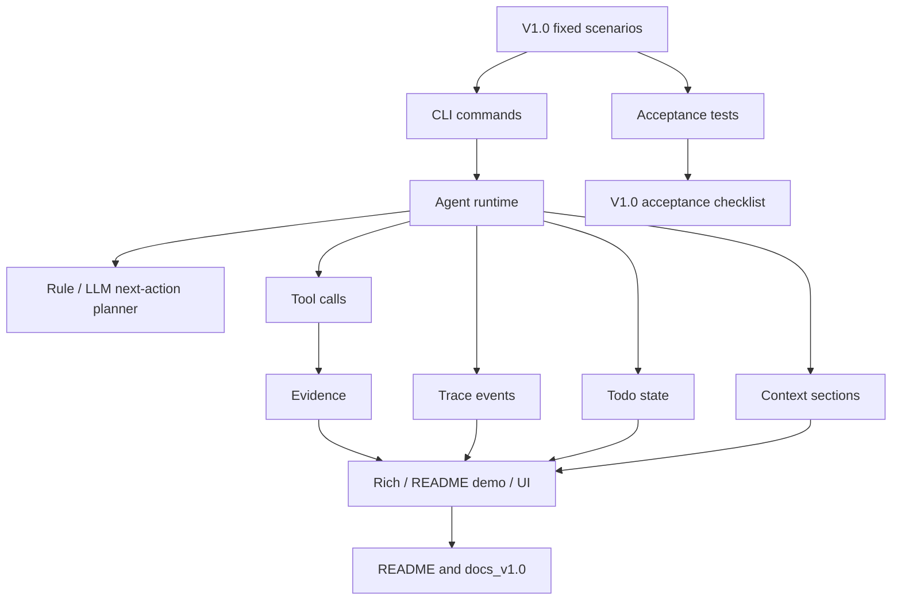

# V1.0-D 开发记录：真实场景验收

> 所属版本：PyCode V1.0  
> 阶段编号：V1.0-D  
> 创建日期：2026-07-14  
> 当前状态：开发前规划  
> 依据文档：`docs_v1.0/v1.0_roadmap.md`、`docs_v1.0/v1.0_develop_requirements.md`、`CCLearning NO.1-6`

## 1. 开发前：本阶段主要目标和目标效果

V1.0-A 已经完成 `observe-decide-act` loop 的工程结构，V1.0-B 已经把 Context / Memory / Todo / Task DAG 统一纳入可审查状态，V1.0-C 已经让 LLM next-action planner 参与每轮决策并补齐错误恢复。V1.0-D 不再以新增核心功能为主，而是进入 V1.0 收尾阶段：用固定、可重复、可展示的真实开发分析场景验证整个 harness 是否稳定、可信、边界清楚。

本阶段的核心目标是：

```text
用真实场景验收 PyCode V1.0 harness，补齐测试清单、演示脚本、README/文档边界说明，并确认 trace、todo、evidence、context 能完整解释 Agent run。
```

本阶段完成后，V1.0 应该能回答以下问题：

1. 用户能否用离线规则 planner 稳定演示 V1.0 loop，而不依赖 LLM API。
2. 用户能否用普通 Agent 命令查看每轮 context、next action、tool result、trace、todo 和 evidence。
3. 入口分析、新手阅读顺序、改动影响、git diff 风险、测试覆盖检查这些 V1.0 目标场景是否可运行、可解释。
4. 工具失败、权限拒绝、LLM 不可用或 schema 失败时，Agent 是否能进入可诊断状态，而不是静默失败或崩溃。
5. README、docs_v1.0 和演示材料是否准确说明 V1.0 的能力、边界、运行方法和非目标。

### 1.1 本阶段验收场景

V1.0-D 固定以下验收场景，避免临时挑选“刚好能跑通”的示例：

使用功能场景：

- 入口在哪里：验证 `query entry`、`retrieve_context`、Agent 的入口分析链路。
- 新手阅读顺序：验证 onboard / Agent 能根据 index、graph 和 evidence 给出合理阅读路径。
- 修改某文件影响哪里：验证 impact / graph 查询 / search evidence 是否能说明影响范围。
- 当前 git diff 有什么风险：验证 git 工具、风险解释、无 diff 或非 git 项目时的降级说明。

项目测试场景：

- 某函数是否有测试覆盖：验证测试文件搜索、相关测试定位和 `--run-tests` / `--no-tests` 边界。
- 某次工具失败后 Agent 如何恢复：验证失败 observation、trace、todo 状态和 final / stop 语义。
- Agent 的错误处理是否规范有效：验证 LLM planner fallback、policy denial、无效参数和数据文件异常的可观测性。

### 1.2 本阶段边界

V1.0-D 要做：

- 增加或整理验收测试。
- 增加真实场景 demo script。
- 更新 README 中 V1.0 能力、边界和运行方法。
- 补充 V1.0 技术说明、限制说明、验收清单或发布检查清单。
- 用固定命令验证 trace / todo / evidence / context 展示效果。
- 如果发现 A/B/C 阶段已有能力存在小缺陷，可以做必要修复。

V1.0-D 暂不做：

- 不新增自动代码修改能力。
- 不新增自动 git commit / reset / push 能力。
- 不实现完整多 Agent、MCP、后台 worker 或技能市场。
- 不引入大型外部依赖、图数据库或向量数据库。
- 不为展示效果编造 Agent 能力；文档必须如实说明边界。

## 2. 开发前：文件级工作拆解

### 2.1 `tests/`

当前现状：

- 已有 `test_agent_runtime.py`、`test_agent_llm_planner.py`、`test_agent_trace.py`、`test_agent_context.py`、`test_agent_memory.py`、`test_agent_task_dag.py`、`test_tools_*.py`、`test_cli.py`、`test_rich_output.py`、`test_ui_data_loader.py` 等基础测试。
- A/B/C 阶段已经覆盖了核心模块，但 V1.0-D 需要把测试组织为“验收场景”视角，而不只是模块视角。

本阶段计划：

1. 新增或扩展 Agent 场景验收测试。
   - 建议新增 `tests/test_v1_acceptance.py`，集中覆盖入口分析、阅读顺序、影响分析、git diff 风险、测试覆盖检查等端到端或近端到端场景。
   - 使用 `examples/demo_project` 作为稳定样例，必要时使用临时目录复制样例项目以制造 git diff 或失败场景。
   - 优先使用离线 `--rule-plan` 或 fake LLM client，避免测试依赖真实网络。
2. 扩展 CLI 验收测试。
   - 更新 `tests/test_cli.py`，确认 README 和 demo script 中列出的关键命令可解析、可运行或至少能稳定返回预期结构。
   - 覆盖 `--show-context`、`--rule-plan`、`--run-tests`、`--no-tests` 的关键边界。
3. 扩展错误恢复测试。
   - 可放在 `tests/test_agent_runtime.py`、`tests/test_agent_llm_planner.py`、`tests/test_agent_trace.py`，或集中放在 `tests/test_v1_acceptance.py`。
   - 覆盖工具失败进入 observation、policy denial 进入 trace、LLM schema 失败 fallback、无 LLM client 时离线路径可用。
4. 补齐 UI / Rich 展示回归。
   - 更新 `tests/test_rich_output.py` 和 `tests/test_ui_data_loader.py`，确认新增验收字段不会破坏展示层。

设计要求：

- 测试应优先验证 V1.0 的真实能力和边界，不为过度兼容旧行为添加大量兜底。
- 测试不依赖外部 LLM API。
- 涉及 git diff 的测试应使用临时 git 仓库或明确验证非 git 项目下的降级输出。

### 2.2 `docs_v1.0/`

当前现状：

- 已有 roadmap、开发要求，以及 V1.0-A/B/C 阶段开发记录。
- 尚缺 V1.0-D 的验收记录、最终测试清单、V1.0 版本边界和可展示 demo script。

本阶段计划：

1. 本文件 `docs_v1.0/V1.0D_development_record.md`
   - 记录开发前规划、开发中纪要、问题记录、开发后总结和运行方法。
2. 建议新增 `docs_v1.0/v1.0_acceptance_checklist.md`
   - 固化 V1.0 验收项。
   - 按 P0 / P1 / P2 / P3 或按场景列出检查结果。
   - 记录每个场景的命令、预期观察点和通过标准。
3. 建议新增 `docs_v1.0/v1.0_demo_script.md`
   - 提供从索引、图谱、离线 Agent、普通 Agent、失败场景到 UI 展示的可复现演示流程。
   - 说明哪些命令不需要 LLM，哪些命令需要 `.env` 或环境变量。
4. 建议新增或更新 `docs_v1.0/v1.0_architecture_overview.md`
   - 汇总 A/B/C/D 后的最终架构：runtime、planner、executor、policy、tools、trace、context、memory、task 的职责边界。
   - 说明 `plan-and-execute` 到 `observe-decide-act` 的变化。
5. 建议新增或更新 `docs_v1.0/v1.0_limitations.md`
   - 明确 V1.0 当前不做自动修复、不做完整多 Agent、不做远程 MCP、不做后台任务、不做跨语言完整支持。

设计要求：

- 文档必须和实际代码能力一致，不夸大 Agent 能力。
- 验收脚本必须能被项目负责人照着执行。
- 文档要突出 V1.0 的工程底座价值，而不是只写功能列表。

### 2.3 `README.md`

当前现状：

- README 已经包含项目定位、核心能力、快速开始、LLM 配置、Agent 与项目状态、架构概览、运行测试和当前局限。
- 仍需要根据 V1.0-D 验收结果收口，突出 V1.0 已完成的 harness 能力和可复现演示路径。

本阶段计划：

1. 更新快速开始。
   - 明确推荐的 V1.0 离线演示命令。
   - 明确索引、图谱、Agent、context 展示的顺序。
2. 更新 Agent 与项目状态。
   - 说明 V1.0 Agent run 中 trace、todo、evidence、context 的查看方式。
   - 说明 `--rule-plan`、`--show-context`、`--run-tests`、`--no-tests` 的差异。
3. 更新当前局限。
   - 与 roadmap P3 非目标对齐。
   - 继续强调默认不自动修改代码、不自动提交 git、不默认运行测试。
4. 视需要新增 V1.0 验收小节。
   - 列出推荐验收场景和对应命令。
   - 链接到 `docs_v1.0/v1.0_demo_script.md` 和 `docs_v1.0/v1.0_acceptance_checklist.md`。

设计要求：

- README 面向第一次打开仓库的人，命令要少而准。
- 不把 README 写成完整开发记录；详细验收流程放到 docs_v1.0。

### 2.4 `pycode/cli.py`

当前现状：

- CLI 已支持 index、graph、query、ask、explain、onboard、impact、agent、memory、task 等命令。
- Agent 命令支持 `--rule-plan`、`--show-context`、LLM 配置、测试运行控制等路径。

本阶段计划：

1. 验证 V1.0 demo script 中所有 CLI 命令是否存在并能稳定执行。
2. 如输出文本或参数说明与 V1.0 语义不一致，做小范围修正。
3. 确认 `--show-context` 能帮助用户审查每轮 context section。
4. 确认 `--rule-plan` 仍是离线稳定演示路径。
5. 确认 `--run-tests` / `--no-tests` 的行为和 README 说明一致。

设计要求：

- CLI 不新增复杂功能，只修正验收过程中暴露出的说明、参数或输出问题。
- CLI 不直接实现 planner / executor 逻辑。

### 2.5 `pycode/rich_output.py`

当前现状：

- Rich 输出已经支持 Agent runtime 展示，并在 V1.0-C 中适配了非工具 turn、planner source 和 fallback 事件。

本阶段计划：

1. 验证验收场景输出是否能清楚展示：
   - plan / todo
   - turns / action
   - tool results / errors
   - trace event
   - context sections
   - planner source / fallback
2. 如果关键信息被隐藏或显示不清，做小范围展示层调整。
3. 确认无 LLM、LLM fallback、policy denial、tool failure 等路径不会导致 Rich 输出崩溃。

设计要求：

- 展示层只读取 `AgentResult` / trace / context，不参与决策。
- 不为了展示漂亮而改变底层数据语义。

### 2.6 `ui/data_loader.py`、`ui/components.py`、`ui/streamlit_app.py`

当前现状：

- Streamlit UI 已可展示项目概览、文件树、图谱、Agent run、memory、tasks 等信息。
- A/B/C 阶段已让 UI 适配部分新 schema。

本阶段计划：

1. 验证 UI 是否能读取 V1.0 schema 下的 index、graph、memory、tasks、trace。
2. 确认 UI 展示不夸大能力，只呈现已有状态、证据和边界。
3. 如验收中发现 schema 字段缺失导致 UI 崩溃，补齐兼容当前 V1.0 schema 的读取逻辑。
4. 更新 demo script 中 UI 启动和观察点。

设计要求：

- UI 是展示型 demo，不升级为完整 IDE。
- UI 不新增后台任务或自动执行能力。

### 2.7 `examples/demo_project/`

当前现状：

- 示例项目包含 `main.py`、controllers、services、models、utils 和 tests。
- README 已说明该目录默认不携带 `.git`，git diff 场景需要真实 Git 仓库或临时初始化。

本阶段计划：

1. 确认示例项目足以支撑入口分析、新手阅读顺序、影响分析和测试覆盖检查。
2. 如果需要更稳定的测试覆盖场景，可增加极小的示例测试或 fixture，但不为 demo 编造复杂业务。
3. git diff 风险场景优先在测试中通过临时复制目录和临时 git 仓库制造，不直接污染示例项目。

设计要求：

- 示例项目保持轻量。
- 不把 demo_project 变成另一个需要维护的大项目。

### 2.8 `pycode/agent/*` 和 `pycode/tools/*`

当前现状：

- A/B/C 已经完成核心 harness 改造。
- V1.0-D 不计划大规模改动 agent 内核或工具系统。

本阶段计划：

1. 仅在验收发现真实缺陷时做小范围修复。
2. 重点关注：
   - `pycode/agent/runtime.py`：AgentResult、fallback、stop reason、context 注入。
   - `pycode/agent/llm_planner.py`：schema 错误分类和 trace 元数据。
   - `pycode/agent/context.py`：debug view、included / skipped section。
   - `pycode/agent/trace.py`：事件输出完整性。
   - `pycode/tools/git_tools.py`：非 git 项目和无 diff 时的清晰降级。
   - `pycode/tools/test_runner.py`：显式授权运行测试。
3. 修复时遵循“少兜底、少兼容”的开发要求，只保留服务 V1.0 真实验收的逻辑。

设计要求：

- 不为 D 阶段新增新的主流程抽象。
- 不改变 A/B/C 已经稳定的职责边界，除非验收证明边界本身存在问题。

## 3. 开发前：为什么要做这些收尾和验收

### 3.1 依据一：CCLearning NO.1 的最小 Agent loop 必须用真实任务验证

`CCLearning NO.1` 的核心不是“代码里有一个循环”，而是 Agent 能在每次观察之后重新决定下一步。A/B/C 阶段已经完成了 loop、next-action planner、policy、executor、trace 的结构化实现，但只有真实场景才能验证这些模块是否真正协作：

- 入口分析是否会调用正确的查询和检索工具。
- 工具结果是否会进入 observation。
- observation 是否会影响下一轮 action。
- final answer 是否基于 evidence，而不是凭空总结。
- policy denial 是否能作为可解释结果返回。

因此 V1.0-D 必须用固定开发分析任务验收，而不是只看单元测试通过。

### 3.2 依据二：CCLearning NO.2 的 TodoWrite 价值在于复杂任务中的进度可见

Todo 的意义不是装饰性地列一个清单，而是在多轮任务中帮助用户看见当前进展。V1.0-D 的入口分析、阅读顺序、影响分析、测试覆盖检查都应该能回答：

- 哪些步骤已经完成。
- 当前正在执行什么。
- 哪些步骤失败了，失败原因是什么。
- Agent 是否在失败后继续收集替代证据，还是应当停止。

所以本阶段需要把 todo 作为验收观察点，确认它和 turns、trace、tool results 的关系一致。

### 3.3 依据三：CCLearning NO.3 的 Memory / Context / 错误恢复需要可审查输出

`CCLearning NO.3` 强调 context section 和错误分类。V1.0-B/C 已经把 Context Builder、Memory 注入、LLM 错误分类和 fallback 接入主流程。V1.0-D 要验证这些机制不是只存在于内部结构中，而是能被用户审查：

- `--show-context` 是否显示 included / skipped section。
- Memory 是否按相关性注入，而不是无差别污染上下文。
- LLM 不可用或 schema 错误时，trace 是否说明 fallback 原因。
- 最终回答是否能说明证据来源。

这也是 README 和 demo script 需要更新的原因：用户要知道如何看见这些证据。

### 3.4 依据四：CCLearning NO.4 的 Task DAG 是可恢复任务，不是后台执行器

V1.0-D 需要确认 Task DAG 的展示和文档边界足够清楚。它服务跨会话任务恢复，而不是自动后台 worker。验收时应关注：

- CLI 能否 create / list / get / claim / complete。
- context 是否能显示任务状态和阻塞关系。
- README 是否避免把 Task DAG 描述成完整项目管理或后台任务系统。

这可以防止 V1.0 在收尾阶段出现产品定位膨胀。

### 3.5 依据五：CCLearning NO.5 / NO.6 的边界必须在 V1.0 文档中讲清楚

`CCLearning NO.5` 和 `NO.6` 提供了多 Agent、通信协议、MCP、动态工具池等后续方向，但 roadmap 已明确这些不是 V1.0 主线。D 阶段要做的不是实现它们，而是把边界写清楚：

- 未来多 Agent 不得绕过 policy。
- 未来 MCP 工具也必须进入 ToolSpec / policy / trace。
- 当前 V1.0 不做 teammate manager、远程 MCP、OAuth、后台 worker。

如果 README 和验收文档不说明这些边界，用户会误以为 V1.0 的展示能力已经等于完整生产级 Agent 平台，反而削弱项目可信度。

### 3.6 依据六：roadmap 的 V1.0 验收标准要求可复现、可解释、可讲清楚

roadmap 第 9 节明确要求 V1.0 完成时至少满足：

- runtime 支持 observe -> decide next action -> continue/stop。
- 离线演示不依赖 LLM 也能展示 loop turns、todo、trace、context。
- 普通 Agent 任务的工具调用均经过 policy 和 trace。
- 权限拒绝和 LLM 不可用有明确降级。
- CLI / UI 能展示每一轮看到了什么、决定了什么、依据来自哪里。
- README 能说明 V1.0 的能力、边界和后续方向。
- 测试覆盖 P0 模块关键路径。

这些要求都属于 V1.0-D 的收尾验收范围。D 阶段的成功标准不是“写更多功能”，而是让 V1.0 的能力可以被稳定复现、被用户理解、被项目负责人讲清楚。

### 3.7 本阶段核心关系图



### 3.8 本阶段完成标准

V1.0-D 完成后，至少应满足：

1. 存在可复现的 V1.0 demo script。
2. 存在 V1.0 验收清单，覆盖 roadmap 中的核心验收标准。
3. 入口分析、新手阅读顺序、改动影响、git diff 风险、测试覆盖检查至少有离线或 fake LLM 的稳定验收路径。
4. 工具失败、policy denial、LLM fallback 至少有一个可复现验收场景。
5. README 能准确说明 V1.0 能力、默认安全边界和非目标。
6. `tests/` 中有面向 V1.0 验收场景的测试，且不依赖真实外部 LLM。
7. Rich / CLI / UI 对 trace、todo、context、evidence 的展示不崩溃，且能支撑演示。
8. 开发记录中记录实际完成内容、问题、改进点和运行方法。

## 4. 开发中纪要

> 本区域用于 V1.0-D 开发过程中持续追加记录。每完成或修改一块内容时，记录本次动作、影响文件和验证方式。

### 2026-07-14：pytest 运行环境排查

- 现象：Codex 在当前 Windows 沙箱中直接运行 pytest 时，会卡在 pytest 临时目录权限处理阶段；用户在本机终端手动运行测试不一定复现。
- 原因定位：pytest 的 `tmp_path` / basetemp 逻辑会尝试对临时目录设置 `0o700` ACL，并清理 numbered temp symlink；该行为在当前受限沙箱下不稳定。
- 处理方式：不修改项目文件，Codex 运行 pytest 时使用一次性的进程内包装，临时 monkeypatch `_pytest.tmpdir.TempPathFactory.getbasetemp`、`make_numbered_dir` 和 `cleanup_dead_symlinks`，同时禁用插件自动加载、禁用 pyc、禁用 cacheprovider。
- 验证：包装方式可稳定运行 pytest；该包装不写入仓库。

### 2026-07-14：新增 V1.0 验收测试

- 影响文件：`tests/test_v1_acceptance.py`。
- 覆盖场景：入口分析、新手阅读顺序、改动影响、真实临时 git diff、测试覆盖边界、工具失败、policy denial、LLM planner fallback、无 LLM 离线规则路径。
- 设计取舍：git diff 场景复制 `examples/demo_project` 到临时目录并初始化临时 git 仓库，不污染示例项目；LLM 行为使用 fake client，不依赖真实 API。
- 验证：`tests/test_v1_acceptance.py` 通过，结果为 `5 passed in 1.17s`。

### 2026-07-14：补充 CLI / Rich / UI 展示回归

- 影响文件：`tests/test_cli.py`、`tests/test_rich_output.py`、`tests/test_ui_data_loader.py`。
- CLI：补充 V1.0 demo command 解析，覆盖 `--show-context`、`--rule-plan`、`--run-tests`、`--no-tests` 的边界。
- Rich：补充非工具 turn、todo、trace、context、planner fallback reason 展示回归。
- UI：补充 V1.0 task row schema 字段读取回归，确认 `schema_version`、`can_start`、`missing_dependencies` 不破坏展示。
- 验证：定向回归 `tests/test_v1_acceptance.py tests/test_cli.py tests/test_rich_output.py tests/test_ui_data_loader.py` 通过，结果为 `33 passed in 14.18s`。

### 2026-07-14：补齐 V1.0 收口文档与 README

- 新增 `docs_v1.0/v1.0_acceptance_checklist.md`：按场景列出命令、观察点和通过标准。
- 新增 `docs_v1.0/v1.0_demo_script.md`：提供离线演示、普通 Agent、测试边界、git diff 和 UI 展示流程。
- 新增 `docs_v1.0/v1.0_architecture_overview.md`：总结 V1.0 最终架构和 runtime / planner / policy / tools / trace / context / memory / task 的职责。
- 新增 `docs_v1.0/v1.0_limitations.md`：明确不做自动改代码、自动 git 操作、完整多 Agent、远程 MCP、后台 worker、跨语言完整支持等。
- 更新 `README.md`：加入 V1.0 演示入口、Agent 参数说明、验收文档入口、沙箱 pytest 说明和非目标边界。

### 2026-07-14：最终回归验证

- 核心组合测试：`tests/test_agent_runtime.py tests/test_agent_llm_planner.py tests/test_agent_trace.py tests/test_cli.py tests/test_v1_acceptance.py`，结果 `58 passed in 15.98s`。
- 全量测试：`tests`，结果 `201 passed in 16.61s`。
- 运行方式：Codex Windows 沙箱使用临时 pytest 包装；包装未写入项目文件。

## 5. 开发中问题记录

> 本区域用于记录 V1.0-D 开发过程中遇到的报错、设计冲突、依赖问题和解决方式。

### pytest 临时目录 ACL 问题

- 问题：直接运行 pytest 时在当前 Codex Windows 沙箱中可能卡住或失败，尤其是使用 `tmp_path` 的测试。
- 影响：V1.0-D 需要大量验收与回归测试，若不处理会降低自动验证可信度。
- 解决：采用临时进程内 pytest 包装；不写入项目文件，不改变项目测试配置。
- 后续：普通开发者仍可直接运行 README 中的 pytest 命令；只有 Codex 沙箱需要该包装。

### 验收测试复制示例项目时误带临时目录

- 问题：首次运行 `tests/test_v1_acceptance.py` 时，临时复制 `examples/demo_project` 可能把 `.pytest_tmp`、`.venv`、`.git` 等无关目录带入副本。
- 解决：复制时忽略 `__pycache__`、`.pclens`、`.pytest_cache`、`.pytest_tmp*`、`.venv`、`.git`。
- 结果：验收测试副本保持干净，git diff 场景只使用临时仓库。

### Rich fallback 事件展示边界

- 问题：新增 Rich 回归时最初断言 `LLMPlanFallback` 会出现在 planner events 表，但当前展示层只把 next-action 相关事件放入该表；初始 plan fallback 显示在顶部 `Planner fallback reason`。
- 解决：测试按真实展示契约断言 `Planner fallback reason`、`ValueError` 和 `LLMNextActionFinished`。
- 结果：展示层语义保持不变，测试覆盖更贴近当前 UI 行为。

## 6. 开发后总结

> 本区域在 V1.0-D 开发完成后补充：实际完成内容、完成情况、未完成事项和后续可改进点。

V1.0-D 已完成真实场景验收和 V1.0 收口的主体工作：

1. 新增面向验收场景的 `tests/test_v1_acceptance.py`，覆盖入口、新手阅读、影响分析、git diff、测试覆盖、工具失败、policy denial 和 LLM fallback。
2. 扩展 CLI / Rich / UI 回归，确认 demo command、context 展示、非工具 turn、planner fallback 和 V1.0 task schema 不破坏展示。
3. 新增 V1.0 验收清单、演示脚本、架构概览和限制说明。
4. 更新 README，使其能作为 V1.0 的入口页说明能力、边界、演示命令和测试方式。
5. 保持 D 阶段定位：未新增主功能，未引入新依赖，未修改示例项目结构；仅在验收层和文档层收口。

最终验证结果：

- 定向验收与展示回归：`33 passed in 14.18s`。
- V1.0 核心组合回归：`58 passed in 15.98s`。
- 全量回归：`201 passed in 16.61s`。

未完成事项：无阻塞项。后续可改进点是将当前文档中的验收命令整理成可选的本地脚本，但 V1.0-D 按计划未把 Codex 专用 pytest 包装写入仓库。

## 7. V1.0-D 功能运行方法

> 本区域在 V1.0-D 开发完成后补充：本阶段各项验收场景、测试和演示的具体运行步骤与命令。

### 7.1 离线演示

```powershell
.\.venv\Scripts\python.exe -m pycode.cli index .\examples\demo_project
.\.venv\Scripts\python.exe -m pycode.cli graph .\examples\demo_project
.\.venv\Scripts\python.exe -m pycode.cli query entry .\examples\demo_project
.\.venv\Scripts\python.exe -m pycode.cli agent .\examples\demo_project "这个项目的入口在哪里？阅读顺序应该是怎样的？" --plan-only --show-context --rule-plan
```

### 7.2 影响分析与测试边界

```powershell
.\.venv\Scripts\python.exe -m pycode.cli agent .\examples\demo_project "分析 services/user_service.py 的影响范围" --show-context --rule-plan
.\.venv\Scripts\python.exe -m pycode.cli agent .\examples\demo_project "检查 services/user_service.py 的测试覆盖" --no-tests --show-context --rule-plan
.\.venv\Scripts\python.exe -m pycode.cli agent .\examples\demo_project "检查 services/user_service.py 的测试覆盖并运行测试" --run-tests --show-context --rule-plan
```

### 7.3 UI 展示

```powershell
.\.venv\Scripts\streamlit.exe run .\ui\streamlit_app.py
```

### 7.4 自动化验收

普通开发环境：

```powershell
.\.venv\Scripts\python.exe -m pytest tests -q
```

Codex 当前 Windows 沙箱：使用临时进程内 pytest 包装运行，避免 pytest tmpdir ACL 问题；包装不写入项目文件。
