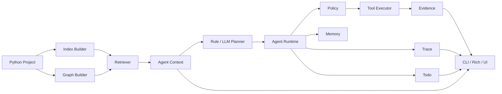

# V1.0 架构概览

> 版本：PyCode V1.0  
> 目标：说明 A/B/C/D 阶段完成后的最终职责边界。

## 总体结构

PyCode V1.0 由三层组成：

1. 静态理解层：扫描 Python 文件，解析 AST，生成 index 和 code graph。
2. 证据选择层：基于 index / graph 检索有限上下文，避免把整个仓库直接交给 LLM。
3. Agent harness 层：围绕 observe -> decide -> act 循环执行工具、记录 trace、维护 todo、注入 context、输出 evidence。

## Runtime

`pycode.agent.runtime` 是 V1.0 Agent harness 的核心。它负责：
- 接收 `AgentTask`。
- 组装 context。
- 选择下一步 action。
- 调用 executor 执行工具。
- 把 observation、tool result、todo 和 trace 合并回运行状态。
- 决定继续、停止或降级。

V1.0 的重点不是一次性生成完整计划后机械执行，而是在每轮观察后重新决定下一步。

## Planner

V1.0 有两类 planner：
- rule planner：离线、稳定、可演示，不依赖真实 LLM API。
- LLM planner：用于生成初始 plan 或 next action；schema 错误、调用错误和无效工具会进入 fallback。

Planner 不直接执行工具，也不绕过 policy。

## Policy 与 Executor

Policy 负责判断工具调用是否被允许。V1.0 的默认边界是只读分析：
- 不自动修改源代码。
- 不自动执行 git commit / reset / push。
- 测试运行必须显式授权。
- 只允许注册过的工具执行。

Executor 只负责按 policy 允许的调用执行工具，并把成功、失败或拒绝结果写回 trace。

## Tools

V1.0 工具包括：
- 文件读取与代码搜索。
- 图谱查询和上下文检索。
- git changed files / diff。
- 受控测试运行。

工具返回 `ToolResult`，其中包含 `ok`、`summary`、`data`、`error` 和 evidence。最终回答应基于这些证据，而不是凭空总结。

## Trace、Todo、Context、Memory

Trace 记录 Agent run 的事件和工具调用，服务于审计与调试。

Todo 表示多步任务的进展状态，服务于用户理解当前 run 做到了哪一步。

Context Section 记录给 planner / answer 使用的上下文片段，并区分 included / skipped。

Memory 是项目级辅助信息，不替代当前代码证据。对于代码事实类任务，V1.0 仍要求当前代码证据参与判断。

## Task DAG

Task DAG 是轻量任务状态存储，用于跨会话恢复和展示任务依赖。它不是后台 worker，也不会自动调度执行任务。

## CLI、Rich 与 UI

CLI 是主入口，覆盖 index、graph、query、ask、explain、onboard、impact、agent、memory 和 task。

Rich 输出负责把结构化结果展示成人类可读的终端视图，包括 runtime turns、planner event、trace、todo、context 和 evidence。

Streamlit UI 是展示型 Demo，读取项目 artifact、memory、task 和 AgentResult 展示状态，不承担后台执行。

